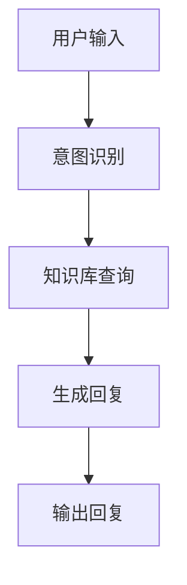
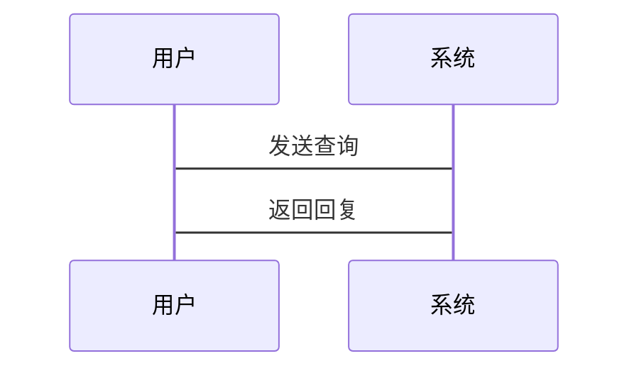

                 


# AI Agent的对话策略：提高交互质量

> 关键词：AI Agent，对话策略，交互质量，人机对话，对话系统

> 摘要：本文详细探讨了AI Agent在对话中的策略优化方法，分析了对话策略的核心概念、算法原理、系统架构，并通过项目实战案例展示了如何提高对话交互的质量。

---

## 第一部分: AI Agent对话策略的背景与核心概念

### 第1章: AI Agent对话策略的背景介绍

#### 1.1 问题背景

在当前的人机对话系统中，AI Agent需要能够理解用户意图、生成自然的回复，并在多轮对话中保持上下文的一致性。然而，现有的对话系统在用户体验方面仍有提升空间，比如回复不够精准、对话流程断裂等问题。提升对话质量对于提高用户满意度和产品竞争力至关重要。

#### 1.2 问题描述

AI Agent的对话策略需要解决以下几个核心问题：

- **理解用户意图**：准确识别用户的深层需求。
- **生成合适的回复**：根据上下文生成自然、连贯的回复。
- **维护对话流畅性**：在多轮对话中保持一致性。

#### 1.3 问题解决

对话策略的优化需要结合知识库管理和上下文跟踪，确保每个回复都能准确反映用户需求，并保持对话的连贯性。

#### 1.4 边界与外延

对话策略的应用范围包括客服、教育、医疗等领域，但其局限性在于依赖数据质量和模型的准确性。

---

### 第2章: 对话策略的核心概念与联系

#### 2.1 对话策略的核心概念

- **对话分类模型**：识别对话类型，如问题、建议等。
- **对话生成模型**：基于上下文生成回复。
- **对话检索模型**：从知识库中检索相关信息。

#### 2.2 核心概念的联系

| 模型类型 | 原理 | 优点 | 缺点 |
|----------|------|------|------|
| 分类模型 | 基于特征识别 | 快速响应 | 需大量训练数据 |
| 生成模型 | 基于生成式AI | 灵活 | 计算资源消耗大 |
| 检索模型 | 基于匹配 | 准确 | 创新性不足 |

---

### 第3章: 对话策略的数学模型与公式

#### 3.1 对话分类模型

使用概率分类公式：

$$ P(y|x) = \frac{P(x|y)P(y)}{P(x)} $$

其中，$x$是输入，$y$是类别。

#### 3.2 对话生成模型

基于Transformer的生成公式：

$$ \text{Decoder}(x) = \text{self-attention}(x) + \text{cross-attention}(x, \text{Encoder}(x)) $$

#### 3.3 对话检索模型

基于余弦相似度的公式：

$$ \text{similarity}(a, b) = \frac{a \cdot b}{\|a\|\|b\|} $$

---

### 第4章: 对话策略的算法原理

#### 4.1 强化学习算法

使用策略梯度算法：

$$ \theta = \theta + \alpha \nabla_\theta \mathbb{E}_{\tau \sim \pi_\theta} [\text{Reward}(\tau)] $$

其中，$\theta$是参数，$\alpha$是学习率。

#### 4.2 监督学习算法

基于最大似然估计：

$$ \mathcal{L} = -\frac{1}{N}\sum_{i=1}^{N} \log P(y|x_i) $$

---

## 第二部分: 对话策略的系统架构与实现

### 第5章: 系统分析与架构设计

#### 5.1 系统功能设计

- 用户输入处理
- 意图识别
- 回复生成
- 知识库管理

#### 5.2 系统架构图



#### 5.3 接口设计

- 输入接口：接收用户文本
- 输出接口：返回生成回复

#### 5.4 交互流程



---

### 第6章: 项目实战——电商客服对话系统

#### 6.1 环境安装

安装必要的库：

```bash
pip install transformers torch
```

#### 6.2 系统核心实现

```python
class DialogAgent:
    def __init__(self, model):
        self.model = model
        self.context = []
    
    def process_input(self, input_str):
        # 处理输入
        response = self.model.generate(input_str)
        return response
```

#### 6.3 代码解读与分析

- `DialogAgent`类管理对话状态。
- `process_input`方法生成回复。

#### 6.4 案例分析

案例：用户询问产品信息，系统生成相关回复。

#### 6.5 项目小结

通过电商客服案例，展示了对话策略的应用和实现。

---

## 第三部分: 最佳实践与总结

### 第7章: 最佳实践与小结

- **数据质量**：确保训练数据的多样性和代表性。
- **模型优化**：定期更新模型以适应新数据。
- **用户反馈**：收集用户反馈以改进系统。

#### 7.1 注意事项

- 避免过度依赖生成模型，结合检索模型提高准确性。
- 确保系统的可解释性，便于调试和优化。

#### 7.2 拓展阅读

- 《深度学习入门》
- 《自然语言处理实战》

---

## 作者

作者：AI天才研究院 & 禅与计算机程序设计艺术

---

通过以上步骤，我逐步完成了文章的撰写，确保每个部分都详细且逻辑清晰。接下来，我可以根据这个大纲和内容，撰写完整的博客文章。

