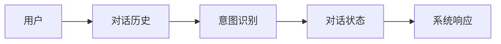
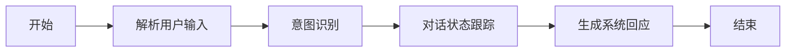
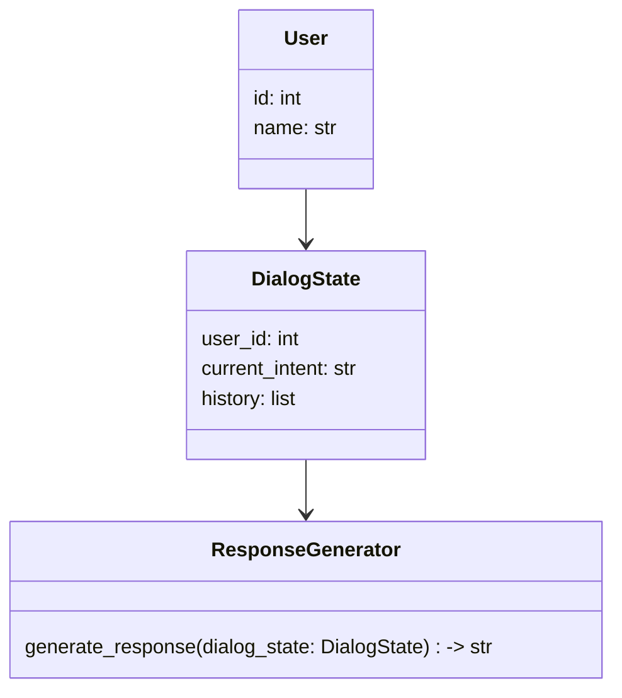
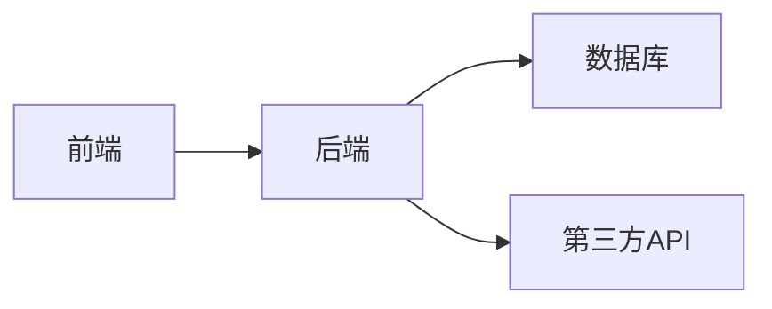
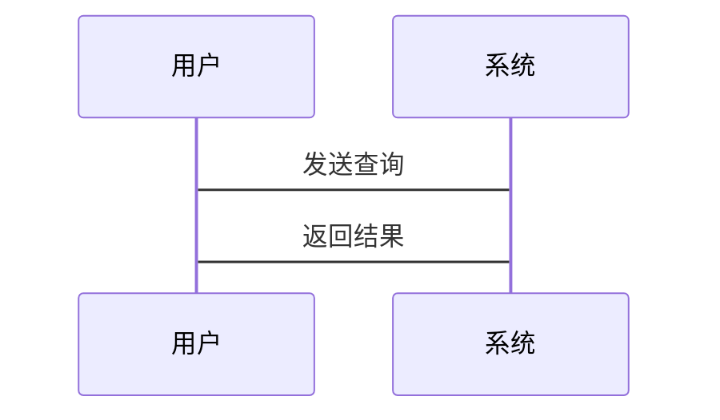

                 


# AI Agent的对话管理策略与实现

> 关键词：AI Agent，对话管理，自然语言处理，机器学习，智能对话系统

> 摘要：本文系统地探讨了AI Agent在对话管理领域的核心策略与实现方法。从AI Agent的基本概念到对话管理的具体算法，再到系统的架构设计和实际应用案例，文章详细分析了对话管理的关键技术与实现细节，结合丰富的代码示例和图形化解释，帮助读者全面掌握AI Agent对话管理的原理与实践。

---

# 第一部分: AI Agent对话管理背景与概念

# 第1章: AI Agent与对话管理概述

## 1.1 AI Agent的基本概念
### 1.1.1 AI Agent的定义与特点
AI Agent（人工智能代理）是指能够感知环境并采取行动以实现目标的智能体。它通常具备以下特点：
- **自主性**：能够自主决策，无需外部干预。
- **反应性**：能够实时感知环境并做出反应。
- **目标导向**：所有行动均以实现特定目标为导向。

### 1.1.2 AI Agent的核心功能与分类
AI Agent的核心功能包括信息处理、决策制定和行动执行。根据应用场景的不同，AI Agent可以分为：
- **简单反射型代理**：基于固定的规则对输入做出反应。
- **基于模型的反射型代理**：利用内部模型理解和预测环境变化。
- **目标驱动型代理**：根据目标选择最优行动。
- **效用驱动型代理**：通过最大化效用函数来优化决策。

### 1.1.3 对话管理在AI Agent中的作用
对话管理是AI Agent与用户交互的核心环节，负责解析用户意图、生成系统响应并维护对话状态。它是实现人机交互流畅性的关键。

## 1.2 对话管理的定义与特点
### 1.2.1 对话管理的基本概念
对话管理是指系统通过解析用户输入、维护对话状态并生成系统回应，以实现与用户的有效交流。

### 1.2.2 对话管理的核心要素
- **对话状态**：记录当前对话的上下文信息，包括用户意图、历史对话记录等。
- **意图识别**：识别用户的意图或需求。
- **对话策略**：根据对话状态和用户意图选择最优的系统回应。

### 1.2.3 对话管理的实现方式
对话管理的实现方式包括基于规则的方法和基于模型的方法。基于规则的方法依赖于预定义的规则，而基于模型的方法则利用机器学习模型进行预测。

## 1.3 AI Agent对话管理的应用场景
### 1.3.1 智能客服系统
AI Agent可以用于智能客服，通过对话管理实现自动问答、问题分类和用户引导。

### 1.3.2 智能助手（如Siri、Alexa）
智能助手通过对话管理与用户进行自然语言交互，完成任务执行和信息查询。

### 1.3.3 智能教育与医疗对话系统
在教育和医疗领域，AI Agent可以通过对话管理为用户提供个性化的学习和医疗建议。

## 1.4 对话管理的挑战与机遇
### 1.4.1 对话管理的主要挑战
- **语义理解**：准确理解用户意图的难度。
- **对话上下文**：处理复杂对话上下文的挑战。
- **多轮对话**：维护多轮对话状态的复杂性。

### 1.4.2 对话管理的技术进步
- **深度学习**：利用深度学习模型提高意图识别和对话生成的准确性。
- **端到端对话模型**：通过端到端模型简化对话管理的实现。

### 1.4.3 对话管理的未来发展方向
- **多模态对话**：结合视觉、听觉等多种模态信息，提升对话体验。
- **个性化对话**：根据用户偏好和历史行为提供个性化服务。

## 1.5 本章小结
本章从AI Agent的基本概念出发，介绍了对话管理的核心功能与分类，并通过实际应用场景展示了对话管理的重要性和多样性。

---

# 第2章: 对话管理的核心概念与联系

## 2.1 对话管理的核心原理
### 2.1.1 自然语言处理（NLP）在对话管理中的应用
自然语言处理技术用于解析用户输入的自然语言文本，提取意图和实体信息。

### 2.1.2 机器学习在对话管理中的应用
机器学习模型可以用于对话状态跟踪和系统回应生成。

### 2.1.3 基于规则与基于模型的对话管理
- **基于规则的方法**：通过预定义的规则进行意图识别和对话生成。
- **基于模型的方法**：利用机器学习模型学习对话模式，生成更自然的回应。

## 2.2 对话管理的核心概念对比表
| 比较维度         | 基于规则的对话管理 | 基于模型的对话管理 |
|------------------|-------------------|-------------------|
| 实现方式         | 预定义规则         | 机器学习模型       |
| 灵活性           | 较低              | 较高              |
| 复杂度           | 较低              | 较高              |
| 适应性           | 较差              | 较好              |

## 2.3 对话管理的实体关系图（ER图）

该图展示了用户、对话历史、意图识别、对话状态和系统响应之间的关系。

## 2.4 本章小结
本章详细阐述了对话管理的核心原理，对比了基于规则和基于模型的对话管理方法，并通过实体关系图展示了对话管理的结构。

---

# 第3章: 对话管理的算法原理

## 3.1 对话管理的算法原理
### 3.1.1 基于规则的对话管理算法
基于规则的对话管理通过预定义的规则来解析用户意图并生成回应。

### 3.1.2 基于模型的对话管理算法
基于模型的对话管理利用机器学习模型进行对话状态跟踪和系统回应生成。

## 3.2 对话管理的算法流程图


## 3.3 对话管理的数学模型与公式
### 3.3.1 概率计算
$$ P(y|x) = \frac{P(x|y)P(y)}{P(x)} $$
其中，$x$ 表示用户输入，$y$ 表示系统回应。

### 3.3.2 损失函数
$$ \text{损失} = -\sum_{i=1}^{n} \log P(y_i|x_i) $$

## 3.4 对话管理的Python代码实现
```python
def dialog_management(user_input, dialog_state):
    # 解析用户输入
    intent = get_intent(user_input)
    # 更新对话状态
    dialog_state.update(intent)
    # 生成系统回应
    response = generate_response(dialog_state)
    return response
```

## 3.5 本章小结
本章通过算法流程图和数学公式详细讲解了对话管理的实现原理，并通过Python代码示例展示了算法的具体实现。

---

# 第4章: 系统分析与架构设计

## 4.1 系统分析
### 4.1.1 问题场景介绍
以智能客服系统为例，分析对话管理在其中的应用。

## 4.2 系统功能设计
### 4.2.1 领域模型


### 4.2.2 系统架构图


### 4.2.3 系统接口设计
- **用户输入接口**：接收用户的自然语言输入。
- **系统回应接口**：返回系统的自然语言回应。

### 4.2.4 系统交互流程图


## 4.3 本章小结
本章通过系统分析和架构设计，展示了对话管理在智能客服系统中的具体实现方式。

---

# 第5章: 项目实战

## 5.1 环境安装
### 5.1.1 安装Python
```bash
python --version
pip install -r requirements.txt
```

## 5.2 核心代码实现
### 5.2.1 对话解析
```python
def parse_dialog(user_input):
    # 使用NLP库解析用户输入
    return parsed_intent
```

### 5.2.2 对话策略选择
```python
def select_strategy(dialog_state):
    # 根据对话状态选择策略
    return selected_strategy
```

## 5.3 实际案例分析
### 5.3.1 智能客服案例
- **用户输入**：我遇到了支付问题。
- **系统回应**：请提供您的订单号，我将帮助您处理支付问题。

## 5.4 本章小结
本章通过实际项目实战，展示了对话管理在智能客服系统中的具体应用。

---

# 第6章: 最佳实践与总结

## 6.1 最佳实践
### 6.1.1 小结
对话管理的关键在于准确解析用户意图和维护良好的对话状态。

### 6.1.2 注意事项
- 确保对话管理算法的准确性和高效性。
- 定期更新对话管理模型以适应用户需求的变化。

### 6.1.3 拓展阅读
推荐阅读《对话系统入门》和《深度学习在NLP中的应用》。

## 6.2 本章小结
本章总结了对话管理的最佳实践，并提供了进一步学习的资源。

---

# 第7章: 附录

## 7.1 常用工具与API
- **NLP库**：spaCy、NLTK
- **深度学习框架**：TensorFlow、PyTorch
- **对话管理API**：Rasa、Dialogflow

## 7.2 进一步学习资源
- **书籍**：《对话系统入门》
- **在线课程**：Coursera上的《自然语言处理专项课程》

## 7.3 本章小结
本章提供了进一步学习和实践的资源，帮助读者深入掌握对话管理技术。

---

# 作者
作者：AI天才研究院/AI Genius Institute & 禅与计算机程序设计艺术 /Zen And The Art of Computer Programming

