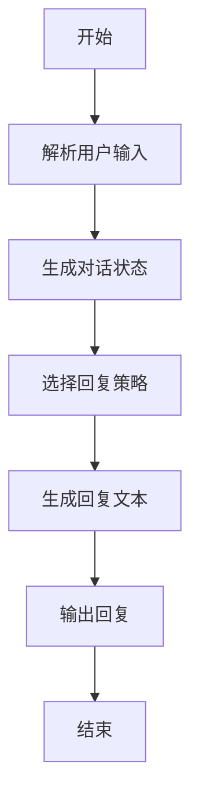
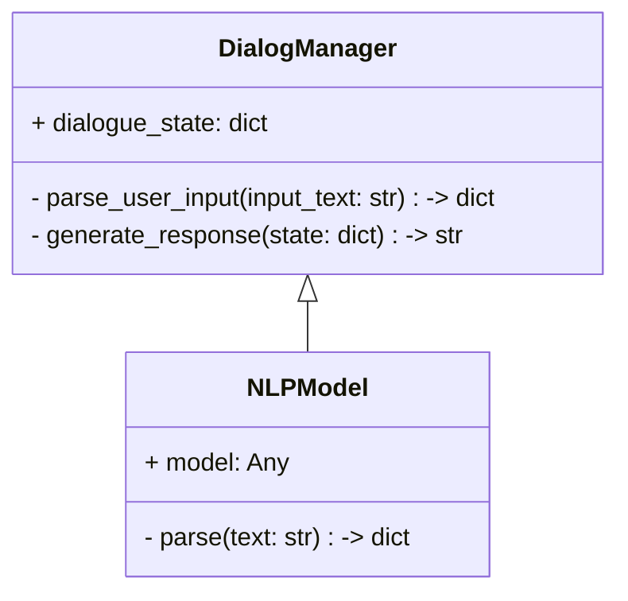
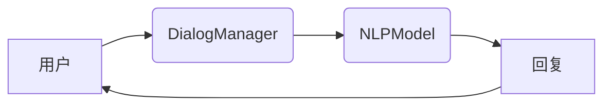
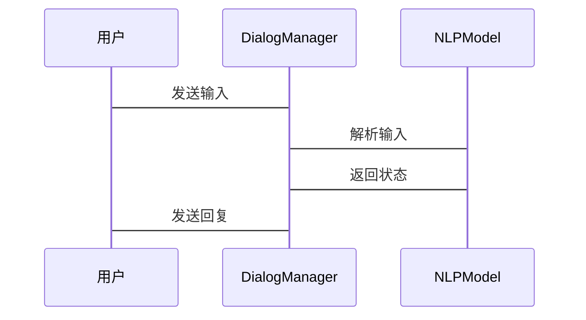

                 


# AI Agent的对话管理系统：设计与实现

---

## 关键词
AI Agent, 对话管理, 系统设计, 算法原理, 系统架构, 项目实战

---

## 摘要
本文系统地探讨了AI Agent对话管理系统的理论基础、核心算法、系统架构以及实现方案。通过分析对话管理的关键问题，结合实际应用场景，详细讲解了对话管理系统的实现过程，包括算法原理、数学模型、系统设计与项目实战。本文旨在为AI开发者和研究人员提供深入的技术指导，帮助他们理解并实现高效的对话管理系统。

---

# 第1章 AI Agent与对话管理概述

## 1.1 问题背景与描述

### 1.1.1 对话系统的定义与分类
对话系统是一种能够与人类进行自然语言交互的计算机系统，其核心目标是理解用户意图并生成合适的回复。根据实现方式，对话系统可以分为规则驱动型和数据驱动型两种。

**规则驱动型对话系统**：基于预定义的规则和模板生成回复，适用于特定场景，如客服系统。

**数据驱动型对话系统**：利用机器学习和自然语言处理技术，通过数据训练生成回复，适用于复杂场景，如智能助手。

### 1.1.2 AI Agent在对话管理中的角色
AI Agent（智能体）是一种能够感知环境、自主决策并执行任务的实体。在对话管理中，AI Agent充当用户的代理，负责理解用户需求、调用相关服务并生成自然语言回复。

### 1.1.3 当前对话管理系统的挑战与机遇
- **挑战**：对话系统需要处理歧义性、上下文依赖性以及用户情绪等问题。
- **机遇**：随着深度学习和自然语言处理技术的进步，对话系统在多个领域（如客服、教育、医疗）的应用前景广阔。

## 1.2 问题解决与边界

### 1.2.1 对话管理的核心问题
对话管理的核心问题包括：
1. **理解用户意图**：通过自然语言处理技术解析用户需求。
2. **保持对话连贯性**：跟踪对话上下文，确保回复的连贯性。
3. **处理多轮对话**：在多轮对话中，系统需要动态更新状态并调整回复策略。

### 1.2.2 系统的边界与外延
对话管理系统的边界包括：
- **输入**：用户输入的文本或语音。
- **输出**：生成的回复文本或动作指令。
- **外部服务调用**：根据需要调用第三方服务（如搜索引擎、数据库）。

### 1.2.3 核心要素与组成结构
对话管理系统的组成结构包括：
- **对话理解模块**：解析用户输入，生成对话状态。
- **对话策略模块**：根据对话状态选择合适的回复策略。
- **回复生成模块**：生成符合策略的回复文本。

## 1.3 核心概念与联系

### 1.3.1 AI Agent的原理
AI Agent的核心原理是通过感知环境、推理和行动来实现目标。在对话管理中，AI Agent通过理解用户输入、推理用户需求并生成回复来实现对话目标。

### 1.3.2 对话管理系统的属性对比
以下是AI Agent和对话管理系统的属性对比表：

| 属性       | AI Agent                     | 对话管理系统         |
|------------|------------------------------|----------------------|
| 输入       | 用户输入（文本/语音）        | 用户输入（文本/语音）|
| 输出       | 回复文本或动作指令            | 回复文本或动作指令    |
| 核心功能   | 理解、推理、决策              | 理解、生成、管理      |
| 应用场景   | 智能助手、推荐系统            | 客服、教育、医疗      |

### 1.3.3 ER实体关系图

```mermaid
er
  actor(Agent)
  actor(对话管理)
  actor(用户)
  entity(对话历史)
  entity(意图)
  entity(回复)
  relation(参与)
  relation(包含)
  relation(映射)
```

---

# 第2章 对话管理系统的算法原理

## 2.1 算法流程与实现

### 2.1.1 对话管理的算法流程



### 2.1.2 Python核心代码实现

```python
class DialogManager:
    def __init__(self):
        self.dialogue_state = {}

    def parse_user_input(self, input_text):
        # 使用NLP模型解析用户输入
        pass

    def generate_response(self, state):
        # 根据状态生成回复
        pass
```

### 2.1.3 代码应用解读与分析
- `parse_user_input`方法负责解析用户输入，生成对话状态。
- `generate_response`方法根据对话状态选择合适的回复策略，并生成回复文本。

### 2.2 数学模型与公式

#### 对话管理的概率模型

对话管理的概率模型可以通过马尔可夫链进行建模：

$$ P(s_t | s_{t-1}) $$

其中，$s_t$表示当前对话状态，$s_{t-1}$表示上一状态。

---

# 第3章 系统分析与架构设计

## 3.1 系统功能需求

### 3.1.1 对话理解与生成
对话理解与生成是对话管理系统的核心功能，包括：
- 用户意图识别
- 对话上下文跟踪
- 多轮对话管理

### 3.1.2 状态管理与上下文跟踪
状态管理模块负责维护对话的上下文信息，确保回复的连贯性。

### 3.1.3 多轮对话的流程控制
多轮对话的流程控制需要动态调整对话策略，确保对话的流畅性。

## 3.2 系统架构设计

### 3.2.1 领域模型类图



### 3.2.2 系统架构图



### 3.2.3 系统接口与交互设计



---

# 第4章 项目实战与实现

## 4.1 环境安装与配置

### 4.1.1 开发环境
- Python 3.8+
- NLTK库
- spaCy库

### 4.1.2 安装依赖
```bash
pip install numpy nltk spacy
python -m spacy download en_core_web_sm
```

## 4.2 系统核心实现

### 4.2.1 对话管理模块实现

```python
import spacy
from nltk.tokenize import word_tokenize

class DialogManager:
    def __init__(self):
        self.nlp = spacy.load("en_core_web_sm")

    def parse_user_input(self, input_text):
        doc = self.nlp(input_text)
        # 提取实体和意图
        return {"intent": "greeting", "entities": []}

    def generate_response(self, state):
        # 简单实现：固定回复
        return "Hello! How can I help you today?"
```

### 4.2.2 代码应用解读与分析
- `parse_user_input`方法使用spaCy提取文本中的实体和意图。
- `generate_response`方法根据对话状态生成回复文本。

## 4.3 项目小结
通过本章的项目实战，读者可以了解对话管理系统的实现过程，包括环境配置、模块实现以及系统测试。

---

# 第5章 最佳实践与总结

## 5.1 小结
本文详细讲解了AI Agent对话管理系统的理论基础、算法原理、系统架构以及实现方案。通过实际案例分析，读者可以掌握对话管理系统的实现技巧。

## 5.2 注意事项
- 对话系统的性能依赖于NLP模型的质量。
- 在实际应用中，需要考虑用户隐私和数据安全问题。

## 5.3 拓展阅读
-《对话系统中的上下文管理》
-《基于深度学习的对话生成模型》

---

## 作者
作者：AI天才研究院 & 禅与计算机程序设计艺术

---

以上是《AI Agent的对话管理系统：设计与实现》的完整目录大纲和文章内容，确保每个部分都详细展开，涵盖理论与实践，为读者提供全面的技术指导。

