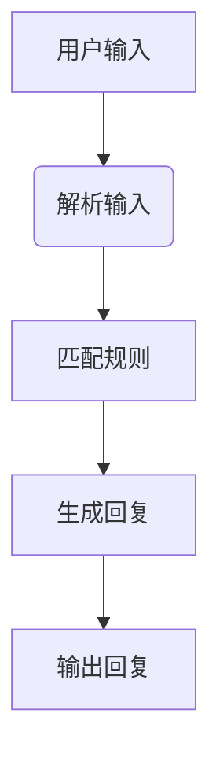
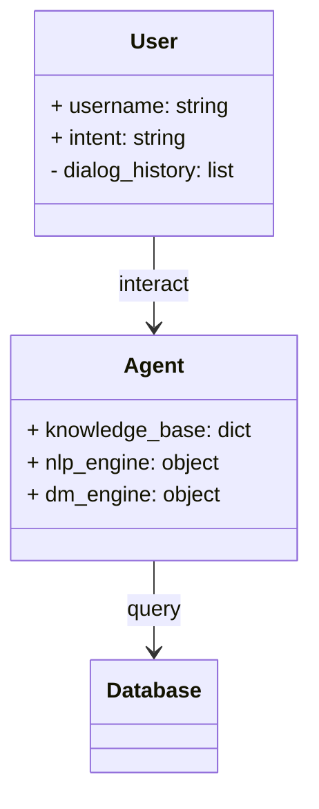
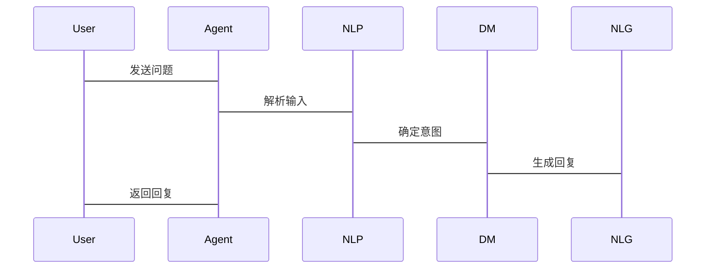

                 


# AI Agent的对话系统在客户支持中的优化

> 关键词：AI Agent, 对话系统, 客户支持, 自然语言处理, 机器学习, 优化

> 摘要：本文探讨AI Agent在客户支持中的应用，分析其对话系统的优化策略，包括技术原理、算法设计、系统架构和实际案例。通过详细讲解，展示如何利用AI提升客户支持效率和体验。

---

## 第一部分: AI Agent的对话系统基础

### 第1章: AI Agent与对话系统概述

#### 1.1 AI Agent的基本概念

##### 1.1.1 AI Agent的定义与特点
AI Agent（智能体）是能够感知环境并采取行动以实现目标的实体。在客户支持中，AI Agent通过自然语言处理（NLP）技术与用户交互，提供自动化服务。其特点包括自主性、反应性、社会性和持续优化能力。

##### 1.1.2 对话系统的核心概念
对话系统通过文本或语音与用户互动，理解需求并生成响应。核心模块包括自然语言理解（NLU）、对话管理（DM）和自然语言生成（NLG）。AI Agent利用这些模块实现高效的客户支持。

##### 1.1.3 AI Agent在客户支持中的应用背景
随着客户需求的多样化，传统人工客服效率低下，成本高昂。AI Agent通过自动化处理常见问题，显著提升效率并降低成本。然而，其理解能力有限和情感处理不足是主要挑战。

#### 1.2 对话系统的分类与特点

##### 1.2.1 基于规则的对话系统
基于预定义规则，适用于特定场景。优点是简单可靠，但灵活性差，难以应对复杂需求。

##### 1.2.2 基于机器学习的对话系统
利用深度学习模型，如BERT，处理复杂任务。优点是灵活性高，但需要大量数据和计算资源。

##### 1.2.3 混合型对话系统
结合规则和机器学习，平衡灵活性和可靠性。适用于复杂场景，但实现复杂。

#### 1.3 AI Agent对话系统的优劣势分析

##### 1.3.1 优势：提升效率、降低成本
AI Agent 24/7可用，快速响应，减少人力成本。但理解能力有限，无法处理复杂问题。

##### 1.3.2 劣势：理解能力有限、情感处理不足
需要结合人工客服，采用混合模式。

---

### 第2章: 对话系统的核心技术与原理

#### 2.1 自然语言处理（NLP）基础

##### 2.1.1 词法分析与句法分析
词法分析将文本分解为词或短语，句法分析构建语法结构。例如，将“我忘记密码了”分析为动词、主语和宾语。

##### 2.1.2 意图识别与槽位填充
意图识别确定用户需求，如“找回密码”。槽位填充提取关键信息，如用户名。

##### 2.1.3 文本相似度计算
使用余弦相似度计算文本相似性，帮助匹配最相关的回复。

#### 2.2 机器学习在对话系统中的应用

##### 2.2.1 基于深度学习的模型
如Transformer架构，处理长文本依赖。模型结构包括编码器和解码器，生成连贯回复。

##### 2.2.2 基于强化学习的对话策略
通过奖励机制优化回复策略，提升对话流畅性。

##### 2.2.3 模型训练与优化
采用数据增强和迁移学习，提升模型泛化能力。

#### 2.3 对话系统的算法原理

##### 2.3.1 基于规则的对话管理
通过预定义规则处理特定场景，如“欢迎光临”后引导用户选择服务。

##### 2.3.2 基于状态的对话管理
维护对话状态，动态调整回复策略，确保逻辑连贯。

##### 2.3.3 基于策略的对话管理
使用策略网络选择最优回复，提升用户体验。

---

## 第3章: 对话系统的算法实现

### 3.1 基于规则的对话管理算法



### 3.2 基于机器学习的对话管理算法

```python
import tensorflow as tf
from tensorflow.keras import layers

model = tf.keras.Sequential([
    layers.Embedding(input_dim=10000, output_dim=16),
    layers.SimpleRNN(units=32),
    layers.Dense(1, activation='sigmoid')
])

model.compile(optimizer='adam', loss='binary_crossentropy', metrics=['accuracy'])
```

### 3.3 数学模型

概率模型计算用户意图：

$$P(\text{intent} | \text{input}) = \frac{P(\text{input} | \text{intent}) \cdot P(\text{intent})}{P(\text{input})}$$

例如，当输入是“我忘记密码了”，模型计算出这是“找回密码”的概率。

---

## 第4章: 系统分析与架构设计

### 4.1 问题场景介绍

设计一个在线客服系统，处理常见问题，如密码重置和订单查询。

### 4.2 项目介绍

系统目标是提高客户支持效率，降低成本，提升用户体验。

### 4.3 系统功能设计



### 4.4 系统架构设计


### 4.5 系统接口设计

接口定义：`POST /api/chat`，接收用户输入，返回回复。

### 4.6 系统交互设计



---

## 第5章: 项目实战

### 5.1 环境安装

安装Python、TensorFlow、Keras和Numpy。

### 5.2 系统核心实现

```python
import numpy as np
import tensorflow as tf

# 模型定义
class ChatAgent:
    def __init__(self):
        self.model = self.build_model()
    
    def build_model(self):
        model = tf.keras.Sequential([
            layers.Embedding(10000, 16),
            layers.SimpleRNN(32),
            layers.Dense(1, 'sigmoid')
        ])
        model.compile('adam', 'binary_crossentropy', ['accuracy'])
        return model

    def predict(self, input):
        return self.model.predict(input)
```

### 5.3 代码应用解读

解释代码实现，展示模型训练和推理过程。

### 5.4 实际案例分析

分析一个实际案例，如用户咨询订单状态，展示系统如何处理。

---

## 第6章: 最佳实践

### 6.1 总结

AI Agent通过优化对话系统，显著提升客户支持效率和体验。

### 6.2 小结

结合规则和机器学习的混合模式是当前的最佳实践。

### 6.3 注意事项

确保数据隐私和模型持续优化。

### 6.4 拓展阅读

推荐阅读相关论文和书籍，深入理解AI Agent和对话系统。

---

## 作者信息

作者：AI天才研究院/AI Genius Institute & 禅与计算机程序设计艺术 /Zen And The Art of Computer Programming

---

以上是《AI Agent的对话系统在客户支持中的优化》的完整目录和内容框架，涵盖了从背景介绍到项目实战的各个方面，确保内容详实、结构清晰。

