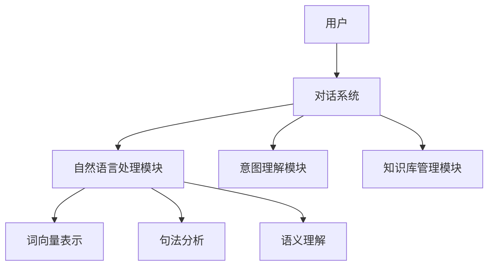
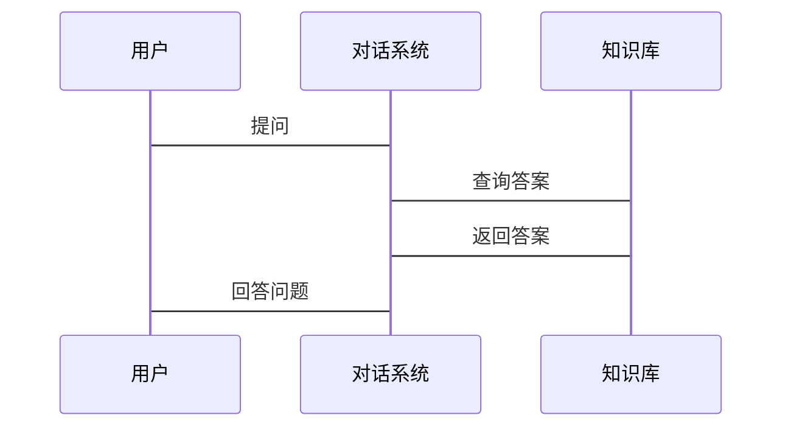

                 


# AI Agent的对话系统在教育领域的应用与优化

> 关键词：AI Agent，对话系统，教育领域，自然语言处理，机器学习，深度学习

> 摘要：随着人工智能技术的快速发展，AI Agent（人工智能代理）与对话系统的结合在教育领域展现出巨大潜力。本文将深入探讨AI Agent对话系统的核心概念、算法原理、系统架构及其在教育场景中的具体应用。通过分析实际案例，本文还将揭示如何优化AI Agent对话系统以提升教育效果，并展望未来的发展方向。

---

## 第一部分: AI Agent的对话系统概述

### 第1章: AI Agent与对话系统基础

#### 1.1 AI Agent的基本概念

##### 1.1.1 AI Agent的定义与特点
AI Agent（人工智能代理）是指能够感知环境、自主决策并执行任务的智能体。其核心特点包括：
- **自主性**：无需外部干预，自主完成任务。
- **反应性**：能够实时感知环境并做出响应。
- **目标导向性**：基于目标驱动行为。
- **学习能力**：通过数据和经验不断优化自身性能。

##### 1.1.2 对话系统的定义与分类
对话系统是一种能够与用户进行自然语言交互的系统，根据实现方式可分为：
- **基于规则的对话系统**：通过预定义的规则匹配用户的输入，生成响应。
- **基于统计的对话系统**：利用概率模型预测用户的意图，并生成响应。
- **基于深度学习的对话系统**：使用神经网络模型（如Transformer）学习对话模式，生成更自然的响应。

##### 1.1.3 AI Agent在对话系统中的作用
AI Agent通过整合自然语言处理（NLP）、机器学习和知识表示等技术，为对话系统提供智能化的决策和执行能力。

---

#### 1.2 对话系统的原理与技术

##### 1.2.1 自然语言处理（NLP）基础
自然语言处理是对话系统的核心技术，主要包括：
- **分词**：将文本分割为词或短语。
- **词向量表示**：将词语转换为向量形式（如Word2Vec、GloVe）。
- **句法分析**：分析句子的语法结构。
- **语义理解**：理解文本的语义含义（如BERT、GPT）。

##### 1.2.2 机器学习与深度学习在对话系统中的应用
- **监督学习**：基于标注数据训练模型。
- **无监督学习**：利用未标注数据进行自适应学习。
- **强化学习**：通过与环境交互优化对话策略。

##### 1.2.3 对话系统的关键技术与挑战
- **意图识别**：准确理解用户的意图。
- **上下文理解**：处理多轮对话中的上下文信息。
- **知识库集成**：将外部知识库与对话系统结合。

---

### 第2章: 教育领域中的对话系统应用背景

#### 2.1 教育领域的智能化需求

##### 2.1.1 传统教育模式的局限性
- **个性化教学不足**：传统教育难以满足每个学生的个性化需求。
- **教学资源分散**：学习资源分布零散，缺乏系统性。
- **互动性不足**：学生与教师之间缺乏实时互动。

##### 2.1.2 智能化教育的必要性
- **个性化学习支持**：通过AI Agent对话系统为学生提供个性化学习建议。
- **24/7可用性**：对话系统可以随时为学生提供帮助。
- **数据驱动的决策**：利用大数据分析学生的学习行为，优化教学策略。

##### 2.1.3 对话系统在教育中的潜在价值
- **提升学习效率**：通过智能化对话引导学生掌握知识。
- **降低教师负担**：协助教师进行教学管理和学生辅导。
- **增强学生参与度**：通过互动对话提高学生的学习兴趣。

---

#### 2.2 教育对话系统的应用场景

##### 2.2.1 在线教育辅助
- **在线课程辅导**：为学生提供实时的在线课程辅导。
- **作业与练习反馈**：自动批改作业并提供反馈。
- **学习计划制定**：根据学生的学习情况制定个性化学习计划。

##### 2.2.2 学生个性化学习支持
- **知识点查漏补缺**：通过对话系统帮助学生发现知识盲点。
- **学习进度跟踪**：实时跟踪学生的学习进度并提供反馈。
- **情感支持**：通过情感分析为学生提供心理支持。

##### 2.2.3 教师教学辅助工具
- **教学数据分析**：分析学生的学习数据，为教师提供教学建议。
- **课堂互动支持**：通过对话系统增强课堂互动。
- **教学资源共享**：帮助教师快速找到合适的教学资源。

---

#### 2.3 教育对话系统的挑战与机遇

##### 2.3.1 数据隐私与安全问题
- **数据泄露风险**：学生的学习数据可能被滥用。
- **数据保护措施**：需要采取严格的加密和访问控制措施。

##### 2.3.2 知识覆盖与准确性
- **知识库的完整性**：对话系统的知识库需要覆盖广泛的知识领域。
- **准确性优化**：通过持续学习和优化算法提高回答的准确性。

##### 2.3.3 用户体验优化
- **自然语言理解能力**：对话系统需要能够理解复杂的语言表达。
- **多轮对话的连贯性**：保持多轮对话的逻辑连贯性和一致性。

---

## 第二部分: AI Agent对话系统的算法原理与实现

### 第3章: 对话系统的核心算法原理

#### 3.1 自然语言处理模型

##### 3.1.1 基于规则的对话系统
- **规则定义**：通过预定义的规则匹配用户的输入并生成响应。
- **优点**：简单易懂，开发成本低。
- **缺点**：难以应对复杂的对话场景。

##### 3.1.2 基于统计的对话系统
- **统计模型**：利用概率模型预测用户的意图。
- **优点**：能够处理一定程度的不确定性。
- **缺点**：依赖于大量的训练数据，准确率有限。

##### 3.1.3 基于深度学习的对话系统
- **神经网络模型**：使用Transformer等深度学习模型进行对话生成。
- **优点**：能够生成更自然的对话。
- **缺点**：需要大量的计算资源和数据支持。

---

#### 3.2 常见对话模型介绍

##### 3.2.1 基于规则的RNN模型
- **RNN（循环神经网络）**：用于处理序列数据，适合短文本的对话生成。
- **缺点**：难以处理长文本，容易出现梯度消失问题。

##### 3.2.2 基于Transformer的模型（如GPT）
- **Transformer架构**：通过自注意力机制处理长文本，生成连贯的对话。
- **优点**：能够处理长文本，生成高质量的对话。
- **缺点**：计算资源消耗较大，需要大量的训练数据。

##### 3.2.3 混合模型的优势与劣势
- **混合模型**：结合规则和深度学习的优点，生成更准确的对话。
- **优点**：能够处理复杂的对话场景。
- **缺点**：实现复杂，需要平衡规则和深度学习的性能。

---

#### 3.3 对话系统的训练与优化

##### 3.3.1 数据预处理与清洗
- **数据清洗**：去除无效数据，确保数据质量。
- **分词处理**：将文本分割为词或短语。
- **数据增强**：通过数据增强技术增加数据多样性。

##### 3.3.2 模型训练与调参
- **模型训练**：使用训练数据训练深度学习模型。
- **参数调整**：通过网格搜索或随机搜索优化模型参数。
- **交叉验证**：通过交叉验证评估模型的泛化能力。

##### 3.3.3 模型评估与优化
- **评估指标**：使用BLEU、ROUGE等指标评估对话生成的质量。
- **优化策略**：通过调整模型结构和参数优化对话生成效果。

---

#### 3.4 对话系统的数学模型与公式

##### 3.4.1 词嵌入模型（Word Embedding）
- **Word2Vec模型**：通过CBOW和Skip-Gram算法生成词向量。
  $$ \text{CBOW:} \quad P(w_i|w_{i-2}, w_{i-1}, w_{i+1}, w_{i+2}) $$
  $$ \text{Skip-Gram:} \quad P(w_{i-1}, w_{i+1}|w_i) $$
- **GloVe模型**：基于全局词向量的词嵌入模型。
  $$ \text{GloVe:} \quad \theta_{word} = \theta_{context}^T \cdot W + b $$

##### 3.4.2 注意力机制（Attention）
- **自注意力机制**：用于处理序列数据，生成长距离依赖关系。
  $$ \text{Attention}(Q, K, V) = \text{softmax}\left(\frac{QK^T}{\sqrt{d_k}}\right)V $$

##### 3.4.3 损失函数
- **交叉熵损失函数**：用于训练对话生成模型。
  $$ \text{损失函数} = -\sum_{i=1}^{n} \text{log}(p(y_i|x_i)) $$

---

### 第4章: 对话系统的数学模型与公式

#### 4.1 自然语言处理的数学基础

##### 4.1.1 词袋模型（Bag-of-Words）
- **词袋模型**：将文本表示为词袋，不考虑词序。
  $$ \text{BOW} = \{x_1, x_2, ..., x_n\} $$

##### 4.1.2 词嵌入模型（Word Embedding）
- **词嵌入模型**：通过神经网络生成词向量。
  $$ \text{Word Embedding} = \{e_1, e_2, ..., e_n\} $$

##### 4.1.3 注意力机制（Attention）
- **自注意力机制**：用于处理序列数据，生成长距离依赖关系。
  $$ \text{Attention}(Q, K, V) = \text{softmax}\left(\frac{QK^T}{\sqrt{d_k}}\right)V $$

---

### 第5章: 系统分析与架构设计方案

#### 5.1 问题场景介绍

##### 5.1.1 教育场景中的问题
- **学生学习效率低**：学生无法有效掌握知识点。
- **教师工作负担重**：教师需要花费大量时间进行个性化辅导。
- **学习资源分散**：学生难以快速找到所需的学习资源。

##### 5.1.2 对话系统的解决方案
- **个性化学习支持**：通过对话系统为学生提供个性化学习建议。
- **24/7可用性**：对话系统可以随时为学生提供帮助。
- **知识库集成**：将学习资源与对话系统结合，提供一站式服务。

---

#### 5.2 系统功能设计

##### 5.2.1 功能模块划分
- **用户识别模块**：识别用户身份并提供个性化服务。
- **意图理解模块**：分析用户的意图并生成响应。
- **知识库管理模块**：管理和更新对话系统的知识库。

##### 5.2.2 功能模块实现
- **用户识别**：通过用户ID或生物特征识别用户身份。
- **意图理解**：通过自然语言处理技术分析用户的意图。
- **知识库管理**：通过知识图谱或数据库管理对话系统的知识库。

---

#### 5.3 系统架构设计

##### 5.3.1 系统架构图


##### 5.3.2 接口设计
- **用户接口**：提供自然语言输入和输出接口。
- **知识库接口**：提供与知识库交互的接口。
- **日志接口**：记录用户交互日志。

##### 5.3.3 交互流程


---

### 第6章: 项目实战

#### 6.1 环境安装

##### 6.1.1 环境配置
- **Python版本**：Python 3.8+
- **依赖库安装**：
  ```bash
  pip install numpy
  pip install pandas
  pip install transformers
  pip install torch
  ```

##### 6.1.2 数据准备
- **训练数据集**：下载公开的对话数据集（如公开的教育对话数据集）。
- **预处理脚本**：编写数据预处理脚本，将数据格式化为模型所需的格式。

---

#### 6.2 系统核心实现

##### 6.2.1 对话系统实现
- **模型选择**：选择基于Transformer的对话模型（如GPT）。
- **模型训练**：使用训练数据训练模型。
- **模型优化**：通过调整超参数优化模型性能。

##### 6.2.2 知识库集成
- **知识库构建**：构建教育领域的知识图谱。
- **知识库查询**：通过对话系统查询知识库。

---

#### 6.3 代码实现与解读

##### 6.3.1 对话系统实现代码
```python
import torch
import torch.nn as nn
import torch.optim as optim

class DialogSystem(nn.Module):
    def __init__(self, vocab_size):
        super(DialogSystem, self).__init__()
        self.embedding = nn.Embedding(vocab_size, 512)
        self.transformer = nn.Transformer(512, 512, 4)
        self.decoder = nn.Linear(512, vocab_size)
        
    def forward(self, input_seq):
        embedded = self.embedding(input_seq)
        output = self.transformer(embedded, embedded)
        output = self.decoder(output)
        return output

# 模型训练
vocab_size = 10000
model = DialogSystem(vocab_size)
optimizer = optim.Adam(model.parameters(), lr=0.001)
criterion = nn.CrossEntropyLoss()

for epoch in range(100):
    for batch in batches:
        outputs = model(batch['input'])
        loss = criterion(outputs, batch['target'])
        optimizer.zero_grad()
        loss.backward()
        optimizer.step()
```

##### 6.3.2 知识库查询代码
```python
# 知识库查询
def query_knowledge_base(question):
    # 调用知识库查询接口
    result = knowledge_base.query(question)
    return result
```

---

### 第7章: 最佳实践、小结与注意事项

#### 7.1 最佳实践
- **数据隐私保护**：在处理学生数据时，必须严格遵守数据隐私法规。
- **模型优化策略**：通过持续学习和优化算法提高对话系统的准确性。
- **用户体验优化**：通过用户反馈不断优化对话系统的交互体验。

#### 7.2 小结
本文详细介绍了AI Agent对话系统在教育领域的应用与优化，从对话系统的原理到具体的实现案例，为读者提供了全面的技术解读。通过本文的学习，读者可以深入了解AI Agent对话系统的核心技术，并能够在实际应用中进行优化和改进。

#### 7.3 注意事项
- **数据质量**：对话系统的性能依赖于高质量的数据，必须确保数据的准确性和完整性。
- **模型泛化能力**：在实际应用中，需要关注模型的泛化能力，避免过拟合。
- **技术与教育的结合**：在技术实现的基础上，需要关注教育领域的实际需求，确保技术与教育的深度融合。

---

## 作者

作者：AI天才研究院/AI Genius Institute & 禅与计算机程序设计艺术 /Zen And The Art of Computer Programming

