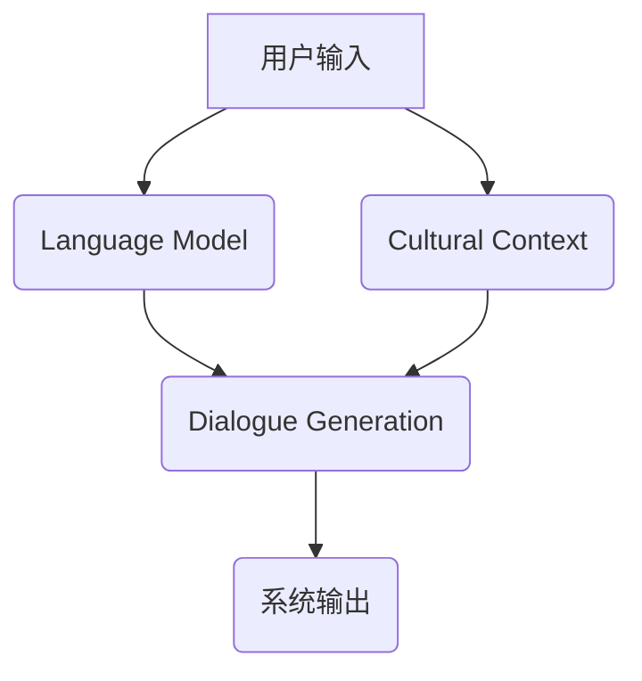

                 


# AI Agent的对话系统在跨文化交流中的应用

> 关键词：AI Agent, 对话系统, 跨文化交际, 自然语言处理, 语言模型

> 摘要：本文深入探讨了AI Agent对话系统在跨文化交流中的应用，分析了其核心概念、算法原理、系统架构及实际应用场景。通过具体案例分析和项目实战，揭示了AI Agent在处理跨文化交际中的挑战与解决方案，为实现更自然、更高效的跨文化交流提供了理论支持与实践指导。

---

# 第1章: AI Agent与对话系统概述

## 1.1 AI Agent的基本概念

### 1.1.1 AI Agent的定义与特点
AI Agent（人工智能代理）是一种能够感知环境并采取行动以实现目标的智能实体。它具备以下特点：
- **自主性**：能够在没有外部干预的情况下独立运行。
- **反应性**：能够实时感知环境并做出响应。
- **学习能力**：通过数据和经验不断优化自身行为。
- **社交能力**：能够与人类或其他系统进行交互。

### 1.1.2 对话系统的定义与分类
对话系统是一种通过自然语言处理技术实现人与机器之间交互的系统。根据实现方式，可以分为以下几类：
- **基于规则的对话系统**：通过预定义的规则和脚本进行对话。
- **基于统计的对话系统**：利用大数据和机器学习算法生成对话。
- **基于深度学习的对话系统**：采用神经网络模型（如Transformer）进行对话生成。

### 1.1.3 AI Agent在对话系统中的作用
AI Agent作为对话系统的核心，负责处理用户的输入、理解意图并生成合适的回应。它通过自然语言处理技术，将人类语言转化为计算机可理解的格式，并通过语言生成技术将计算机输出转化为人类可理解的语言。

## 1.2 跨文化交际的挑战

### 1.2.1 跨文化交际的核心问题
跨文化交际涉及不同文化背景的人之间的交流，其核心问题是：
- **语言差异**：不同语言的语法、词汇和表达习惯不同。
- **文化差异**：文化背景影响语言的使用方式和意义。
- **非语言因素**：肢体语言、语调、时间观念等在跨文化交际中同样重要。

### 1.2.2 跨文化交际中的语言与非语言障碍
语言障碍主要表现为词汇、语法和语义的差异，而非语言障碍则体现在文化背景、价值观和习惯的差异上。例如，西方文化更注重直接表达，而东方文化更倾向于含蓄和间接。

### 1.2.3 跨文化交际对AI Agent的需求
在跨文化交际中，AI Agent需要具备以下能力：
- **多语言支持**：能够理解并生成多种语言。
- **文化适应性**：能够根据用户的文化背景调整对话内容和语气。
- **非语言信息处理**：能够理解和模拟肢体语言、语调等非语言因素。

## 1.3 本章小结
本章介绍了AI Agent的基本概念和对话系统的分类，重点分析了跨文化交际的核心问题及对AI Agent的需求。AI Agent在跨文化交际中的应用，不仅需要理解语言本身，还需要理解文化背景和非语言因素。

---

# 第2章: 跨文化对话系统的原理

## 2.1 跨文化对话系统的概念模型

### 2.1.1 系统输入与输出
跨文化对话系统的输入包括：
- **用户输入**：用户的自然语言输入。
- **文化背景信息**：用户的语言和文化背景数据。
系统输出包括：
- **对话回应**：基于用户输入和文化背景生成的自然语言回应。
- **反馈信息**：用于优化对话系统的元数据。

### 2.1.2 跨文化语境的建模
跨文化语境建模需要考虑以下因素：
- **语言模型**：用于理解用户的输入。
- **文化特征提取**：提取用户的文化背景特征。
- **语境记忆**：记录对话历史，以便生成连贯的回应。

### 2.1.3 对话历史的处理
对话历史的处理需要：
- **存储**：将对话历史存储为可检索的格式。
- **关联**：根据对话内容关联上下文。
- **更新**：动态更新对话历史，以反映当前对话状态。

## 2.2 跨文化对话系统的实现流程

### 2.2.1 语言理解模块
语言理解模块负责将用户的自然语言输入转化为计算机可理解的格式。常用技术包括：
- **词嵌入**：将词语转化为向量表示。
- **句法分析**：分析句子的语法结构。
- **语义理解**：理解句子的意图和情感。

### 2.2.2 跨文化语境分析模块
跨文化语境分析模块负责提取用户的文化背景信息。常用技术包括：
- **文化特征提取**：通过用户输入提取文化相关的特征。
- **文化适应性调整**：根据文化背景调整对话生成策略。

### 2.2.3 对话生成模块
对话生成模块负责根据用户输入和文化背景生成自然语言回应。常用技术包括：
- **基于规则的生成**：根据预定义规则生成回应。
- **基于统计的生成**：利用大数据和机器学习生成回应。
- **基于深度学习的生成**：采用神经网络模型生成回应。

## 2.3 跨文化对话系统的性能指标

### 2.3.1 对话准确率
对话准确率是指系统生成的回应与用户意图匹配的程度。可以通过用户满意度调查或自动评估指标（如BLEU、ROUGE）来衡量。

### 2.3.2 跨文化适应性
跨文化适应性是指系统在不同文化背景下生成合适回应的能力。可以通过跨文化交际的理论框架（如霍夫斯泰德文化维度理论）来评估。

### 2.3.3 对话流畅性
对话流畅性是指系统生成的对话是否自然、连贯。可以通过语言流畅度评估指标（如困惑度）来衡量。

## 2.4 本章小结
本章详细介绍了跨文化对话系统的概念模型和实现流程，重点分析了语言理解、文化语境分析和对话生成模块。跨文化对话系统的性能指标包括对话准确率、跨文化适应性和对话流畅性。

---

# 第3章: 跨文化对话系统的核心概念与联系

## 3.1 語言模型与跨文化适应性的关系

### 3.1.1 語言模型的可解释性
语言模型的可解释性是指模型生成回应的逻辑是否清晰、易于理解。对于跨文化对话系统，可解释性尤为重要，因为用户需要理解系统生成回应的原因。

### 3.1.2 跨文化适应性对语言模型的要求
跨文化适应性要求语言模型能够根据用户的文化背景调整生成的回应。例如，在生成回应时，系统需要考虑用户的语言习惯和文化价值观。

### 3.1.3 語言模型与跨文化语境的关系
语言模型与跨文化语境密切相关。语言模型需要在跨文化语境中提取文化特征，并根据这些特征生成合适的回应。

## 3.2 語言模型与对话生成的对比分析

### 3.2.1 基于规则的对话生成
基于规则的对话生成是一种简单但受限的方法。它通过预定义的规则和脚本生成对话，适用于特定场景，但缺乏灵活性。

### 3.2.2 基于统计的对话生成
基于统计的对话生成通过分析大数据生成对话，具有较高的灵活性和可扩展性，但生成的对话可能缺乏逻辑性和连贯性。

### 3.2.3 基于深度学习的对话生成
基于深度学习的对话生成采用神经网络模型，能够生成高质量、连贯的对话。但其生成过程通常缺乏可解释性。

## 3.3 語言模型与跨文化语境的关系

### 3.3.1 語言模型在跨文化语境中的应用
语言模型在跨文化语境中可以用于：
- **多语言支持**：支持多种语言的对话生成。
- **文化特征提取**：提取用户的文化背景特征。
- **文化适应性调整**：根据文化背景调整对话生成策略。

### 3.3.2 語言模型对跨文化语境的适应性
语言模型对跨文化语境的适应性取决于其训练数据和模型结构。多语言模型（如多语言BERT）可以在不同语言和文化背景下生成合适的回应。

## 3.4 本章小结
本章分析了语言模型与跨文化适应性的关系，对比了不同对话生成方法的优缺点，并探讨了语言模型在跨文化语境中的应用。跨文化对话系统需要结合语言模型和文化适应性调整，以实现高效、自然的对话。

---

# 第4章: 跨文化对话系统的算法原理

## 4.1 語言模型的训练方法

### 4.1.1 监督学习
监督学习是语言模型训练的主要方法。通过标注数据训练模型，使其能够生成符合预期的回应。

### 4.1.2 对比学习
对比学习是一种新兴的训练方法。通过比较不同文化的语言特征，优化模型的跨文化适应性。

### 4.1.3 自监督学习
自监督学习通过利用未标注数据进行预训练，提高模型的跨文化适应性。

## 4.2 对话生成算法的数学模型

### 4.2.1 基于Transformer的对话生成模型
基于Transformer的对话生成模型（如GPT）通过自注意力机制生成连贯的对话。其数学模型如下：

$$
\text{Transformer}(x) = \text{FFN}(\text{Self-attention}(x))
$$

其中，Self-attention用于计算输入序列中每个词与其他词的相关性，FFN表示前馈神经网络。

### 4.2.2 对话生成的损失函数
对话生成的损失函数通常采用交叉熵损失函数：

$$
\text{Loss} = -\sum_{i=1}^{n} \text{log}(P(y_i|x_{\leq i}))
$$

其中，$P(y_i|x_{\leq i})$表示在输入序列$x_{\leq i}$下生成$y_i$的概率。

## 4.3 跨文化适应性调整算法

### 4.3.1 文化特征提取算法
文化特征提取算法通过分析用户输入提取文化背景特征。例如，可以使用文化维度理论（如霍夫斯泰德文化维度理论）进行特征提取。

### 4.3.2 文化适应性调整算法
文化适应性调整算法根据提取的文化特征调整对话生成策略。例如，可以根据文化背景调整对话的语气和内容。

## 4.4 本章小结
本章详细介绍了跨文化对话系统的算法原理，包括语言模型的训练方法、对话生成的数学模型和文化适应性调整算法。跨文化对话系统需要结合多种算法，以实现高效、自然的对话生成。

---

# 第5章: 跨文化对话系统的系统分析与架构设计

## 5.1 系统功能设计

### 5.1.1 语言理解模块
语言理解模块负责将用户的自然语言输入转化为计算机可理解的格式。其功能包括：
- **词嵌入**：将词语转化为向量表示。
- **句法分析**：分析句子的语法结构。
- **语义理解**：理解句子的意图和情感。

### 5.1.2 跨文化语境分析模块
跨文化语境分析模块负责提取用户的文化背景信息。其功能包括：
- **文化特征提取**：通过用户输入提取文化相关的特征。
- **文化适应性调整**：根据文化背景调整对话生成策略。

### 5.1.3 对话生成模块
对话生成模块负责根据用户输入和文化背景生成自然语言回应。其功能包括：
- **基于规则的生成**：根据预定义规则生成回应。
- **基于统计的生成**：利用大数据和机器学习生成回应。
- **基于深度学习的生成**：采用神经网络模型生成回应。

## 5.2 系统架构设计

### 5.2.1 系统架构图
以下是跨文化对话系统的架构图：



### 5.2.2 系统接口设计
系统接口设计需要考虑以下方面：
- **输入接口**：接收用户的自然语言输入和文化背景信息。
- **输出接口**：生成并返回自然语言回应。
- **数据接口**：与外部数据源（如文化数据库）进行交互。

## 5.3 本章小结
本章详细介绍了跨文化对话系统的功能设计和系统架构。系统架构图展示了各模块之间的关系，系统接口设计明确了模块之间的交互方式。

---

# 第6章: 跨文化对话系统的项目实战

## 6.1 环境安装

### 6.1.1 安装Python
安装Python 3.8及以上版本。

### 6.1.2 安装相关库
安装以下Python库：
- `transformers`：用于加载预训练的语言模型。
- `torch`：用于深度学习模型的训练。
- `mermaid`：用于绘制系统架构图。

## 6.2 系统核心实现源代码

### 6.2.1 数据预处理代码
```python
import torch
from transformers import AutoTokenizer, AutoModelForSeq2Seq

tokenizer = AutoTokenizer.from_pretrained('facebook/m2m100')
model = AutoModelForSeq2Seq.from_pretrained('facebook/m2m100')

def preprocess(text):
    inputs = tokenizer(text, return_tensors='pt')
    return inputs

# 示例输入
input_text = "Hello, how are you?"
inputs = preprocess(input_text)
```

### 6.2.2 对话生成代码
```python
def generate_response(inputs, max_length=50):
    outputs = model.generate(inputs['input_ids'], max_length=max_length)
    response = tokenizer.decode(outputs[0], skip_special_tokens=True)
    return response

# 示例生成
response = generate_response(inputs)
print(response)
```

## 6.3 实际案例分析

### 6.3.1 案例背景
假设用户来自不同的文化背景，系统需要生成适合其文化的回应。

### 6.3.2 案例分析
用户输入：
- 中文用户：“你好，今天过得怎么样？”
- 英文用户：“Hello, how are you today?”

系统生成：
- 中文回应：“我很好，谢谢。您呢？”
- 英文回应：“I'm fine, thank you. How about you?”

## 6.4 本章小结
本章通过实际案例分析展示了跨文化对话系统的实现过程。从环境安装到代码实现，详细介绍了系统的核心功能和实现细节。

---

# 第7章: 跨文化对话系统的最佳实践

## 7.1 小结
跨文化对话系统的实现需要结合语言模型和文化适应性调整算法。通过多语言支持和文化背景分析，系统能够生成适合不同文化背景的对话回应。

## 7.2 注意事项
- **数据多样性**：训练数据需要涵盖多种语言和文化背景。
- **文化敏感性**：系统需要避免文化偏见和误解。
- **用户反馈**：通过用户反馈不断优化系统性能。

## 7.3 拓展阅读
- **推荐书籍**：《跨文化交际学》
- **推荐论文**：《Multilingual Neural Machine Translation》
- **推荐工具**：Hugging Face的Transformers库

---

# 作者：AI天才研究院/AI Genius Institute & 禅与计算机程序设计艺术 /Zen And The Art of Computer Programming

