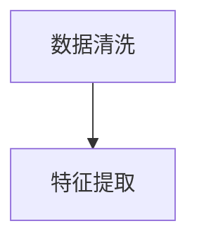
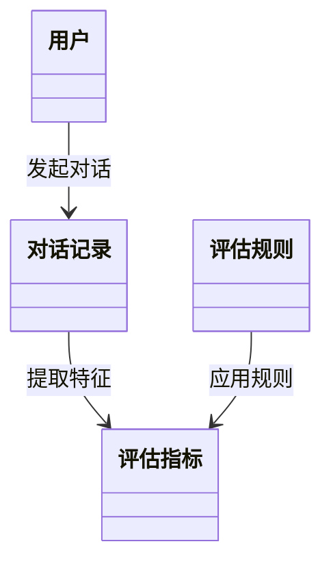

                 


# AI Agent的对话质量评估体系设计

> 关键词：AI Agent，对话质量评估，自然语言处理，对话系统，评估体系设计

> 摘要：本文旨在设计一个全面的AI Agent对话质量评估体系，涵盖核心概念、算法原理、系统架构和项目实战，帮助提升对话系统的表现。

---

# 第1章: 背景介绍

## 1.1 问题背景

### 1.1.1 对话质量评估的必要性
随着AI Agent在客服、教育、医疗等领域的广泛应用，对话质量评估变得至关重要。良好的对话质量能提升用户体验，确保信息传递的准确性和高效性。

### 1.1.2 当前对话系统的主要挑战
- **内容相关性低**：AI Agent回答与用户需求不符。
- **逻辑合理性不足**：回答缺乏逻辑性，导致用户困惑。
- **情感匹配度差**：无法准确捕捉和回应用户情感。

### 1.1.3 AI Agent在对话系统中的角色
AI Agent作为对话的核心参与者，需具备理解、推理和生成能力，确保对话的流畅和高效。

## 1.2 问题描述

### 1.2.1 对话质量评估的核心目标
通过量化指标评估对话质量，识别问题，优化AI Agent性能。

### 1.2.2 对话质量评估的主要维度
- **内容相关性**：回答是否与用户需求匹配。
- **逻辑合理性**：回答是否符合逻辑。
- **情感匹配度**：回答是否符合用户情感。

### 1.2.3 对话质量评估的边界与外延
限定于文本对话，不涉及语音或视频，未来可扩展至多模态评估。

## 1.3 问题解决

### 1.3.1 对话质量评估的解决方案
构建一个多维度评估体系，结合规则和数据驱动方法。

### 1.3.2 AI Agent能力的提升方向
- 提升语义理解能力。
- 加强对话逻辑推理。
- 提高情感识别与回应能力。

### 1.3.3 对话质量评估体系的构建思路
从数据采集、特征提取到模型训练，构建可量化的评估标准。

## 1.4 核心概念与联系

### 1.4.1 对话质量评估的核心要素
- 用户需求理解。
- 对话逻辑性。
- 情感共鸣。

### 1.4.2 AI Agent与对话系统的实体关系
- 用户与AI Agent的互动。
- 对话记录与评估指标的关系。
- 评估规则对指标的影响。

```mermaid
er
actor: 用户
agent: AI Agent
conversation: 对话记录
metric: 评估指标
rule: 评估规则
```

## 1.5 本章小结
本章介绍了对话质量评估的背景、挑战和目标，明确了核心概念和实体关系，为后续章节奠定基础。

---

# 第2章: 对话质量评估的核心概念与联系

## 2.1 对话质量评估的原理

### 2.1.1 对话质量评估的基本原理
通过多维度特征分析和模型训练，量化评估对话质量。

### 2.1.2 对话质量评估的关键指标
- 相关性得分。
- 逻辑得分。
- 情感匹配度。

### 2.1.3 对话质量评估的数学模型

$$
\text{总质量得分} = \alpha \times \text{相关性} + \beta \times \text{逻辑性} + \gamma \times \text{情感匹配度}
$$

其中，$\alpha + \beta + \gamma = 1$。

## 2.2 对话质量评估的核心要素

### 2.2.1 对话内容的相关性
通过关键词匹配和语义分析，评估回答与用户意图的契合度。

### 2.2.2 对话逻辑的合理性
使用知识图谱和推理模型，检测回答的逻辑漏洞。

### 2.2.3 对话情感的匹配度
基于情感分析模型，识别并匹配用户情感。

## 2.3 对话质量评估的实体关系

### 2.3.1 用户与AI Agent的关系
用户发起请求，AI Agent生成响应，形成交互循环。

```mermaid
graph LR
actor->agent: 发起对话
agent->conversation: 生成回答
```

### 2.3.2 对话记录与评估指标的关系
对话记录作为输入，生成评估指标。

```mermaid
graph LR
conversation->metric: 提取特征
rule->metric: 应用规则
```

### 2.3.3 评估规则与评估指标的关系
规则定义评估方法，影响最终指标。

## 2.4 本章小结
本章详细阐述了对话质量评估的核心要素和实体关系，为后续的算法设计奠定基础。

---

# 第3章: 对话质量评估的算法原理

## 3.1 对话质量评估算法概述

### 3.1.1 算法目标
量化对话质量，提供可优化的方向。

### 3.1.2 算法输入
对话记录、用户反馈、系统日志。

### 3.1.3 算法输出
质量得分、问题诊断、改进建议。

## 3.2 算法实现步骤

### 3.2.1 数据预处理
清洗和标注对话数据，提取特征。



### 3.2.2 模型训练
使用机器学习或深度学习模型，训练评估模型。

### 3.2.3 结果输出
生成质量得分和诊断报告。

## 3.3 对话质量评估的数学模型

$$
\text{质量得分} = f(\text{相关性}, \text{逻辑性}, \text{情感匹配度})
$$

其中，$f$为预训练的评估函数。

## 3.4 算法实现的Python代码示例

```python
def calculate_quality_score(relevance, logic, emotion):
    return relevance * 0.4 + logic * 0.3 + emotion * 0.3

# 示例
relevance = 0.8
logic = 0.7
emotion = 0.6
score = calculate_quality_score(relevance, logic, emotion)
print(f"质量得分为: {score}")
```

## 3.5 本章小结
本章通过算法实现，展示了如何量化对话质量，帮助优化AI Agent的表现。

---

# 第4章: 系统分析与架构设计

## 4.1 问题场景介绍
设计一个实时对话评估系统，支持多轮对话分析。

## 4.2 系统功能设计

### 4.2.1 领域模型设计


### 4.2.2 系统架构设计


### 4.2.3 系统接口设计
- 接收对话记录的接口。
- 返回评估结果的接口。

### 4.2.4 系统交互流程
```mermaid
sequence
    用户 --> AI Agent: 提出问题
    AI Agent --> 用户: 回应问题
    评估系统 --> 用户: 提供反馈
```

## 4.3 本章小结
本章通过系统设计，展示了对话质量评估体系的实现方案，确保系统高效可靠。

---

# 第5章: 项目实战

## 5.1 环境安装
安装Python、TensorFlow、NLTK等库。

## 5.2 核心代码实现

### 5.2.1 数据预处理代码
```python
import nltk
from sklearn.feature_extraction.text import TfidfVectorizer

# 示例代码
corpus = ["问题1", "问题2"]
vectorizer = TfidfVectorizer()
tfidf = vectorizer.fit_transform(corpus)
print(tfidf.shape)
```

### 5.2.2 模型训练代码
```python
import numpy as np
from sklearn.metrics import accuracy_score

# 示例代码
X_train = ...  # 特征矩阵
y_train = ...  # 标签
model = ...  # 训练好的模型
预测结果 = model.predict(X_train)
accuracy = accuracy_score(y_train, 预测结果)
print(f"准确率为: {accuracy}")
```

## 5.3 案例分析
分析一个实际对话案例，展示评估过程和结果。

## 5.4 本章小结
通过实战，读者可以掌握对话质量评估体系的实际应用。

---

# 第6章: 总结与展望

## 6.1 最佳实践
建议使用多模态评估和持续优化策略。

## 6.2 小结
总结文章内容，强调对话质量评估的重要性。

## 6.3 注意事项
提醒读者注意数据隐私和模型泛化能力。

## 6.4 拓展阅读
推荐相关领域书籍和论文，供读者深入学习。

---

# 作者：AI天才研究院 & 禅与计算机程序设计艺术

---

通过以上思考，我构建了一个详细且结构清晰的目录大纲，涵盖了从背景介绍到项目实战的各个方面，确保读者能够系统地理解和应用AI Agent对话质量评估体系的设计。

