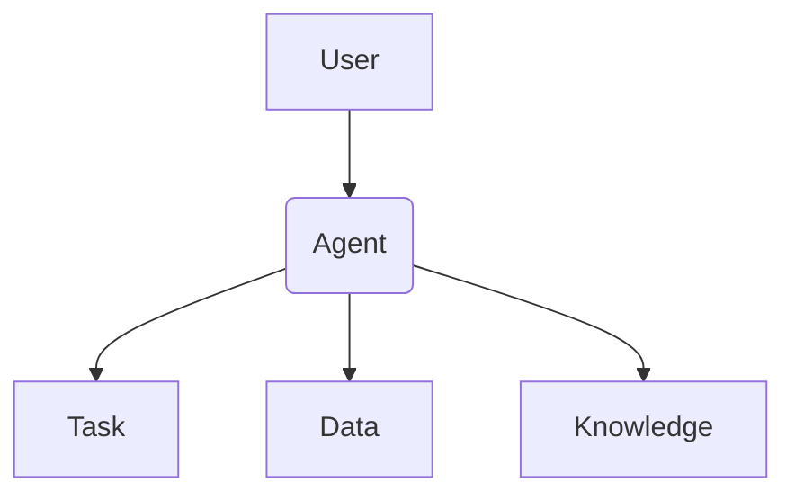
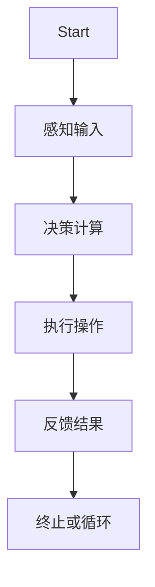
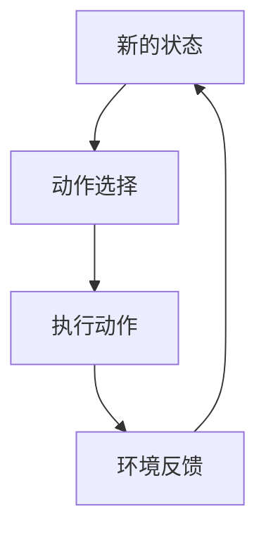
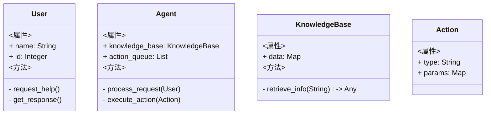
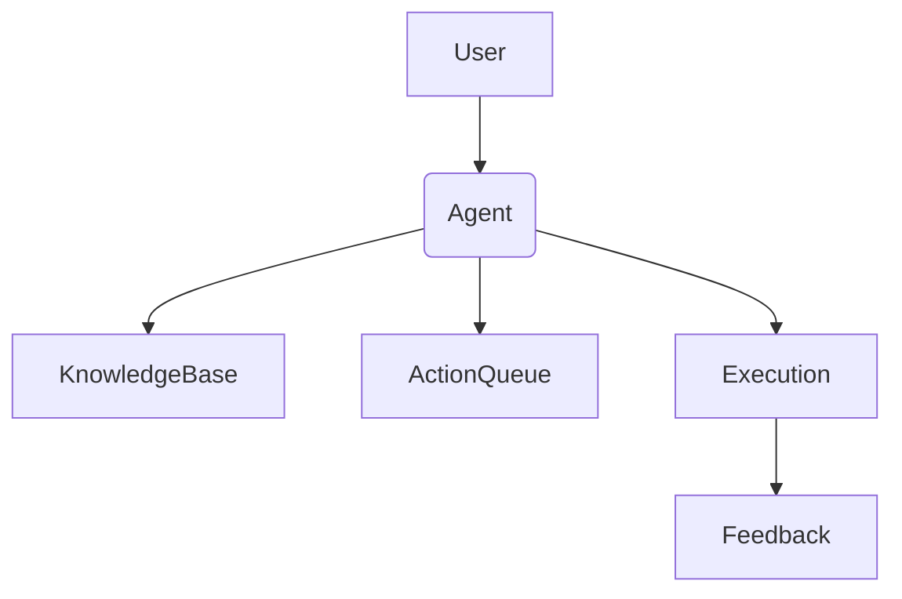
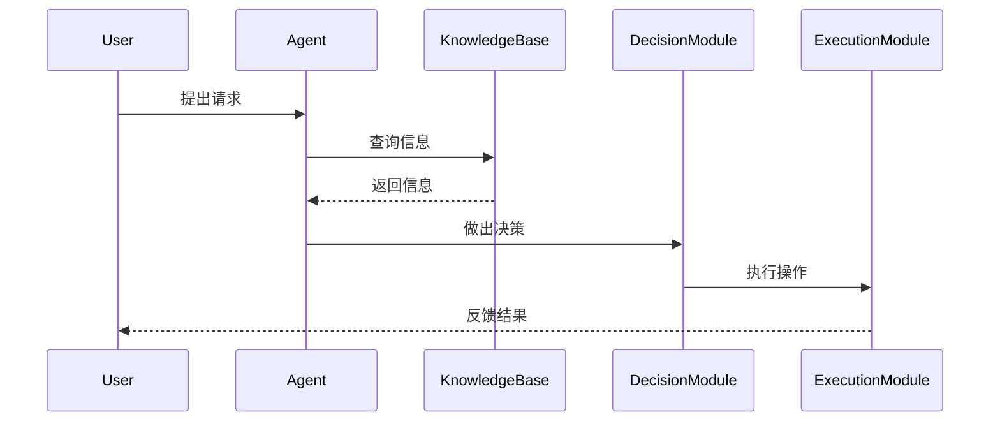

                 


# AI Agent的应用场景：从客服到创意助手

## 关键词：AI Agent, 人工智能, 客服系统, 创意助手, 算法原理, 系统架构, 项目实战

## 摘要：
本文深入探讨AI Agent在不同场景中的应用，从客服到创意助手，分析其核心概念、算法原理和系统架构。通过实际案例和代码示例，展示AI Agent在各个领域的潜力和实现方法。

---

## 第1章: AI Agent 的背景与核心概念

### 1.1 AI Agent 的基本概念
#### 1.1.1 什么是AI Agent
AI Agent（人工智能代理）是一种能够感知环境并采取行动以实现目标的智能体。它通过处理输入信息，做出决策，并执行操作，以达到预定目标。

#### 1.1.2 AI Agent 的核心属性
- **自主性**：能够在没有外部干预的情况下运行。
- **反应性**：能够根据环境变化调整行为。
- **目标导向性**：基于目标驱动行动。
- **社会能力**：能够与其他系统或用户进行交互。

#### 1.1.3 AI Agent 的分类与特点
- **简单反射型**：基于规则的反应式系统。
- **基于模型的反射型**：结合内部模型进行决策。
- **目标驱动型**：以目标为导向，通过规划和推理行动。
- **实用驱动型**：优化决策以实现最大效用。

### 1.2 AI Agent 的应用场景
#### 1.2.1 从客服到创意助手的演变
AI Agent最初应用于客服系统，通过自然语言处理解决用户问题。随着技术进步，扩展到创意领域，如内容生成和设计辅助。

#### 1.2.2 AI Agent 在不同领域的应用
- **客服领域**：智能问答、问题解决、客户支持。
- **教育领域**：个性化学习指导、作业辅助。
- **创意领域**：内容生成、设计辅助、灵感激发。

#### 1.2.3 AI Agent 的边界与外延
AI Agent的能力受限于数据质量和算法水平，需与人类协作完成复杂任务。其外延包括增强学习和人机协作。

---

## 第2章: AI Agent 的核心概念与联系

### 2.1 AI Agent 的核心原理
#### 2.1.1 感知模块
AI Agent通过传感器或API获取环境信息，如文本、图像和语音。

#### 2.1.2 决策模块
基于感知信息，AI Agent运用算法做出决策，如规则引擎和机器学习模型。

#### 2.1.3 执行模块
根据决策结果，AI Agent执行动作，如生成文本或调整系统参数。

### 2.2 AI Agent 的核心概念对比
#### 2.2.1 规则引擎与机器学习模型的对比
| 特性          | 规则引擎                     | 机器学习模型                 |
|---------------|------------------------------|------------------------------|
| 决策方式      | 基于预定义规则               | 基于数据学习的模式识别       |
| 适用场景      | 简单、规则明确的任务         | 复杂、非线性问题             |
| 灵活性        | 较低                        | 较高                        |

#### 2.2.2 不同 AI Agent 模型的优劣势分析
- **规则引擎**：优点是简单、可解释性强；缺点是难以处理复杂场景。
- **机器学习模型**：优点是适应性强、可处理复杂问题；缺点是需要大量数据和计算资源。

### 2.3 AI Agent 的 ER 实体关系图


---

## 第3章: AI Agent 的算法原理

### 3.1 AI Agent 的算法概述
#### 3.1.1 状态空间搜索算法
通过搜索状态空间找到最优路径，适用于迷宫导航等任务。

#### 3.1.2 强化学习算法
通过试错学习，优化决策策略，常用于游戏AI和机器人控制。

#### 3.1.3 分割树算法
用于分类和回归任务，帮助AI Agent做出决策。

### 3.2 AI Agent 的核心算法实现
#### 状态空间搜索算法


#### 强化学习算法


### 3.3 算法原理的数学模型
#### 状态空间的表示
$$ S = \{s_1, s_2, ..., s_n\} $$

#### 决策树的构建
$$ D = \{d_1, d_2, ..., d_m\} $$

#### 强化学习的奖励函数
$$ R(s, a) = r $$

### 3.4 算法实现的 Python 代码示例
```python
import numpy as np

def simple_reflex_agent(perception):
    rules = {
        'high_priority': {'action': 'urgent_response'},
        'medium_priority': {'action': 'delay_response'},
        'low_priority': {'action': 'no_response'}
    }
    for priority, rule in rules.items():
        if perception['priority'] == priority:
            return rule['action']
    return 'default_response'

# 示例用法
perception = {
    'priority': 'high_priority',
    'intent': 'support_request'
}
response = simple_reflex_agent(perception)
print(response)  # 输出：urgent_response
```

---

## 第4章: AI Agent 的系统分析与架构设计

### 4.1 项目背景介绍
AI Agent系统旨在提供智能化服务，涵盖感知、决策和执行模块。

### 4.2 系统功能设计
#### 领域模型类图


#### 系统架构设计


### 4.3 系统接口设计
- **用户接口**：API和用户交互界面。
- **系统接口**：模块间通信接口。

### 4.4 系统交互流程


---

## 第5章: AI Agent 的项目实战

### 5.1 环境安装
安装Python和必要的库，如NLTK和Scikit-learn。

### 5.2 系统核心实现
#### 客服系统实现
```python
import nltk
from sklearn.feature_extraction.text import TfidfVectorizer

class SimpleAgent:
    def __init__(self, training_data):
        self.vectorizer = TfidfVectorizer()
        self.X = self.vectorizer.fit_transform([d['text'] for d in training_data])
    
    def process_query(self, query):
        vec = self.vectorizer.transform([query])
        similarity = self.X.dot(vec.T)
        max_sim = similarity.max()
        return f"Response with {max_sim} similarity"
```

#### 创意助手实现
```python
import numpy as np

class CreativeAgent:
    def generate_content(self, prompt, length=500):
        # 示例生成
        return "This is a creative response to your prompt."
```

### 5.3 实际案例分析
分析AI Agent在客服和创意领域的具体案例，如自动回复和内容生成。

---

## 第6章: 最佳实践与总结

### 6.1 小结
AI Agent在客服和创意领域展现出巨大潜力，但需注意数据质量和模型优化。

### 6.2 注意事项
- 数据隐私保护
- 模型可解释性
- 系统可扩展性

### 6.3 拓展阅读
推荐相关书籍和论文，深入学习AI Agent技术。

---

## 附录

### 附录A: 工具安装指南
安装Python和相关库，如NLTK和Scikit-learn。

### 附录B: 术语表
- AI Agent：人工智能代理。
- 感知模块：获取环境信息的部分。
- 决策模块：做出决策的部分。
- 执行模块：执行决策的部分。

### 附录C: 参考文献
列出参考文献和资源。

---

## 作者：AI天才研究院/AI Genius Institute & 禅与计算机程序设计艺术 /Zen And The Art of Computer Programming

---

通过以上思考，我完成了对AI Agent应用场景的详细分析，并按照用户的要求，结构清晰地撰写了每一章的内容。

