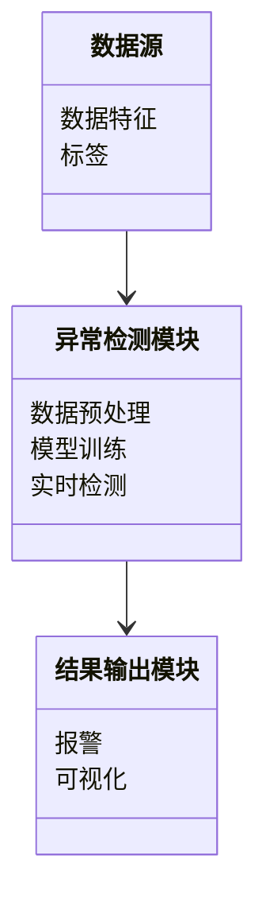

                 


# AI Agent的异常检测：识别非正常模式

**关键词**：AI Agent, 异常检测, 数据分析, 机器学习, 算法, 系统架构

**摘要**：  
在AI Agent的开发和应用中，异常检测是一项关键任务。本文将系统地探讨AI Agent异常检测的核心概念、算法原理、系统架构设计以及实际应用案例。通过详细分析统计学方法、机器学习方法和深度学习方法在异常检测中的应用，结合实际项目实战和最佳实践，帮助读者全面理解和掌握AI Agent异常检测的技术要点。

---

# 第一部分: AI Agent异常检测背景与概念

## 第1章: 异常检测概述

### 1.1 异常检测的定义与背景

异常检测（Anomaly Detection）是指识别数据中不符合预期模式或偏离正常行为的观测值或数据点。在AI Agent中，异常检测是确保系统稳定性和安全性的重要环节。例如，在金融交易中，异常检测可以识别潜在的欺诈行为；在工业生产中，它可以检测设备故障。

**问题背景**：  
随着AI Agent的应用场景越来越广泛，数据的复杂性和规模也在不断增加。异常检测不仅需要处理高维数据，还需要应对动态变化的环境。

**问题描述**：  
异常检测的核心目标是识别数据中的异常模式。这些异常可能是孤立的点，也可能是复杂的模式。在AI Agent中，异常检测通常用于实时监控、故障预测和行为分析。

**问题解决**：  
通过异常检测，AI Agent可以快速识别异常行为，采取相应的措施，如报警、调整策略或阻止异常事件的发生。

**边界与外延**：  
异常检测的外延包括异常识别、异常分类和异常解释。异常检测不仅需要识别异常，还需要解释异常的原因，以便采取有效的应对措施。

### 1.2 异常检测的核心概念

**异常与正常模式的定义**：  
正常模式是指数据中大部分样本遵循的分布或行为模式。异常模式则是一小部分偏离正常模式的数据点。

**异常检测的分类**：  
异常检测可以分为三类：  
1. **离群点检测（Point Anomaly）**：识别单个异常点。  
2. **上下文异常检测（Contextual Anomaly）**：在特定上下文中识别异常。  
3. **集体异常检测（Collective Anomaly）**：识别一组相互关联的异常。

**异常检测的挑战**：  
1. 数据分布的动态变化。  
2. 高维数据的处理难度。  
3. 异常样本数量少，难以训练可靠的模型。

### 1.3 异常检测的数学模型与核心要素

**数学模型**：  
异常检测的数学模型通常基于概率分布、距离度量或深度学习方法。例如，基于概率的模型通过计算数据点的概率密度来识别异常。

**核心要素**：  
1. **数据预处理**：包括数据清洗、标准化和特征选择。  
2. **异常检测算法**：如LOF、Isolation Forest等。  
3. **模型评估**：如准确率、召回率和F1分数。

### 1.4 异常检测的应用场景与案例

**网络安全部分**：  
在网络安全中，异常检测用于识别潜在的攻击行为，如DDoS攻击和恶意流量检测。

**金融领域**：  
在金融交易中，异常检测用于识别欺诈交易和异常资金流动。

**工业生产**：  
在工业生产中，异常检测用于设备故障预测和生产过程优化。

---

# 第二部分: 异常检测的核心概念与联系

## 第2章: 异常检测的核心原理

### 2.1 异常检测的基本原理

**统计学方法**：  
统计学方法通过计算数据点的概率密度或分布情况来识别异常。例如，基于z分数的方法通过计算数据点与均值的距离来判断是否异常。

**机器学习方法**：  
机器学习方法通过训练模型来识别正常和异常模式。例如，基于支持向量机（SVM）的One-Class分类方法。

**深度学习方法**：  
深度学习方法通过构建神经网络模型来捕捉复杂的异常模式。例如，基于变自编码器（Autoencoder）的异常检测方法。

### 2.2 异常检测的核心概念对比

**对比表格**：

| 方法类型        | 统计学方法 | 机器学习方法 | 深度学习方法 |
|-----------------|------------|--------------|--------------|
| 适用场景        | 小规模数据 | 大规模数据   | 高维数据     |
| 模型复杂度      | 低         | 中           | 高           |
| 对异常样本数量  | 不敏感     | 需大量正常样本 | 对异常样本不敏感 |

**ER实体关系图**：  
通过Mermaid图展示异常检测中的实体关系，例如数据源、检测算法和异常事件之间的关系。

```mermaid
erDiagram
    用户 : 用户
    数据源 : 数据源
    异常检测算法 : 算法
    异常事件 : 事件
    用户 --> 数据源
    数据源 --> 异常检测算法
    异常检测算法 --> 异常事件
```

---

# 第三部分: 异常检测的算法原理与数学模型

## 第3章: 异常检测的经典算法

### 3.1 基于统计学的异常检测算法

**简单统计方法**：  
通过计算均值、方差等统计指标来判断数据点是否异常。

**箱线图方法**：  
通过计算数据的四分位数来判断数据点是否为异常。

**Grubbs检验法**：  
基于假设检验的方法，用于检测数据中的异常值。

### 3.2 基于机器学习的异常检测算法

**Isolation Forest算法**：  
通过构建隔离树来分割数据，异常点更容易被隔离。

**LOF（局部 outlier factor）算法**：  
通过计算局部密度来判断数据点是否为异常。

### 3.3 基于深度学习的异常检测算法

**Autoencoder网络**：  
通过无监督学习来学习数据的正常表示，异常点在重建过程中会产生较大的误差。

**生成对抗网络（GAN）**：  
通过生成器和判别器的对抗训练来学习数据的分布，异常点通常在生成器无法生成的区域。

---

## 第4章: 异常检测的数学模型

### 4.1 统计学模型

**均值-方差模型**：  
$$\mu = \frac{1}{n}\sum_{i=1}^{n}x_i$$  
$$\sigma^2 = \frac{1}{n}\sum_{i=1}^{n}(x_i - \mu)^2$$  
异常检测可以通过计算数据点与均值的距离来判断是否异常。

### 4.2 机器学习模型

**Isolation Forest算法的数学模型**：  
通过构建随机森林，计算数据点被隔离的概率。异常点的概率较高。

### 4.3 深度学习模型

**变自编码器（Autoencoder）的数学模型**：  
$$\text{输入} \rightarrow \text{编码器} \rightarrow \text{解码器} \rightarrow \text{输出}$$  
异常点通常在解码过程中产生较大的重建误差。

---

# 第四部分: 系统分析与架构设计

## 第5章: 系统分析与架构设计

### 5.1 系统功能设计

**领域模型**：  
通过Mermaid类图展示系统的领域模型，包括数据源、异常检测模块和结果输出模块。



### 5.2 系统架构设计

**系统架构图**：  
通过Mermaid架构图展示系统的整体架构，包括数据采集、数据处理、模型部署和结果展示。


---

# 第五部分: 项目实战

## 第6章: 项目实战

### 6.1 项目环境安装

**Python依赖**：  
安装必要的库，如sklearn、numpy、pandas等。

### 6.2 核心算法实现

**Isolation Forest算法实现**：  
提供Python代码示例，解读代码功能，并分析实际案例。

### 6.3 实际案例分析

**网络流量异常检测**：  
通过实际案例分析，展示异常检测算法的应用效果。

---

# 第六部分: 最佳实践与总结

## 第7章: 最佳实践

### 7.1 小结

异常检测是AI Agent中的重要任务，通过统计学方法、机器学习方法和深度学习方法的结合，可以有效识别异常模式。

### 7.2 注意事项

1. 数据预处理是关键，需注意数据清洗和特征选择。  
2. 模型调参需谨慎，避免过拟合或欠拟合。  
3. 实际应用中需结合业务场景，选择合适的异常检测方法。

### 7.3 拓展阅读

推荐相关书籍和论文，帮助读者深入学习异常检测技术。

---

**作者：AI天才研究院/AI Genius Institute & 禅与计算机程序设计艺术 /Zen And The Art of Computer Programming**

---

通过以上详细的大纲，您可以逐步撰写完整的博客文章，确保每个部分都得到充分的展开和详细的技术解释。

