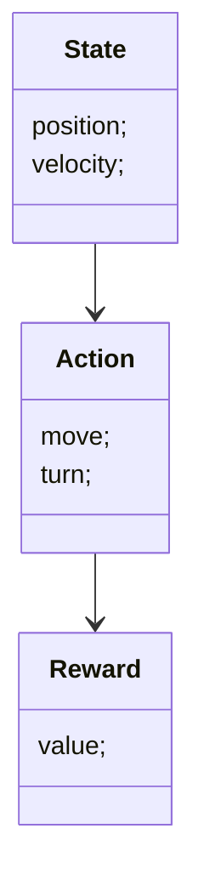
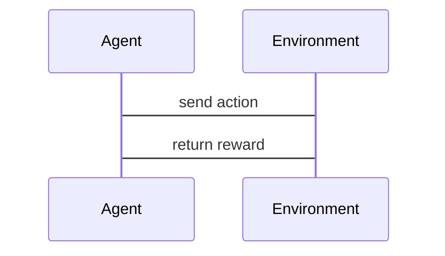

                 


# AI Agent的强化学习在机器人控制中的应用

## 关键词：
AI Agent、强化学习、机器人控制、Q-learning、策略梯度、深度强化学习

## 摘要：
本文详细探讨了AI Agent在机器人控制中的应用，重点分析了强化学习的核心概念、算法原理及其在机器人控制中的具体应用。文章从强化学习的理论基础出发，深入讲解了Q-learning和策略梯度等算法，并通过实际项目案例展示了这些算法在机器人控制中的实现。同时，本文还分析了系统架构设计和项目实战中的关键问题，提供了丰富的技术细节和实践建议。

---

# 第1章 AI Agent与强化学习概述

## 1.1 强化学习的基本概念

### 1.1.1 强化学习的定义
强化学习是一种机器学习范式，通过智能体与环境的交互，学习策略以最大化累积奖励。智能体通过感知环境状态，选择动作，并根据反馈的奖励信号调整策略。

### 1.1.2 强化学习的核心要素
- **状态 (State)**：环境中的当前情况。
- **动作 (Action)**：智能体的选择。
- **奖励 (Reward)**：环境对动作的反馈。
- **策略 (Policy)**：智能体选择动作的规则。

### 1.1.3 AI Agent的基本概念
AI Agent是具有感知和决策能力的实体，能够根据环境信息做出最优选择。

## 1.2 强化学习与机器人控制的联系

### 1.2.1 机器人控制的基本问题
机器人需要通过传感器感知环境，并根据反馈调整动作，以完成特定任务。

### 1.2.2 强化学习在机器人控制中的作用
强化学习为机器人提供了一种自适应决策机制，能够通过试错优化控制策略。

### 1.2.3 AI Agent在机器人控制中的应用案例
- 自主导航
- 机械臂操作
- 人机协作

---

# 第2章 强化学习的理论基础

## 2.1 马尔可夫决策过程

### 2.1.1 状态、动作、奖励的定义
- **状态**：环境中的当前情况，如位置和速度。
- **动作**：智能体的选择，如移动方向。
- **奖励**：环境对动作的反馈，如距离目标的接近程度。

### 2.1.2 策略与价值函数
- **策略**：决定智能体选择动作的规则。
- **价值函数**：评估状态或动作的价值。

### 2.1.3 贝尔曼方程
$$ V(s) = \max_{a} [ r(s,a) + \gamma V(s') ] $$
其中，\( r(s,a) \) 是奖励函数，\( \gamma \) 是折扣因子。

## 2.2 Q-learning算法

### 2.2.1 Q-learning的基本原理
通过更新Q值表，学习状态-动作对的最优奖励。

### 2.2.2 Q-learning的数学公式
$$ Q(s,a) = Q(s,a) + \alpha [ r + \gamma \max Q(s',a') - Q(s,a) ] $$
其中，\( \alpha \) 是学习率。

### 2.2.3 Q-learning的收敛性分析
Q-learning在离散环境中收敛，适用于机器人控制中的离散动作空间。

## 2.3 策略梯度方法

### 2.3.1 策略梯度的基本思想
通过优化策略的参数，最大化累积奖励。

### 2.3.2 策略梯度的数学推导
$$ \nabla J = \mathbb{E} [ \nabla \log \pi(a|s) \cdot Q(s,a) ] $$
其中，\( \pi(a|s) \) 是策略分布，\( Q(s,a) \) 是价值函数。

### 2.3.3 策略梯度的应用场景
适用于连续动作空间的问题，如机器人姿态控制。

---

# 第3章 AI Agent的核心概念

## 3.1 状态空间与动作空间

### 3.1.1 状态空间的定义与特征
- **离散状态空间**：有限个状态。
- **连续状态空间**：无限个状态。

### 3.1.2 动作空间的定义与特征
- **离散动作空间**：有限个动作。
- **连续动作空间**：无限个动作。

### 3.1.3 状态与动作空间的转换关系
通过状态编码和动作解码实现转换。

## 3.2 奖励机制与目标函数

### 3.2.1 奖励机制的定义与设计原则
- 设计奖励机制需明确任务目标。
- 避免奖励稀疏性问题。

### 3.2.2 目标函数的定义与优化方法
- 最大化累积奖励：\( J = \mathbb{E} [ R ] \)

### 3.2.3 奖励机制与目标函数的关系
奖励机制定义目标函数，目标函数指导策略优化。

## 3.3 多智能体协作

### 3.3.1 多智能体协作的基本概念
多个智能体协作完成任务。

### 3.3.2 多智能体协作的挑战与解决方案
- **通信开销**：减少不必要的通信。
- **协调问题**：使用共享目标或分布式决策。

### 3.3.3 多智能体协作在机器人控制中的应用
- 多机器人协作任务：如无人机编队。

---

# 第4章 强化学习算法的实现与优化

## 4.1 Q-learning算法的实现

### 4.1.1 Q-learning的实现流程
1. 初始化Q表。
2. 与环境交互，更新Q值。
3. 重复直到收敛。

### 4.1.2 Q-learning的代码实现
```python
class QLearning:
    def __init__(self, state_space, action_space, gamma=0.99):
        self.Q = np.zeros((state_space, action_space))
        self.gamma = gamma

    def update(self, state, action, reward, next_state):
        self.Q[state, action] = reward + self.gamma * max(self.Q[next_state])
```

### 4.1.3 Q-learning的优化策略
- 使用经验回放。
- 调整学习率。

## 4.2 策略梯度方法的实现

### 4.2.1 策略梯度的实现流程
1. 初始化参数。
2. 采样动作，计算梯度。
3. 更新参数。

### 4.2.2 策略梯度的代码实现
```python
import tensorflow as tf

class PolicyGradient:
    def __init__(self, state_dim, action_dim):
        self.theta = tf.Variable(tf.random.normal([state_dim, action_dim]))

    def call(self, s):
        return tf.nn.softmax(tf.matmul(s, self.theta))
```

### 4.2.3 策略梯度的优化方法
- 使用Adam优化器。
- 调整学习率。

---

# 第5章 强化学习在机器人控制中的应用

## 5.1 机器人控制的强化学习框架

### 5.1.1 系统架构设计
- 智能体层：决策逻辑。
- 环境层：机器人与环境交互。

### 5.1.2 核心算法实现
- Q-learning：实现路径规划。
- 策略梯度：实现动作选择。

## 5.2 机器人控制的项目实战

### 5.2.1 环境配置
- 使用OpenAI Gym模拟环境。

### 5.2.2 核心代码实现
```python
import gym

env = gym.make('CartPole-v0')
agent = QLearning(env.observation_space.shape[0], env.action_space.n)

for episode in range(1000):
    state = env.reset()
    while True:
        action = agent.choose_action(state)
        next_state, reward, done, _ = env.step(action)
        agent.update(state, action, reward, next_state)
        if done:
            break
```

### 5.2.3 实际案例分析
- 自动驾驶中的路径规划。
- 机械臂的抓取控制。

---

# 第6章 系统分析与架构设计

## 6.1 项目背景介绍

### 6.1.1 项目目标
实现AI Agent控制的机器人系统。

## 6.2 系统功能设计

### 6.2.1 领域模型


### 6.2.2 系统架构
```mermaid
container RobotControl {
    State
    Action
    Reward
}
```

## 6.3 系统接口设计

### 6.3.1 接口定义
- 输入：状态信息。
- 输出：动作指令。

## 6.4 系统交互设计

### 6.4.1 交互流程


---

# 第7章 总结与展望

## 7.1 总结
强化学习为AI Agent在机器人控制中提供了有效的决策机制。

## 7.2 最佳实践
- 合理设计奖励机制。
- 选择合适的算法。

## 7.3 未来研究方向
- 多智能体协作优化。
- 离线强化学习。

---

作者：AI天才研究院/AI Genius Institute & 禅与计算机程序设计艺术 /Zen And The Art of Computer Programming

