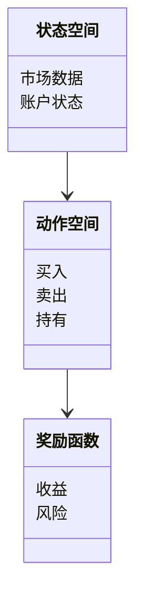

                 


# AI Agent的强化学习在自动化交易中的应用

> 关键词：强化学习, AI Agent, 自动化交易, 算法原理, 交易策略

> 摘要：本文深入探讨了AI Agent如何利用强化学习技术在自动化交易中实现高效决策和策略优化。从强化学习的基础概念到其在交易系统中的具体应用，结合数学模型和实际案例，详细分析了强化学习在自动化交易中的算法原理、系统架构设计以及项目实现。本文旨在为读者提供一个全面的视角，理解AI Agent如何通过强化学习在复杂金融环境中做出最优决策。

---

# 第一部分: 强化学习与AI Agent基础

## 第1章: 强化学习基础

### 1.1 强化学习的定义与特点

#### 1.1.1 强化学习的定义
强化学习（Reinforcement Learning, RL）是一种机器学习范式，通过智能体（Agent）与环境的交互，逐步学习最优策略以最大化累积奖励。与监督学习和无监督学习不同，强化学习强调实时决策和动态反馈。

$$
\text{强化学习：} \quad \text{智能体} \rightarrow \text{环境} \rightarrow \text{反馈} \rightarrow \text{智能体}
$$

#### 1.1.2 强化学习的核心特点
- **实时决策**：智能体在每一步做出决策，影响后续状态。
- **奖励驱动**：通过奖励信号指导学习方向。
- **状态-动作空间**：智能体根据当前状态选择动作，影响下一状态。

#### 1.1.3 强化学习与监督学习的区别

| 特性         | 监督学习                  | 强化学习                  |
|--------------|--------------------------|---------------------------|
| 数据来源     | 标签化数据                | 环境反馈（奖励）          |
| 决策方式     | 预测式                   | 实时决策式               |
| 反馈机制     | 瞬时反馈（标签）          | 延时反馈（奖励）          |
| 应用场景     | 分类、回归                | 控制、游戏、交易           |

---

## 第2章: AI Agent的基本概念

### 2.1 AI Agent的定义
AI Agent（人工智能代理）是指在环境中能够感知并自主决策的智能实体，其核心目标是通过与环境交互实现特定目标。AI Agent可以是软件程序、机器人或其他智能系统。

### 2.2 AI Agent的核心属性

| 属性           | 描述                       |
|----------------|----------------------------|
| 感知能力       | 通过传感器或数据源获取环境信息 |
| 决策能力       | 基于当前状态选择最优动作     |
| 学习能力       | 通过经验优化决策策略       |
| 执行能力       | 执行决策并影响环境状态       |

---

## 第3章: 强化学习在AI Agent中的应用

### 3.1 强化学习与AI Agent的关系
强化学习为AI Agent提供了决策机制，使其能够在复杂环境中实现自主优化。通过强化学习，AI Agent能够从经验中学习，逐步掌握最优策略。

### 3.2 强化学习的核心算法

| 算法         | 描述                       |
|--------------|----------------------------|
| Q-Learning   | 基于值函数的离线学习算法     |
| DQN          | 基于深度神经网络的Q-Learning变体 |
| Policy Gradient | 基于策略直接优化的算法       |

---

# 第二部分: 强化学习算法与数学模型

## 第4章: 强化学习的数学模型

### 4.1 状态空间与动作空间
- **状态空间**：智能体所处环境的所有可能状态的集合。
- **动作空间**：智能体在每个状态下可执行的所有动作的集合。

$$
\text{状态转移：} \quad s_{t+1} = P(s_t, a_t)
$$

### 4.2 奖励函数与价值函数
- **奖励函数**：定义智能体执行某个动作后的奖励值。
- **价值函数**：衡量某状态下采取某动作的期望累积奖励。

$$
Q(s, a) = r + \gamma \max Q(s', a')
$$

---

## 第5章: 强化学习的核心算法原理

### 5.1 Q-Learning算法原理
Q-Learning通过更新Q值表，记录每个状态下每个动作的期望奖励，逐步逼近最优策略。

$$
Q(s, a) \leftarrow Q(s, a) + \alpha [r + \gamma \max Q(s', a') - Q(s, a)]
$$

### 5.2 Deep Q-Networks (DQN)算法
DQN通过深度神经网络近似Q值函数，解决高维状态空间下的强化学习问题。

### 5.3 Policy Gradient方法
Policy Gradient直接优化策略，通过梯度上升最大化奖励期望。

$$
\theta \leftarrow \theta + \alpha \nabla_\theta J(\theta)
$$

---

# 第三部分: 自动化交易系统架构与设计

## 第6章: 自动化交易系统的架构设计

### 6.1 系统功能模块划分

| 模块         | 功能描述                     |
|--------------|------------------------------|
| 数据采集     | 采集市场数据                 |
| 策略执行     | 根据策略生成交易信号         |
| 风险控制     | 监控并管理交易风险           |
| 绩效评估     | 评估交易策略的收益与风险     |

---

## 第7章: 强化学习在自动化交易中的应用

### 7.1 交易策略优化
通过强化学习，AI Agent能够学习最优的买卖时机，提升交易收益。

### 7.2 系统架构设计

#### 7.2.1 领域模型


### 7.3 算法实现

#### 7.3.1 DQN算法实现
```python
class DQN:
    def __init__(self, state_dim, action_dim):
        self.state_dim = state_dim
        self.action_dim = action_dim
        self.model = self.build_model()

    def build_model(self):
        model = Sequential()
        model.add(Dense(64, activation='relu', input_dim=self.state_dim))
        model.add(Dense(self.action_dim))
        return model

    def remember(self, state, action, reward, next_state):
        # 简化版的存储单元
        pass

    def act(self, state):
        # 简化版的决策函数
        pass

    def replay(self):
        # 简化版的回放函数
        pass
```

---

## 第8章: 项目实战

### 8.1 环境安装
- 安装Python和相关库（如TensorFlow、Keras）
- 数据源：股票价格数据集

### 8.2 核心实现
```python
# 强化学习模型
class Agent:
    def __init__(self, state_size, action_size):
        self.state_size = state_size
        self.action_size = action_size
        self.model = self.build_model()

    def build_model(self):
        model = Sequential()
        model.add(Dense(64, activation='relu', input_dim=self.state_size))
        model.add(Dense(self.action_size))
        model.compile(loss='mse', optimizer=Adam())
        return model

    def act(self, state):
        # 简化版的动作选择
        return self.model.predict(state)[0]

# 交易系统
class TradingSystem:
    def __init__(self, agent):
        self.agent = agent
        self.data = data  # 市场数据
        self.position = 0  # 持股状态

    def run(self):
        for i in range(len(self.data)):
            state = self.data[i]
            action = self.agent.act(state)
            # 执行交易
            self.execute_trade(action)
            # 更新状态
            self.update_state()

    def execute_trade(self, action):
        # 简化版的交易执行
        pass

    def update_state(self):
        # 简化版的状态更新
        pass
```

---

## 第9章: 总结与展望

### 9.1 总结
本文详细介绍了强化学习在AI Agent中的应用，从基础概念到算法实现，再到自动化交易系统的设计，为读者提供了一个完整的知识框架。

### 9.2 展望
未来，随着强化学习技术的不断进步，AI Agent在自动化交易中的应用将更加广泛，尤其是在高频交易和复杂市场环境中的表现值得期待。

---

# 作者：AI天才研究院/AI Genius Institute & 禅与计算机程序设计艺术 /Zen And The Art of Computer Programming

