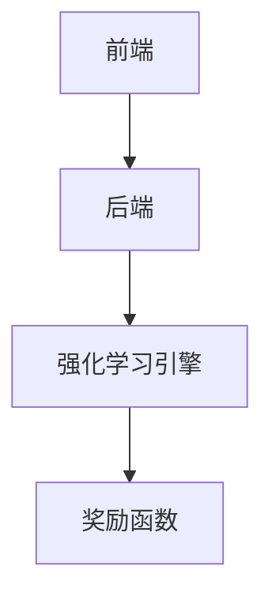
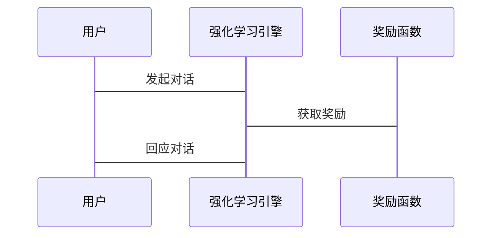

                 


# AI Agent的强化学习应用

## 关键词
AI Agent, 强化学习, Q-Learning, DQN, Policy Gradient, 系统架构, 实战案例

## 摘要
本文深入探讨AI Agent在强化学习中的应用，从基本概念到核心算法，再到系统架构和实战案例，全面解析强化学习如何驱动AI Agent实现智能决策。通过详细分析Q-Learning、DQN和Policy Gradient等算法，结合实际项目案例，展示强化学习在AI Agent中的实践应用。同时，本文提供代码实现和系统设计，帮助读者掌握强化学习驱动的AI Agent的开发与优化。

---

# 第一部分: AI Agent的强化学习基础

## 第1章: AI Agent与强化学习概述

### 1.1 AI Agent的基本概念

#### 1.1.1 什么是AI Agent
AI Agent（人工智能代理）是指能够感知环境、做出决策并采取行动的智能实体。它能够通过与环境交互，自主完成特定任务，实现目标。

- **自主性**：AI Agent能够在没有外部干预的情况下自主决策。
- **反应性**：能够实时感知环境变化并做出响应。
- **目标导向**：通过优化目标函数，实现预设的目标。

#### 1.1.2 AI Agent的核心特征
1. **感知能力**：通过传感器或API接口感知环境状态。
2. **决策能力**：基于感知信息，通过算法做出最优决策。
3. **执行能力**：通过执行器或API接口将决策转化为实际操作。

#### 1.1.3 AI Agent的应用场景
- **游戏AI**：在电子游戏中实现智能NPC或玩家代理。
- **机器人控制**：用于工业机器人、服务机器人等自主决策。
- **自动驾驶**：实现车辆的自主导航和决策。
- **推荐系统**：通过强化学习优化用户推荐策略。

### 1.2 强化学习的基本概念

#### 1.2.1 强化学习的定义
强化学习是一种机器学习范式，通过智能体与环境的交互，学习最优策略以最大化累积奖励。

- **智能体（Agent）**：学习和决策的主体。
- **环境（Environment）**：智能体所处的外部世界。
- **状态（State）**：环境在某一时刻的描述。
- **动作（Action）**：智能体对环境的响应。
- **奖励（Reward）**：智能体行为的反馈，用于指导学习方向。

#### 1.2.2 强化学习的核心要素
1. **状态空间**：所有可能的状态的集合。
2. **动作空间**：所有可能的动作的集合。
3. **奖励函数**：定义智能体行为的优劣。
4. **策略**：智能体选择动作的规则。

#### 1.2.3 强化学习与监督学习的区别
| 特性 | 监督学习 | 强化学习 |
|------|----------|----------|
| 数据 | 标签数据 | 奖励信号 |
| 目标 | 最小化预测误差 | 最大化累积奖励 |
| 交互 | 静态数据 | 动态环境 |

### 1.3 AI Agent与强化学习的关系

#### 1.3.1 强化学习在AI Agent中的作用
强化学习为AI Agent提供了一种在动态环境中自主学习和优化决策的机制。

#### 1.3.2 AI Agent通过强化学习实现智能决策
AI Agent通过强化学习不断优化其策略，以应对复杂多变的环境。

#### 1.3.3 强化学习驱动的AI Agent的优势
- **自适应性**：能够根据环境变化调整策略。
- **高效性**：通过奖励信号快速学习最优行为。
- **灵活性**：适用于多种任务和场景。

---

## 第2章: 强化学习的核心算法

### 2.1 Q-Learning算法

#### 2.1.1 Q-Learning的基本原理
Q-Learning是一种基于值函数的强化学习算法，通过更新Q值表来学习最优策略。

- **Q值表**：记录每个状态下每个动作的期望奖励。
- **更新规则**：$$ Q(s,a) = Q(s,a) + \alpha [r + \gamma \max Q(s',a') - Q(s,a)] $$

#### 2.1.2 Q-Learning的数学模型
- **状态转移**：$s' = f(s, a)$
- **奖励函数**：$r = R(s,a,s')$
- **Q值更新**：$$ Q(s,a) = Q(s,a) + \alpha (r + \gamma \max Q(s',a') - Q(s,a)) $$

#### 2.1.3 Q-Learning的实现步骤
1. 初始化Q值表。
2. 环境提供当前状态$s$。
3. 根据策略选择动作$a$。
4. 执行动作$a$，观察新状态$s'$和奖励$r$。
5. 更新Q值表。
6. 重复步骤2-5直到终止条件满足。

#### 2.1.4 Q-Learning的优缺点
- **优点**：简单易实现，适用于离散状态和动作空间。
- **缺点**：收敛速度慢，难以处理高维状态空间。

### 2.2 Deep Q-Network (DQN)算法

#### 2.2.1 DQN的基本原理
DQN通过深度神经网络近似Q值函数，解决Q-Learning在高维状态空间中的计算难题。

- **神经网络结构**：输入层（状态）→ 隐藏层 → 输出层（动作值）。
- **目标网络**：用于稳定训练，通过软更新保持目标值。

#### 2.2.2 DQN的数学模型
- **Q值网络**：$Q_\theta(s,a)$，参数$\theta$。
- **目标网络**：$Q_{\theta'}(s,a)$。
- **损失函数**：$$ \mathcal{L} = \mathbb{E}[(r + \gamma Q_{\theta'}(s',a')) - Q_\theta(s,a)]^2 $$

#### 2.2.3 DQN的实现步骤
1. 初始化主网络和目标网络。
2. 从经验回放池中随机抽取经验。
3. 训练主网络以最小化损失函数。
4. 定期更新目标网络。

#### 2.2.4 DQN的优缺点
- **优点**：适用于高维状态空间，稳定性高。
- **缺点**：训练过程复杂，需要经验回放池。

### 2.3 Policy Gradient方法

#### 2.3.1 Policy Gradient的基本原理
Policy Gradient直接优化策略，通过梯度上升方法最大化累积奖励。

- **策略函数**：$\pi_\theta(a|s)$，参数$\theta$。
- **目标函数**：$$ J(\theta) = \mathbb{E}[R] $$

#### 2.3.2 Policy Gradient的数学模型
- **梯度计算**：$$ \nabla J = \mathbb{E}[\nabla \log \pi_\theta(a|s) \cdot Q(s,a)] $$

#### 2.3.3 Policy Gradient的实现步骤
1. 初始化策略网络。
2. 采样状态$s$，选择动作$a$。
3. 计算梯度并更新参数。
4. 重复步骤2-3直到收敛。

#### 2.3.4 Policy Gradient的优缺点
- **优点**：直接优化策略，适用于连续动作空间。
- **缺点**：收敛速度慢，容易陷入局部最优。

---

## 第3章: 强化学习的数学模型与公式

### 3.1 Q-Learning的数学模型
- **Q值更新公式**：$$ Q(s,a) = Q(s,a) + \alpha [r + \gamma \max Q(s',a') - Q(s,a)] $$
- **收敛条件**：当$\alpha$趋近于0时，Q值收敛于最优值。

### 3.2 DQN的数学模型
- **Q值网络**：$Q_\theta(s,a)$。
- **目标网络**：$Q_{\theta'}(s,a)$。
- **损失函数**：$$ \mathcal{L} = \mathbb{E}[(r + \gamma Q_{\theta'}(s',a')) - Q_\theta(s,a)]^2 $$

### 3.3 Policy Gradient的数学模型
- **目标函数**：$$ J(\theta) = \mathbb{E}[R] $$
- **梯度计算**：$$ \nabla J = \mathbb{E}[\nabla \log \pi_\theta(a|s) \cdot Q(s,a)] $$

---

## 第4章: 系统分析与架构设计

### 4.1 项目场景介绍
假设我们正在开发一个智能客服机器人，需要通过强化学习优化对话策略，提高客户满意度。

### 4.2 系统功能设计
- **领域模型**：定义对话的状态、动作和奖励。
- **系统架构**：包括前端、后端、强化学习引擎和奖励函数。

### 4.3 系统架构图


### 4.4 系统交互流程图


---

## 第5章: 项目实战

### 5.1 环境安装
安装Python和相关库：
```bash
pip install gym numpy tensorflow
```

### 5.2 核心代码实现
```python
import gym
import numpy as np
import tensorflow as tf

class DQN:
    def __init__(self, state_space, action_space):
        self.state_space = state_space
        self.action_space = action_space
        self.main_network = self.build_network()
        self.target_network = self.build_network()
        self.alpha = 0.1
        self.gamma = 0.99

    def build_network(self):
        model = tf.keras.Sequential([
            tf.keras.layers.Dense(64, activation='relu'),
            tf.keras.layers.Dense(self.action_space, activation='linear')
        ])
        return model

    def update_target_network(self):
        self.target_network.set_weights(self.main_network.get_weights())

    def train(self, states, actions, rewards, next_states):
        target = rewards + self.gamma * np.max(self.target_network.predict(next_states), axis=1)
        Q = self.main_network.predict(states)
        Q[np.arange(len(actions)), actions] = target
        self.main_network.fit(states, Q, epochs=1, verbose=0)
```

### 5.3 案例分析
训练一个DQN智能体在CartPole环境中实现平衡。

```python
env = gym.make('CartPole-v1')
agent = DQN(env.observation_space.shape[0], env.action_space.n)
for episode in range(1000):
    state = env.reset()
    total_reward = 0
    while True:
        action = agent.main_network.predict(np.array([state]))[0].argmax()
        next_state, reward, done, _ = env.step(action)
        agent.train(np.array([state]), np.array([action]), np.array([reward]), np.array([next_state]))
        total_reward += reward
        state = next_state
        if done:
            break
    agent.update_target_network()
    print(f'Episode {episode}, Total Reward: {total_reward}')
```

### 5.4 项目小结
通过DQN算法实现的智能体能够在CartPole环境中稳定运行，验证了强化学习在AI Agent中的有效性。

---

## 第6章: 最佳实践与总结

### 6.1 最佳实践
- **经验回放**：使用经验回放池减少样本偏差。
- **网络结构**：选择合适的神经网络结构以提高学习效率。
- **奖励设计**：设计合理的奖励函数以引导智能体的行为。

### 6.2 小结
本文从理论到实践，详细探讨了AI Agent在强化学习中的应用，通过具体案例展示了如何实现强化学习驱动的智能代理。

### 6.3 注意事项
- 强化学习需要大量计算资源，建议使用GPU加速。
- 在实际应用中，需要根据具体场景调整算法参数。

### 6.4 拓展阅读
- 《Deep Reinforcement Learning》
- 《Reinforcement Learning: Theory and Algorithms》

---

# 作者：AI天才研究院/AI Genius Institute & 禅与计算机程序设计艺术 /Zen And The Art of Computer Programming

---

通过以上思考过程，我们可以系统地撰写一篇结构清晰、内容详实的技术博客文章，全面覆盖AI Agent的强化学习应用，从基础概念到实际应用，帮助读者深入了解这一领域的核心内容。

