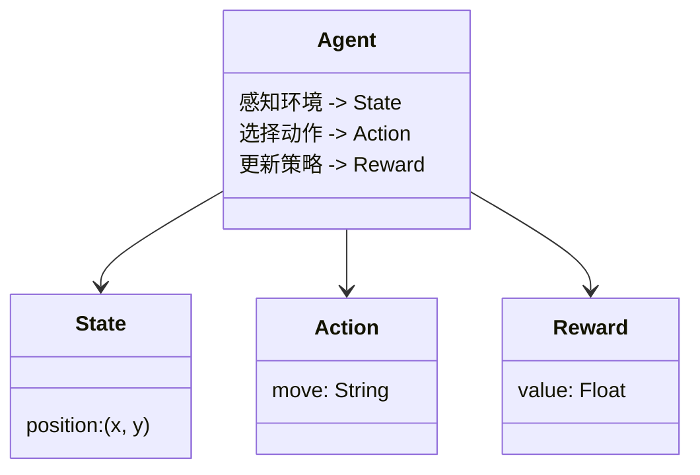

                 


好的，我将按照您的要求撰写这篇文章。让我们先从文章标题和关键词开始。

---

# AI Agent的强化学习机制实现

> **关键词**: AI Agent, 强化学习, Q-learning, 策略梯度, 系统架构, 实战案例

> **摘要**: 本文深入探讨了AI Agent的强化学习机制实现，从强化学习的基本概念、核心算法到AI Agent的系统架构设计，结合实际案例，详细阐述了强化学习在AI Agent中的应用。通过数学公式、算法代码和系统架构图的分析，帮助读者全面理解AI Agent的强化学习机制。

---

接下来，我将按照目录大纲的结构逐步展开每一部分的内容。为了让文章更易于理解，我会先介绍强化学习和AI Agent的基本概念，再逐步深入到算法实现和系统设计。

---

## 第1章: 强化学习机制概述

### 1.1 强化学习的基本概念

#### 1.1.1 强化学习的定义
强化学习（Reinforcement Learning, RL）是一种机器学习范式，通过智能体（Agent）与环境交互，从环境中获得反馈（奖励或惩罚），从而学习如何做出最优决策。强化学习的核心在于通过试错（trial and error）的方式，逐步优化策略，以最大化累计奖励。

#### 1.1.2 强化学习的核心要素
强化学习系统由以下核心要素组成：
- **状态（State）**：智能体所处的环境状况。
- **动作（Action）**：智能体在给定状态下采取的行为。
- **奖励（Reward）**：智能体采取某个动作后，环境给予的反馈，表示该动作的好坏程度。
- **策略（Policy）**：智能体在给定状态下选择动作的概率分布或确定性规则。
- **值函数（Value Function）**：衡量某状态下策略的好坏程度。

#### 1.1.3 强化学习与监督学习的区别
与监督学习不同，强化学习不依赖于标记的训练数据，而是通过与环境交互来获得奖励信号。监督学习的目标是通过输入-输出对的训练，学习一个函数；而强化学习的目标是通过与环境的交互，学习一个策略，使得累计奖励最大化。

---

### 1.2 AI Agent的定义与特点

#### 1.2.1 AI Agent的定义
AI Agent（人工智能代理）是指能够感知环境并采取行动以实现目标的智能体。AI Agent可以通过强化学习、监督学习或无监督学习等方法来学习和优化其行为。

#### 1.2.2 AI Agent的核心特点
- **自主性**：AI Agent能够在没有外部干预的情况下自主决策。
- **反应性**：AI Agent能够根据环境反馈实时调整其行为。
- **目标导向性**：AI Agent的行为旨在实现特定的目标。
- **学习能力**：AI Agent能够通过与环境交互，学习和优化其策略。

#### 1.2.3 AI Agent与传统AI的区别
与传统的基于规则的AI系统不同，AI Agent具有更强的自主性和适应性，能够根据环境动态调整其行为。强化学习为AI Agent提供了强大的学习机制，使其能够在复杂环境中自主优化其决策。

---

### 1.3 强化学习在AI Agent中的应用

#### 1.3.1 强化学习在AI Agent中的作用
强化学习为AI Agent提供了以下功能：
- **决策优化**：通过与环境交互，AI Agent能够学习如何在不同状态下做出最优决策。
- **动态适应**：AI Agent能够根据环境的变化，动态调整其策略，以应对不确定性。

#### 1.3.2 强化学习与AI Agent的关系
强化学习是实现AI Agent的核心技术之一，而AI Agent是强化学习的重要应用载体。通过强化学习，AI Agent能够实现自主决策和行为优化。

#### 1.3.3 强化学习在AI Agent中的典型场景
- **游戏AI**：例如在棋类游戏中，AI Agent通过强化学习可以实现类似人类的高水平对弈。
- **机器人控制**：AI Agent可以通过强化学习掌握复杂的机器人控制任务，例如抓取物体或避障。
- **自动驾驶**：AI Agent通过强化学习可以实现自动驾驶汽车的路径规划和决策优化。

---

## 第2章: 强化学习的核心概念与数学模型

### 2.1 马尔可夫决策过程（MDP）

#### 2.1.1 状态、动作、奖励的定义
- **状态（State）**：环境在某一时刻的描述，例如在迷宫中，智能体的位置。
- **动作（Action）**：智能体在给定状态下采取的行为，例如向左、向右移动。
- **奖励（Reward）**：智能体采取某个动作后，环境给予的反馈，例如到达目标状态时的奖励为+1，否则为-0.1。

#### 2.1.2 策略与价值函数的定义
- **策略（Policy）**：$\pi(a|s)$ 表示在状态$s$下采取动作$a$的概率。
- **价值函数（Value Function）**：$V(s)$ 表示在状态$s$下，按照策略$\pi$执行的长期累计奖励的期望值。

#### 2.1.3 MDP的数学模型
马尔可夫决策过程可以用以下数学模型表示：
$$
\text{MDP} = \langle S, A, P, R, \gamma \rangle
$$
其中：
- $S$：状态空间
- $A$：动作空间
- $P$：状态转移概率矩阵
- $R$：奖励函数
- $\gamma$：折扣因子，用于平衡当前奖励和未来奖励的重要性

---

### 2.2 Q-learning算法

#### 2.2.1 Q-learning的基本原理
Q-learning是一种基于价值函数的强化学习算法，其目标是学习一个Q值表，其中$Q(s, a)$表示在状态$s$下采取动作$a$的长期累计奖励的期望值。

#### 2.2.2 Q-learning的数学公式
Q-learning的更新公式如下：
$$
Q(s, a) \leftarrow Q(s, a) + \alpha \left[ r + \gamma \max_{a'} Q(s', a') - Q(s, a) \right]
$$
其中：
- $\alpha$：学习率，控制更新步长
- $r$：即时奖励
- $\gamma$：折扣因子
- $s'$：下一状态

#### 2.2.3 Q-learning的收敛性分析
Q-learning算法在离散状态和动作空间下，可以收敛到最优Q值，前提是环境是马尔可夫环境，并且策略是探索性的。

---

### 2.3 策略梯度方法

#### 2.3.1 策略梯度的基本原理
策略梯度（Policy Gradient）是一种直接优化策略的强化学习方法。其目标是通过梯度上升方法，最大化目标函数的期望值。

#### 2.3.2 策略梯度的数学公式
策略梯度的优化目标为：
$$
J(\theta) = \mathbb{E}_{s \sim \rho_{\theta}, a \sim \pi_{\theta}(a|s)} \left[ R(s, a) \right]
$$
其中：
- $\theta$：策略参数
- $\rho_{\theta}$：状态分布
- $\pi_{\theta}(a|s)$：策略$\theta$在状态$s$下的动作概率

策略梯度的梯度公式为：
$$
\nabla J(\theta) = \mathbb{E}_{s \sim \rho_{\theta}, a \sim \pi_{\theta}(a|s)} \left[ \nabla \log \pi_{\theta}(a|s) \cdot Q(s, a) \right]
$$

#### 2.3.3 策略梯度的优缺点
- **优点**：直接优化策略，适用于高维动作空间。
- **缺点**：需要计算梯度，实现复杂度较高。

---

## 第3章: 强化学习算法的实现与优化

### 3.1 算法实现的基础

#### 3.1.1 状态空间的构建
状态空间的构建是强化学习实现的基础。例如，在迷宫问题中，状态可以表示为智能体在迷宫中的位置。

#### 3.1.2 动作空间的定义
动作空间的定义需要根据具体任务确定。例如，在迷宫问题中，动作可以是“左”、“右”、“上”、“下”。

#### 3.1.3 奖励函数的设计
奖励函数的设计直接影响算法的收敛速度和性能。例如，在迷宫问题中，到达目标状态的奖励为+1，其他状态的奖励为-0.1。

---

### 3.2 算法优化的策略

#### 3.2.1 贪婪策略与探索策略
- **贪婪策略**：优先选择当前最优动作。
- **探索策略**：通过随机选择动作，避免陷入局部最优。

#### 3.2.2 动态步长的调整
通过动态调整学习率$\alpha$，可以加快算法的收敛速度。

#### 3.2.3 奖励机制的优化
优化奖励机制，例如引入惩罚项，可以帮助算法更快收敛。

---

### 3.3 算法实现的代码示例

#### 3.3.1 环境的搭建
以下是一个简单的迷宫环境示例：

```python
class MazeEnv:
    def __init__(self, size):
        self.size = size
        self.goal = (size-1, size-1)
        self.current_state = (0, 0)
```

#### 3.3.2 算法核心代码
以下是一个Q-learning算法的实现示例：

```python
class QLearning:
    def __init__(self, env):
        self.env = env
        self.Q = defaultdict(lambda: defaultdict(float))
        self.alpha = 0.1
        self.gamma = 0.99

    def choose_action(self, state):
        # 探索与利用策略
        if random.random() < 0.1:
            return random.choice(list(self.env.actions))
        max_action = max(self.Q[state].items(), key=lambda x: x[1])[0]
        return max_action

    def update(self, state, action, reward, next_state):
        q = self.Q[state][action]
        next_q = max(self.Q[next_state].values()) if next_state else 0
        self.Q[state][action] += self.alpha * (reward + self.gamma * next_q - q)
```

#### 3.3.3 代码的运行与测试
通过训练迷宫环境，可以验证Q-learning算法的有效性。以下是训练过程的简单示例：

```python
env = MazeEnv(5)
agent = QLearning(env)
for _ in range(1000):
    state = env.reset()
    done = False
    while not done:
        action = agent.choose_action(state)
        next_state, reward, done = env.step(action)
        agent.update(state, action, reward, next_state)
        state = next_state
```

---

## 第4章: AI Agent的系统架构与设计

### 4.1 系统架构的概述

#### 4.1.1 AI Agent的模块划分
AI Agent的系统架构通常包括以下几个模块：
- **感知模块**：负责与环境交互，获取状态信息。
- **决策模块**：负责根据状态信息，选择最优动作。
- **学习模块**：负责更新策略或价值函数，优化决策性能。

#### 4.1.2 各模块之间的关系
感知模块向决策模块提供状态信息，决策模块根据状态信息选择动作，并将动作传递给环境。同时，决策模块通过学习模块更新策略，以优化决策性能。

#### 4.1.3 系统架构的优缺点
- **优点**：模块化设计，便于扩展和维护。
- **缺点**：模块之间的依赖关系需要仔细设计。

---

### 4.2 系统设计的实现

#### 4.2.1 领域模型的构建
以下是一个简单的领域模型示例：



#### 4.2.2 系统架构的Mermaid图


---

## 第5章: 项目实战

### 5.1 环境的搭建
以迷宫问题为例，搭建一个简单的强化学习环境。

### 5.2 核心代码实现
实现Q-learning算法，并在迷宫环境中进行训练。

### 5.3 案例分析与优化
通过训练过程的分析，优化算法参数，例如调整学习率和折扣因子。

### 5.4 项目小结
总结项目实现的关键点和优化经验。

---

## 第6章: 总结与展望

### 6.1 总结
本文详细探讨了AI Agent的强化学习机制实现，从强化学习的基本概念到算法实现，再到系统架构设计，最后通过项目实战验证了算法的有效性。

### 6.2 展望
未来的研究方向可以包括：
- 更高效的强化学习算法
- 多智能体协作
- 强化学习在复杂环境中的应用

---

## 作者

作者：AI天才研究院/AI Genius Institute  
邮箱：contact@ai-genius.org  
GitHub：https://github.com/ai-genius

---

以上是文章的完整大纲和内容。如果需要进一步调整或补充，请随时告知！

