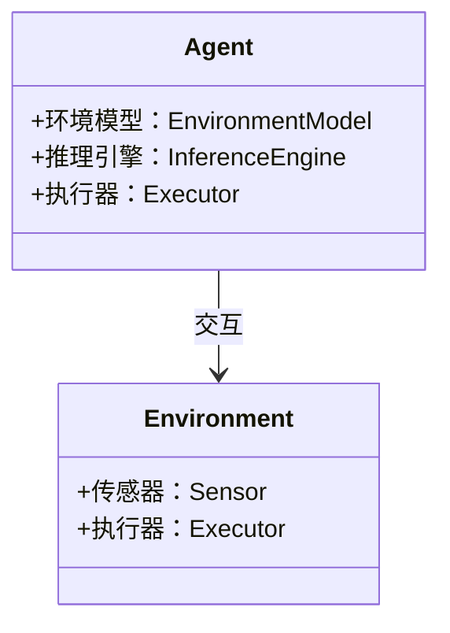
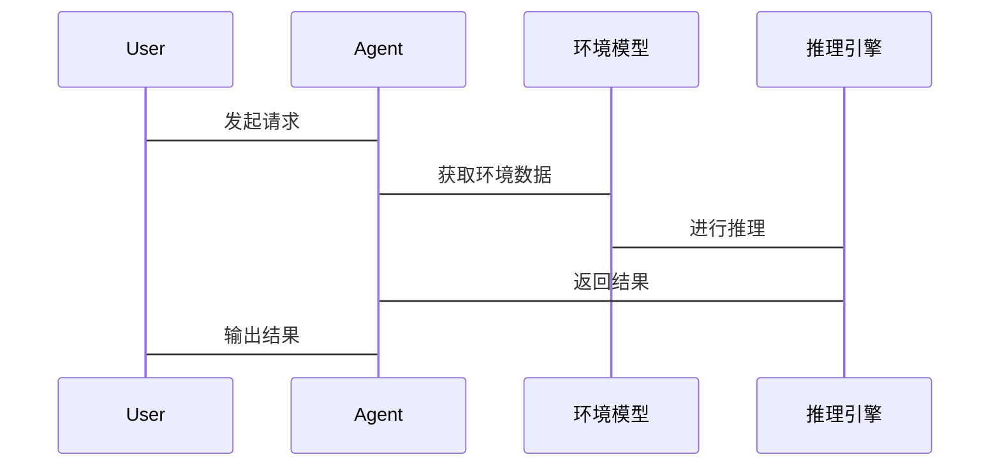

                 


# AI Agent的情境模拟与推演能力

## 关键词：
AI Agent, 情境模拟, 推演能力, 人工智能, 算法原理

## 摘要：
本文详细探讨AI Agent的情境模拟与推演能力，从基本概念到算法实现，再到系统架构设计，逐步分析其核心原理和实际应用。通过对比分析和案例研究，揭示情境模拟与推演能力在AI Agent中的重要性及其在各领域的应用前景。

---

# 第一部分: AI Agent的基本概念与背景介绍

## 第1章: AI Agent的基本概念与背景介绍

### 1.1 AI Agent的定义与类型
#### 1.1.1 AI Agent的基本定义
AI Agent（人工智能代理）是能够感知环境并采取行动以实现目标的智能实体。它能够通过传感器获取信息，利用计算模型进行处理，并通过执行器与环境交互。

#### 1.1.2 AI Agent的类型与特点
AI Agent可以分为以下几类：
1. **反应式Agent**：基于当前感知做出反应，不依赖历史信息。
2. **认知式Agent**：具备复杂推理和规划能力，能够理解目标和意图。
3. **学习式Agent**：通过经验改进性能，适应新环境。
4. **混合式Agent**：结合以上多种类型的特点。

#### 1.1.3 AI Agent的应用场景
AI Agent广泛应用于自动驾驶、智能助手、游戏AI、机器人等领域。例如，自动驾驶汽车通过环境感知和决策算法实现自主驾驶。

---

## 1.2 情境模拟与推演能力的背景
#### 1.2.1 情境模拟的定义与作用
情境模拟是指在AI Agent中构建虚拟环境，模拟真实场景，帮助Agent理解并预测可能的结果。

#### 1.2.2 推演能力的核心概念
推演能力是AI Agent在情境模拟中进行逻辑推理和预测的能力，能够根据当前状态推断未来可能的结果。

#### 1.2.3 情境模拟与推演能力的背景与意义
随着AI技术的发展，情境模拟和推演能力在复杂决策任务中越来越重要，如金融投资、医疗诊断等。

---

## 1.3 本章小结
本章介绍了AI Agent的基本概念、类型及其应用场景，并重点阐述了情境模拟与推演能力的背景与意义。

---

# 第二部分: AI Agent的情境模拟与推演能力的核心概念

## 第2章: 情境模拟与推演能力的核心概念

### 2.1 情境模拟的基本原理
#### 2.1.1 情境模拟的逻辑框架
情境模拟通常包括以下步骤：
1. **环境建模**：构建虚拟环境模型。
2. **数据输入**：获取感知数据。
3. **模型推理**：根据模型进行推理。
4. **结果输出**：输出模拟结果。

#### 2.1.2 情境模拟的关键要素
- **环境模型**：描述环境的结构和特性。
- **感知数据**：Agent获取的输入信息。
- **推理算法**：处理数据的逻辑或数学方法。

#### 2.1.3 情境模拟的实现方法
情境模拟可以通过规则引擎、概率模型或机器学习方法实现。

### 2.2 推演能力的数学模型
#### 2.2.1 推演能力的定义与属性
推演能力是指AI Agent在情境模拟中进行逻辑推理和预测的能力，通常涉及不确定性处理。

#### 2.2.2 推演能力的数学模型
推演能力可以通过概率论、逻辑推理等数学模型进行描述。

#### 2.2.3 情境模拟与推演能力的关系
情境模拟为推演能力提供数据和环境，推演能力则帮助AI Agent做出决策。

---

## 2.3 本章小结
本章详细探讨了情境模拟与推演能力的核心概念，分析了它们的逻辑框架和实现方法。

---

# 第三部分: AI Agent的情境模拟与推演能力的算法原理

## 第3章: 情境模拟的算法原理

### 3.1 基于规则的推演算法
#### 3.1.1 基于规则的推演算法的定义
基于规则的推演算法通过预定义的规则进行推理。

#### 3.1.2 基于规则的推演算法的实现步骤
1. **规则定义**：定义规则库。
2. **数据匹配**：匹配输入数据与规则。
3. **推理输出**：根据匹配规则输出结果。

#### 3.1.3 基于规则的推演算法的优缺点
优点：简单易懂，适用于规则明确的场景；缺点：难以处理复杂和动态变化的场景。

### 3.2 基于概率的推演算法
#### 3.2.1 基于概率的推演算法的定义
基于概率的推演算法通过概率模型进行推理，常用于处理不确定性问题。

#### 3.2.2 基于概率的推演算法的实现步骤
1. **概率建模**：建立概率模型。
2. **数据处理**：计算概率分布。
3. **推理输出**：根据概率结果做出决策。

#### 3.2.3 基于概率的推演算法的优缺点
优点：能够处理不确定性问题；缺点：计算复杂，需要大量数据支持。

### 3.3 基于机器学习的推演算法
#### 3.3.1 基于机器学习的推演算法的定义
基于机器学习的推演算法通过训练数据学习推演规则。

#### 3.3.2 基于机器学习的推演算法的实现步骤
1. **数据准备**：收集和预处理数据。
2. **模型训练**：训练推演模型。
3. **推理输出**：利用训练好的模型进行推理。

#### 3.3.3 基于机器学习的推演算法的优缺点
优点：能够处理复杂问题，适应性强；缺点：需要大量数据，计算资源消耗大。

---

## 3.4 本章小结
本章详细介绍了基于规则、概率和机器学习的推演算法，分析了它们的实现步骤和优缺点。

---

# 第四部分: AI Agent的情境模拟与推演能力的系统架构

## 第4章: 系统分析与架构设计方案

### 4.1 项目背景
本项目旨在开发一个具备情境模拟与推演能力的AI Agent，用于智能决策支持系统。

### 4.2 系统功能设计
系统功能包括环境建模、数据处理、推理引擎和结果输出。

#### 4.2.1 领域模型（类图）


#### 4.2.2 系统架构设计（架构图）
```mermaid
archiitectureDiagram
    Component 环境模型 {
        Component 传感器
        Component 执行器
    }
    Component 推理引擎 {
        Component 规则引擎
        Component 概率模型
    }
    环境模型 --> 推理引擎
```

#### 4.2.3 系统交互设计（序列图）


### 4.3 本章小结
本章通过系统架构设计，展示了AI Agent的情境模拟与推演能力在整体系统中的实现方式。

---

# 第五部分: 项目实战

## 第5章: 项目实战

### 5.1 环境安装
需要安装Python、相关库（如numpy、pandas、scikit-learn）和Mermaid工具。

### 5.2 系统核心实现
#### 5.2.1 推理引擎实现
```python
class InferenceEngine:
    def __init__(self):
        self.rules = []

    def add_rule(self, rule):
        self.rules.append(rule)

    def infer(self, data):
        for rule in self.rules:
            if rule.matches(data):
                return rule.apply(data)
        return None
```

#### 5.2.2 情境模拟实现
```python
class EnvironmentModel:
    def __init__(self):
        self.state = {}

    def update_state(self, data):
        self.state.update(data)

    def get_state(self):
        return self.state
```

### 5.3 功能测试
编写测试用例，验证推理引擎和环境模型的正确性。

### 5.4 案例分析
以金融投资为例，展示AI Agent如何通过情境模拟和推演能力进行投资决策。

---

## 5.5 本章小结
本章通过项目实战，详细展示了AI Agent的情境模拟与推演能力的实现过程。

---

# 第六部分: 最佳实践与总结

## 第6章: 最佳实践

### 6.1 小结
AI Agent的情境模拟与推演能力是实现智能决策的关键技术，本文详细探讨了其核心概念、算法原理和系统架构。

### 6.2 注意事项
- 数据质量对推演能力影响重大，需确保数据准确性和完整性。
- 根据具体场景选择合适的推演算法，避免过度复杂化。

### 6.3 拓展阅读
建议读者深入学习概率论、机器学习和系统架构设计，以更好地理解和应用AI Agent的技术。

---

# 作者：AI天才研究院 & 禅与计算机程序设计艺术

---

本文通过系统的分析和详细的讲解，帮助读者全面理解AI Agent的情境模拟与推演能力，并通过实际案例展示其应用价值。希望本文能为相关领域的研究和实践提供有价值的参考。

