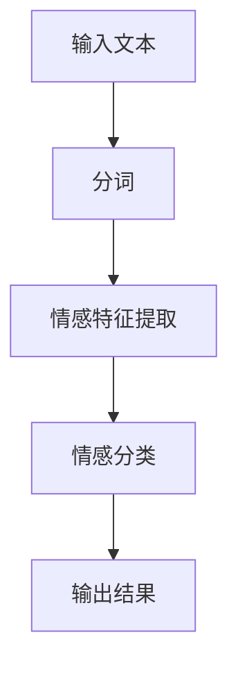
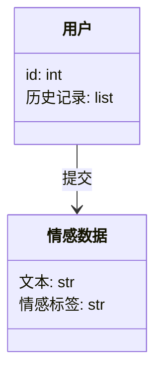
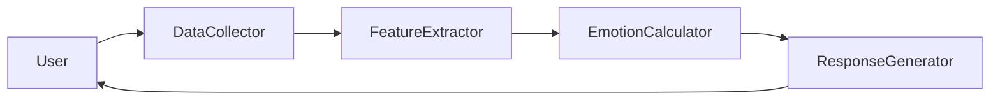
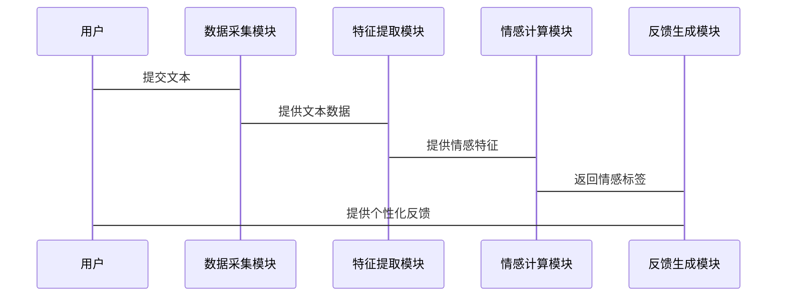

                 


# AI Agent的情感计算与应用

## 关键词：AI Agent，情感计算，情感分析，机器学习，深度学习

## 摘要：本文探讨了AI Agent在情感计算中的应用，从基本概念、算法原理到系统架构，详细分析了情感计算在AI Agent中的作用及其实际应用案例，最后展望了情感计算的未来发展。

---

## 第一部分: AI Agent与情感计算的背景介绍

### 第1章: AI Agent与情感计算的概述

#### 1.1 情感计算的定义与背景
- **1.1.1 情感计算的定义**  
  情感计算（Affective Computing）是通过计算机对人类情感的识别、理解和响应，来改善人机交互体验的一项技术。它涉及情绪识别、情感分析、情感生成等多个方面。

- **1.1.2 情感计算的发展历史**  
  情感计算的研究始于20世纪90年代，随着人工智能和机器学习技术的发展，情感计算逐渐从理论研究走向实际应用。如今，情感计算已广泛应用于聊天机器人、智能客服、教育技术等领域。

- **1.1.3 情感计算的基本原理**  
  情感计算通过分析文本、语音、面部表情等多种数据源，提取情感特征（如快乐、悲伤、愤怒等），并基于这些特征进行情感分类和预测。

- **1.1.4 AI Agent与情感计算的关系**  
  AI Agent需要与人类交互时，情感计算使其能够理解用户的当前情感状态，从而提供更个性化的服务。例如，在智能客服中，AI Agent可以根据用户的语气判断其情绪，并调整回应方式。

#### 1.2 情感计算的核心概念
- **1.2.1 情感分析与生成**  
  情感分析是通过自然语言处理技术判断文本的情感倾向，而情感生成则是基于情感数据生成相应的情感文本或语音。

- **1.2.2 情感计算的应用场景**  
  包括智能助手、教育技术、医疗健康、游戏娱乐等领域。例如，在医疗领域，情感计算可以帮助医生更好地理解患者的情绪状态。

- **1.2.3 情感计算的边界与外延**  
  情感计算不仅限于文本分析，还包括语音、图像等多种数据源的处理。其外延还包括情感记忆和情感推理等高级功能。

- **1.2.4 情感计算的核心要素组成**  
  包括数据采集、特征提取、情感分类、情感推理和反馈机制等。

---

## 第二部分: 情感计算的核心概念与联系

### 第2章: 情感计算的核心概念与联系

#### 2.1 情感计算的核心概念
- **2.1.1 情感分析**  
  情感分析是情感计算的核心任务之一，旨在判断一段文本的情感倾向。常用的方法包括基于规则的分类和机器学习方法。

- **2.1.2 情感生成**  
  情感生成是通过给定情感标签生成相应的情感文本。这在智能写作和情感对话系统中尤为重要。

- **2.1.3 情感记忆**  
  情感记忆是指系统能够记录和存储用户过去的情感状态，以便在后续交互中进行情感预测和个性化推荐。

#### 2.2 情感计算的核心概念对比
- **2.2.1 情感分析与情感生成的对比**  
  情感分析侧重于理解用户情感，而情感生成侧重于模拟用户情感。

- **2.2.2 情感计算与其他AI技术的对比**  
  情感计算与自然语言处理（NLP）和计算机视觉有交集，但其核心目标是理解人类情感。

- **2.2.3 情感计算与传统数据处理的对比**  
  传统数据处理主要关注事实性信息，而情感计算关注情绪和情感信息。

#### 2.3 情感计算的ER实体关系图
```mermaid
er
actor: 用户
action: 情感计算操作
object: 情感数据
```

---

## 第三部分: 情感计算的算法原理

### 第3章: 情感计算的算法原理

#### 3.1 情感计算的主要算法
- **3.1.1 基于规则的情感计算算法**  
  通过预定义的规则（如情感词典）来判断文本的情感倾向。

- **3.1.2 基于机器学习的情感计算算法**  
  使用支持向量机（SVM）或朴素贝叶斯（Naive Bayes）等机器学习模型进行情感分类。

- **3.1.3 基于深度学习的情感计算算法**  
  使用卷积神经网络（CNN）或循环神经网络（RNN）进行情感分析，尤其适用于处理长文本和复杂情感。

#### 3.2 情感计算算法的流程图


#### 3.3 情感计算的数学模型
- 情感分类的常用模型是支持向量机（SVM）：
  $$ \text{目标函数} = \min \frac{1}{2}||w||^2 $$
  $$ \text{约束条件} = y_i(w \cdot x_i + b) \geq 1 $$
  
- 深度学习中的情感分类通常使用交叉熵损失函数：
  $$ \text{损失函数} = -\sum_{i=1}^n y_i \log(p_i) + (1 - y_i) \log(1 - p_i) $$

#### 3.4 情感计算的Python实现
以下是一个基于机器学习的情感分类示例代码：
```python
from sklearn.feature_extraction.text import TfidfVectorizer
from sklearn.svm import SVC

# 数据预处理
X = ["This is a great product!", "I'm very disappointed."]
y = [1, 0]

# 特征提取
vectorizer = TfidfVectorizer()
X_vec = vectorizer.fit_transform(X)

# 建模与训练
model = SVC()
model.fit(X_vec, y)

# 预测
test_sentence = "The quality is excellent!"
test_vec = vectorizer.transform([test_sentence])
predicted = model.predict(test_vec)
print(predicted)
```

---

## 第四部分: 系统分析与架构设计

### 第4章: 系统分析与架构设计

#### 4.1 系统功能设计
- **功能模块**：
  - 数据采集模块：收集用户输入的文本、语音或图像数据。
  - 特征提取模块：提取情感特征，如情感词、句法结构等。
  - 情感计算模块：进行情感分析和情感生成。
  - 交互反馈模块：根据情感计算结果生成相应的反馈。

- **领域模型**：


#### 4.2 系统架构设计
- **架构图**：


- **接口设计**：
  - 数据输入接口：接受用户的输入数据。
  - 情感计算接口：提供情感分析和生成服务。
  - 反馈输出接口：输出情感计算结果和个性化反馈。

- **交互流程图**：


---

## 第五部分: 项目实战

### 第5章: 项目实战

#### 5.1 项目背景与目标
- **项目背景**：分析社交媒体上的用户评论，判断其情感倾向。
- **项目目标**：构建一个基于深度学习的情感分析模型。

#### 5.2 环境安装
- 安装Python和相关库：
  ```bash
  pip install numpy
  pip install pandas
  pip install scikit-learn
  pip install tensorflow
  ```

#### 5.3 核心代码实现
- 情感分析模型的实现：
```python
import tensorflow as tf
from tensorflow.keras import layers

# 数据预处理
def preprocess(data):
    # 假设data包含文本和标签
    x = data['text']
    y = data['label']
    return x, y

# 模型构建
model = tf.keras.Sequential([
    layers.Embedding(input_dim=10000, output_dim=16),
    layers.BGRU(units=64, return_sequences=False),
    layers.Dense(2, activation='softmax')
])

model.compile(optimizer='adam', loss='sparse_categorical_crossentropy', metrics=['accuracy'])

# 训练
model.fit(x_train, y_train, epochs=10, batch_size=32)
```

#### 5.4 案例分析与结果解读
- 训练后的模型可以对新评论进行情感分类：
  ```python
  prediction = model.predict(x_test)
  print("预测结果:", prediction.argmax(axis=1))
  ```

---

## 第六部分: 总结与展望

### 第6章: 总结与展望

#### 6.1 本书总结
- 情感计算是AI Agent实现人机交互的重要技术，涵盖了情感分析、情感生成等多个方面。
- 通过算法原理和系统设计，我们可以构建高效的情感计算系统。

#### 6.2 未来展望
- 情感计算将更加智能化，结合边缘计算和实时反馈机制，提供更个性化的服务。
- 随着AI技术的发展，情感计算将应用于更多领域，如元宇宙和增强现实等新兴技术。

#### 6.3 最佳实践 tips
- 在实际应用中，注意数据的多样性和平衡性，避免模型过拟合。
- 结合业务需求，选择合适的情感计算算法和系统架构。
- 定期更新模型，以适应用户情感需求的变化。

#### 6.4 小结
- 情感计算是一项具有挑战性和应用前景的技术，AI Agent的情感计算将推动人机交互的智能化和个性化。

---

## 作者：AI天才研究院/AI Genius Institute & 禅与计算机程序设计艺术 /Zen And The Art of Computer Programming

---

本文通过详细分析情感计算的核心概念、算法原理、系统架构和实际应用，为读者提供了全面了解AI Agent情感计算的视角。从理论到实践，帮助读者掌握情感计算的关键技术，并能够在实际项目中灵活应用。

