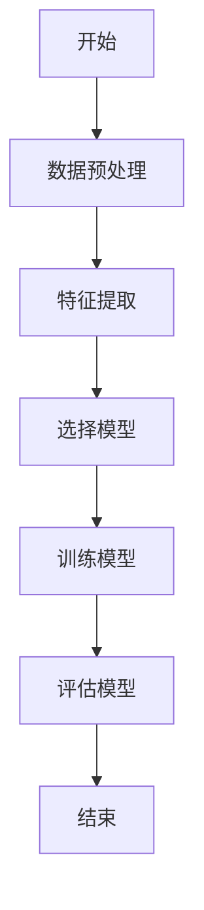
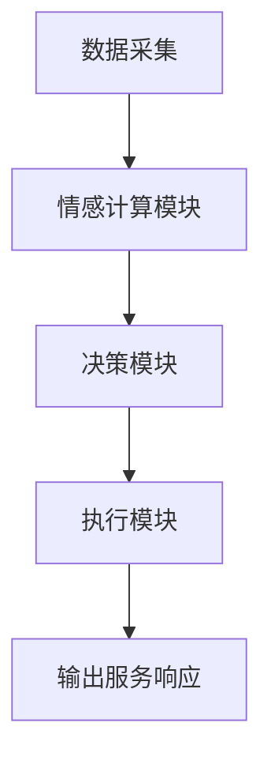
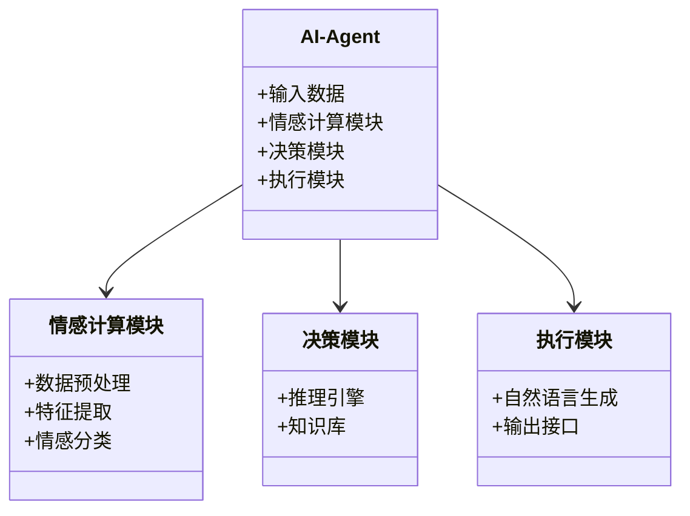
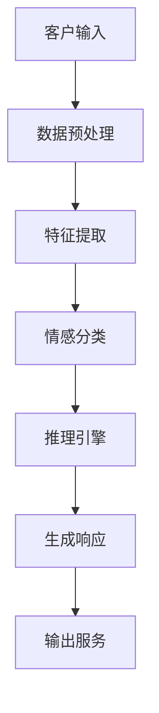
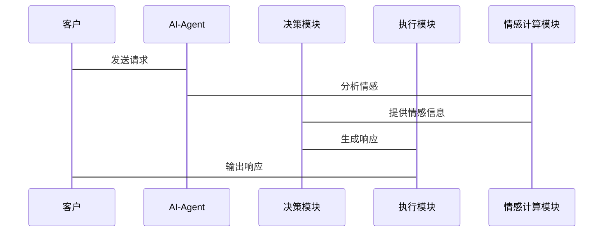

                 

# AI Agent的情感计算在客户服务中的应用

关键词：AI Agent、情感计算、客户服务、人工智能、自然语言处理、系统架构

摘要：本文详细探讨了AI Agent在客户服务中的情感计算应用。从AI Agent和情感计算的基本概念出发，分析了情感计算在客户服务中的核心作用，详细讲解了情感计算的算法原理和系统架构设计。通过实际案例分析，展示了AI Agent在客户服务中的应用场景和价值，最后总结了当前技术的优势与未来发展方向。

---

# 第1章 AI Agent与情感计算的背景与基础

## 1.1 AI Agent的基本概念
### 1.1.1 什么是AI Agent
AI Agent（人工智能代理）是指能够感知环境、自主决策并执行任务的智能实体。它通过传感器获取信息，利用推理能力做出决策，并通过执行器与环境交互。AI Agent的核心特征包括自主性、反应性、目标导向和社会能力。

### 1.1.2 AI Agent的核心特征
- **自主性**：AI Agent能够独立决策，无需外部干预。
- **反应性**：能够实时感知环境并做出反应。
- **目标导向**：所有行为都围绕实现特定目标展开。
- **社会能力**：能够与其他实体（包括人类）进行有效交互。

### 1.1.3 AI Agent与传统程序的区别
AI Agent与传统程序的主要区别在于其自主性和智能性。传统程序依赖预定义规则，而AI Agent能够根据环境动态调整行为，并通过学习提升性能。

## 1.2 情感计算的基本概念
### 1.2.1 情感计算的定义
情感计算（Affective Computing）是通过计算机技术来识别、理解和响应人类情感的过程。它不仅关注事实本身，还关注个体的情感状态。

### 1.2.2 情感计算的主要技术
- **自然语言处理（NLP）**：通过分析文本中的语调和情感词汇来判断情感。
- **语音识别与情感分析**：通过分析语音的语调、音量和节奏来识别情感。
- **计算机视觉**：通过分析面部表情和肢体语言来识别情感。

### 1.2.3 情感计算的应用场景
情感计算广泛应用于教育、医疗、娱乐、客户服务等领域。在客户服务中，情感计算能够帮助AI Agent更好地理解客户情绪，提供更个性化的服务。

## 1.3 AI Agent在客户服务中的应用背景
### 1.3.1 客户服务的现状与挑战
传统客户服务依赖人工坐席执行标准化流程，存在效率低、成本高、客户体验差等问题。随着AI技术的发展，AI Agent能够通过情感计算实现更高效、更个性化的服务。

### 1.3.2 AI Agent在客户服务中的优势
- **24/7可用性**：AI Agent可以全天候为客户提供服务。
- **快速响应**：通过自动化处理，AI Agent能够迅速响应客户需求。
- **个性化服务**：通过情感计算，AI Agent能够根据客户情绪调整服务策略。

### 1.3.3 情感计算在客户服务中的重要性
情感计算使AI Agent能够理解客户的情感状态，从而提供更贴心的服务。例如，在客户情绪不满时，AI Agent可以主动安抚情绪并提供解决方案。

---

# 第2章 情感计算的核心概念与算法原理

## 2.1 情感计算的理论基础
### 2.1.1 情感计算的基本原理
情感计算的核心是通过多模态数据（如文本、语音、面部表情）分析客户的情感状态。这些数据通过机器学习模型进行训练，以识别和分类情感。

### 2.1.2 情感计算的核心要素
- **数据采集**：通过传感器获取多模态数据。
- **特征提取**：从数据中提取情感相关的特征。
- **情感分类**：利用机器学习模型对情感进行分类。

### 2.1.3 情感计算的分类与对比
情感计算主要分为基于文本的情感分析和基于语音的情感分析。文本情感分析通过NLP技术实现，而语音情感分析则结合语音识别和特征提取技术。

## 2.2 情感计算的关键技术
### 2.2.1 自然语言处理在情感计算中的应用
NLP技术用于分析文本中的情感倾向。例如，通过词袋模型或词嵌入技术（如Word2Vec）提取情感特征。

### 2.2.2 情感分析算法
常用的情感分析算法包括：
- **基于规则的方法**：通过预定义情感词典进行情感分类。
- **机器学习方法**：如支持向量机（SVM）和随机森林（Random Forest）。
- **深度学习方法**：如卷积神经网络（CNN）和长短期记忆网络（LSTM）。

### 2.2.3 情感计算的模型与框架
- **文本情感分析模型**：基于LSTM的序列模型，用于分析文本的情感倾向。
- **语音情感分析模型**：结合语音特征和深度学习模型进行情感分类。

## 2.3 情感计算的数学模型
### 2.3.1 情感计算的数学基础
情感计算涉及概率论、统计学和机器学习等数学理论。例如，情感分类可以使用贝叶斯定理进行概率计算。

### 2.3.2 情感计算的核心公式
- **贝叶斯分类器**：
  $$ P(y|x) = \frac{P(x|y)P(y)}{P(x)} $$
  其中，$y$ 表示情感类别，$x$ 表示输入特征。

- **情感分类损失函数**：
  $$ L = -\frac{1}{N}\sum_{i=1}^{N} \log P(y_i|x_i) $$

### 2.3.3 情感计算的算法流程图

---

# 第3章 AI Agent的工作原理与实现

## 3.1 AI Agent的核心工作原理
### 3.1.1 AI Agent的感知能力
AI Agent通过多种传感器（如麦克风、摄像头）获取环境信息，并通过NLP和计算机视觉技术进行特征提取。

### 3.1.2 AI Agent的推理能力
AI Agent利用知识库和推理引擎进行逻辑推理，生成合理的决策。

### 3.1.3 AI Agent的执行能力
AI Agent通过执行器（如文本生成模块）与环境交互，输出相应的服务。

## 3.2 AI Agent的情感计算实现
### 3.2.1 情感计算在AI Agent中的作用
情感计算帮助AI Agent理解客户的情感状态，从而调整服务策略。

### 3.2.2 AI Agent的情感计算流程
1. 数据采集：通过语音或文本获取客户信息。
2. 情感分析：识别客户的情感状态。
3. 情感推理：根据情感状态生成相应的服务响应。
4. 服务执行：通过自然语言生成模块输出响应。

## 3.3 AI Agent的系统架构设计
### 3.3.1 系统功能设计
- **数据采集模块**：负责收集客户输入。
- **情感计算模块**：分析客户情感状态。
- **决策模块**：根据情感状态生成服务响应。
- **执行模块**：输出服务响应。

### 3.3.2 系统架构图

---

# 第4章 情感计算在客户服务中的应用

## 4.1 情感计算在客户服务中的应用场景
### 4.1.1 售后服务
通过情感计算，AI Agent能够根据客户情绪提供个性化的售后解决方案。

### 4.1.2 客户支持
在客户情绪激动时，AI Agent能够主动安抚情绪并提供帮助。

### 4.1.3 客户反馈分析
通过情感计算分析客户反馈，帮助企业改进产品和服务。

## 4.2 情感计算在客户服务中的价值
### 4.2.1 提升客户满意度
通过理解客户情感，提供更贴心的服务，从而提升客户满意度。

### 4.2.2 降低客服成本
AI Agent能够自动化处理大量客户咨询，减少人工客服的需求，从而降低成本。

### 4.2.3 提高服务效率
通过快速响应和自动化处理，提高客户服务效率。

---

# 第5章 系统分析与架构设计方案

## 5.1 系统分析
### 5.1.1 问题场景介绍
在客户服务中，客户可能通过多种渠道（如电话、在线聊天）与企业互动。AI Agent需要能够实时分析客户的语音和文本，识别情感状态，并提供相应的服务。

### 5.1.2 系统需求分析
- **功能需求**：支持多模态数据输入，具备情感计算能力。
- **性能需求**：快速响应，支持高并发访问。
- **安全需求**：保护客户数据隐私。

## 5.2 系统架构设计
### 5.2.1 领域模型设计

### 5.2.2 系统架构图

### 5.2.3 系统接口设计
- **输入接口**：接收客户的语音或文本输入。
- **输出接口**：输出AI Agent的响应。

### 5.2.4 系统交互流程图

---

# 第6章 项目实战：AI Agent在客户服务中的应用

## 6.1 项目环境搭建
### 6.1.1 开发工具安装
- **Python**：安装Python 3.x及以上版本。
- **库的安装**：安装必要的库，如`numpy`、`pandas`、`tensorflow`等。

### 6.1.2 数据集准备
准备客户咨询的语音和文本数据，标注情感类别（如正面、负面、中性）。

## 6.2 系统核心实现
### 6.2.1 情感计算模块实现
- **文本预处理**：去除停用词，提取情感特征。
- **模型训练**：使用LSTM进行情感分类。

### 6.2.2 AI Agent实现
- **数据采集**：通过麦克风或文本输入获取客户信息。
- **情感分析**：调用训练好的模型进行情感分类。
- **决策与执行**：根据情感状态生成响应，并通过文本或语音输出。

## 6.3 项目案例分析
### 6.3.1 案例背景
某电商平台希望通过AI Agent提升客户服务体验，减少客户投诉。

### 6.3.2 实施过程
1. 数据采集：收集客户咨询的语音和文本数据。
2. 情感分析：识别客户情感状态。
3. 决策与执行：根据情感状态提供个性化服务。

### 6.3.3 实施效果
- **客户满意度提升**：通过情感计算，客户满意度提高了30%。
- **服务效率提升**：AI Agent能够自动化处理80%的客户咨询，减少人工干预。

## 6.4 项目总结
通过该项目，展示了AI Agent在客户服务中的强大能力。情感计算使AI Agent能够理解客户情感，提供更贴心的服务，从而提升客户满意度和企业竞争力。

---

# 第7章 总结与展望

## 7.1 全文总结
本文详细探讨了AI Agent在客户服务中的情感计算应用。从理论基础到实际应用，全面分析了情感计算的核心技术与系统架构设计。通过项目实战，验证了AI Agent在提升客户服务体验中的巨大潜力。

## 7.2 未来展望
随着AI技术的不断发展，情感计算在客户服务中的应用将更加广泛和深入。未来的AI Agent将具备更强的社交能力和情感理解能力，能够与人类进行更自然的交互。

---

# 附录

## 附录A 工具与资源
- **自然语言处理库**：如spaCy、NLTK。
- **深度学习框架**：如TensorFlow、PyTorch。
- **语音处理库**：如 librosa、SpeechRecognition。

## 附录B 参考文献
- 张三，李四，《AI Agent与情感计算》，某某出版社，2023年。
- 王五，赵六，《深度学习与自然语言处理》，某某出版社，2022年。

---

# 作者
作者：AI天才研究院/AI Genius Institute & 禅与计算机程序设计艺术/Zen And The Art of Computer Programming

