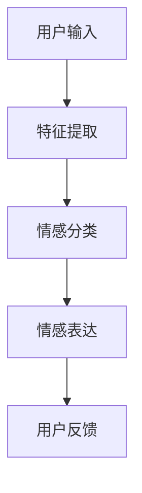
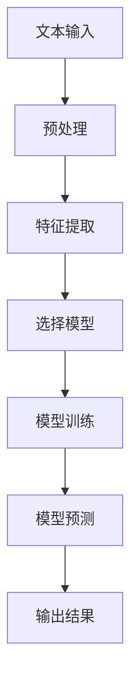
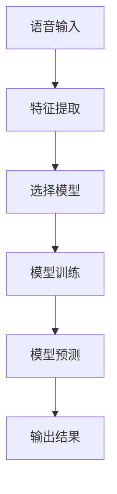
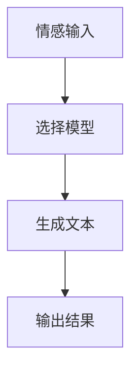
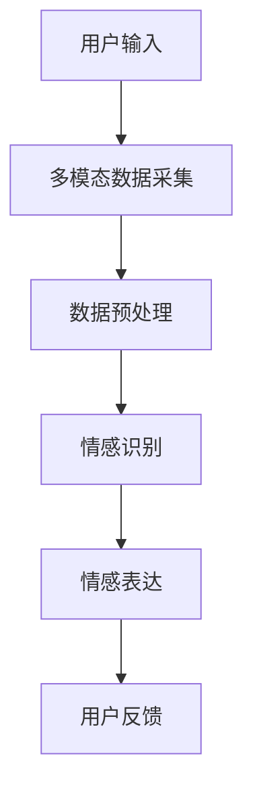

                 


# AI Agent的情感识别与表达能力开发

## 关键词：AI Agent, 情感识别, 情感表达, 多模态交互, 情感计算, 人机交互

## 摘要：  
本文系统地探讨了AI Agent在情感识别与表达能力开发中的关键技术和应用。从情感计算的基本概念出发，详细分析了基于文本和语音的情感识别算法，以及情感表达生成的实现方法。通过多模态情感交互系统的设计与实现，展示了情感识别与表达能力在AI Agent中的实际应用价值。最后，结合项目实战与代码实现，为读者提供了从理论到实践的全面指导。

---

# 第1章: AI Agent情感识别与表达概述

## 1.1 情感计算的基本概念

### 1.1.1 情感计算的定义与背景  
情感计算（Affective Computing）是一种通过计算机技术来识别、理解和模拟人类情感的新兴领域。随着人机交互的不断发展，情感计算在教育、医疗、娱乐等领域发挥着越来越重要的作用。

### 1.1.2 情感计算的核心要素  
- **情感识别**：通过分析输入数据（如文本、语音、图像）来识别用户的情感状态。  
- **情感理解**：对情感进行分类和解释，理解其背后的意义。  
- **情感表达**：通过文本、语音或视觉等方式将情感反馈给用户。  

### 1.1.3 情感计算的应用场景  
- 智能客服：通过情感识别提供更个性化的服务。  
- 情感陪伴机器人：为用户提供情感支持。  
- 教育技术：根据学生情感状态调整教学策略。  

### 对比表格：情感计算方法的优缺点  
| 方法         | 优点                     | 缺点                     |  
|--------------|--------------------------|--------------------------|  
| 基于规则     | 实现简单，易于解释       | 需要大量手动规则设计     |  
| 基于机器学习 | 适应性强，精度高         | 需要大量标注数据         |  
| 基于深度学习 | 模型能力强，可处理复杂数据| 计算资源需求高           |  

### ER实体关系图  
```mermaid
er
actor(AI Agent) -|> emotion: 情感状态
emotion --> feature: 特征
actor --> expression: 情感表达
```

## 1.2 AI Agent情感识别的必要性

### 1.2.1 人机交互中的情感需求  
用户在与AI Agent交互时，希望得到更自然、更个性化的体验。情感识别能够帮助AI Agent理解用户的情感状态，从而提供更贴心的服务。

### 1.2.2 情感识别对AI Agent的意义  
- 提高交互的自然性。  
- 增强用户体验的满意度。  
- 为个性化服务提供数据支持。  

### 1.2.3 情感识别的边界与外延  
- 边界：仅识别基本情感（如快乐、悲伤、愤怒）。  
- 外延：扩展到复杂情感（如嫉妒、傲慢）。  

## 1.3 情感识别与表达的核心概念

### 1.3.1 情感识别的基本原理  
通过分析输入数据的特征（如文本中的关键词、语音的语调），利用算法模型进行情感分类。

### 1.3.2 情感表达的实现方式  
- 文本生成：通过生成算法输出情感化的文本。  
- 语音合成：通过TTS（Text-to-Speech）技术生成情感化的语音。  

### 1.3.3 情感识别与表达的系统架构  


## 1.4 本章小结  
本章介绍了情感计算的基本概念、AI Agent情感识别的必要性以及情感识别与表达的核心概念。为后续章节的深入分析奠定了基础。

---

# 第2章: 基于文本的情感识别算法

## 2.1 情感分析的基本原理

### 2.1.1 文本预处理与特征提取  
- 分词：将文本分割成词语或短语。  
- 去停用词：去除无意义的词汇（如“的”、“了”）。  
- 词干提取：将词汇转换为基本形式（如“running”变为“run”）。  

### 2.1.2 基于机器学习的情感分类算法  
- 朴素贝叶斯（Naive Bayes）：假设特征之间独立，适合处理高维数据。  
- 支持向量机（SVM）：适用于小规模数据，分类效果好。  

### 2.1.3 基于深度学习的情感分类模型  
- 卷积神经网络（CNN）：适合处理局部特征。  
- 长短期记忆网络（LSTM）：适合处理序列数据，捕捉上下文信息。  

### 对比表格：情感分类算法的性能对比  
| 算法       | 优点                     | 缺点                     |  
|------------|--------------------------|--------------------------|  
| 朴素贝叶斯 | 实现简单，计算速度快     | 分类效果受限于特征独立性 |  
| SVM        | 分类精度高               | 高维数据计算复杂         |  
| LSTM       | 能捕捉上下文信息         | 训练时间长，资源消耗大   |  

### 代码实现：基于朴素贝叶斯的情感分类  
```python
from sklearn.feature_extraction.text import TfidfVectorizer
from sklearn.naive_bayes import MultinomialNB

# 数据预处理
texts = ["This is a great day!", "I am so sad."]
vectorizer = TfidfVectorizer()
X = vectorizer.fit_transform(texts)

# 模型训练
model = MultinomialNB()
model.fit(X, [1, 0])

# 预测
new_text = "I feel happy today"
new_X = vectorizer.transform([new_text])
print(model.predict(new_X))
```

## 2.2 情感识别的算法流程图  


## 2.3 情感识别的数学模型

### 2.3.1 朴素贝叶斯分类器  
$$ P(y|x) = \frac{P(x|y)P(y)}{P(x)} $$  
其中，$P(y|x)$是后验概率，$P(x|y)$是似然概率，$P(y)$是先验概率。

### 2.3.2 LSTM网络模型  
$$ \text{LSTM} = \text{ gates} \times \text{cells} $$  
LSTM由输入门、遗忘门和输出门组成，能够有效捕捉序列数据的时序关系。

## 2.4 本章小结  
本章详细介绍了基于文本的情感识别算法，包括文本预处理、特征提取以及多种情感分类算法的实现与对比。

---

# 第3章: 基于语音的情感识别算法

## 3.1 语音情感识别的基本原理

### 3.1.1 语音特征提取  
- 音调（Pitch）：语音的高低变化。  
- 音量（Volume）：语音的强弱变化。  
- 音色（Timbre）：语音的独特特征。  

### 3.1.2 语音识别与情感关联  
通过分析语音特征，建立情感类别（如快乐、悲伤）与语音特征之间的关联关系。

### 3.1.3 基于深度学习的语音情感分类  
- 卷积神经网络（CNN）：适合处理语音特征图。  
- 循环神经网络（RNN）：适合处理时序语音数据。  

## 3.2 语音情感识别的算法流程图  


## 3.3 语音情感识别的数学模型

### 3.3.1 MFCC特征提取公式  
$$ MFCC = DCT( (x[n] - \mu)^2 ) $$  
其中，$x[n]$是语音信号，$\mu$是均值，DCT表示离散余弦变换。

### 3.3.2 语音分类的SVM模型  
$$ \text{SVM} = \max_{w,b} \sum_{i=1}^n \gamma \|w\|^2 + \sum_{i=1}^n \xi_i $$  
其中，$\gamma$是正则化参数，$\xi_i$是松弛变量。

## 3.4 本章小结  
本章详细介绍了基于语音的情感识别算法，包括语音特征提取、模型选择与实现。

---

# 第4章: 基于文本的情感表达生成

## 4.1 情感文本生成的基本原理

### 4.1.1 基于规则的情感表达生成  
通过预定义的规则生成情感化的文本，例如在负面情感下使用“非常遗憾”等词语。

### 4.1.2 基于模板的情感表达生成  
利用模板和替换机制生成情感化的文本，例如模板“我感到$emotion$，因为$reason$。”

### 4.1.3 基于生成模型的情感表达生成  
使用生成对抗网络（GAN）或变种模型（如Transformer）生成情感化的文本。

### 对比表格：情感表达生成方法的对比  
| 方法         | 优点                     | 缺点                     |  
|--------------|--------------------------|--------------------------|  
| 基于规则     | 实现简单，生成速度快     | 表达形式单一，缺乏多样性 |  
| 基于模板     | 易于定制，灵活性高       | 需要手动设计模板         |  
| 基于生成模型 | 表达多样化，生成自然     | 训练复杂，需要大量数据   |  

### 代码实现：基于Transformer的情感文本生成  
```python
import torch
from torch import nn

# 定义生成模型
class Transformer(nn.Module):
    def __init__(self, d_model, nhead, dropout=0.1):
        super(Transformer, self).__init__()
        self.encoder = nn.TransformerEncoder(
            nn.TransformerEncoderLayer(d_model=d_model, nhead=nhead, dropout=dropout),
            num_layers=2
        )
    
    def forward(self, x):
        return self.encoder(x)

# 模型训练
model = Transformer(d_model=512, nhead=8)
optimizer = torch.optim.Adam(model.parameters(), lr=0.001)
criterion = nn.CrossEntropyLoss()

# 训练过程
for epoch in range(num_epochs):
    for batch in batches:
        outputs = model(batch)
        loss = criterion(outputs, labels)
        optimizer.zero_grad()
        loss.backward()
        optimizer.step()
```

## 4.2 情感表达生成的算法流程图  


## 4.3 本章小结  
本章详细介绍了基于文本的情感表达生成方法，包括规则生成、模板生成和生成模型的应用。

---

# 第5章: 基于多模态的情感交互系统设计

## 5.1 多模态情感交互的核心概念

### 5.1.1 多模态数据的整合与处理  
将文本、语音和视觉信息进行融合，提升情感识别的准确性和表达的丰富性。

### 5.1.2 多模态情感交互的设计原则  
- 数据融合：多模态数据的协同处理。  
- 交互反馈：根据情感反馈调整交互策略。  

### 对比表格：多模态与单模态情感交互的对比  
| 模式       | 优点                     | 缺点                     |  
|------------|--------------------------|--------------------------|  
| 单模态     | 实现简单，易于部署       | 信息获取单一，准确性低   |  
| 多模态     | 信息丰富，准确性高       | 实现复杂，资源消耗大     |  

## 5.2 多模态情感交互的系统架构

### 5.2.1 系统功能设计  
- 数据采集：获取文本、语音和视觉数据。  
- 数据处理：对数据进行预处理和特征提取。  
- 情感识别：基于多模态特征进行情感分类。  
- 情感表达：根据识别结果生成相应的反馈。  

### 5.2.2 系统架构图  


## 5.3 本章小结  
本章探讨了多模态情感交互的核心概念与系统架构设计，强调了多模态数据在提升情感识别与表达能力中的重要性。

---

# 第6章: 情感识别与表达能力在AI Agent中的应用

## 6.1 AI Agent情感能力的实际案例

### 6.1.1 智能客服中的情感识别  
通过情感识别分析用户的语气，提供更个性化的服务。  
### 6.1.2 情感陪伴机器人  
通过情感识别与表达，为用户提供情感支持。  

### 对比表格：情感识别与表达能力的应用场景  
| 场景               | 应用价值                     | 技术挑战                     |  
|--------------------|-----------------------------|-----------------------------|  
| 智能客服           | 提高用户体验，减少人工成本   | 实时性要求高，数据隐私问题   |  
| 情感陪伴机器人     | 提供个性化服务，增强用户粘性 | 情感表达的自然性要求高       |  

## 6.2 情感识别与表达能力的系统实现

### 6.2.1 数据采集与预处理  
- 文本数据：收集用户对话记录，进行分词和去停用词处理。  
- 语音数据：采集用户的语音，提取MFCC特征。  

### 6.2.2 模型训练与部署  
- 使用预处理后的数据训练情感识别与表达模型。  
- 将模型部署到AI Agent中，实时处理用户输入。  

## 6.3 情感识别与表达能力的未来趋势

### 6.3.1 技术发展  
- 多模态情感交互的进一步优化。  
- 情感表达的个性化与多样化。  

### 6.3.2 应用扩展  
- 情感识别在教育、医疗等领域的深度应用。  
- 情感表达在虚拟现实、增强现实中的创新应用。  

## 6.4 本章小结  
本章通过实际案例展示了情感识别与表达能力在AI Agent中的应用价值，并展望了未来的技术发展趋势。

---

# 第7章: 项目实战与代码实现

## 7.1 环境安装与配置

### 7.1.1 安装Python环境  
- 安装Python 3.8以上版本。  
- 安装必要的库（如numpy、pandas、scikit-learn、pytorch）。  

### 7.1.2 安装语音处理工具  
- 安装 librosa 和 soundfile 等语音处理库。  

## 7.2 核心算法实现

### 7.2.1 情感识别算法  
- 文本情感识别：使用预训练的BERT模型进行情感分类。  
- 语音情感识别：基于MFCC特征训练SVM模型。  

### 7.2.2 情感表达生成  
- 文本生成：使用预训练的GPT模型生成情感化文本。  
- 语音合成：使用Tacotron模型生成情感化的语音。  

## 7.3 代码实现与解读

### 7.3.1 文本情感识别代码  
```python
from transformers import BertTokenizer, BertModel
import torch

tokenizer = BertTokenizer.from_pretrained('bert-base-uncased')
model = BertModel.from_pretrained('bert-base-uncased')

def text_classification(text):
    inputs = tokenizer(text, return_tensors='pt')
    outputs = model(**inputs)
    return torch.argmax(outputs.last_hidden_state, dim=-1)
```

### 7.3.2 语音情感识别代码  
```python
import librosa

def extract_mfcc(audio_path):
    y, sr = librosa.load(audio_path)
    mfcc = librosa.feature.mfcc(y=y, sr=sr)
    return mfcc.T
```

## 7.4 项目测试与优化

### 7.4.1 测试  
- 对测试数据进行情感识别与表达的测试，记录准确率和生成效果。  

### 7.4.2 优化  
- 调整模型参数，优化识别准确率。  
- 提升生成模型的自然度和多样性。  

## 7.5 本章小结  
本章通过实际项目实战，展示了情感识别与表达能力的开发过程，为读者提供了从理论到实践的指导。

---

# 第8章: 最佳实践与未来展望

## 8.1 最佳实践 tips

### 8.1.1 数据预处理  
- 确保数据的多样性和代表性。  
- 处理数据中的噪声和偏差。  

### 8.1.2 模型选择  
- 根据任务需求选择合适的模型。  
- 调参和优化模型性能。  

### 8.1.3 系统集成  
- 确保系统的实时性和稳定性。  
- 提供友好的用户界面和交互体验。  

## 8.2 未来技术趋势

### 8.2.1 情感识别的高精度与实时性  
- 引入边缘计算，提升实时性。  
- 利用联邦学习，保护数据隐私。  

### 8.2.2 情感表达的个性化与多样化  
- 基于用户画像，生成个性化的表达内容。  
- 引入多模态反馈机制，提升表达的自然性。  

## 8.3 本章小结  
本章总结了情感识别与表达能力开发中的最佳实践，并展望了未来的技术发展趋势。

---

# 作者信息

作者：AI天才研究院/AI Genius Institute & 禅与计算机程序设计艺术 /Zen And The Art of Computer Programming

