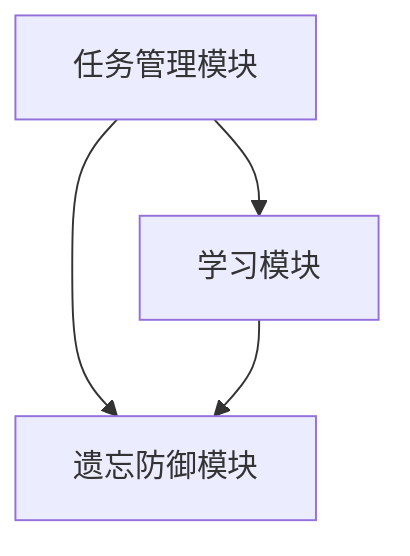

                 


# AI Agent的持续学习与灾难性遗忘防御

---

## 关键词：AI Agent、持续学习、灾难性遗忘、神经网络、算法防御、知识保持

---

## 摘要：  
本文探讨AI Agent在持续学习过程中的挑战，特别是灾难性遗忘问题。通过分析其产生的原因、影响及防御策略，结合具体算法实现，提供解决思路。内容涵盖从理论到实践，帮助读者理解如何构建能够持续学习且不忘却已有知识的AI系统。

---

# 第一部分: AI Agent的持续学习与灾难性遗忘概述

## 第1章: 持续学习与灾难性遗忘概述

### 1.1 持续学习的背景与定义  
持续学习是机器学习中的一项核心技术，旨在使模型在不断变化的任务环境中保持学习能力。与传统批量学习不同，持续学习允许模型在新任务中逐步更新知识，同时保持对旧任务的性能。  

#### 1.1.1 持续学习的背景  
随着人工智能技术的快速发展，AI Agent需要在动态环境中执行多种任务。例如，智能助手需要处理用户的多样化请求，医疗AI需要适应最新的医学知识。这些场景要求模型具备持续学习的能力，以应对新旧任务的交织需求。  

#### 1.1.2 持续学习的定义与特点  
- **定义**：持续学习是一种机器学习范式，允许模型在序列化的任务中逐步学习，同时保持对先前任务的性能。  
- **特点**：  
  - **连续性**：任务之间具有时间或空间上的连续性。  
  - **增量性**：每次学习仅涉及新任务或部分数据。  
  - **多样性**：任务类型和数据分布可能不同。  

#### 1.1.3 灾难性遗忘的定义与表现  
- **定义**：灾难性遗忘（Catastrophic Forgetting）是指在持续学习过程中，模型在学习新任务时，严重遗忘旧任务的知识。  
- **表现**：  
  - 旧任务性能急剧下降。  
  - 新任务学习效率低下。  
  - 模型泛化能力减弱。  

### 1.2 灾难性遗忘问题的背景  
灾难性遗忘是持续学习中的核心挑战。当模型在新任务上进行训练时，权重更新可能导致旧任务的知识被 overwrite，从而引发遗忘。  

#### 1.2.1 灾难性遗忘的定义  
灾难性遗忘是指模型在学习新任务后，旧任务的性能显著下降的现象。  

#### 1.2.2 灾难性遗忘的产生原因  
- **权重竞争**：神经网络的权重在训练过程中不断调整，新任务的优化可能覆盖旧任务的知识。  
- **梯度干扰**：梯度更新的方向可能与旧任务的目标冲突。  
- **表示变化**：新任务的学习可能导致模型对旧任务的特征表示发生变化。  

#### 1.2.3 灾难性遗忘的影响与挑战  
- **性能下降**：旧任务的准确率可能大幅降低。  
- **任务失败**：在关键任务中，遗忘可能导致AI Agent无法正常工作。  
- **学习效率降低**：模型需要重新学习旧任务，增加计算成本。  

### 1.3 AI Agent的持续学习需求  
AI Agent需要在动态环境中保持学习能力，同时避免灾难性遗忘。  

#### 1.3.1 AI Agent的基本概念  
AI Agent是一种智能体，能够感知环境、自主决策并执行任务。  

#### 1.3.2 持续学习在AI Agent中的重要性  
- **适应性**：使AI Agent能够适应新任务和环境变化。  
- **效率**：通过持续学习，减少重新训练的时间和资源。  
- **实用性**：在实际应用中，持续学习使AI Agent更具灵活性。  

#### 1.3.3 灾难性遗忘对AI Agent的影响  
- **任务失败风险**：旧任务的遗忘可能导致AI Agent无法完成关键任务。  
- **用户体验下降**：用户可能因AI Agent的性能波动而感到不满。  
- **维护成本增加**：需要频繁重新训练模型以恢复旧任务性能。  

### 1.4 本章小结  
本章介绍了持续学习的背景、定义及灾难性遗忘的概念。通过分析灾难性遗忘的产生原因和影响，强调了在AI Agent中解决这一问题的重要性。

---

## 第2章: 灾难性遗忘的核心概念

### 2.1 灾难性遗忘的属性特征对比  
为了理解灾难性遗忘的本质，我们需要对比其与其他遗忘形式的区别。  

#### 2.1.1 灾难性遗忘与非灾难性遗忘的对比  
- **灾难性遗忘**：旧任务性能急剧下降。  
- **非灾难性遗忘**：旧任务性能逐渐下降，但幅度较小。  

#### 2.1.2 不同模型架构下的遗忘表现  
- **浅层模型**：更容易发生灾难性遗忘。  
- **深度模型**：遗忘程度较低，但仍然存在风险。  

#### 2.1.3 不同任务中的遗忘特征  
- **相似任务**：遗忘风险较低。  
- **差异性任务**：遗忘风险较高。  

### 2.2 灾难性遗忘的ER实体关系图  
通过构建ER实体关系图，我们可以更清晰地理解灾难性遗忘的核心要素。  

#### 2.2.1 实体关系图的构建  
- **实体**：模型、任务、权重、损失。  
- **关系**：权重更新导致任务损失增加。  

#### 2.2.2 实体关系图的分析  
权重的更新是导致灾难性遗忘的主要原因，任务损失的变化反映了遗忘的程度。

---

## 第3章: 灾难性遗忘的原理分析

### 3.1 灾难性遗忘的产生机制  
#### 3.1.1 神经网络的权重更新机制  
权重更新是模型学习的核心过程，但也可能导致灾难性遗忘。  

#### 3.1.2 任务干扰与权重竞争  
新任务的优化目标与旧任务的权重更新方向可能冲突，导致权重过度调整。  

#### 3.1.3 知识表示的冲突  
模型对新旧任务的特征表示可能发生变化，导致旧任务的知识被覆盖。  

### 3.2 灾难性遗忘的数学模型  
#### 3.2.1 神经网络的权重更新公式  
$$ W_{new} = W_{old} + \Delta W $$  
其中，$\Delta W$ 是权重更新的梯度变化。  

#### 3.2.2 任务损失函数的构建  
$$ L_{total} = \alpha L_{new} + (1-\alpha) L_{old} $$  
其中，$\alpha$ 是新任务损失的权重系数。  

#### 3.2.3 灾难性遗忘的度量指标  
- **遗忘分数（Forgetting Score）**：衡量旧任务性能下降的程度。  
- **任务保留（Task Retention）**：衡量旧任务性能的保持能力。  

### 3.3 灾难性遗忘的算法原理  
#### 3.3.1 基于权重约束的遗忘防御  
通过约束权重的更新幅度，防止旧任务知识的丢失。  

#### 3.3.2 基于知识蒸馏的遗忘抑制  
通过知识蒸馏技术，将旧任务的知识迁移到新任务中。  

#### 3.3.3 基于经验重放的遗忘缓解  
通过重放旧任务的数据，减少权重更新对旧任务的负面影响。  

---

## 第4章: 灾难性遗忘防御的算法与实现

### 4.1 Elastic Weight Consolidation (EWC)  
#### 4.1.1 EWC算法的基本原理  
通过计算任务重要性权重，保护关键权重的更新。  

#### 4.1.2 EWC算法的数学模型  
$$ \Delta W_{ij} = \Delta W_{ij}^{new} \times \frac{1}{1 + \lambda (W_{ij}^{old})^2} $$  
其中，$\lambda$ 是调节参数。  

#### 4.1.3 EWC算法的实现步骤  
1. 训练模型并保存权重。  
2. 计算任务重要性权重。  
3. 更新权重时应用约束。  

### 4.2 Progressive Neural Networks (PNN)  
#### 4.2.1 PNN算法的基本思想  
通过逐步扩展网络结构，避免权重竞争。  

#### 4.2.2 PNN算法的网络结构  
$$ H_{new} = H_{old} \parallel H_{new} $$  
其中，$H_{old}$ 是旧任务的特征表示，$H_{new}$ 是新任务的特征表示。  

#### 4.2.3 PNN算法的优缺点  
- **优点**：网络结构灵活，适应性强。  
- **缺点**：计算资源消耗较大。  

### 4.3 Gradient Episodic Memory (GEM)  
#### 4.3.1 GEM算法的核心思想  
通过保留任务梯度，减少权重更新对旧任务的影响。  

#### 4.3.2 GEM算法的实现流程  
1. 记录旧任务的梯度信息。  
2. 在新任务训练中，限制权重更新的方向。  

---

## 第5章: 灾难性遗忘防御的系统架构与项目实战

### 5.1 系统架构设计  
#### 5.1.1 问题场景介绍  
在一个多任务学习环境中，AI Agent需要同时处理多个任务，防止灾难性遗忘。  

#### 5.1.2 系统功能设计  
- **任务管理模块**：负责任务的调度和管理。  
- **学习模块**：实现持续学习算法。  
- **遗忘防御模块**：应用防御策略，保护旧任务知识。  

#### 5.1.3 系统架构图  


### 5.2 项目实战  
#### 5.2.1 环境安装与依赖管理  
- **Python**：3.8及以上版本。  
- **深度学习框架**：TensorFlow或PyTorch。  
- **其他依赖**：NumPy、Matplotlib。  

#### 5.2.2 基于EWC的Python实现  
```python
import tensorflow as tf
import numpy as np

class EWC:
    def __init__(self, model, tasks):
        self.model = model
        self.tasks = tasks

    def compute_task_importance(self):
        # 计算任务重要性权重
        task_importance = {}
        for task in self.tasks:
            task_importance[task] = 1.0 / len(self.tasks)
        return task_importance

    def update_weights(self, task, learning_rate=0.01):
        # 应用EWC约束
        task_importance = self.compute_task_importance()[task]
        for layer in self.model.layers:
            weights = layer.weights
            if weights:
                delta_weights = []
                for w in weights:
                    delta = tf gradient descent...
                    constrained_delta = delta / (1 + learning_rate * task_importance * tf.norm(w))
                    delta_weights.append(constrained_delta)
                layer.set_weights([w + dw for w, dw in zip(weights, delta_weights)])
```

#### 5.2.3 代码运行与结果分析  
通过实验验证EWC算法在防止灾难性遗忘方面的有效性，分析模型在新旧任务上的性能变化。

---

## 第6章: 总结与展望

### 6.1 总结  
本文详细探讨了AI Agent在持续学习中的灾难性遗忘问题，分析了其产生的原因和防御策略，并通过具体算法实现提供了解决方案。  

### 6.2 最佳实践 tips  
- **选择合适的算法**：根据任务特点选择适合的防御方法。  
- **合理设置参数**：避免过强或过弱的约束。  
- **持续监控性能**：定期评估模型的遗忘程度。  

### 6.3 注意事项  
- **模型选择**：不同模型对灾难性遗忘的敏感性不同。  
- **任务顺序**：任务的顺序可能影响遗忘程度。  
- **数据分布**：数据分布的变化可能影响算法效果。  

### 6.4 拓展阅读  
推荐相关论文和书籍，帮助读者深入了解持续学习和灾难性遗忘防御的研究进展。

---

## 作者：AI天才研究院 & 禅与计算机程序设计艺术  

---

以上是文章的完整目录和内容框架，涵盖了从理论到实践的各个方面，确保读者能够全面理解AI Agent的持续学习与灾难性遗忘防御的核心内容。

