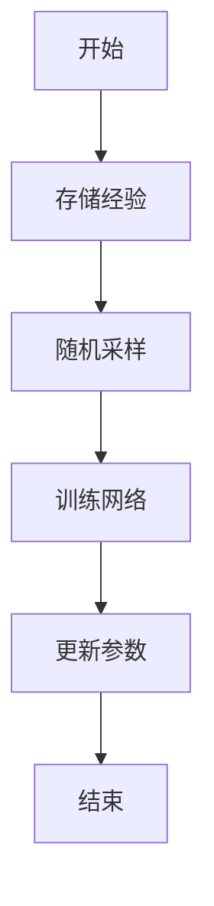
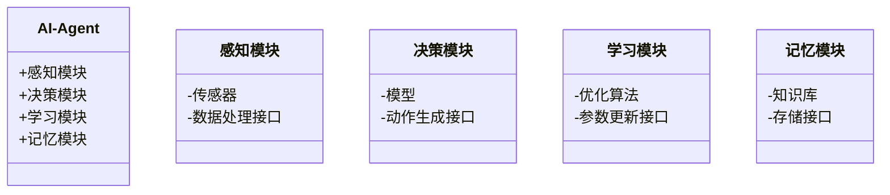
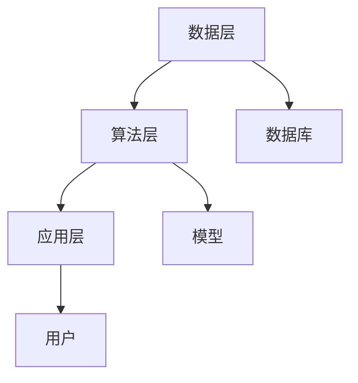

                 


# AI Agent的持续学习与适应机制

> 关键词：AI Agent，持续学习，适应机制，机器学习，强化学习

> 摘要：AI Agent的持续学习与适应机制是人工智能领域的重要研究方向。随着环境的变化和任务的复杂化，AI Agent需要不断更新知识和技能以适应新的挑战。本文从AI Agent的基本概念出发，详细探讨了持续学习的核心原理、算法实现、系统架构设计以及实际项目应用，最后总结了最佳实践和未来发展方向。

---

## 第1章: AI Agent的基本概念与持续学习的背景

### 1.1 AI Agent的定义与核心特征

AI Agent（人工智能代理）是指能够感知环境、自主决策并采取行动的智能实体。AI Agent的核心特征包括：

1. **自主性**：能够在没有外部干预的情况下独立运作。
2. **反应性**：能够实时感知环境并做出反应。
3. **目标导向性**：具有明确的目标，并通过行动实现这些目标。
4. **学习能力**：能够通过经验改进自身的性能。

AI Agent与传统AI的区别在于其自主性和适应性。传统AI系统通常依赖于预设的规则和数据，而AI Agent能够动态调整其行为以适应环境的变化。

---

### 1.2 持续学习的背景与必要性

持续学习是指AI Agent在不断变化的环境中，能够持续更新知识和技能以适应新的任务和挑战。随着AI技术的广泛应用，持续学习在以下几个方面显得尤为重要：

1. **动态环境适应**：现实世界中的环境是不断变化的，AI Agent需要能够实时更新其知识库以应对新的挑战。
2. **任务复杂化**：现代AI应用（如自动驾驶、智能客服等）需要处理的任务日益复杂，单一的预训练模型往往难以满足需求。
3. **数据增量性**：在实际应用中，数据通常是逐步收集的，AI Agent需要能够在线处理增量数据。

持续学习的核心问题包括知识更新的挑战、环境变化的适应以及模型泛化的边界。这些问题需要从算法设计和系统架构两个方面进行综合考虑。

---

## 第2章: 持续学习与适应机制的核心概念

### 2.1 持续学习的基本原理

持续学习的定义是：AI Agent能够在不中断现有任务的情况下，通过在线学习或经验重放等方式，逐步更新其模型以适应新的数据和任务。其核心机制包括模型更新策略、知识记忆机制以及环境反馈的处理。

持续学习的数学模型可以表示为一个在线优化问题，目标是最小化损失函数$J(\theta)$，其中$\theta$表示模型参数。具体公式如下：

$$
\theta_{t+1} = \theta_t - \eta \cdot \nabla J(\theta_t)
$$

其中，$\eta$是学习率，$\nabla J(\theta_t)$是损失函数关于$\theta_t$的梯度。

---

### 2.2 持续学习与在线学习的区别

在线学习是指模型在数据流不断输入的情况下，逐步更新其参数以适应新的数据。其核心特点包括：

1. **实时更新**：数据是按流的形式输入，模型在接收到每一条数据后立即更新。
2. **内存效率**：通常只保留最近的数据，以减少存储开销。
3. **低延迟**：适用于需要实时反馈的应用场景。

与持续学习相比，在线学习更注重实时性和效率，而持续学习则强调长期的知识积累和适应能力。

---

## 第3章: 持续学习的核心算法

### 3.1 在线学习算法

在线学习算法的核心是基于梯度的优化方法。以下是几种常见的在线学习算法：

1. **随机梯度下降（SGD）**：
   $$$
   \theta_{t+1} = \theta_t - \eta \cdot \nabla J(\theta_t)
   $$
   SGD是一种常用的一阶优化算法，适用于在线学习场景。

2. **AdaGrad**：
   $$
   g_t = \nabla J(\theta_t)
   $$
   $$
   \theta_{t+1} = \theta_t - \eta \cdot \frac{g_t}{\sqrt{g_{1}^2 + g_{2}^2 + \dots + g_{t}^2}}
   $$
   AdaGrad能够自适应地调整学习率，适用于稀疏数据。

3. **Adam优化器**：
   $$
   m_t = \beta_1 m_{t-1} + (1 - \beta_1) g_t
   $$
   $$
   n_t = \beta_2 n_{t-1} + (1 - \beta_2) g_t^2
   $$
   $$
   \theta_{t+1} = \theta_t - \eta \cdot \frac{m_t}{\sqrt{n_t + \epsilon}}
   $$
   Adam结合了动量和自适应学习率的优点，是目前广泛使用的优化算法。

---

### 3.2 经验重放机制

经验重放是一种用于强化学习的持续学习技术，其基本原理是将过去的经验存储在一个经验回放池中，并在训练时随机抽取样本进行训练。以下是经验重放的实现步骤：

1. **存储经验**：将每一步的观测、动作和奖励存储在经验池中。
2. **随机采样**：在训练时，随机抽取一批经验样本。
3. **训练网络**：使用抽取的样本更新神经网络的参数。

经验重放的流程图如下：



---

## 第4章: 持续学习的系统架构设计

### 4.1 系统功能设计

AI Agent的持续学习系统通常包括以下几个功能模块：

1. **感知模块**：负责收集环境中的数据，如图像、文本等。
2. **决策模块**：基于感知数据，通过模型生成决策。
3. **学习模块**：根据环境反馈更新模型参数。
4. **记忆模块**：存储和管理长期知识。

系统的类图如下：



---

### 4.2 系统架构设计

AI Agent的持续学习系统通常采用分层架构，包括：

1. **数据层**：负责数据的采集和存储。
2. **算法层**：实现各种持续学习算法。
3. **应用层**：对外提供接口，供上层应用调用。

系统的架构图如下：



---

## 第5章: 项目实战

### 5.1 环境安装

为了实现一个简单的AI Agent持续学习系统，我们需要以下环境：

1. Python 3.8+
2. TensorFlow 2.0+
3. NumPy 1.20+
4. 建议使用Jupyter Notebook进行开发。

---

### 5.2 核心代码实现

以下是基于经验重放机制的简单实现代码：

```python
import numpy as np
import tensorflow as tf

# 定义神经网络模型
class DQN:
    def __init__(self, state_dim, action_dim):
        self.state_dim = state_dim
        self.action_dim = action_dim
        self.model = self.build_model()
    
    def build_model(self):
        model = tf.keras.Sequential([
            tf.keras.layers.Dense(64, activation='relu', input_shape=(self.state_dim,)),
            tf.keras.layers.Dense(32, activation='relu'),
            tf.keras.layers.Dense(self.action_dim, activation='linear')
        ])
        model.compile(optimizer=tf.keras.optimizers.Adam(learning_rate=0.001), loss='mean_squared_error')
        return model
    
    def predict(self, state):
        return self.model.predict(state)
    
    def train(self, states, targets):
        self.model.fit(states, targets, epochs=1, verbose=0)

# 初始化经验回放池
class ReplayBuffer:
    def __init__(self, capacity):
        self.capacity = capacity
        self.buffer = []
    
    def push(self, experience):
        if len(self.buffer) < self.capacity:
            self.buffer.append(experience)
        else:
            self.buffer.pop(0)
    
    def sample(self, batch_size):
        indices = np.random.randint(0, len(self.buffer), batch_size)
        return np.array([self.buffer[i] for i in indices])
```

---

### 5.3 功能解读与案例分析

以下是一个简单的智能客服系统的实现案例：

1. **需求分析**：智能客服需要根据用户的输入生成合适的回复。
2. **数据准备**：收集并预处理用户咨询数据。
3. **模型训练**：使用上述DQN模型进行训练。
4. **系统部署**：将模型部署到生产环境，并实时更新。

---

## 第6章: 总结与展望

### 6.1 小结

本文从AI Agent的基本概念出发，详细探讨了持续学习的核心原理、算法实现、系统架构设计以及实际项目应用。通过理论分析和代码实现，展示了AI Agent在动态环境中的适应能力。

### 6.2 注意事项

在实际应用中，需要注意以下几点：

1. **数据质量**：持续学习的效果依赖于数据的质量和多样性。
2. **模型收敛性**：需要选择合适的优化算法和参数设置。
3. **系统稳定性**：确保系统的实时性和安全性。

### 6.3 拓展阅读

建议读者进一步阅读以下内容：

1. 《Deep Reinforcement Learning》
2. 《Neural Networks and Deep Learning》
3. 《Practical Deep Learning for Coders》

---

作者：AI天才研究院/AI Genius Institute & 禅与计算机程序设计艺术 /Zen And The Art of Computer Programming

