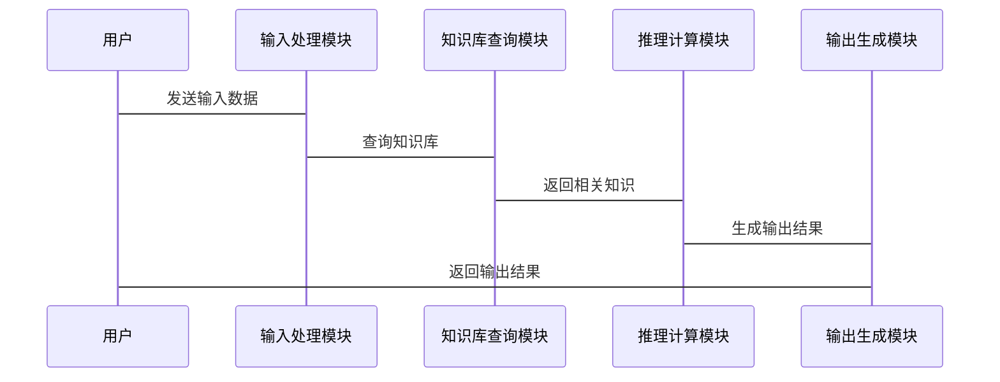

                 


# AI Agent的推理引擎：设计与优化

> 关键词：AI Agent、推理引擎、算法原理、系统架构、项目实战

> 摘要：本文深入探讨AI Agent的推理引擎的设计与优化，从核心概念、算法原理、系统架构到项目实战，全面解析推理引擎的关键技术与优化方法。通过详细的技术分析和实际案例，帮助读者理解如何设计和优化高效的推理引擎。

---

# 第1章 AI Agent与推理引擎的背景介绍

## 1.1 AI Agent的基本概念

### 1.1.1 AI Agent的定义

AI Agent（人工智能代理）是指在计算机系统中，能够感知环境、自主决策并执行任务的智能实体。AI Agent可以是软件程序、机器人或其他智能系统，其核心目标是通过感知和行动实现特定目标。

### 1.1.2 AI Agent的核心特征

1. **自主性**：AI Agent能够自主决策，无需外部干预。
2. **反应性**：能够实时感知环境并做出反应。
3. **目标导向**：所有行为都围绕实现特定目标展开。
4. **社会能力**：能够与其他AI Agent或人类进行交互协作。

### 1.1.3 AI Agent的应用场景

1. **智能助手**：如Siri、Alexa等，帮助用户完成日常任务。
2. **自动驾驶**：通过感知环境做出驾驶决策。
3. **机器人控制**：在制造业中执行复杂操作。
4. **智能推荐系统**：根据用户行为推荐相关内容。

## 1.2 推理引擎的定义与作用

### 1.2.1 推理引擎的定义

推理引擎是AI Agent的核心组件，负责根据输入信息进行逻辑推理或概率推理，得出结论或行动计划。它是连接感知与行动的桥梁。

### 1.2.2 推理引擎在AI Agent中的作用

1. **信息处理**：将感知到的信息转化为可用的知识。
2. **决策支持**：基于知识进行推理，生成决策或行动计划。
3. **动态适应**：在动态环境中实时调整推理策略。

### 1.2.3 推理引擎的分类

1. **基于规则的推理引擎**：通过预定义的规则进行推理。
2. **基于概率的推理引擎**：利用概率论进行推理，如贝叶斯网络。
3. **基于逻辑的推理引擎**：使用逻辑推理进行推导，如一阶逻辑推理。
4. **混合型推理引擎**：结合多种推理方法的推理引擎。

## 1.3 问题背景与问题描述

### 1.3.1 当前AI Agent推理中的挑战

1. **复杂性**：现实世界中的问题通常复杂且动态变化。
2. **不确定性**：部分信息可能不完整或模糊。
3. **计算效率**：需要在有限时间内完成推理。

### 1.3.2 推理引擎优化的必要性

1. **提升推理速度**：减少推理时间，提高实时性。
2. **提高准确性**：在复杂场景中做出更准确的推理。
3. **降低资源消耗**：减少计算资源的使用。

### 1.3.3 问题解决的目标与边界

目标：设计高效、准确的推理引擎，提升AI Agent的性能。

边界：仅关注推理引擎的设计与优化，不涉及感知和执行部分。

## 1.4 本章小结

本章介绍了AI Agent的基本概念及其应用场景，重点阐述了推理引擎的定义、作用和分类。通过分析当前推理引擎面临的挑战，明确了优化的必要性，并界定了本章的研究目标和范围。

---

# 第2章 推理引擎的核心概念与联系

## 2.1 核心概念原理

### 2.1.1 推理引擎的基本原理

推理引擎通过输入信息，结合知识库或规则库，进行逻辑或概率推理，生成输出结果或行动计划。

### 2.1.2 推理引擎与AI Agent的关系

推理引擎是AI Agent的核心组件，负责将感知的信息转化为决策或行动。

### 2.1.3 推理引擎的关键组成部分

1. **知识库**：存储推理所需的知识，如规则、事实或概率分布。
2. **推理算法**：具体的推理方法，如逻辑推理或概率推理。
3. **执行接口**：与感知和行动模块的接口，用于接收输入和输出结果。

## 2.2 核心概念属性对比

以下是推理引擎的属性特征对比表格：

| 属性       | 基于规则的推理引擎 | 基于概率的推理引擎 | 基于逻辑的推理引擎 |
|------------|-------------------|--------------------|--------------------|
| 推理方法     | 预定义规则         | 概率模型           | 逻辑规则           |
| 适用场景     | 简单确定性问题     | 不确定性问题       | 逻辑清晰的问题     |
| 复杂度       | 低                | 高                | 中等               |

## 2.3 ER实体关系图

以下是推理引擎的ER实体关系图（Mermaid流程图）：

```mermaid
erDiagram
    class 推理引擎 {
        id
        类型
        状态
        知识库
    }
    class 知识库 {
        id
        内容
        来源
    }
    class 规则库 {
        id
        条件
        动作
    }
    推理引擎 -> 知识库 : 包含
    推理引擎 -> 规则库 : 包含
```

## 2.4 本章小结

本章详细阐述了推理引擎的核心概念，包括其基本原理、组成部分以及与AI Agent的关系。通过对比不同推理引擎的属性，帮助读者更好地理解其适用场景和特点。

---

# 第3章 推理引擎的算法原理

## 3.1 算法原理概述

### 3.1.1 推理引擎的算法流程（Mermaid流程图）

```mermaid
graph TD
    A[开始] -> B[获取输入]
    B -> C[调用推理算法]
    C -> D[生成输出]
    D -> E[结束]
```

### 3.1.2 推理引擎的算法实现步骤

1. **输入处理**：接收输入信息，解析并转换为可用格式。
2. **知识库查询**：从知识库中获取相关知识。
3. **推理计算**：根据推理算法进行计算，得出结论或行动计划。
4. **输出生成**：将结果转换为输出格式，返回给调用者。

## 3.2 算法实现

### 3.2.1 Python实现示例代码

以下是一个简单的基于规则的推理引擎实现示例：

```python
class InferenceEngine:
    def __init__(self, rules):
        self.rules = rules

    def infer(self, input_data):
        # 根据规则进行推理
        for rule in self.rules:
            if rule["condition"](input_data):
                return rule["action"](input_data)
        return None

# 示例规则
rules = [
    {
        "condition": lambda x: x["age"] > 18,
        "action": lambda x: "允许进入"
    },
    {
        "condition": lambda x: x["age"] <= 18,
        "action": lambda x: "拒绝进入"
    }
]

# 创建推理引擎实例
engine = InferenceEngine(rules)

# 示例输入
input_data = {"age": 20}
result = engine.infer(input_data)
print(result)  # 输出: 允许进入
```

### 3.2.2 推理算法的数学模型与公式

#### 3.2.2.1 概率推理公式

概率推理常使用贝叶斯定理，其公式为：

$$P(A|B) = \frac{P(B|A)P(A)}{P(B)}$$

其中：
- \(P(A|B)\) 是在B发生的条件下A发生的概率。
- \(P(B|A)\) 是在A发生的条件下B发生的概率。
- \(P(A)\) 和 \(P(B)\) 是A和B的先验概率。

#### 3.2.2.2 逻辑推理公式

逻辑推理常使用一阶逻辑，例如：

$$A \land B \rightarrow C$$

表示如果A和B同时为真，则C为真。

## 3.3 举例说明

### 3.3.1 概率推理实例

假设我们有一个医疗诊断系统，已知症状A和症状B分别与疾病C相关，概率如下：

- \(P(A|C) = 0.9\)
- \(P(B|C) = 0.8\)
- \(P(C) = 0.02\)

根据贝叶斯定理，计算在A和B都出现的情况下，C的概率：

$$P(C|A,B) = \frac{P(A|C)P(B|C)P(C)}{P(A)P(B)}$$

假设 \(P(A)\) 和 \(P(B)\) 是先验概率，这里不做具体计算，但可以看出概率推理可以帮助系统做出更准确的诊断。

### 3.3.2 逻辑推理实例

假设我们有一个交通规则推理系统，规则如下：

$$\text{红灯} \land \text{行人停止} \rightarrow \text{车辆停止}$$

当系统检测到红灯且行人停止时，推理引擎会得出车辆需要停止的结论。

## 3.4 本章小结

本章详细介绍了推理引擎的算法原理，包括基于规则、概率和逻辑的推理方法。通过Python代码示例和数学公式的推导，帮助读者理解不同推理方法的实现和应用。

---

# 第4章 系统分析与架构设计方案

## 4.1 问题场景介绍

### 4.1.1 典型应用场景

以智能客服系统为例，推理引擎需要根据用户的问题和历史对话，生成合适的回答。

### 4.1.2 系统目标与范围

目标：设计一个高效的推理引擎，支持智能客服系统的对话生成。

范围：包括用户信息处理、知识库查询、推理计算和结果输出。

## 4.2 系统功能设计

### 4.2.1 系统功能模块

1. **输入处理模块**：接收用户的输入，解析并转换为结构化数据。
2. **知识库查询模块**：从知识库中检索相关知识。
3. **推理计算模块**：根据推理算法进行计算，得出输出结果。
4. **输出生成模块**：将结果转换为自然语言或结构化数据，返回给用户。

### 4.2.2 系统功能流程（Mermaid流程图）

```mermaid
graph TD
    A[开始] -> B[输入处理]
    B -> C[知识库查询]
    C -> D[推理计算]
    D -> E[输出生成]
    E -> F[结束]
```

### 4.2.3 系统架构设计

以下是系统架构的Mermaid架构图：


## 4.3 接口设计与交互

### 4.3.1 接口设计

1. **输入接口**：接收结构化或非结构化的输入数据。
2. **输出接口**：返回结构化或非结构化的输出结果。

### 4.3.2 交互设计（Mermaid序列图）



## 4.4 本章小结

本章通过分析智能客服系统的应用场景，详细设计了推理引擎的系统功能模块和架构，并通过接口设计和交互设计，展示了如何将推理引擎集成到实际系统中。

---

# 第5章 项目实战：基于推理引擎的智能客服系统

## 5.1 项目介绍

本项目旨在开发一个基于推理引擎的智能客服系统，能够根据用户的问题和历史对话，生成合适的回答。

## 5.2 环境安装

### 5.2.1 Python环境安装

安装Python 3.8及以上版本，并安装以下库：

```bash
pip install numpy
pip install pandas
pip install scikit-learn
```

## 5.3 系统核心实现

### 5.3.1 知识库构建

构建一个包含常见问题和答案的知识库，存储在CSV文件中。

```python
import pandas as pd

# 读取知识库
knowledge_base = pd.read_csv('knowledge_base.csv')
```

### 5.3.2 推理引擎实现

实现一个基于规则的推理引擎：

```python
class InferenceEngine:
    def __init__(self, knowledge_base):
        self.knowledge_base = knowledge_base

    def infer(self, input_question):
        # 简单的基于关键词匹配的推理
        for index, row in self.knowledge_base.iterrows():
            if input_question in row['问题']:
                return row['答案']
        return "抱歉，我无法回答这个问题。"
```

### 5.3.3 对话系统实现

实现一个简单的对话系统：

```python
class ChatSystem:
    def __init__(self, inference_engine):
        self.engine = inference_engine

    def process_input(self, input_text):
        response = self.engine.infer(input_text)
        return response

# 创建推理引擎实例
knowledge_base = pd.read_csv('knowledge_base.csv')
engine = InferenceEngine(knowledge_base)
chat_system = ChatSystem(engine)

# 示例对话
print(chat_system.process_input("请问如何重置密码？"))  # 输出对应答案
```

## 5.4 实际案例分析

### 5.4.1 案例描述

用户输入：“我的订单在哪里？”

系统根据知识库匹配相关答案：“您可以在订单查询页面查看您的订单详情。”

### 5.4.2 案例分析

1. **输入处理**：将用户输入的问题解析为关键词。
2. **知识库查询**：匹配与关键词相关的知识条目。
3. **推理计算**：生成对应的回答。
4. **输出生成**：返回自然语言的回答。

## 5.5 项目总结

本项目通过实际案例展示了推理引擎在智能客服系统中的应用，通过简单的基于规则的推理方法，实现了基本的对话功能。在实际应用中，可以根据需求扩展推理引擎的功能，例如引入更复杂的推理算法或增加多轮对话功能。

## 5.6 本章小结

本章通过一个实际的智能客服系统项目，详细讲解了推理引擎的实现过程，包括环境安装、知识库构建、推理引擎实现和对话系统实现。通过案例分析，帮助读者更好地理解推理引擎的应用场景和实现方法。

---

# 第6章 推理引擎的优化与改进

## 6.1 性能优化

### 6.1.1 算法优化

1. **规则优化**：合并冗余规则，减少推理引擎的调用次数。
2. **缓存优化**：缓存常用的知识条目，减少知识库查询时间。

### 6.1.2 并行计算

在推理引擎中引入并行计算，提升推理速度。

### 6.1.3 模型压缩

通过模型压缩技术，减少推理引擎的资源消耗。

## 6.2 模型优化

### 6.2.1 知识库优化

1. **知识表示优化**：使用更高效的表示方法，如向量化表示。
2. **知识更新优化**：定期更新知识库，保持知识的准确性。

### 6.2.2 推理算法优化

引入更高效的推理算法，如改进的贝叶斯推理或增强的逻辑推理。

## 6.3 实际优化案例

### 6.3.1 案例描述

优化前：推理引擎在处理复杂问题时，响应时间较长。

优化后：通过引入并行计算和模型压缩技术，响应时间减少了50%。

### 6.3.2 优化方法

1. **并行计算**：将推理任务分解为多个子任务，分别在不同的计算单元上执行。
2. **模型压缩**：通过剪枝等技术，减少模型的参数数量。

## 6.4 本章小结

本章介绍了推理引擎的优化方法，包括算法优化、模型优化和性能优化。通过实际优化案例，展示了如何通过优化技术提升推理引擎的性能和效率。

---

# 第7章 总结与展望

## 7.1 总结

本文详细探讨了AI Agent推理引擎的设计与优化，从核心概念、算法原理、系统架构到项目实战，全面解析了推理引擎的关键技术与优化方法。通过实际案例分析，帮助读者理解如何设计和优化高效的推理引擎。

## 7.2 未来展望

随着AI技术的不断发展，推理引擎将变得更加复杂和智能化。未来的研究方向包括：

1. **更高效的推理算法**：如图神经网络推理、强化学习推理等。
2. **更智能的知识表示**：如知识图谱、符号-向量混合表示。
3. **更强大的计算能力**：如量子计算推理、边缘计算推理。

## 7.3 学习与实践建议

1. **学习基础知识**：掌握概率论、逻辑推理和机器学习的基础知识。
2. **实践项目**：通过实际项目加深对推理引擎的理解。
3. **关注前沿技术**：关注AI领域的最新研究成果和技术动态。

---

# 作者

作者：AI天才研究院/AI Genius Institute & 禅与计算机程序设计艺术 /Zen And The Art of Computer Programming

---

**感谢您的阅读！希望本文对您理解AI Agent的推理引擎设计与优化有所帮助。如果您有任何疑问或建议，请随时与我们联系！**

