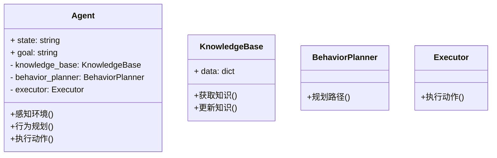
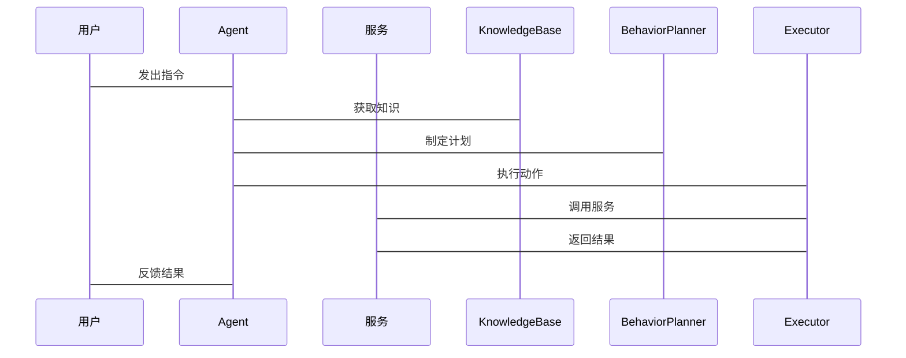

                 


# AI Agent的架构设计：从概念到实现

## 关键词：AI Agent，架构设计，智能体，人工智能，算法实现

## 摘要：本文从AI Agent的基本概念出发，详细探讨了其核心原理、算法实现、系统架构设计以及实际项目中的应用场景。通过结合理论与实践，系统性地分析了AI Agent从概念到实现的全过程，为读者提供了全面而深入的技术指导。

---

## 第1章 AI Agent的基本概念与背景

### 1.1 AI Agent的定义与特点

AI Agent（人工智能代理）是指能够感知环境、自主决策并执行任务的智能实体。其核心特点包括：

- **自主性**：能够在没有外部干预的情况下独立运行。
- **反应性**：能够实时感知环境并做出响应。
- **目标导向**：基于预设目标或学习目标采取行动。
- **适应性**：能够根据环境变化调整行为策略。

### 1.2 AI Agent的历史与发展

AI Agent的概念可以追溯到20世纪70年代，随着人工智能技术的进步，其发展经历了以下几个阶段：

1. **简单反射阶段**：基于简单的条件反射规则进行决策。
2. **基于模型阶段**：引入了状态表示和规划能力。
3. **目标驱动阶段**：以目标为导向进行行为规划。
4. **学习进化阶段**：通过机器学习技术提升决策能力。

### 1.3 AI Agent的应用场景

AI Agent广泛应用于多个领域：

- **智能助手**：如Siri、Alexa等，能够执行语音交互和任务管理。
- **自动交易系统**：在金融市场中进行实时交易决策。
- **游戏AI**：在游戏开发中实现智能NPC（非玩家角色）和对手。
- **智能监控系统**：用于安全监控和异常检测。

---

## 第2章 AI Agent的核心概念与体系结构

### 2.1 智能体的基本构成

AI Agent由以下几个核心部分组成：

- **知识表示**：以某种形式存储和表示智能体对环境的理解。
- **行为规划**：制定实现目标的行为序列。
- **执行机构**：将规划的行为转化为具体操作。

### 2.2 AI Agent的类型

AI Agent可以根据不同的标准进行分类：

- **简单反射型智能体**：基于当前感知直接做出反应。
- **基于模型的智能体**：通过内部模型进行状态推理和决策。
- **目标驱动型智能体**：以实现特定目标为导向。
- **学习型智能体**：通过学习提升行为策略。

### 2.3 AI Agent的核心要素

AI Agent的核心要素包括：

- **知识库**：存储智能体所需的知识和经验。
- **感知器**：用于获取环境信息。
- **行为器**：执行具体动作的模块。
- **学习模块**：通过数据和经验改进行为策略。

### 2.4 AI Agent的体系结构

AI Agent的体系结构主要有以下几种形式：

- **单智能体架构**：适用于简单的任务场景。
- **多智能体架构**：多个智能体协作完成复杂任务。
- **分层架构**：将智能体功能分为多个层次，便于管理和扩展。

---

## 第3章 AI Agent的算法原理与实现

### 3.1 基于模型的规划算法

基于模型的规划算法是一种典型的AI Agent算法，其工作流程如下：

1. **状态表示**：将环境状态表示为图节点。
2. **动作选择**：根据当前状态选择可行动作。
3. **目标推理**：推理出目标状态。
4. **路径规划**：从当前状态到目标状态规划路径。

### 3.2 算法实现的代码示例

以下是一个简单的基于模型的规划算法的Python实现：

```python
class Agent:
    def __init__(self, initial_state):
        self.current_state = initial_state
        self.goal = 'target_state'

    def感知环境(self):
        # 获取环境当前状态
        return self.current_state

    def 行为规划(self):
        # 简单的状态转移逻辑
        if self.current_state == 'current_state':
            return 'action1'
        else:
            return 'action2'

    def 执行动作(self, action):
        # 执行具体动作
        pass

# 示例用法
agent = Agent('initial_state')
while agent.current_state != agent.goal:
    action = agent.行为规划()
    agent.执行动作(action)
```

### 3.3 算法的数学模型与公式

基于模型的规划算法可以用以下数学模型表示：

$$
\text{规划} = \argmin_{\pi} \sum_{t=0}^{T} (s_t, a_t)
$$

其中，\( s_t \) 表示第 \( t \) 时刻的状态，\( a_t \) 表示第 \( t \) 时刻的动作，\( \pi \) 表示策略。

---

## 第4章 系统分析与架构设计

### 4.1 问题场景分析

以智能助手为例，我们需要设计一个能够处理用户语音指令的AI Agent。

### 4.2 系统功能设计

系统功能包括：

- **语音识别**：将语音转换为文本指令。
- **任务解析**：理解指令并分解为具体任务。
- **任务执行**：调用相关服务完成任务。
- **反馈交互**：向用户反馈执行结果。

### 4.3 系统架构设计

以下是系统架构的类图：



### 4.4 系统接口设计

系统接口设计如下：

- **输入接口**：接收用户指令。
- **输出接口**：反馈执行结果。
- **服务接口**：调用第三方服务。

### 4.5 交互流程图

以下是交互流程的Mermaid序列图：



---

## 第5章 项目实战：AI Agent的实现

### 5.1 环境安装

安装必要的库：

```bash
pip install python-magic==0.4.18
pip install numpy==1.21.2
pip install matplotlib==3.5.1
```

### 5.2 核心代码实现

以下是实现AI Agent的核心代码：

```python
import numpy as np
from collections import deque

class Agent:
    def __init__(self, initial_state):
        self.current_state = initial_state
        self.goal = 'target_state'
        self.knowledge = {}

    def感知环境(self):
        return self.current_state

    def 行为规划(self):
        if self.current_state == 'current_state':
            return 'action1'
        else:
            return 'action2'

    def 执行动作(self, action):
        if action == 'action1':
            self.current_state = 'new_state'
        else:
            pass

# 示例用法
agent = Agent('initial_state')
while agent.current_state != agent.goal:
    action = agent.行为规划()
    agent.执行动作(action)
```

### 5.3 代码解读与分析

- **感知环境**：获取当前环境状态。
- **行为规划**：根据当前状态选择合适动作。
- **执行动作**：将规划的动作转化为具体操作。

### 5.4 实际案例分析

以智能助手为例，详细分析如何实现语音交互和任务管理。

### 5.5 项目小结

通过项目实战，我们掌握了AI Agent的基本实现方法和开发流程。

---

## 第6章 总结与展望

### 6.1 本章总结

本文系统性地介绍了AI Agent的基本概念、算法原理、系统架构设计以及实际实现方法。

### 6.2 未来展望

随着人工智能技术的发展，AI Agent将在更多领域得到广泛应用，同时其算法和架构也将不断优化。

### 6.3 注意事项

- **数据安全**：确保智能体的数据安全和隐私保护。
- **算法优化**：持续优化算法以提高执行效率。
- **人机协作**：注重人机协作的用户体验设计。

### 6.4 最佳实践

- **模块化设计**：将智能体功能模块化设计，便于维护和扩展。
- **持续学习**：引入机器学习技术，提升智能体的自适应能力。

---

## 作者：AI天才研究院/AI Genius Institute & 禅与计算机程序设计艺术 /Zen And The Art of Computer Programming

