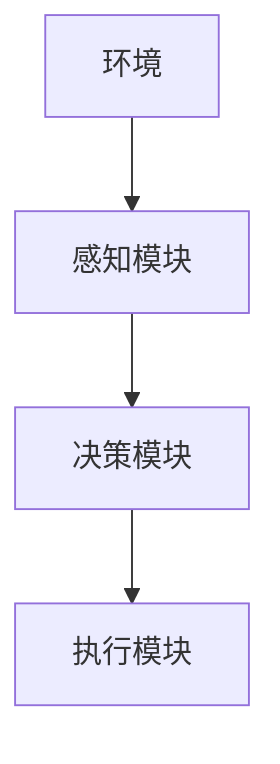
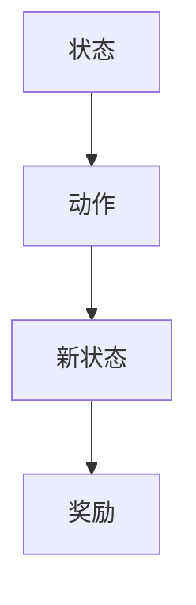
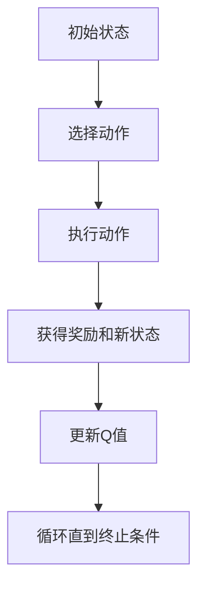
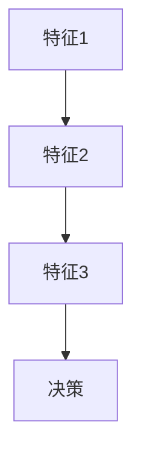
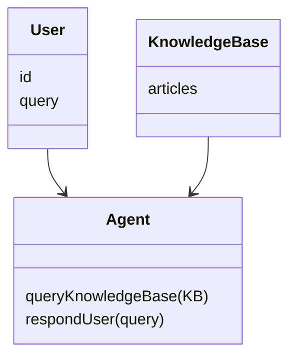
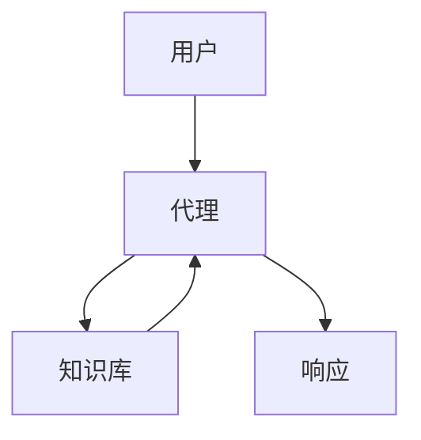
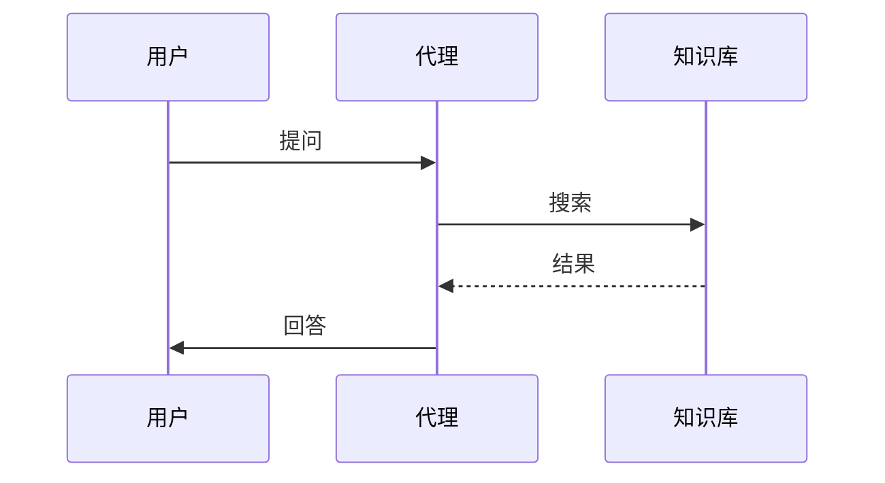

                 


# AI Agent的架构设计：从需求分析到系统规划

## 关键词：AI Agent, 架构设计, 需求分析, 系统规划, 强化学习, 监督学习, 系统架构

## 摘要：本文系统地探讨了AI Agent的架构设计过程，从需求分析到系统规划，涵盖了核心概念、算法原理、系统架构、项目实战以及最佳实践。通过详细讲解感知层和决策层的算法，结合实际案例分析，帮助读者全面理解AI Agent的设计与实现。

---

## 第一部分：AI Agent的基本概念与核心原理

### 第1章：AI Agent的基本概念与核心原理

#### 1.1 AI Agent的定义与类型

##### 1.1.1 AI Agent的定义
AI Agent（人工智能代理）是指能够感知环境、自主决策并采取行动以实现目标的智能实体。AI Agent可以是软件程序、机器人或其他智能系统，其核心能力在于自主性、反应性和目标导向性。

##### 1.1.2 AI Agent的主要类型
AI Agent可以根据功能、智能水平和环境类型进行分类：

| 类型                | 描述                                                                 |
|---------------------|----------------------------------------------------------------------|
| 反应式Agent         | 基于当前感知做出反应，不依赖历史信息，适用于动态环境。               |
| 计划式Agent         | 能够制定和执行复杂计划，适用于任务型场景。                         |
| 学习式Agent         | 通过学习提升性能，适用于需要自适应的复杂环境。                     |
| 混合式Agent         | 结合多种类型Agent的特点，适用于复杂多变的场景。                     |

##### 1.1.3 AI Agent的核心特征对比

| 特征       | 反应式Agent | 计划式Agent | 学习式Agent | 混合式Agent |
|------------|-------------|-------------|-------------|-------------|
| 自主性     | 高          | 高          | 高          | 高          |
| 环境复杂度 | 低          | 中          | 高          | 高          |
| 学习能力   | 无          | 无          | 有          | 有          |
| 计划能力   | 无          | 有          | 无          | 有          |

#### 1.2 AI Agent的架构设计背景

##### 1.2.1 问题背景与需求分析
在现代智能系统中，AI Agent被广泛应用于自动驾驶、智能助手、机器人控制等领域。随着应用场景的复杂化，AI Agent需要处理多目标、多约束的决策问题。

##### 1.2.2 问题描述与目标设定
AI Agent的设计目标包括：
1. 实现自主决策能力。
2. 在动态环境中保持稳定性。
3. 提供高效的计算性能。

##### 1.2.3 问题解决的思路与方法
AI Agent的设计通常采用分层架构，将感知、决策和执行模块独立设计，便于模块化开发和维护。

##### 1.2.4 AI Agent的边界与外延
AI Agent的边界包括感知、决策、执行三个核心模块，外延则涉及环境接口、数据源和用户输入。

#### 1.3 AI Agent的核心要素与概念结构

##### 1.3.1 核心要素分析
AI Agent的核心要素包括：
1. 感知模块：获取环境信息。
2. 决策模块：制定行动计划。
3. 执行模块：执行决策。

##### 1.3.2 概念结构图


##### 1.3.3 外部环境与内部组件的关系
外部环境通过感知模块与AI Agent交互，决策模块负责处理信息并制定计划，执行模块将决策转化为具体行动。

---

## 第二部分：AI Agent的算法原理与实现

### 第2章：AI Agent的感知层算法

#### 2.1 感知层算法概述

##### 2.1.1 感知层的核心任务
感知层负责从环境中获取数据，通常涉及数据采集、预处理和特征提取。

##### 2.1.2 常见感知算法介绍
常用的感知算法包括强化学习和监督学习。

##### 2.1.3 感知层算法的选择与优化
选择感知算法时需考虑数据类型、环境动态性和计算效率。

#### 2.2 基于强化学习的感知算法

##### 2.2.1 强化学习的基本原理
强化学习通过智能体与环境的交互，学习最优策略以最大化累积奖励。

##### 2.2.2 Q-learning算法实现


##### 2.2.3 算法流程图（mermaid）


##### 2.2.4 示例代码
```python
def q_learning(Q, alpha, gamma):
    state = 0
    while True:
        action = choose_action(Q, state)
        next_state, reward = step(state, action)
        Q[state][action] += alpha * (reward + gamma * max(Q[next_state]) - Q[state][action])
        state = next_state
```

##### 2.2.5 算法数学模型
$$ Q(s, a) = Q(s, a) + \alpha [r + \gamma \max Q(s', a') - Q(s, a)] $$

#### 2.3 感知层算法的数学模型

##### 2.3.1 示例场景分析
在迷宫导航问题中，AI Agent通过Q-learning算法学习最优路径。

---

### 第3章：AI Agent的决策层算法

#### 3.1 决策层算法概述

##### 3.1.1 决策层的核心任务
决策层负责制定行动计划，通常涉及策略选择和优化。

##### 3.1.2 常见决策算法介绍
常用的决策算法包括监督学习和强化学习。

##### 3.1.3 决策层算法的选择与优化
选择决策算法时需考虑任务复杂度和数据可获得性。

#### 3.2 基于监督学习的决策算法

##### 3.2.1 监督学习的基本原理
监督学习通过训练数据学习输入与输出的映射关系。

##### 3.2.2 决策树算法实现


##### 3.2.3 示例代码
```python
def decision_tree(train_data, test_data):
    model = DecisionTreeClassifier()
    model.fit(train_data)
    prediction = model.predict(test_data)
    return prediction
```

##### 3.2.4 算法数学模型
$$ Gini_impurity = \sum_{i} p_i(1 - p_i) $$

#### 3.3 决策层算法的数学模型

##### 3.3.1 示例场景分析
在电商推荐系统中，AI Agent使用决策树算法分析用户行为，推荐个性化商品。

---

## 第三部分：AI Agent的系统架构设计

### 第4章：AI Agent的系统分析与架构设计

#### 4.1 系统分析与需求提取

##### 4.1.1 项目背景与目标
本项目旨在设计一个智能客服AI Agent，提供高效的问题解答服务。

##### 4.1.2 需求分析
核心需求包括自然语言处理、知识库检索和对话管理。

#### 4.2 系统功能设计

##### 4.2.1 领域模型设计


##### 4.2.2 系统架构设计


#### 4.3 系统接口设计

##### 4.3.1 接口描述
1. `queryKnowledgeBase(query): returns articles`
2. `respondUser(query): returns response`

#### 4.4 系统交互设计

##### 4.4.1 交互流程


---

## 第四部分：AI Agent的项目实战

### 第5章：AI Agent的实现与优化

#### 5.1 项目实战

##### 5.1.1 环境安装
安装必要的库：
```bash
pip install numpy scikit-learn matplotlib
```

##### 5.1.2 系统核心实现

###### 5.1.2.1 需求解析模块
```python
def parse_query(query):
    return keywords
```

###### 5.1.2.2 任务规划模块
```python
def plan_actions(keywords):
    return actions
```

###### 5.1.2.3 执行控制模块
```python
def execute_action(action):
    return result
```

##### 5.1.3 代码实现
```python
import numpy as np
from sklearn.tree import DecisionTreeClassifier

def q_learning(Q, alpha, gamma, state, action):
    next_state, reward = step(state, action)
    Q[state][action] += alpha * (reward + gamma * max(Q[next_state]) - Q[state][action])
    return Q

# 示例场景
states = np.array([0, 1])
actions = np.array([0, 1])
Q = np.zeros((2, 2))
alpha = 0.1
gamma = 0.9

for _ in range(100):
    Q = q_learning(Q, alpha, gamma, 0, 0)
```

##### 5.1.4 案例分析
通过模拟环境，训练AI Agent完成任务，如自动驾驶中的路径规划。

---

## 第五部分：AI Agent的系统规划与最佳实践

### 第6章：系统规划与实施

#### 6.1 系统规划

##### 6.1.1 需求分析与可行性评估
确保需求明确，技术可行。

##### 6.1.2 系统设计与模块划分
将系统划分为感知、决策和执行模块。

#### 6.2 最佳实践

##### 6.2.1 代码规范与文档管理
遵循行业标准，保持代码可读性和维护性。

##### 6.2.2 测试策略与优化方法
实施单元测试和集成测试，持续优化性能。

##### 6.2.3 团队协作与版本控制
使用Git进行版本管理，确保团队协作顺畅。

---

## 作者：AI天才研究院 & 禅与计算机程序设计艺术

---

通过以上结构和内容的详细规划，我可以开始撰写完整的博客文章。每个部分都将按照上述大纲展开，确保内容详实、逻辑清晰。接下来，我将根据这个大纲逐步撰写文章的各个章节。

