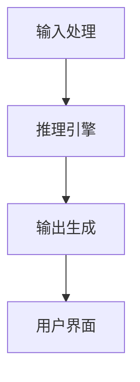
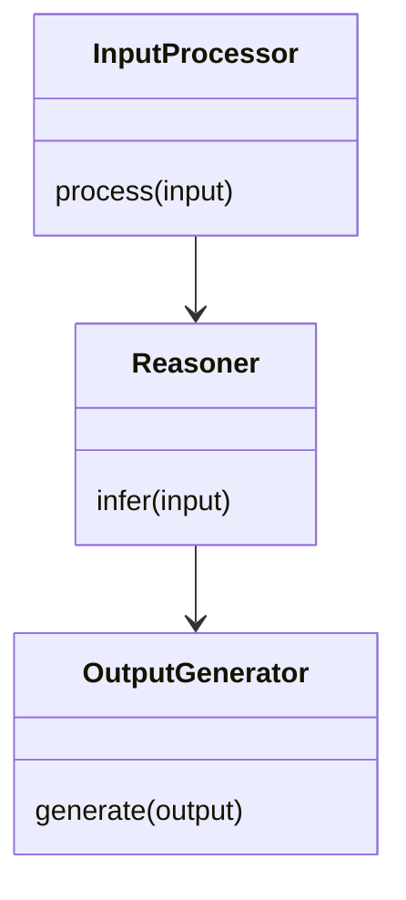

                 


# AI Agent的核心组件：输入处理、推理引擎和输出生成

> 关键词：AI Agent、输入处理、推理引擎、输出生成、自然语言处理、图神经网络、生成式模型

> 摘要：本文将详细探讨AI Agent的核心组件，包括输入处理、推理引擎和输出生成。通过分析每个组件的原理、实现方法和应用场景，揭示其在人工智能系统中的重要性。文章结合实际案例和数学模型，深入浅出地解析AI Agent的技术细节。

---

## 第一部分：AI Agent的核心概念与背景

### 第1章：AI Agent概述

#### 1.1 AI Agent的基本概念

AI Agent（人工智能代理）是指在计算机系统中，能够感知环境、自主决策并执行任务的智能实体。它能够通过与环境交互，利用感知信息完成特定目标，例如问题求解、数据处理或用户交互等。

**核心属性**：
- **自主性**：无需外部干预，自主决策。
- **反应性**：能实时感知环境并做出反应。
- **目标导向性**：所有行为都以实现特定目标为导向。
- **学习能力**：通过经验改进性能。

#### 1.2 AI Agent的应用场景

AI Agent广泛应用于多个领域，包括：
- **自然语言处理**：如智能对话系统。
- **推荐系统**：根据用户行为推荐相关内容。
- **自动驾驶**：处理车辆周围的环境信息。
- **机器人技术**：用于工业自动化或服务机器人。

#### 1.3 本章小结

本章介绍了AI Agent的基本概念、核心属性及其应用场景，为后续分析奠定了基础。

---

## 第二部分：AI Agent的核心组件分析

### 第2章：输入处理

#### 2.1 输入处理的基本原理

输入处理是AI Agent的第一步，涉及将外部输入转化为系统可处理的形式。输入可以是文本、图像或传感器数据。

**输入分类**：
- **结构化数据**：如数据库中的记录。
- **非结构化数据**：如文本、图像。
- **时间序列数据**：如传感器数据。

#### 2.2 输入处理的实现流程

1. **数据预处理**：
   - 去除噪声。
   - 标准化处理。

2. **数据清洗**：
   - 去除无效数据。
   - 处理缺失值。

3. **特征提取**：
   - 将数据转化为特征向量。

#### 2.3 输入处理的算法实现

- **自然语言处理**：使用词嵌入模型（如Word2Vec）将文本转化为向量。
- **图像处理**：使用CNN提取图像特征。

**代码示例**：
```python
import numpy as np

# 示例：文本特征提取
def text_feature_extraction(text):
    # 假设text是输入文本
    features = []
    for word in text.split():
        features.append(word_embedding(word))
    return np.array(features)
```

#### 2.4 本章小结

输入处理是AI Agent的基石，决定了后续推理的质量。

---

### 第3章：推理引擎

#### 3.1 推理引擎的基本原理

推理引擎负责根据输入数据进行逻辑推理，得出结论。常见的推理方法包括符号逻辑推理和概率推理。

**符号逻辑推理**：
- 基于知识库中的事实和规则进行推理。

**概率推理**：
- 使用贝叶斯网络计算概率。

#### 3.2 推理引擎的实现原理

1. **知识表示**：
   - 使用规则库或知识图谱。

2. **推理算法**：
   - 前向链推理。
   - 后向链推理。

**数学模型**：
- 贝叶斯公式：
  $$ P(A|B) = \frac{P(B|A)P(A)}{P(B)} $$

#### 3.3 推理引擎的算法实现

- **符号逻辑推理**：
  ```python
  def forward_chaining(rules, facts):
      # 实现前向推理算法
      pass
  ```

- **概率推理**：
  ```python
  def bayesian_inference(priors, likelihoods):
      # 实现贝叶斯推理
      pass
  ```

#### 3.4 本章小结

推理引擎是AI Agent的核心，决定了系统的决策能力。

---

### 第4章：输出生成

#### 4.1 输出生成的基本原理

输出生成是AI Agent的最后一步，将推理结果转化为可理解的形式。常见的输出形式包括文本、图像和动作指令。

#### 4.2 输出生成的实现方法

1. **文本生成**：
   - 使用生成式模型（如GPT）生成自然语言文本。

2. **图像生成**：
   - 使用GAN生成图像。

**数学模型**：
- 生成对抗网络（GAN）：
  $$ G(z) = D(G(z)) $$

#### 4.3 输出生成的代码实现

- **文本生成**：
  ```python
  import tensorflow as tf

  def generate_text(model, tokenizer):
      input_ids = tokenizer.encode("Hello, how are you?", add_special_tokens=True)
      outputs = model.generate(input_ids, max_length=50)
      return tokenizer.decode(outputs[0], skip_special_tokens=True)
  ```

#### 4.4 本章小结

输出生成是AI Agent与用户交互的关键部分，决定了用户体验。

---

## 第三部分：系统架构设计与项目实战

### 系统架构设计

**系统架构图**：


**类图**：


### 项目实战

#### 环境安装

```bash
pip install numpy tensorflow transformers
```

#### 核心代码实现

```python
class AI-Agent:
    def __init__(self):
        self.input_processor = InputProcessor()
        self.reasoner = Reasoner()
        self.output_generator = OutputGenerator()

    def process_input(self, input_data):
        processed_data = self.input_processor.process(input_data)
        result = self.reasoner.infer(processed_data)
        output = self.output_generator.generate(result)
        return output
```

---

## 第四部分：总结与展望

### 总结

AI Agent的核心组件——输入处理、推理引擎和输出生成，共同决定了系统的性能和功能。通过合理的算法选择和系统设计，可以构建高效、智能的AI Agent。

### 展望

未来，AI Agent将在更多领域发挥作用，例如更复杂的推理模型和更自然的输出生成方式。多模态AI Agent也是一个重要的研究方向。

---

## 作者信息

作者：AI天才研究院 & 禅与计算机程序设计艺术

---

以上是文章的详细目录大纲和部分内容，接下来将按照此结构撰写完整的文章。

