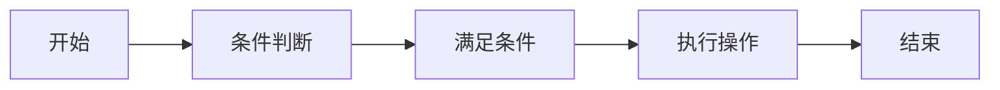
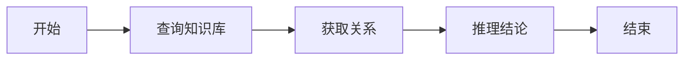
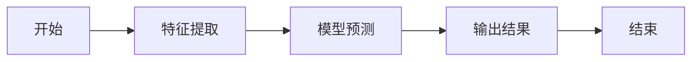
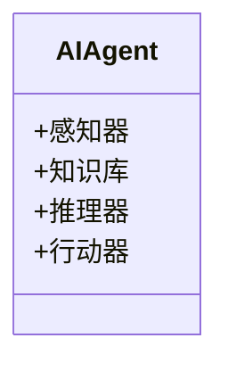
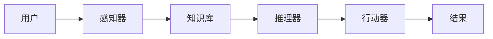

                 


# AI Agent的概念学习与推理实现

> 关键词：AI Agent, 人工智能, 推理实现, 系统架构, 项目实战

> 摘要：本文将详细探讨AI Agent的概念、核心原理、算法实现、系统架构设计以及项目实战。通过逐步分析，我们将了解AI Agent的基本概念，学习其推理机制，并通过实际项目展示如何实现一个完整的AI Agent系统。

---

## 第一章: AI Agent 的概念与背景

### 1.1 AI Agent 的定义与背景

#### 1.1.1 AI Agent 的定义

AI Agent（人工智能代理）是指能够感知环境并采取行动以实现目标的智能体。AI Agent可以是软件程序、机器人或其他智能系统，其核心目标是通过与环境交互来完成特定任务。

#### 1.1.2 AI Agent 的发展历史

AI Agent的概念起源于20世纪60年代的知识表示与推理研究。随着技术进步，AI Agent经历了从基于规则到基于机器学习的演进，如今广泛应用于自动驾驶、智能助手等领域。

#### 1.1.3 AI Agent 的应用场景

- **自动驾驶**：实时感知环境，做出驾驶决策。
- **智能助手**：如Siri、Alexa，通过语音交互帮助用户完成任务。
- **推荐系统**：基于用户行为推荐个性化内容。

#### 1.1.4 问题背景与问题描述

AI Agent的设计面临环境动态性、多目标冲突、资源受限等挑战。如何在复杂环境中做出高效、准确的决策是核心问题。

#### 1.1.5 学习目标与预期成果

通过本章，读者将理解AI Agent的基本概念、核心能力及其在实际应用中的价值。

---

## 第二章: AI Agent 的核心概念与原理

### 2.1 AI Agent 的概念结构

#### 2.1.1 概念结构与核心要素

AI Agent由**感知器**、**推理器**、**知识库**和**行动器**组成，分别负责环境交互、知识处理、决策制定和行动执行。

#### 2.1.2 AI Agent 的核心属性特征对比表

| 属性 | 描述 |
|------|------|
| 感知能力 | 环境数据采集能力 |
| 推理能力 | 逻辑推理能力 |
| 决策能力 | 行动选择能力 |
| 学习能力 | 自适应优化能力 |

#### 2.1.3 ER 实体关系图

```mermaid
er
actor(AI Agent) -|> perceptron: 接收环境数据
actor(AI Agent) -|> knowledge_base: 存储知识
actor(AI Agent) -|> reasoner: 进行逻辑推理
actor(AI Agent) -|> action: 执行操作
```

### 2.2 AI Agent 的核心原理

#### 2.2.1 基于规则的推理原理

基于规则的推理通过预定义的规则进行逻辑推导。例如，如果A且B，则结论C。

#### 2.2.2 基于知识图谱的推理原理

知识图谱存储实体间的关系，AI Agent通过路径推理得出结论。例如，如果A是B的父类，且B是C的父类，则A是C的祖先。

#### 2.2.3 基于机器学习的推理原理

利用训练数据，模型学习输入与输出的映射关系。例如，使用神经网络进行分类或回归。

---

## 第三章: AI Agent 的算法原理与实现

### 3.1 AI Agent 的算法原理

#### 3.1.1 基于规则的推理算法



```python
def rule_based_inference(condition):
    if condition:
        return "结论"
    else:
        return "其他结论"
```

#### 3.1.2 基于知识图谱的推理算法



#### 3.1.3 基于机器学习的推理算法



### 3.2 AI Agent 的数学模型与公式

#### 3.2.1 基于规则的推理模型

规则形式化表示为：如果前提P，那么结论Q。

$$ P \rightarrow Q $$

#### 3.2.2 基于知识图谱的推理模型

知识图谱中的三元组表示为：(头实体, 关系, 尾实体)。

$$ head - relation -> tail $$

#### 3.2.3 基于机器学习的推理模型

例如，逻辑回归模型：

$$ P(y|x) = \frac{e^{w \cdot x + b}}{1 + e^{w \cdot x + b}} $$

---

## 第四章: AI Agent 的系统架构设计

### 4.1 问题场景介绍

#### 4.1.1 问题背景与目标

设计一个AI Agent，用于智能助手，完成用户查询、信息检索和结果呈现。

#### 4.1.2 项目介绍与范围

项目范围包括：用户交互、信息处理、结果反馈。

### 4.2 系统功能设计

#### 4.2.1 领域模型设计



#### 4.2.2 功能模块划分

- **感知器**：接收输入
- **知识库**：存储数据
- **推理器**：处理逻辑
- **行动器**：输出结果

### 4.3 系统架构设计

#### 4.3.1 系统架构图



#### 4.3.2 接口设计与交互流程

- 用户输入查询
- 感知器接收并传递给推理器
- 推理器处理后传递给行动器
- 行动器输出结果给用户

---

## 第五章: AI Agent 的项目实战

### 5.1 环境安装与配置

安装Python、TensorFlow、Keras等工具，配置开发环境。

### 5.2 系统核心实现源代码

```python
class AI_Agent:
    def __init__(self):
        self.perceptron = Perceptron()
        self.knowledge_base = KnowledgeBase()
        self.reasoner = Reasoner()
        self.action = Action()

    def process_query(self, query):
        data = self.perceptron.receive(query)
        result = self.reasoner.inference(data, self.knowledge_base)
        self.action.execute(result)
```

### 5.3 代码应用解读与分析

- **Perceptron**：负责接收输入
- **KnowledgeBase**：存储和检索知识
- **Reasoner**：进行逻辑推理
- **Action**：执行操作

### 5.4 实际案例分析

实现一个简单的AI Agent，接收用户查询，进行推理并返回结果。

### 5.5 项目小结

通过项目实战，读者可以理解AI Agent的实现过程，并掌握各模块的协作方式。

---

## 第六章: 最佳实践与总结

### 6.1 小结

AI Agent的设计需要考虑感知、推理、行动三者的协调配合，通过项目实战可以深入理解其实现过程。

### 6.2 注意事项

- 确保知识库的准确性和完整性
- 设计高效的推理算法
- 处理环境的动态变化

### 6.3 拓展阅读

建议阅读相关书籍，如《人工智能：一种现代的方法》。

### 6.4 常见问题解答

- Q：如何处理多目标冲突？
- A：通过优先级排序或优化算法解决。

---

作者：AI天才研究院 & 禅与计算机程序设计艺术

---

通过以上结构，读者可以系统地学习AI Agent的概念、原理和实现方法，从理论到实践，全面掌握AI Agent的核心技术。

