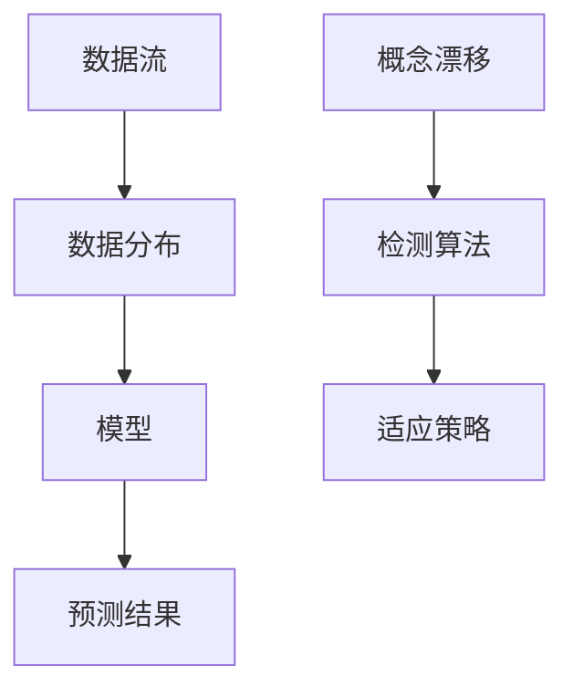
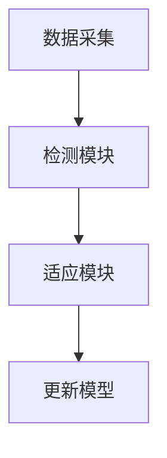
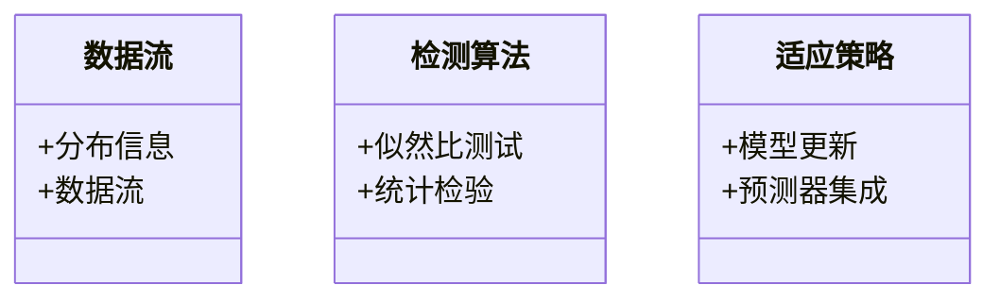
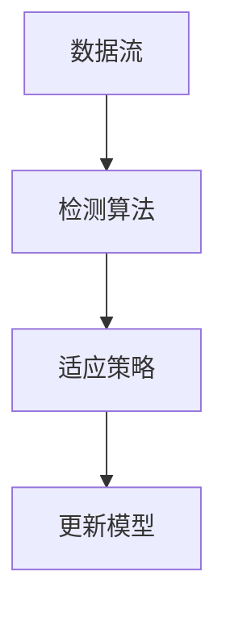

                 


# AI Agent的概念漂移检测与适应

**关键词**: AI Agent, 概念漂移, 检测算法, 适应策略, 实体关系图, 流程图, 数学模型

**摘要**: 本文深入探讨AI Agent中概念漂移的检测与适应问题，从背景介绍、核心概念、算法原理、系统设计、项目实战到最佳实践，全面解析概念漂移的技术细节和实际应用。通过详细的数学模型和流程图，帮助读者理解如何设计和实现高效的检测与适应算法，保持AI系统的性能和准确性。

---

## 第1章: 概念漂移的基本问题

### 1.1 概念漂移的定义与问题背景

#### 1.1.1 什么是概念漂移
概念漂移指的是数据分布的变化，导致模型预测性能下降。例如，随着时间推移，客户购买行为的变化可能使旧模型失效。

#### 1.1.2 概念漂移的分类
- **突然漂移**: 突然的数据分布变化，如市场突发事件。
- **渐进漂移**: 数据分布逐渐变化，如客户偏好缓慢转变。
- **局部漂移**: 某个子群体的行为变化。

#### 1.1.3 概念漂移的检测与适应的重要性
及时检测和适应概念漂移，能确保AI Agent持续高效运行，避免性能下降。

---

### 1.2 概念漂移的检测与适应的基本问题

#### 1.2.1 概念漂移的检测方法
- 统计方法: 使用似然比测试检测数据分布变化。
- 假设检验: 比较新旧数据分布差异。

#### 1.2.2 概念漂移的适应策略
- 重新训练模型: 使用新数据更新模型。
- 预测器集成: 结合多个模型提高鲁棒性。

#### 1.2.3 概念漂移的数学模型与算法
检测算法基于似然比统计量，公式如下：

$$ LR = \frac{P(D|H_1)}{P(D|H_0)} $$

其中，$H_0$和$H_1$分别是原假设和备择假设。

---

## 第2章: 概念漂移的核心概念与联系

### 2.1 概念漂移的核心概念

#### 2.1.1 数据流的动态变化
数据分布的变化是概念漂移的核心驱动因素。

#### 2.1.2 模型的更新与优化
模型需要定期更新以适应数据分布的变化。

#### 2.1.3 概念漂移的检测与适应算法
算法通过检测数据变化并触发适应策略。

### 2.2 概念漂移的核心属性特征对比

| 类型       | 描述                     |
|------------|--------------------------|
| 突然漂移   | 数据分布突然变化         |
| 渐进漂移   | 数据分布逐渐变化         |
| 局部漂移   | 某个子群体的行为变化     |

### 2.3 概念漂移的ER实体关系图



---

## 第3章: 概念漂移检测与适应的核心算法原理

### 3.1 概念漂移检测算法的原理

#### 3.1.1 算法的基本原理
基于似然比测试，检测数据分布变化。

#### 3.1.2 算法的输入与输出
- 输入: 数据流
- 输出: 漂移信号

#### 3.1.3 检测机制
$$ LR = \prod_{i=1}^{n} \frac{P(x_i|H_1)}{P(x_i|H_0)} $$

### 3.2 概念漂移适应算法的原理

#### 3.2.1 更新机制
- 重新训练模型，公式如下：

$$ \theta_{new} = \arg\max_\theta \sum_{i=1}^{n} \log P(x_i|\theta) $$

#### 3.2.2 优化策略
结合多个模型，提高鲁棒性。

### 3.3 概念漂移检测与适应的数学模型

#### 3.3.1 概念漂移的数学模型
$$ H_0: P(D|θ_0) \quad vs. \quad H_1: P(D|θ_1) $$

#### 3.3.2 检测算法的数学模型
似然比统计量：

$$ LR = \frac{P(D|θ_1)}{P(D|θ_0)} $$

---

## 第4章: 概念漂移检测与适应的系统分析与架构设计

### 4.1 系统分析

#### 4.1.1 系统目标
检测数据分布变化，触发模型更新。

#### 4.1.2 系统功能模块
- 数据采集模块
- 检测模块
- 适应模块

#### 4.1.3 模块划分


### 4.2 系统架构设计

#### 4.2.1 领域模型类图


#### 4.2.2 系统架构图


---

## 第5章: 项目实战

### 5.1 环境配置

```bash
pip install numpy scikit-learn
```

### 5.2 核心代码实现

```python
import numpy as np
from sklearn.naive_bayes import GaussianNB

# 示例数据
X_old = np.random.randn(100, 2)
y_old = np.zeros(100)

X_new = np.random.randn(100, 2)
y_new = np.ones(100)

# 训练旧模型
model_old = GaussianNB().fit(X_old, y_old)

# 检测漂移
score_old = model_old.score(X_new, y_new)
if score_old < 0.8:
    # 更新模型
    model_new = GaussianNB().fit(np.vstack((X_old, X_new)), np.concatenate((y_old, y_new)))
else:
    model_new = model_old
```

### 5.3 代码解读与分析

#### 5.3.1 代码解读
- 使用高斯贝叶斯模型进行分类。
- 检测模型在新数据上的表现，若低于阈值，更新模型。

#### 5.3.2 实际案例分析
在客户 churn 预测中，检测购买行为变化，及时更新模型，提高预测准确性。

---

## 第6章: 最佳实践与小结

### 6.1 检测与适应的关键点
- 定期检测数据变化
- 选择合适的检测算法
- 设定合理的适应阈值

### 6.2 小结
概念漂移检测与适应是保持AI Agent性能的重要环节，需综合考虑算法选择和系统设计。

### 6.3 注意事项
- 数据质量和数量影响检测效果
- 避免过度适应，防止模型过拟合

### 6.4 拓展阅读
- 《Data Stream Mining》
- 《概念漂移检测的算法研究》

---

**作者**: AI天才研究院 & 禅与计算机程序设计艺术

