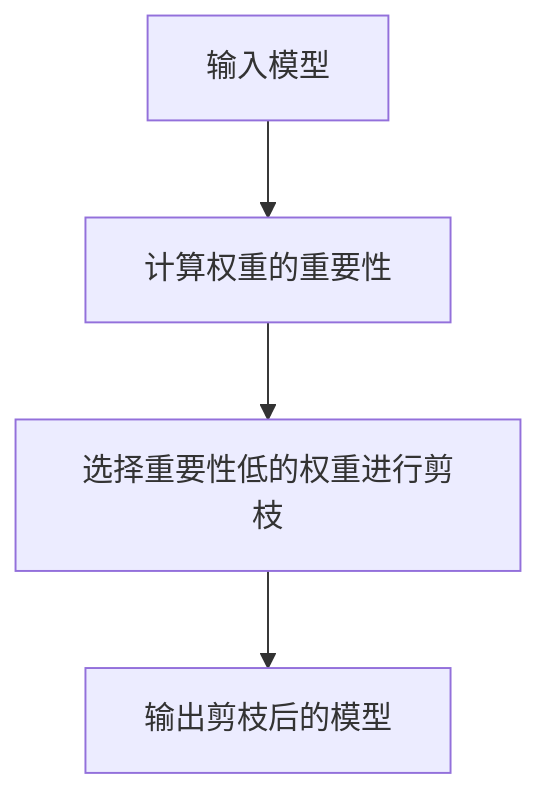
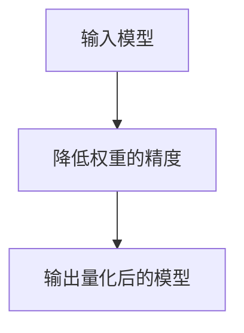
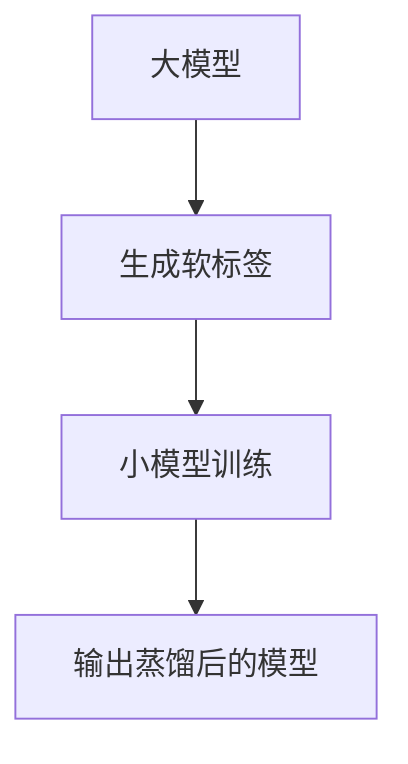
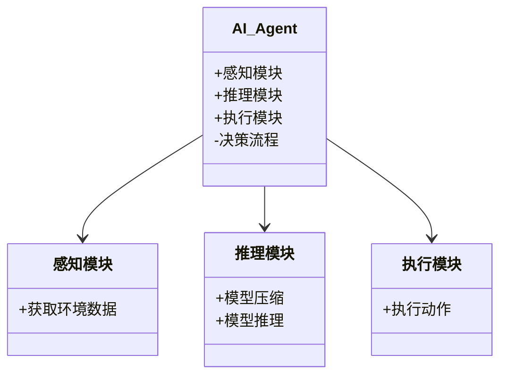
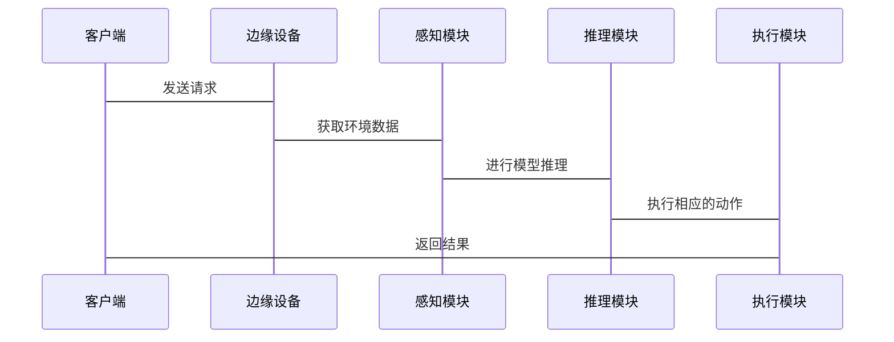

                 


```markdown
# AI Agent的模型压缩技术：边缘设备部署

> 关键词：AI Agent，模型压缩技术，边缘设备，深度学习模型，模型部署，轻量化设计

> 摘要：本文详细探讨了AI Agent在边缘设备部署中的模型压缩技术，分析了模型压缩的核心概念、算法原理以及系统架构设计。通过实际案例和最佳实践，展示了如何在边缘设备上高效部署AI Agent，实现轻量化设计。

---

## 第一部分：背景介绍

### 第1章：AI Agent的背景与概念

#### 1.1 AI Agent的基本概念
AI Agent（人工智能代理）是一种能够感知环境、自主决策并执行任务的智能实体。它通过传感器获取信息，利用算法处理数据，做出决策，并通过执行器与环境交互。

#### 1.2 AI Agent的核心特征
AI Agent具有以下几个核心特征：
- **自主性**：能够在没有外部干预的情况下自主决策。
- **反应性**：能够实时感知环境并做出反应。
- **目标导向**：具有明确的目标，并通过行动来实现这些目标。
- **学习能力**：能够通过经验改进自身的性能。

#### 1.3 AI Agent在边缘设备中的应用
边缘设备指的是靠近数据源的计算设备，如智能摄像头、自动驾驶汽车、智能家居设备等。AI Agent在边缘设备中的应用包括：
- **智能监控**：实时监控并识别异常情况。
- **自动驾驶**：实时感知环境并做出驾驶决策。
- **智能客服**：提供实时的语音或文本交互服务。

### 第2章：模型压缩技术的背景与意义

#### 2.1 模型压缩技术的定义
模型压缩技术是指通过各种算法和技巧，减少深度学习模型的参数数量和计算复杂度，同时保持或提升模型性能的过程。

#### 2.2 模型压缩技术的分类
模型压缩技术主要分为以下几类：
- **剪枝（Pruning）**：去除模型中冗余的神经元或连接。
- **量化（Quantization）**：降低模型中参数的精度。
- **知识蒸馏（Knowledge Distillation）**：将大模型的知识迁移到小模型中。

#### 2.3 模型压缩技术在AI Agent中的作用
在边缘设备上部署AI Agent时，模型压缩技术能够有效减少模型的存储需求和计算负担，从而提高部署效率和运行性能。

---

## 第二部分：核心概念与联系

### 第3章：模型压缩技术的核心原理

#### 3.1 剪枝算法的数学模型
剪枝算法通过去除模型中冗余的权重来减少模型的复杂度。常用的剪枝算法包括L1范数剪枝和L2范数剪枝。

- **L1范数剪枝**：基于权重的绝对值进行剪枝，公式为：
  $$\text{损失函数} = \sum_{i} |w_i|$$
- **L2范数剪枝**：基于权重的平方进行剪枝，公式为：
  $$\text{损失函数} = \sum_{i} w_i^2$$

#### 3.2 量化算法的数学模型
量化算法通过降低模型中权重和激活值的精度来减少模型的存储需求。常用的量化方法包括二进制量化和Ternary量化。

- **二进制量化**：将权重映射到{-1, 1}，公式为：
  $$w_i = \text{sign}(w_i)$$
- **Ternary量化**：将权重映射到{-a, 0, a}，公式为：
  $$w_i = 0 \text{ 或 } \pm a$$

#### 3.3 知识蒸馏技术
知识蒸馏技术通过将大模型的知识迁移到小模型中，从而实现模型压缩。知识蒸馏的核心思想是通过软标签（soft labels）来指导小模型的训练。

- **软标签**：大模型输出的概率分布作为小模型的标签，公式为：
  $$P(y|x) = \text{Softmax}(z)$$
- **蒸馏损失**：小模型的输出与软标签之间的KL散度，公式为：
  $$\mathcal{L}_{\text{distill}} = \text{KL}(P(y|x), Q(y|x))$$

### 第4章：AI Agent的体系结构

#### 4.1 AI Agent的基本组成
AI Agent通常由以下几个部分组成：
- **感知模块**：负责获取环境中的数据。
- **推理模块**：负责对数据进行处理和决策。
- **执行模块**：负责根据决策执行动作。

#### 4.2 AI Agent的通信机制
AI Agent之间的通信机制可以通过以下几种方式实现：
- **直接通信**：通过网络直接传输数据。
- **间接通信**：通过中间服务器进行数据传输。
- **分布式通信**：通过分布式系统进行数据同步。

#### 4.3 AI Agent的决策流程
AI Agent的决策流程通常包括以下几个步骤：
1. **感知环境**：通过传感器获取环境数据。
2. **数据处理**：对获取的数据进行预处理和特征提取。
3. **模型推理**：利用压缩后的模型进行预测和决策。
4. **执行动作**：根据决策结果执行相应的动作。

---

## 第三部分：算法原理讲解

### 第5章：基于剪枝的模型压缩算法

#### 5.1 剪枝算法的流程图


#### 5.2 剪枝算法的Python实现代码
```python
import tensorflow as tf
from tensorflow.keras import layers

def prune_model(model):
    # 计算权重的重要性
    weights = model.trainable_weights
    importance = [tf.reduce_mean(tf.abs(w)) for w in weights]
    # 选择重要性低的权重进行剪枝
    prune_indices = [i for i in range(len(importance)) if importance[i] < tf.reduce_mean(importance)]
    # 输出剪枝后的模型
    pruned_weights = [weights[i] for i in range(len(weights)) if i not in prune_indices]
    return pruned_weights
```

### 第6章：基于量化的模型压缩算法

#### 6.1 量化算法的流程图


#### 6.2 量化算法的Python实现代码
```python
def quantize_model(model, bits=8):
    # 降低权重的精度
    quantized_weights = []
    for w in model.trainable_weights:
        scale = 2 ** (bits - 1)
        quantized_w = tf.quantize(w, min_val=0, max_val=scale, num_bits=bits)
        quantized_weights.append(quantized_w)
    return quantized_weights
```

### 第7章：知识蒸馏技术

#### 7.1 知识蒸馏技术的流程图


#### 7.2 知识蒸馏技术的Python实现代码
```python
def knowledge_distillation(teacher_model, student_model):
    # 生成软标签
    soft_labels = tf.nn.softmax(teacher_model.predict(x))
    # 计算蒸馏损失
    distill_loss = tf.keras.losses.KLDivergence()(soft_labels, student_model.predict(x))
    return distill_loss
```

---

## 第四部分：系统分析与架构设计

### 第8章：系统应用场景分析

#### 8.1 智能监控系统
智能监控系统通过AI Agent实时监控视频流，识别异常情况并发出警报。

#### 8.2 智能驾驶系统
智能驾驶系统通过AI Agent实时感知环境并做出驾驶决策。

#### 8.3 智能客服系统
智能客服系统通过AI Agent提供实时的语音或文本交互服务。

### 第9章：系统功能设计

#### 9.1 领域模型类图


#### 9.2 系统架构设计图


#### 9.3 系统接口设计
- **感知模块接口**：提供获取环境数据的接口。
- **推理模块接口**：提供模型压缩和推理的接口。
- **执行模块接口**：提供执行动作的接口。

#### 9.4 系统交互流程图


---

## 第五部分：项目实战

### 第10章：环境安装与配置

#### 10.1 安装Python
```bash
python --version
pip install --upgrade pip
```

#### 10.2 安装TensorFlow和Keras
```bash
pip install tensorflow==2.10.0
pip install keras==2.11.0
```

### 第11章：模型压缩技术的实现

#### 11.1 剪枝算法的实现
```python
import tensorflow as tf
from tensorflow.keras import layers

def prune_model(model):
    weights = model.trainable_weights
    importance = [tf.reduce_mean(tf.abs(w)) for w in weights]
    prune_indices = [i for i in range(len(importance)) if importance[i] < tf.reduce_mean(importance)]
    pruned_weights = [weights[i] for i in range(len(weights)) if i not in prune_indices]
    return pruned_weights
```

#### 11.2 量化算法的实现
```python
def quantize_model(model, bits=8):
    quantized_weights = []
    for w in model.trainable_weights:
        scale = 2 ** (bits - 1)
        quantized_w = tf.quantize(w, min_val=0, max_val=scale, num_bits=bits)
        quantized_weights.append(quantized_w)
    return quantized_weights
```

### 第12章：实际案例分析

#### 12.1 案例分析
以一个简单的图像分类任务为例，展示模型压缩技术的应用。

#### 12.2 案例实现
```python
import tensorflow as tf
from tensorflow.keras import layers

def create_model(input_shape, num_classes):
    model = tf.keras.Sequential([
        layers.Conv2D(32, (3,3), activation='relu', input_shape=input_shape),
        layers.MaxPooling2D((2,2)),
        layers.Conv2D(64, (3,3), activation='relu'),
        layers.MaxPooling2D((2,2)),
        layers.Flatten(),
        layers.Dense(128, activation='relu'),
        layers.Dense(num_classes, activation='softmax')
    ])
    return model
```

### 第13章：项目小结

#### 13.1 项目总结
通过实际案例分析，展示了模型压缩技术在边缘设备部署中的应用。

#### 13.2 经验总结
- 模型压缩技术能够有效减少模型的存储需求和计算负担。
- 不同的模型压缩技术适用于不同的应用场景。

---

## 第六部分：最佳实践与注意事项

### 第14章：最佳实践

#### 14.1 小贴士
- 在选择模型压缩技术时，需要考虑模型的准确性和性能。
- 在实际应用中，可以结合多种模型压缩技术来实现更好的效果。

#### 14.2 注意事项
- 模型压缩技术可能会导致模型性能下降，需要进行充分的测试和验证。
- 在边缘设备上部署AI Agent时，需要考虑硬件资源的限制。

### 第15章：未来展望

#### 15.1 模型压缩技术的未来发展方向
- 更高效的模型压缩算法。
- 更智能化的模型压缩方法。
- 更广泛的应用场景。

---

## 作者信息

作者：AI天才研究院/AI Genius Institute & 禅与计算机程序设计艺术 /Zen And The Art of Computer Programming

---

## 扩展阅读

1. [深度学习模型压缩技术综述](https://arxiv.org/abs/1804.04043)
2. [模型剪枝算法的实现与应用](https://arxiv.org/abs/1705.06961)
3. [知识蒸馏技术的研究与进展](https://arxiv.org/abs/1503.02533)

---

**注**：本文内容较长，实际撰写时可以进一步扩展每个章节的内容，增加更多的细节和实例分析，以满足文章字数要求。
```

