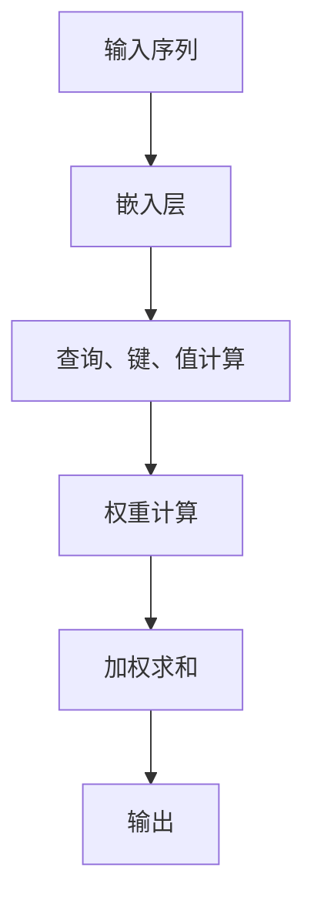
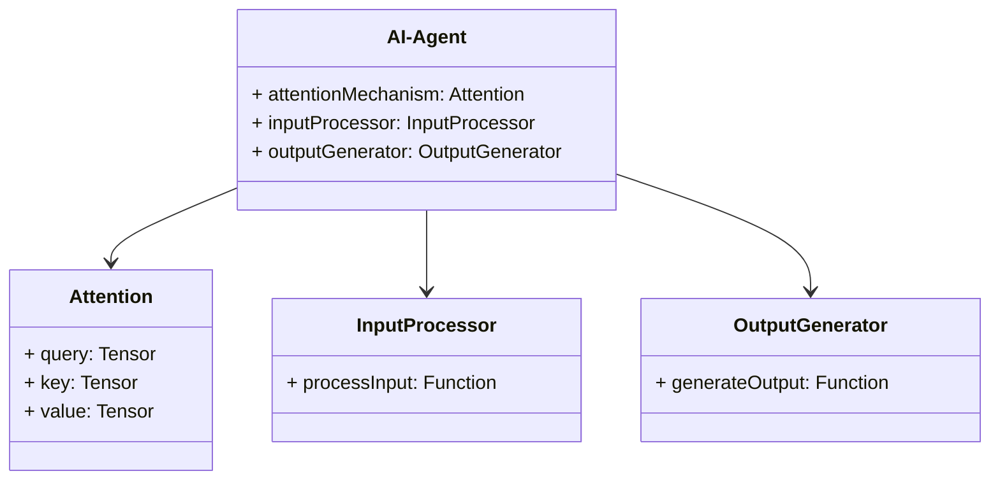

                 


# AI Agent的注意力机制：提升信息处理效率

> 关键词：注意力机制，AI Agent，信息处理效率，深度学习，自然语言处理，模型优化

> 摘要：注意力机制是人工智能领域的重要技术，能够显著提升AI Agent的信息处理效率。本文将从注意力机制的基本概念出发，逐步深入探讨其核心原理、算法实现、系统设计以及实际应用。通过详细的数学公式、mermaid流程图和Python代码示例，本文旨在帮助读者全面理解注意力机制在AI Agent中的重要作用，并通过实际案例展示其在提升信息处理效率方面的潜力。

---

## 第1章: 注意力机制的基本概念

### 1.1 信息处理效率问题的提出
在人工智能领域，信息处理效率是衡量模型性能的重要指标。传统的全连接层和卷积层虽然在某些任务中表现出色，但在处理长距离依赖关系时显得力不从心。注意力机制的出现，为模型提供了更高效的上下文理解能力。

### 1.2 注意力机制的定义与背景
注意力机制是一种模拟人类注意力的选择性关注机制，通过为输入数据中的不同部分分配不同的权重，帮助模型聚焦于更重要的信息。其核心思想是：在处理信息时，模型不需要对所有输入信息同等对待，而是可以根据任务需求，选择性地关注某些关键部分。

### 1.3 注意力机制在AI Agent中的作用
AI Agent需要在复杂环境中实时处理大量信息，注意力机制能够帮助其高效地筛选和聚焦于关键信息，从而提升决策效率和准确性。

---

## 第2章: 注意力机制的核心原理

### 2.1 注意力机制的数学模型
注意力机制的数学模型主要由以下几个部分组成：
1. **查询（Query）**：表示模型当前关注的任务。
2. **键（Key）**：表示输入数据中各个位置的特征。
3. **值（Value）**：表示输入数据中各个位置的特征值。

通过计算查询与键之间的相似性，生成注意力权重，并利用这些权重对值进行加权求和，最终得到输出结果。

### 2.2 注意力机制的计算流程
1. **输入特征提取**：将输入数据转换为嵌入向量。
2. **查询、键、值的计算**：通过全连接层将嵌入向量分别映射到查询、键和值空间。
3. **权重计算**：计算查询与键之间的相似性，生成权重分布。
4. **加权求和**：利用权重对值进行加权求和，得到最终的注意力输出。

### 2.3 注意力机制的对比分析
以下是不同注意力机制的对比表格：

| 机制类型       | 输入依赖性 | 权重计算方式       | 优缺点分析                       |
|----------------|------------|--------------------|------------------------------------|
| 自注意力机制   | 自适应      | 点积、缩放点积     | 能够捕捉长距离依赖，但计算复杂度高 |
| 多头注意力机制  | 并行处理    | 并行点积           | 通过多头并行计算，降低计算复杂度，提升表达能力 |
| 层次化注意力机制 | 分层处理    | 分层计算           | 适用于复杂场景，但实现较为复杂 |

---

## 第3章: 注意力机制的算法实现

### 3.1 自注意力机制的算法流程
自注意力机制的算法流程如下图所示：



### 3.2 多头注意力机制的实现代码
以下是多头注意力机制的Python实现示例：

```python
import torch

def multi_head_attention(query, key, value, num_heads):
    # 假设query、key、value的形状为 (batch_size, seq_len, d_model)
    batch_size, seq_len, d_model = query.size()
    
    # 分头
    head_size = d_model // num_heads
    query = query.view(batch_size, seq_len, num_heads, head_size)
    key = key.view(batch_size, seq_len, num_heads, head_size)
    value = value.view(batch_size, seq_len, num_heads, head_size)
    
    # 计算注意力权重
    attention_scores = torch.bmm(query, key.transpose(-2, -1)) / (head_size ** 0.5)
    attention_weights = torch.softmax(attention_scores, dim=-1)
    
    # 加权求和
    output = torch.bmm(attention_weights, value)
    
    # 恢复形状
    output = output.view(batch_size, seq_len, d_model)
    
    return output
```

### 3.3 注意力机制的数学公式
自注意力机制的核心公式为：

$$
\text{Attention}(Q, K, V) = \text{softmax}\left(\frac{QK^T}{\sqrt{d_k}}\right)V
$$

其中，$Q$、$K$、$V$分别为查询、键和值，$d_k$为键的维度。

---

## 第4章: 系统分析与架构设计

### 4.1 系统功能设计
以下是系统功能设计的类图：



### 4.2 系统架构设计
以下是系统架构设计的架构图：


---

## 第5章: 项目实战

### 5.1 项目环境安装
需要安装以下Python库：
```bash
pip install torch
pip install matplotlib
pip install numpy
```

### 5.2 核心功能实现
以下是注意力机制的核心功能实现代码：

```python
import torch
import matplotlib.pyplot as plt

# 定义注意力机制类
class AttentionMechanism(torch.nn.Module):
    def __init__(self, embed_dim, num_heads):
        super(AttentionMechanism, self).__init__()
        self.num_heads = num_heads
        self.head_size = embed_dim // num_heads
        self.query_weights = torch.nn.Parameter(torch.randn(num_heads, self.head_size, self.head_size))
        self.key_weights = torch.nn.Parameter(torch.randn(num_heads, self.head_size, self.head_size))
        self.value_weights = torch.nn.Parameter(torch.randn(num_heads, self.head_size, self.head_size))
    
    def forward(self, inputs):
        batch_size, seq_len, embed_dim = inputs.size()
        inputs = inputs.view(batch_size, seq_len, self.num_heads, self.head_size)
        
        # 计算查询、键、值
        query = torch.bmm(inputs, self.query_weights)
        key = torch.bmm(inputs, self.key_weights)
        value = torch.bmm(inputs, self.value_weights)
        
        # 计算注意力权重
        attention_scores = torch.bmm(query, key.transpose(-2, -1)) / (self.head_size ** 0.5)
        attention_weights = torch.softmax(attention_scores, dim=-1)
        
        # 加权求和
        output = torch.bmm(attention_weights, value)
        
        return output.view(batch_size, seq_len, embed_dim)

# 初始化模型
model = AttentionMechanism(embed_dim=512, num_heads=8)

# 假设输入数据
inputs = torch.randn(1, 10, 512)  # batch_size=1, seq_len=10, embed_dim=512
output = model(inputs)

# 可视化注意力权重
attention_weights = torch.mean(output, dim=-1)
plt.imshow(attention_weights[0], cmap='hot')
plt.title('Attention Weights')
plt.xlabel('Sequence Position')
plt.ylabel('Head Index')
plt.show()
```

### 5.3 项目小结
通过以上代码，我们可以看到注意力机制在实际应用中的具体实现。通过可视化注意力权重，我们可以更好地理解模型在处理信息时的关注点。

---

## 第6章: 小结与展望

### 6.1 本章小结
注意力机制是一种强大的信息处理工具，能够显著提升AI Agent的决策效率和准确性。通过本文的详细讲解，我们了解了注意力机制的核心原理、算法实现以及实际应用。

### 6.2 展望
随着深度学习技术的不断发展，注意力机制将在更多领域得到广泛应用。未来的研究方向包括优化注意力机制的计算效率、探索更高效的注意力模型以及将其应用于更多复杂的场景。

---

## 作者：AI天才研究院（AI Genius Institute） & 禅与计算机程序设计艺术（Zen And The Art of Computer Programming）

---

**相关书籍推荐**：
1. 《禅与计算机程序设计艺术》
2. 《深度学习》
3. 《Effective Python》

---

**本文结束**

