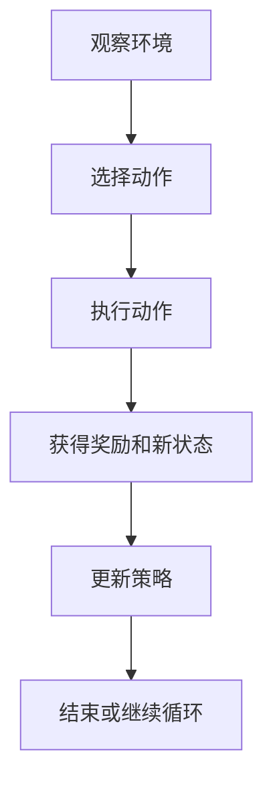
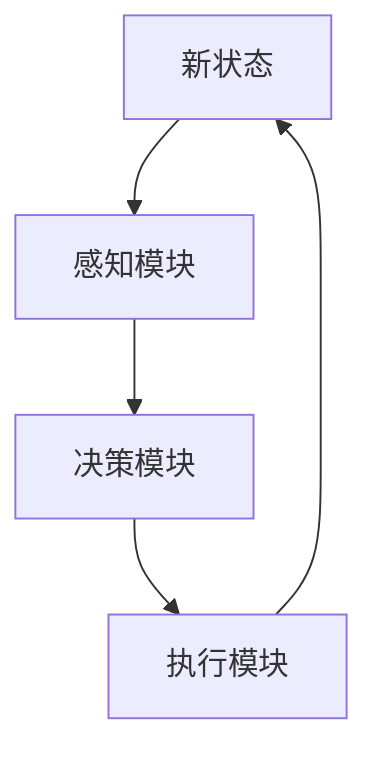

                 


# AI Agent的深度强化学习实现策略

> 关键词：AI Agent，深度强化学习，策略，强化学习，机器学习，智能体

> 摘要：本文深入探讨了AI Agent在深度强化学习中的实现策略，从理论基础到算法实现，从系统设计到项目实战，全面解析如何利用深度强化学习技术构建高效智能的AI Agent。文章结合实际案例，详细分析了AI Agent的核心概念、算法原理、系统架构设计以及实战中的关键问题，并给出了详细的解决方案和最佳实践。

---

## 第1章: AI Agent与深度强化学习背景介绍

### 1.1 AI Agent的基本概念

AI Agent（人工智能代理）是指能够感知环境、自主决策并执行任务的智能实体。它具备以下核心特征：

- **自主性**：无需外部干预，自主完成任务。
- **反应性**：能够实时感知环境并做出反应。
- **目标导向性**：基于目标驱动行为，优化决策过程。

AI Agent的应用场景广泛，包括但不限于自动驾驶、智能机器人、游戏AI、推荐系统等。

### 1.2 深度强化学习的背景与意义

强化学习（Reinforcement Learning, RL）是一种通过试错机制优化决策的机器学习范式。深度强化学习（Deep Reinforcement Learning）则结合了深度学习的表示能力，进一步提升AI Agent的决策水平。

深度强化学习的核心在于通过神经网络构建策略或价值函数，使AI Agent能够在复杂的环境中做出最优决策。与传统强化学习相比，深度强化学习具有更强的泛化能力和处理高维状态空间的能力。

### 1.3 AI Agent与深度强化学习的关系

AI Agent的决策过程可以看作是一个强化学习问题，其中环境状态、动作选择和奖励机制构成了强化学习的基本框架。深度强化学习通过神经网络的引入，显著提升了AI Agent的学习效率和决策能力。

### 1.4 本章小结

本章从AI Agent的基本概念出发，介绍了深度强化学习的背景及其在AI Agent中的重要性。通过对强化学习和深度学习的结合，我们为后续的算法实现和系统设计奠定了理论基础。

---

## 第2章: AI Agent与深度强化学习的核心概念

### 2.1 AI Agent的结构与功能

AI Agent的结构主要包括以下几个部分：

1. **感知模块**：负责接收环境输入，提取有用信息。
2. **决策模块**：基于感知信息，生成动作选择。
3. **执行模块**：将决策结果转化为实际操作。
4. **学习模块**：通过强化学习优化策略。

### 2.2 深度强化学习的基本原理

深度强化学习的核心在于通过神经网络逼近最优策略或价值函数。以下是两种主要的深度强化学习框架：

1. **基于价值函数的方法**：通过学习状态值函数或动作值函数，间接优化策略。
2. **基于策略的方法**：直接学习最优策略，通过梯度上升优化策略参数。

### 2.3 AI Agent的决策过程

AI Agent的决策过程是一个典型的强化学习循环：

1. **观察环境**：接收当前状态$s$。
2. **选择动作**：基于当前策略选择动作$a$。
3. **执行动作**：与环境交互，获得奖励$r$和新状态$s'$。
4. **更新策略**：根据奖励更新策略参数。

### 2.4 深度强化学习的优势

深度强化学习相较于传统强化学习的优势在于：

- **高维状态处理**：深度神经网络能够有效处理高维复杂状态。
- **泛化能力**：通过神经网络的特征提取能力，提升策略的泛化性。
- **端到端学习**：可以直接从原始输入中学习策略，无需手动特征提取。

### 2.5 本章小结

本章深入分析了AI Agent的结构和功能，介绍了深度强化学习的基本原理及其在AI Agent中的应用优势，为后续算法实现奠定了理论基础。

---

## 第3章: 深度强化学习算法原理

### 3.1 基础算法介绍

1. **Q-Learning**：一种基于值函数的强化学习算法，通过迭代更新Q表实现最优策略。
2. **Deep Q-Networks (DQN)**：将Q-Learning与深度神经网络结合，解决高维状态空间问题。

### 3.2 现代算法详解

1. **Proximal Policy Optimization (PPO)**：一种基于策略的强化学习算法，通过限制策略更新步长确保稳定性。
2. **Actor-Critic方法**：结合策略评估和价值评估，实现更高效的策略优化。

### 3.3 算法实现的数学模型

- **DQN的数学模型**：
  - **损失函数**：
  $$ \mathcal{L} = \mathbb{E}\left[(r + \gamma Q(s',a') - Q(s,a))^2\right] $$
  - **更新规则**：
  $$ Q(s,a) = Q(s,a) + \alpha (r + \gamma \max Q(s',a') - Q(s,a)) $$

- **PPO的数学模型**：
  - **目标函数**：
  $$ \mathcal{L} = -\mathbb{E}[\text{log}\,\pi_\theta(a|s) \cdot A(s,a)] $$
  - **约束条件**：
  $$ \mathbb{E}[\text{log}\,\pi_\theta(a|s) - \text{log}\,\pi_\theta(a'|s)] \leq \epsilon $$

### 3.4 算法流程图（mermaid）



### 3.5 算法实现代码示例

```python
import numpy as np
import tensorflow as tf

class DQN:
    def __init__(self, state_space, action_space):
        self.state_space = state_space
        self.action_space = action_space
        self.model = self.build_model()
    
    def build_model(self):
        model = tf.keras.Sequential([
            tf.keras.layers.Dense(64, activation='relu', input_shape=(self.state_space,)),
            tf.keras.layers.Dense(64, activation='relu'),
            tf.keras.layers.Dense(self.action_space, activation='linear')
        ])
        return model
    
    def update(self, states, actions, rewards, next_states, discount_factor):
        # 计算目标Q值
        target_Q = rewards + discount_factor * np.max(self.model.predict(next_states), axis=1)
        # 更新模型
        self.model.fit(states, target_Q, epochs=1, verbose=0)
```

### 3.6 本章小结

本章详细介绍了深度强化学习的核心算法，包括DQN和PPO的基本原理和实现细节，并通过代码示例展示了算法的具体实现过程。

---

## 第4章: AI Agent的系统架构设计

### 4.1 系统结构分析

AI Agent的系统架构主要包括以下模块：

1. **感知模块**：负责接收环境输入并进行特征提取。
2. **决策模块**：基于感知结果生成动作选择。
3. **执行模块**：将决策结果转化为实际操作。
4. **学习模块**：通过强化学习优化策略参数。

### 4.2 系统功能设计

- **状态表示**：将环境状态转化为神经网络的输入。
- **动作选择**：基于当前策略选择最优动作。
- **奖励机制**：设计合理的奖励函数，指导AI Agent的学习方向。

### 4.3 系统架构图（mermaid）



### 4.4 本章小结

本章从系统架构的角度，分析了AI Agent的各个功能模块及其相互关系，为后续的实现提供了系统设计的指导。

---

## 第5章: 项目实战——基于深度强化学习的AI Agent实现

### 5.1 项目背景

以实现一个简单的游戏AI为例，介绍如何利用深度强化学习技术构建AI Agent。

### 5.2 环境配置

- **安装依赖**：
  ```bash
  pip install gym tensorflow numpy
  ```

### 5.3 核心代码实现

```python
import gym
import tensorflow as tf
import numpy as np

class AI_Agent:
    def __init__(self, env):
        self.env = env
        self.model = self.build_model()
    
    def build_model(self):
        model = tf.keras.Sequential([
            tf.keras.layers.Dense(64, activation='relu', input_shape=(self.env.observation_space.shape[0],)),
            tf.keras.layers.Dense(64, activation='relu'),
            tf.keras.layers.Dense(self.env.action_space.n, activation='linear')
        ])
        return model
    
    def get_action(self, state):
        state = np.expand_dims(state, axis=0)
        q_values = self.model.predict(state)[0]
        return np.argmax(q_values)
    
    def update(self, state, action, reward, next_state, discount_factor):
        target_Q = reward + discount_factor * np.max(self.model.predict(next_state))
        target_Q = np.expand_dims(target_Q, axis=0)
        self.model.fit(state, target_Q, epochs=1, verbose=0)

# 初始化环境和AI Agent
env = gym.make('CartPole-v0')
agent = AI_Agent(env)

# 训练过程
for episode in range(1000):
    state = env.reset()
    total_reward = 0
    while True:
        action = agent.get_action(state)
        next_state, reward, done, _ = env.step(action)
        agent.update(state, action, reward, next_state, 0.99)
        total_reward += reward
        state = next_state
        if done:
            break
    print(f"Episode {episode}: Total Reward = {total_reward}")
```

### 5.4 实际案例分析

通过上述代码，我们可以训练一个能够在CartPole环境中保持平衡的AI Agent。训练过程中，AI Agent通过不断试错，逐步优化策略，最终实现稳定控制。

### 5.5 本章小结

本章通过实际项目案例，详细展示了如何利用深度强化学习技术实现AI Agent，并通过代码示例和实际训练过程，帮助读者掌握AI Agent的实现方法。

---

## 第6章: 深度强化学习实现AI Agent的总结与展望

### 6.1 本章总结

本文系统介绍了AI Agent的深度强化学习实现策略，从理论基础到算法实现，从系统设计到项目实战，全面解析了深度强化学习在AI Agent中的应用。

### 6.2 未来展望

随着深度学习和强化学习技术的不断进步，AI Agent将在更多领域展现出强大的应用潜力。未来的研究方向包括多智能体协作、复杂环境下的决策优化以及更高效的算法设计。

### 6.3 注意事项

在实际应用中，需要注意以下几点：

- **奖励函数的设计**：合理的奖励函数是AI Agent学习成功的关键。
- **算法的收敛性**：确保算法在合理的时间内收敛。
- **环境的复杂性**：复杂环境需要更高效的算法和更强的计算能力。

### 6.4 最佳实践

- **从小规模项目开始**：逐步积累经验。
- **注重理论与实践结合**：理解算法原理后再进行实现。
- **持续优化**：根据实际效果不断调整参数和策略。

### 6.5 本章小结

本章总结了全文的主要内容，并展望了深度强化学习在AI Agent领域的未来发展方向，同时给出了实际应用中的注意事项和最佳实践建议。

---

## 附录: 深度强化学习相关工具与资源

### 附录A: 参考文献

1. Mnih, V., et al. "Human-level control through deep reinforcement learning." *Nature*, 2015.
2. Schulman, J., et al. "Proximal Policy Optimization: A Simple and Effective Framework for Deep Reinforcement Learning." *arXiv preprint arXiv:1702.08896*, 2017.

### 附录B: 深度强化学习工具

1. **OpenAI Gym**：强化学习算法实现和测试的工具库。
2. **TensorFlow**：深度学习框架，支持强化学习算法的实现。
3. **PyTorch**：另一个流行的深度学习框架，适合强化学习研究。

---

## 作者：AI天才研究院/AI Genius Institute & 禅与计算机程序设计艺术 /Zen And The Art of Computer Programming

---

以上是《AI Agent的深度强化学习实现策略》的技术博客文章的完整目录和内容概要。如需进一步扩展或调整，请随时告知！

