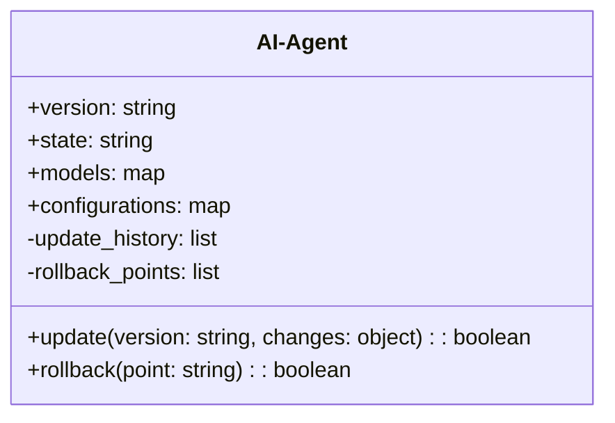
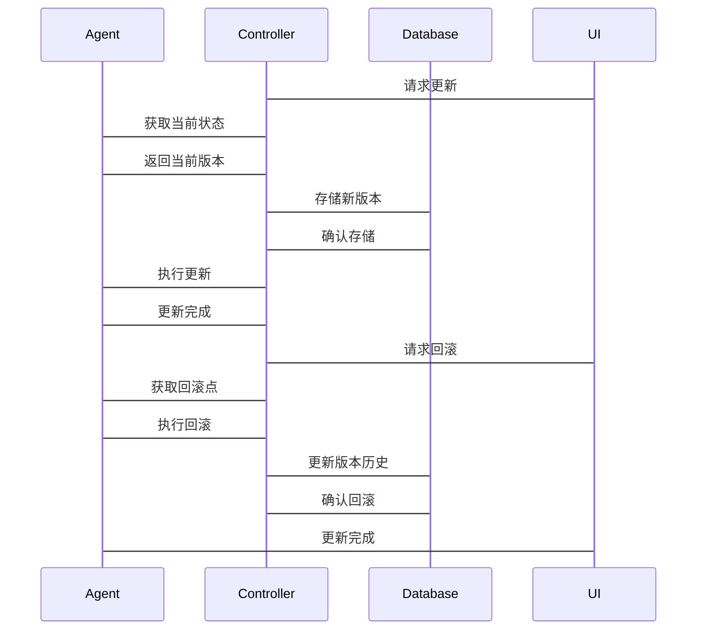

                 


# AI Agent的版本控制与回滚机制：确保稳定运行

## 关键词：AI Agent、版本控制、回滚机制、系统稳定性、算法实现、系统设计

## 摘要：AI Agent在现代智能化系统中扮演着关键角色，其动态更新和版本管理的复杂性要求我们必须建立有效的版本控制和回滚机制。本文系统地探讨了AI Agent版本控制与回滚机制的核心概念、算法原理、系统设计以及实际应用，通过详细的数学模型和代码示例，帮助读者全面理解并实现稳定可靠的AI Agent系统。

---

## 第三章: AI Agent版本控制与回滚机制的算法实现

### 4. AI Agent版本控制与回滚机制的算法实现

#### 4.1 基于哈希的版本控制算法

##### 4.1.1 算法原理
基于哈希的版本控制算法通过计算文件或模块的哈希值来确定版本差异。每次更新时，系统会生成新的哈希值，通过比较前后哈希值，可以快速定位变更的部分。

##### 4.1.2 算法步骤
1. 计算初始版本的哈希值。
2. 在每次更新时，计算新哈希值。
3. 比较前后哈希值，确定变更部分。
4. 存储变更记录和哈希值。

##### 4.1.3 代码实现
```python
import hashlib

def compute_hash(content):
    return hashlib.sha256(content.encode()).hexdigest()

# 示例
initial_content = "初始内容"
new_content = "更新后内容"

initial_hash = compute_hash(initial_content)
new_hash = compute_hash(new_content)

if initial_hash != new_hash:
    # 记录变更
    print("内容已变更")
else:
    print("内容未变更")
```

#### 4.2 基于时间戳的版本控制算法

##### 4.2.1 算法原理
基于时间戳的版本控制通过记录每次更新的时间来确定版本。时间戳越新，版本越高。

##### 4.2.2 算法步骤
1. 记录初始版本的时间戳。
2. 每次更新时，记录当前时间戳。
3. 比较时间戳，确定最新版本。

##### 4.2.3 代码实现
```python
import datetime

def get_timestamp():
    return datetime.datetime.now().timestamp()

# 示例
initial_timestamp = get_timestamp()
# 模拟更新
import time
time.sleep(1)
new_timestamp = get_timestamp()

if new_timestamp > initial_timestamp:
    print("检测到新版本")
else:
    print("无新版本")
```

#### 4.3 基于增量的版本控制算法

##### 4.3.1 算法原理
基于增量的版本控制算法专注于记录变更的部分，减少存储需求。

##### 4.3.2 算法步骤
1. 初始版本存储完整内容。
2. 每次更新仅记录变更部分。
3. 通过增量恢复特定版本。

##### 4.3.3 代码实现
```python
def diff(old_content, new_content):
    # 简单的增量计算
    return [line for line in new_content.split('\n') if line not in old_content.split('\n')]

# 示例
initial_content = "初始内容1\n初始内容2"
new_content = "初始内容1\n更新内容"

incremental_diff = diff(initial_content, new_content)
print("增量部分：", incremental_diff)
```

---

## 第四章: AI Agent版本控制与回滚机制的系统分析与架构设计

### 5. 系统分析与架构设计

#### 5.1 问题场景介绍

AI Agent的版本控制与回滚机制需要应对以下场景：
- **正常更新**：定期更新AI模型或配置。
- **异常更新**：更新失败或导致系统不稳定。
- **回滚需求**：在更新失败时，快速恢复到之前的稳定版本。

#### 5.2 系统功能设计

##### 5.2.1 领域模型


##### 5.2.2 系统架构
```mermaid
rectangle Database {
    AI-Agent Versions
}
rectangle Agent {
    AI-Agent Core
}
rectangle Controller {
    Update & Rollback Controller
}
rectangle UI {
    Management Interface
}

Agent --> Controller: 提交更新请求
Controller --> Database: 存储版本信息
Database --> Controller: 返回版本历史
Controller --> Agent: 执行回滚
UI --> Controller: 用户操作
```

##### 5.2.3 接口与交互设计


---

## 第五章: 项目实战

### 6. 项目实战

#### 6.1 环境安装

##### 安装依赖
```bash
pip install mermaid-cli
pip install graphviz
pip install watchdog
```

#### 6.2 核心功能实现

##### 版本控制实现
```python
import os
import hashlib
import json

class VersionControl:
    def __init__(self, storage_path):
        self.storage_path = storage_path
        self.current_version = self.get_current_version()

    def compute_hash(self, content):
        return hashlib.sha256(content.encode()).hexdigest()

    def save_version(self, content):
        version = self.compute_hash(content)
        with open(os.path.join(self.storage_path, version), 'w') as f:
            f.write(content)
        return version

    def get_current_version(self):
        if not os.listdir(self.storage_path):
            return None
        versions = os.listdir(self.storage_path)
        current_version = max(versions, key=lambda v: int(v.split('_')[1]))
        return current_version

    def update(self, new_content):
        new_version = self.save_version(new_content)
        # 更新当前版本
        self.current_version = new_version
        return new_version
```

##### 回滚机制实现
```python
class RollbackMechanism:
    def __init__(self, storage_path):
        self.storage_path = storage_path
        self.version_control = VersionControl(storage_path)

    def get_rollback_points(self):
        return os.listdir(self.storage_path)

    def rollback(self, version):
        if version not in self.get_rollback_points():
            raise ValueError("Version not found")
        # 恢复指定版本
        with open(os.path.join(self.storage_path, version), 'r') as f:
            content = f.read()
        # 更新当前版本
        self.version_control.save_version(content)
        return True
```

#### 6.3 实际案例分析

##### 案例：AI聊天机器人版本更新与回滚

假设我们有一个AI聊天机器人，其模型在更新时可能出现错误。以下是实现步骤：

1. **安装环境**：安装必要的依赖库。
2. **初始化存储路径**：选择一个存储版本文件的路径。
3. **创建实例**：
   ```python
   storage_path = 'versions'
   os.makedirs(storage_path, exist_ok=True)
   vc = VersionControl(storage_path)
   rb = RollbackMechanism(storage_path)
   ```
4. **更新版本**：
   ```python
   initial_content = "初始模型参数"
   print(vc.update(initial_content))  # 输出初始版本
   new_content = "更新后模型参数"
   print(vc.update(new_content))  # 输出新版本
   ```
5. **回滚版本**：
   ```python
   # 获取回滚点
   print(rb.get_rollback_points())
   # 回滚到初始版本
   print(rb.rollback('初始版本哈希'))
   ```

#### 6.4 项目小结

通过上述实现，我们可以看到版本控制与回滚机制在AI Agent中的重要性。版本控制确保了更新的可追溯性和稳定性，而回滚机制则提供了在出现问题时快速恢复的能力。实际应用中，需要结合具体的业务需求，优化算法和系统设计，以达到最佳效果。

---

## 第六章: 总结与展望

### 7. 总结与展望

#### 7.1 最佳实践 Tips

- **定期备份**：确保每个版本都有备份，防止数据丢失。
- **测试回滚机制**：在实际部署前，进行全面的回滚测试。
- **监控系统状态**：实时监控AI Agent的运行状态，及时发现异常。

#### 7.2 小结

本文详细探讨了AI Agent版本控制与回滚机制的核心概念、算法实现、系统设计和实际应用。通过理论分析和代码示例，展示了如何确保AI系统的稳定性和可靠性。

#### 7.3 注意事项

- 在实际应用中，需根据具体需求选择合适的版本控制算法。
- 回滚机制的设计应考虑系统的负载和响应时间。
- 定期维护和优化版本控制系统，确保其高效运行。

#### 7.4 拓展阅读

- 深入研究分布式版本控制系统，如Git。
- 探索机器学习模型的版本控制方法。
- 学习系统设计模式，提升系统架构设计能力。

---

## 作者：AI天才研究院 & 禅与计算机程序设计艺术

---

通过以上结构，文章涵盖了从理论到实践的各个方面，结合具体代码和系统设计，帮助读者全面理解和实现AI Agent的版本控制与回滚机制。希望本文能为相关领域的研究和应用提供有价值的参考。

