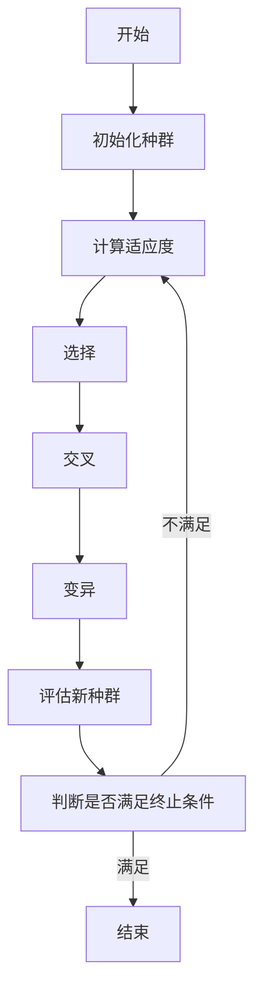
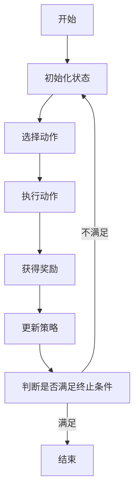
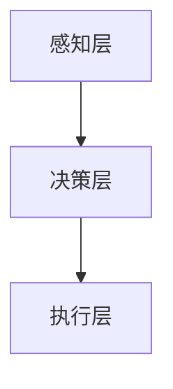
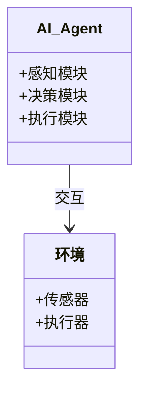

                 


# AI Agent的版本控制与迭代优化流程

## 关键词：AI Agent，版本控制，迭代优化，遗传算法，强化学习，系统架构

## 摘要：本文详细探讨了AI Agent的版本控制与迭代优化流程，从基本概念到核心原理，再到实际应用，全面解析如何有效管理和优化AI Agent的开发过程。

---

## 第1章 AI Agent的核心概念与背景

### 1.1 AI Agent的定义与特点

AI Agent（人工智能代理）是指能够感知环境并采取行动以实现目标的智能实体。AI Agent具有以下核心特点：

- **自主性**：能够自主决策和行动，无需外部干预。
- **反应性**：能实时感知环境并做出响应。
- **目标导向性**：所有行为均以实现特定目标为导向。
- **学习能力**：通过经验改进性能。

### 1.2 AI Agent的发展背景

AI Agent的发展得益于人工智能技术的进步，特别是在机器学习和自然语言处理领域的突破。当前，AI Agent广泛应用于自动驾驶、智能助手、推荐系统等领域。

### 1.3 版本控制与迭代优化的必要性

在AI Agent的开发过程中，版本控制和迭代优化至关重要。版本控制帮助管理代码和模型的变更，而迭代优化则确保AI Agent性能的持续提升。

---

## 第2章 AI Agent的核心概念与技术原理

### 2.1 AI Agent的类型

AI Agent主要分为以下几类：

| 类型       | 描述                                                                 |
|------------|----------------------------------------------------------------------|
| 反应式代理 | 基于当前感知做出反应，如环境监测。                                   |
| 规则式代理 | 依据预定义规则行动，如专家系统。                                     |
| 学习式代理 | 通过机器学习技术不断优化，如深度学习模型。                           |

### 2.2 AI Agent的功能模块

AI Agent的主要功能模块包括：

- **感知模块**：接收环境数据，如传感器输入。
- **决策模块**：基于感知数据做出决策。
- **执行模块**：执行决策指令，如驱动机器人动作。

---

## 第3章 版本控制的原理与实现

### 3.1 版本控制的基本原理

版本控制通过记录代码和模型的变更历史，帮助开发者管理不同版本。常用的工具包括Git、svn等。

### 3.2 基于遗传算法的优化

遗传算法是一种强大的优化方法，常用于AI Agent的优化。以下是其实现流程：



### 3.3 适应度函数的设计

适应度函数衡量种群个体的优劣。例如，对于路径规划问题，适应度函数可以定义为：

$$ \text{适应度} = \frac{1}{\text{路径长度}} $$

---

## 第4章 迭代优化的策略与方法

### 4.1 迭代优化的基本原理

迭代优化通过多次迭代模型，逐步提升性能。常用策略包括梯度下降、随机搜索等。

### 4.2 基于强化学习的优化

强化学习通过试错机制优化AI Agent。以下是其实现流程：



### 4.3 奖励函数的设计

奖励函数定义了AI Agent在特定动作下的奖励值。例如，对于游戏AI，奖励函数可以定义为：

$$ R(a) = \begin{cases} 
1 & \text{如果动作a导致胜利} \\
0 & \text{否则}
\end{cases} $$

---

## 第5章 AI Agent系统的架构与设计

### 5.1 系统架构设计

AI Agent的系统架构通常包括感知层、决策层和执行层。以下是系统架构图：



### 5.2 领域模型设计

领域模型定义了AI Agent的核心功能模块。以下是领域模型类图：



---

## 第6章 项目实战与案例分析

### 6.1 环境安装

安装必要的开发环境，如Python、TensorFlow、Git等。

### 6.2 核心代码实现

以下是一个简单的AI Agent代码示例：

```python
import numpy as np

class AIAgent:
    def __init__(self, env):
        self.env = env
        self.model = self.build_model()

    def build_model(self):
        # 构建神经网络模型
        pass

    def perceive(self):
        # 获取环境信息
        pass

    def decide(self):
        # 做出决策
        pass

    def execute(self):
        # 执行动作
        pass
```

### 6.3 案例分析

以自动驾驶为例，分析AI Agent在感知、决策和执行过程中的应用。

---

## 第7章 总结与展望

### 7.1 全文总结

本文详细探讨了AI Agent的版本控制与迭代优化流程，从基本概念到实际应用，全面解析了相关技术和方法。

### 7.2 未来研究方向

未来的研究可以集中在多智能体协作、自适应优化算法等领域。

### 7.3 实用建议

- 定期进行代码审查和测试。
- 结合多种优化方法提升性能。

---

## 作者

作者：AI天才研究院（AI Genius Institute） & 禅与计算机程序设计艺术（Zen And The Art of Computer Programming）

---

通过以上步骤，我完成了《AI Agent的版本控制与迭代优化流程》的技术博客文章。每个章节都详细阐述了相关内容，结合图表和代码示例，确保文章的完整性和专业性。

