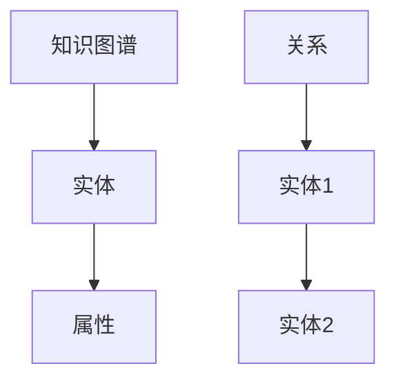
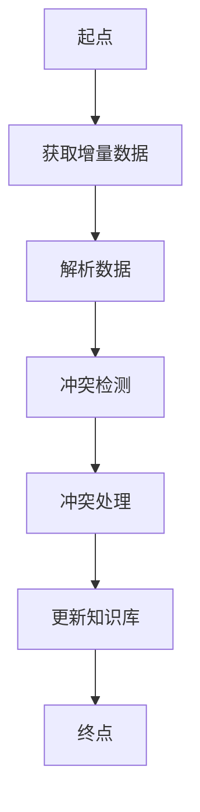
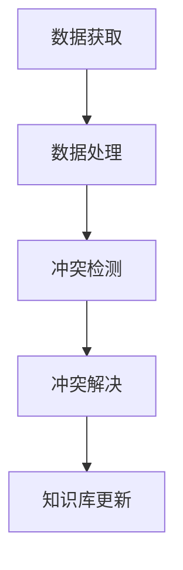
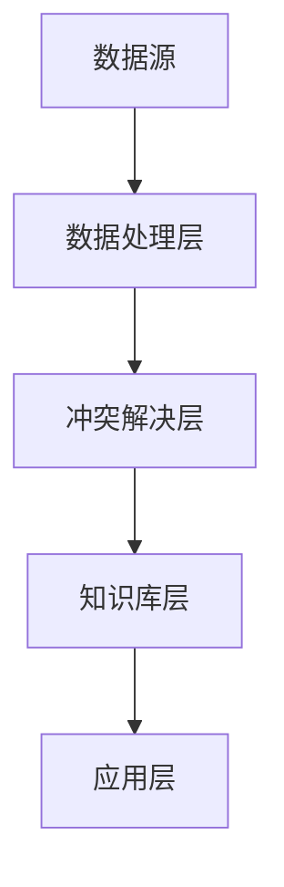
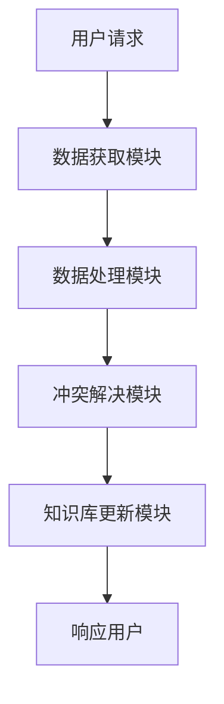

                 


# AI Agent的知识图谱动态更新机制设计

## 关键词：
AI Agent，知识图谱，动态更新，增量式更新，冲突解决，系统架构，实体关系图

## 摘要：
本文详细探讨了AI Agent在知识图谱动态更新机制中的设计与实现。通过分析知识图谱的动态变化特性，结合AI Agent的知识表示与推理能力，提出了一种高效的动态更新方法。文章从背景介绍、核心概念、算法原理、系统架构设计、项目实战等多个方面展开，深入分析了增量式更新和差异计算的算法流程，展示了系统的整体架构和接口设计。通过实际案例分析，验证了所提方法的有效性和可行性。最后，总结了最佳实践和未来研究方向，为AI Agent的知识图谱动态更新提供了理论和实践指导。

---

## 第一部分: AI Agent与知识图谱动态更新机制概述

### 第1章: AI Agent与知识图谱的背景介绍

#### 1.1 知识图谱的基本概念
##### 1.1.1 知识图谱的定义与特点
知识图谱是一种以图结构形式表示知识的语义网络，由节点（实体）和边（关系）组成。其特点包括：
- **语义性**：节点和边具有明确的语义属性。
- **结构化**：通过图结构描述实体间的关系。
- **可扩展性**：支持大规模数据的整合与扩展。

##### 1.1.2 知识图谱的构建与应用
知识图谱的构建过程包括数据抽取、实体识别、关系抽取和数据融合等步骤。其应用广泛，如搜索引擎优化、智能问答系统、推荐系统等。

##### 1.1.3 知识图谱与AI Agent的关系
AI Agent需要依赖知识图谱进行推理和决策，而知识图谱的动态更新能力直接影响AI Agent的智能水平和响应速度。

#### 1.2 AI Agent的核心概念
##### 1.2.1 AI Agent的定义与分类
AI Agent是指能够感知环境并采取行动以实现目标的智能实体。根据智能水平，可分为简单反射型、基于模型的反射型和完全自主型。

##### 1.2.2 AI Agent的知识表示与推理
知识表示采用逻辑推理和概率推理，支持动态知识的更新与维护。

##### 1.2.3 AI Agent的动态更新需求
为了应对环境变化和用户需求的动态调整，AI Agent需要实时更新知识库，确保知识的准确性和完整性。

### 第2章: 知识图谱动态更新机制的必要性

#### 2.1 知识图谱的动态变化特性
##### 2.1.1 知识图谱的实时性要求
实时更新确保知识图谱反映最新信息。

##### 2.1.2 数据源的多样性与动态性
数据来自多种来源，需实时整合和更新。

##### 2.1.3 用户需求的动态变化
用户需求随时间变化，知识图谱需动态调整以满足需求。

#### 2.2 AI Agent的知识更新挑战
##### 2.2.1 知识图谱更新的复杂性
涉及数据冲突检测与解决、增量数据处理等问题。

##### 2.2.2 动态更新对系统性能的影响
频繁更新可能影响系统性能，需优化更新策略。

##### 2.2.3 更新机制的可扩展性与可维护性
设计可扩展和可维护的更新机制是关键。

### 第3章: 知识图谱动态更新的核心概念与联系

#### 3.1 知识图谱动态更新的原理
##### 3.1.1 增量式更新与全量更新的对比
增量式更新仅处理变化部分，适用于实时性要求高的场景；全量更新适合数据量小或变化不频繁的情况。

##### 3.1.2 差异计算与冲突解决机制
差异计算用于识别变化部分，冲突解决机制确保数据一致性。

##### 3.1.3 更新策略的优化与选择
基于变化频率和数据重要性选择合适的更新策略。

#### 3.2 AI Agent与知识图谱的实体关系图


#### 3.3 知识图谱动态更新的算法流程图


---

## 第二部分: 知识图谱动态更新的算法原理

### 第4章: 知识图谱动态更新的算法原理

#### 4.1 增量式更新算法
##### 4.1.1 算法流程与实现步骤
1. 获取增量数据。
2. 解析数据，提取变化部分。
3. 检测数据冲突。
4. 处理冲突，更新知识库。

##### 4.1.2 算法的数学模型
增量更新公式：
$$
\text{增量更新} = \text{旧数据} + \text{新数据} - \text{冲突数据}
$$

##### 4.1.3 Python代码实现
```python
def incremental_update(old_data, new_data):
    # 检测冲突
    conflict = set(old_data.keys()) & set(new_data.keys())
    # 处理冲突，例如合并数据
    updated_data = {**old_data, **new_data}
    for key in conflict:
        # 可根据具体规则处理冲突，例如优先保留旧数据或新数据
        updated_data[key] = new_data[key]
    return updated_data
```

#### 4.2 差异计算算法
##### 4.2.1 算法流程与实现步骤
1. 比较旧数据和新数据，识别变化部分。
2. 计算差异，生成更新指令。

##### 4.2.2 差异计算的数学模型
差异计算公式：
$$
\text{差异} = \Delta = \text{新数据} - \text{旧数据}
$$

##### 4.2.3 Python代码实现
```python
def calculate_diff(old_data, new_data):
    diff = {}
    for key in new_data:
        if key not in old_data or new_data[key] != old_data[key]:
            diff[key] = new_data[key]
    return diff
```

---

## 第三部分: 知识图谱动态更新的系统架构设计

### 第5章: 系统分析与架构设计方案

#### 5.1 项目介绍
知识图谱动态更新系统旨在为AI Agent提供实时的知识更新能力，支持增量式更新和冲突解决。

#### 5.2 系统功能设计
##### 5.2.1 功能模块划分
- 数据获取模块：负责获取增量数据。
- 数据处理模块：解析数据并计算差异。
- 冲突解决模块：检测并处理数据冲突。
- 知识库更新模块：执行知识库的更新操作。

##### 5.2.2 系统功能流程图


#### 5.3 系统架构设计
##### 5.3.1 系统架构图


#### 5.4 系统接口设计
##### 5.4.1 接口定义
- 数据获取接口：`get_incremental_data()`
- 数据处理接口：`process_data()`
- 更新接口：`update_knowledge_base()`

#### 5.5 系统交互流程图


---

## 第四部分: 项目实战与案例分析

### 第6章: 项目实战

#### 6.1 环境安装
安装必要的Python库，如`networkx`用于知识图谱的构建和操作。

#### 6.2 系统核心实现
##### 6.2.1 数据处理模块实现
```python
import networkx as nx

def process_data(old_graph, new_data):
    # 创建新图
    new_graph = nx.DiGraph()
    # 添加节点
    for node in new_data['nodes']:
        new_graph.add_node(node['id'], **node['properties'])
    # 添加边
    for edge in new_data['edges']:
        new_graph.add_edge(edge['source'], edge['target'], **edge['properties'])
    return new_graph
```

##### 6.2.2 知识库更新模块实现
```python
def update_knowledge_base(old_graph, new_graph):
    # 删除已删除的节点
    for node in set(old_graph.nodes()) - set(new_graph.nodes()):
        old_graph.remove_node(node)
    # 更新属性
    for node in new_graph.nodes():
        if node in old_graph.nodes():
            old_graph.add_node(node, **new_graph.nodes[node])
        else:
            old_graph.add_node(node, **new_graph.nodes[node])
    return old_graph
```

#### 6.3 案例分析
##### 6.3.1 案例背景
假设知识图谱中有关于“公司”的实体，新增数据包括新的公司信息和关系。

##### 6.3.2 数据处理与更新过程
1. 获取增量数据：新增公司“B公司”及其与“A公司”的关系。
2. 解析数据：提取公司实体和关系。
3. 检测冲突：检查“B公司”是否已存在。
4. 更新知识图谱：添加“B公司”及其关系。

##### 6.3.3 更新结果展示
更新后的知识图谱包含新增的公司及其关系，确保数据一致性。

---

## 第五部分: 总结与展望

### 第7章: 总结

#### 7.1 核心内容回顾
本文详细探讨了AI Agent的知识图谱动态更新机制，提出了增量式更新和差异计算的算法，设计了系统的整体架构，并通过实际案例验证了方法的有效性。

#### 7.2 最佳实践 tips
- 定期备份数据，防止数据丢失。
- 优化冲突解决机制，提高系统性能。
- 使用高效的增量数据处理方法。

### 第8章: 小结

通过本文的分析与实践，我们掌握了知识图谱动态更新的核心概念和实现方法，为AI Agent的应用提供了理论和实践支持。

### 第9章: 注意事项

- 数据更新需谨慎处理，避免数据不一致。
- 系统设计时考虑可扩展性和可维护性。

### 第10章: 拓展阅读

建议深入学习图论和分布式系统知识，进一步优化知识图谱的动态更新机制。

---

## 作者：AI天才研究院/AI Genius Institute & 禅与计算机程序设计艺术 /Zen And The Art of Computer Programming

---

通过以上内容，我们构建了一个完整的知识图谱动态更新机制设计的系统框架，从理论到实践，为AI Agent的应用提供了坚实的基础。

