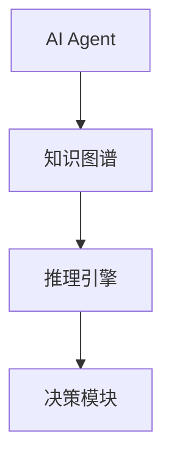

                 


# AI Agent的知识图谱应用

## 关键词：AI Agent，知识图谱，知识抽取，知识建模，图数据库，推理算法

## 摘要：本文探讨AI Agent在知识图谱中的应用，详细讲解了知识图谱的构建方法、AI Agent的系统设计、基于知识图谱的推理算法，并通过实际案例展示了AI Agent在知识图谱上的应用。文章从理论到实践，结合代码和案例，全面分析了AI Agent的知识图谱应用。

---

## 第1章 AI Agent概述

### 1.1 AI Agent的基本概念

#### 1.1.1 什么是AI Agent
AI Agent（人工智能代理）是指能够感知环境并采取行动以实现目标的智能实体。它可以在各种场景中执行任务，例如自动推荐、智能问答、自动驾驶等。

#### 1.1.2 AI Agent的核心特征
- **自主性**：能够自主决策。
- **反应性**：能够实时感知环境并做出反应。
- **目标导向性**：有明确的目标，并采取行动以实现目标。
- **学习能力**：能够通过经验改进性能。

#### 1.1.3 AI Agent的分类与应用场景
- **简单反射型Agent**：基于当前感知做出反应，适用于简单的决策任务。
- **基于模型的反射型Agent**：利用内部模型进行推理和规划，适用于复杂任务。
- **目标驱动型Agent**：以目标为导向，主动采取行动。
- **实用驱动型Agent**：通过优化目标函数来实现目标，常用于机器学习场景。

应用场景包括智能助手、推荐系统、自动驾驶、智能客服等。

### 1.2 知识图谱的基本概念

#### 1.2.1 知识图谱的定义
知识图谱是一种结构化的数据表示方式，由节点（实体）和边（关系）组成，用于描述现实世界中的实体及其关系。

#### 1.2.2 知识图谱的表示方法
知识图谱通常使用RDF（资源描述框架）或图数据库（如Neo4j）来存储。节点表示实体，边表示实体之间的关系。

#### 1.2.3 AI Agent与知识图谱的关系
AI Agent通过知识图谱进行推理和决策，知识图谱为AI Agent提供了知识基础和推理依据。

### 1.3 AI Agent与知识图谱的结合
AI Agent利用知识图谱进行推理和决策，知识图谱为AI Agent提供了丰富的知识支持。

---

## 第2章 知识图谱的构建方法

### 2.1 数据采集与预处理

#### 2.1.1 数据来源与采集方式
数据来源包括结构化数据（数据库）、非结构化数据（文本、图像）和外部API。

#### 2.1.2 数据清洗与标准化
数据清洗包括去除重复数据、处理缺失值、消除噪声。标准化包括数据格式统一、编码转换。

#### 2.1.3 数据格式转换
将数据转换为适合知识图谱存储的格式，如RDF或图数据库格式。

### 2.2 知识抽取与建模

#### 2.2.1 实体识别与关系抽取
使用自然语言处理技术从文本中提取实体及其关系。例如，从“猫喜欢鱼”中提取实体“猫”和“鱼”，关系“喜欢”。

#### 2.2.2 知识图谱的构建模型
构建知识图谱的模型包括基于规则的模型和基于机器学习的模型。基于规则的模型通过预定义规则提取知识，基于机器学习的模型通过训练模型自动学习知识。

#### 2.2.3 知识图谱的存储与管理
使用图数据库（如Neo4j）存储知识图谱。图数据库适合存储复杂的实体关系。

### 2.3 知识图谱的质量评估

#### 2.3.1 知识图谱的完整性评估
评估知识图谱覆盖的实体和关系是否全面。

#### 2.3.2 知识图谱的准确性评估
评估知识图谱中的实体和关系是否准确。

#### 2.3.3 知识图谱的可扩展性评估
评估知识图谱是否能够方便地扩展新的实体和关系。

---

## 第3章 AI Agent的知识图谱应用系统设计

### 3.1 系统架构设计

#### 3.1.1 系统整体架构图（Mermaid流程图）


#### 3.1.2 系统功能模块划分
- 知识图谱存储模块：负责存储和管理知识图谱。
- 推理引擎模块：负责基于知识图谱进行推理。
- 决策模块：负责根据推理结果做出决策。

#### 3.1.3 系统交互流程设计
用户与AI Agent交互，AI Agent通过知识图谱和推理引擎进行推理，最终做出决策并返回结果。

### 3.2 知识图谱的存储与管理

#### 3.2.1 数据库选择与设计
选择图数据库（如Neo4j）存储知识图谱，设计合适的节点和关系。

#### 3.2.2 图数据库的使用（如Neo4j）
在Neo4j中创建节点和关系，例如：
```cypher
CREATE (:Entity {name: '猫'}) 
CREATE (:Entity {name: '鱼'}) 
CREATE (猫)-[:喜欢]->(鱼)
```

#### 3.2.3 知识图谱的查询与检索
使用Cypher语言查询知识图谱，例如：
```cypher
MATCH (a:Entity {name: '猫'})-[r]->(b:Entity)
RETURN a, r, b
```

### 3.3 AI Agent的知识推理与决策

#### 3.3.1 基于知识图谱的推理算法
推理算法包括基于规则的推理和基于机器学习的推理。例如，使用规则引擎进行简单的逻辑推理。

#### 3.3.2 知识图谱的动态更新与维护
根据新数据动态更新知识图谱，保持知识的准确性。

#### 3.3.3 AI Agent的决策逻辑实现
根据推理结果，AI Agent做出决策。例如，基于知识图谱推理出的结论，决定下一步行动。

### 3.4 本章小结

---

## 第4章 AI Agent的知识图谱应用系统实现

### 4.1 环境安装

#### 4.1.1 安装Python环境
使用Anaconda安装Python 3.8及以上版本。

#### 4.1.2 安装Neo4j数据库
下载并安装Neo4j社区版。

#### 4.1.3 安装必要的Python库
安装Neo4j驱动程序`neo4j-driver`和Python的自然语言处理库`spaCy`。

### 4.2 系统核心实现源代码

#### 4.2.1 数据准备与知识抽取
使用spaCy进行实体识别和关系抽取。
```python
import spacy

nlp = spacy.load("en_core_web_sm")
text = "猫喜欢鱼"
doc = nlp(text)
entities = [(ent.text, ent.label_) for ent in doc.ents]
print(entities)
```

#### 4.2.2 知识图谱的构建
将提取的实体和关系存储到Neo4j数据库中。
```python
from neo4j import GraphDatabase

driver = GraphDatabase.driver("bolt://localhost:7687", auth=("neo4j", "password"))
def create_entity(tx, entity):
    tx.run("CREATE (:Entity {name: $name})", name=entity)
def create_relation(tx, source, relation, target):
    tx.run("MATCH (a {name: $source}), (b {name: $target}) "
           "CREATE (a)-[r:$relation]->(b)", source=source, relation=relation, target=target)

with driver.session() as session:
    session.write_transaction(create_entity, "猫")
    session.write_transaction(create_entity, "鱼")
    session.write_transaction(create_relation, "猫", "喜欢", "鱼")
```

#### 4.2.3 推理与决策算法实现
实现简单的推理算法，例如基于规则的推理。
```python
def infer_from_graph(source, relation):
    # 这里简化为直接查找关系
    return f"{source} {relation} 的目标节点"

result = infer_from_graph("猫", "喜欢")
print(result)
```

### 4.3 项目小结

---

## 第5章 总结与展望

### 5.1 总结
本文详细介绍了AI Agent的知识图谱应用，包括知识图谱的构建方法、AI Agent的系统设计以及实际案例的实现。

### 5.2 展望
未来，随着知识图谱和AI Agent技术的不断发展，它们的应用场景将更加广泛，性能也将更加智能化。

---

## 附录

### A. 知识图谱工具
- Neo4j：https://neo4j.com/
- Apache Jena：https://jena.apache.org/

### B. 相关论文与文献
- "Knowledge Graph Construction" by Smith et al.
- "AI Agent and Knowledge Representation" by Lee et al.

---

## 作者
作者：AI天才研究院 & 禅与计算机程序设计艺术

---

**全文完**

