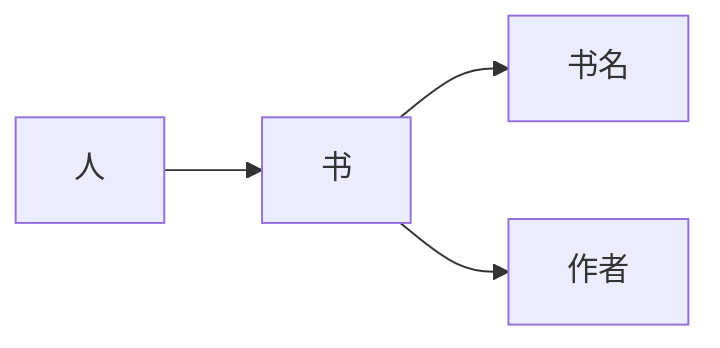

                 


# AI Agent的知识图谱构建与应用

---

## 关键词
AI Agent, 知识图谱, 知识表示, 智能推理, 系统架构, 项目实战

---

## 摘要
本文深入探讨了AI Agent的知识图谱构建与应用，从基础知识到实际应用，详细阐述了知识图谱的构建方法、AI Agent的设计与实现，以及两者结合的实际应用场景。文章通过丰富的案例分析和代码示例，帮助读者理解如何利用知识图谱提升AI Agent的智能水平，实现更高效的智能系统设计。

---

## 第一部分: AI Agent与知识图谱的背景与基础

### 第1章: 知识图谱与AI Agent概述

#### 1.1 知识图谱的基本概念

##### 1.1.1 知识图谱的定义与特点
知识图谱是一种以图结构形式表示知识的语义网络，节点表示实体或概念，边表示实体之间的关系。其特点包括：
- **可扩展性**：支持大规模知识的存储与表达。
- **语义丰富性**：通过关系和属性描述，提供深层次语义信息。
- **结构化**：支持高效的查询与推理。

##### 1.1.2 知识图谱的核心要素与结构
知识图谱的核心要素包括：
- **实体**：现实世界中的具体对象，如“人”、“书”等。
- **关系**：实体之间的关联，如“人写了一本书”。
- **属性**：实体的描述性信息，如“书名”、“作者”。

知识图谱的结构可以通过图模型表示，例如：


##### 1.1.3 知识图谱的构建目标与应用场景
构建知识图谱的目标是将分散的、异构的知识统一表示，便于后续的智能处理。应用场景包括：
- 智能搜索：通过知识图谱实现语义搜索。
- 智能推荐：基于知识图谱进行个性化推荐。
- 自然语言处理：利用知识图谱增强语义理解。

#### 1.2 AI Agent的基本概念

##### 1.2.1 AI Agent的定义与分类
AI Agent是一种具有感知和行动能力的智能体，能够通过环境信息做出决策。分类包括：
- **简单反射型**：基于规则的反应式智能体。
- **基于模型的反射型**：具有内部状态和推理能力的智能体。
- **目标驱动型**：以目标为导向的智能体。

##### 1.2.2 AI Agent的核心功能与能力
AI Agent的核心功能包括：
- **感知**：通过传感器或API获取环境信息。
- **推理**：基于知识库进行逻辑推理。
- **规划**：制定行动计划以实现目标。
- **学习**：通过经验优化自身行为。

##### 1.2.3 AI Agent与知识图谱的结合
知识图谱为AI Agent提供了丰富的知识表示和推理能力，使AI Agent能够更好地理解上下文、进行决策和规划。

#### 1.3 知识图谱与AI Agent的关联

##### 1.3.1 知识图谱在AI Agent中的作用
知识图谱为AI Agent提供了语义理解、知识推理和决策支持的能力，使其能够更好地处理复杂任务。

##### 1.3.2 AI Agent如何利用知识图谱进行智能推理
AI Agent可以通过知识图谱进行以下推理：
- **实体识别**：识别文本中的实体并建立关联。
- **关系推理**：推断实体之间的隐含关系。
- **属性推理**：根据已有属性推断新的属性。

##### 1.3.3 知识图谱与AI Agent结合的典型应用案例
案例：智能问答系统
- **背景**：用户提问“谁是张三？”
- **知识图谱**：通过知识图谱找到与张三相关的实体和关系。
- **推理**：基于知识图谱推理出张三的身份和相关信息。

---

### 第2章: 知识图谱的构建方法

#### 2.1 知识图谱的构建流程

##### 2.1.1 数据收集与预处理
- **数据来源**：结构化数据（数据库）、半结构化数据（网页、文档）、非结构化数据（文本、图像）。
- **数据清洗**：去除重复、噪声数据，标准化处理。

##### 2.1.2 数据清洗与标准化
- **去重**：使用哈希或相似度算法去除重复数据。
- **标准化**：统一实体和属性的命名规范，例如将“书名”统一表示为“Title”。

##### 2.1.3 知识抽取与表示
- **实体抽取**：使用自然语言处理技术从文本中提取实体。
- **关系抽取**：识别实体之间的关系，例如“张三写了《Python编程》”。

#### 2.2 知识图谱的本体设计

##### 2.2.1 实体与关系的定义
- **实体**：定义实体的类型和属性，例如“Person”实体具有“Name”和“Age”属性。
- **关系**：定义实体之间的关系，例如“Person wrote Book”。

##### 2.2.2 本体设计的规范与方法
- **规范**：遵循知识工程的标准，如CIDOC CRM。
- **方法**：基于领域专家的知识进行本体设计。

##### 2.2.3 知识图谱的可扩展性设计
- **模块化设计**：将知识图谱划分为多个模块，便于扩展。
- **版本控制**：记录知识图谱的变更历史，便于管理和维护。

#### 2.3 知识图谱的构建技术

##### 2.3.1 基于规则的知识抽取
- **规则定义**：根据领域知识定义抽取规则，例如“如果一个句子包含‘写’，则提取主语和宾语”。
- **实现**：使用正则表达式或基于规则的NLP工具进行抽取。

##### 2.3.2 基于机器学习的知识抽取
- **模型训练**：使用深度学习模型（如BERT）进行命名实体识别和关系抽取。
- **优势**：能够处理复杂语义，自动学习抽取规则。

##### 2.3.3 知识图谱的合并与对齐技术
- **对齐算法**：基于相似度计算或图匹配算法，将不同来源的知识进行对齐。
- **合并策略**：处理冲突信息，例如相同实体的不同名称。

---

### 第3章: AI Agent的构建与知识表示

#### 3.1 AI Agent的任务理解与需求分析

##### 3.1.1 任务目标的设定
- **目标设定**：明确AI Agent的任务目标，例如“为用户提供个性化推荐”。
- **需求分析**：分析任务的需求，确定所需的知识和能力。

##### 3.1.2 需求分析与功能设计
- **功能设计**：基于需求分析，设计AI Agent的功能模块，例如感知模块、推理模块。
- **边界与限制**：明确任务的边界和限制条件。

##### 3.1.3 任务场景的边界与限制
- **边界**：明确任务的适用范围和限制条件，例如仅支持特定领域的知识。
- **限制**：考虑资源限制，例如计算能力、知识覆盖范围。

#### 3.2 知识表示与推理方法

##### 3.2.1 知识表示的多样性与选择
- **知识表示方法**：包括符号表示、向量表示等。
- **选择依据**：根据任务需求选择合适的表示方法。

##### 3.2.2 知识推理的逻辑与算法
- **推理逻辑**：基于一阶逻辑进行推理，例如使用逻辑规则进行实体关联推理。
- **推理算法**：包括前向 chaining 和后向 chaining 等推理算法。

##### 3.2.3 基于图的推理方法
- **图遍历算法**：使用深度优先搜索或广度优先搜索遍历知识图谱。
- **路径推理**：通过图路径推理实体之间的关系，例如“人→写→书”。

#### 3.3 知识图谱的存储与管理

##### 3.3.1 知识表示的存储结构
- **存储结构**：使用图数据库（如Neo4j）存储实体和关系。
- **存储优化**：针对大规模知识图谱进行压缩和优化。

##### 3.3.2 知识图谱的索引与查询
- **索引技术**：使用倒排索引或基于标签的索引技术优化查询效率。
- **查询语言**：使用SPARQL进行知识图谱查询。

##### 3.3.3 知识图谱的更新与维护
- **更新机制**：支持动态更新知识图谱，例如新增实体或关系。
- **版本控制**：记录知识图谱的变更历史，便于回溯和恢复。

---

### 第4章: 知识图谱与AI Agent的结合应用

#### 4.1 知识图谱与AI Agent的结合

##### 4.1.1 知识图谱在AI Agent中的应用
- **知识表示**：将知识图谱中的实体和关系表示为AI Agent的知识库。
- **推理与决策**：利用知识图谱进行推理，支持AI Agent的决策过程。

##### 4.1.2 AI Agent的知识表示方法
- **符号表示**：使用符号逻辑表示知识。
- **向量表示**：使用嵌入向量表示实体和关系。

##### 4.1.3 知识图谱的动态更新与AI Agent的自适应能力
- **动态更新**：支持知识图谱的动态更新，使AI Agent能够适应变化的环境。
- **自适应推理**：根据知识图谱的变化，动态调整推理策略。

#### 4.2 知识图谱与AI Agent的结合应用场景

##### 4.2.1 智能问答系统
- **应用场景**：基于知识图谱实现智能问答，例如“告诉我关于张三的信息”。
- **实现过程**：
  1. 用户输入问题。
  2. AI Agent解析问题，生成查询语句。
  3. 知识图谱进行查询，返回结果。
  4. AI Agent将结果返回给用户。

##### 4.2.2 智能推荐系统
- **应用场景**：基于知识图谱进行个性化推荐，例如推荐书籍给用户。
- **实现过程**：
  1. AI Agent分析用户的兴趣和行为。
  2. 基于知识图谱进行关联推理，找到相关的推荐对象。
  3. 返回推荐结果。

##### 4.2.3 复杂任务处理
- **应用场景**：处理需要多步推理的任务，例如“找到最近出版的科技书籍”。
- **实现过程**：
  1. AI Agent解析任务，分解为多个子任务。
  2. 基于知识图谱进行多步推理，找到满足条件的书籍。
  3. 返回结果。

---

### 第5章: 知识图谱与AI Agent的系统架构与设计

#### 5.1 系统架构与设计

##### 5.1.1 系统功能设计
- **功能模块**：包括数据采集模块、知识构建模块、推理模块、交互模块等。
- **功能描述**：每个模块的功能和交互方式。

##### 5.1.2 系统架构设计
- **分层架构**：将系统划分为数据层、知识层、推理层和交互层。
- **组件设计**：包括数据采集组件、知识构建组件、推理引擎等。

##### 5.1.3 系统交互设计
- **交互流程**：用户与AI Agent之间的交互流程，例如用户提问，AI Agent解析并返回结果。
- **接口设计**：定义系统与其他模块的接口，例如API接口。

#### 5.2 系统实现细节

##### 5.2.1 知识图谱的存储与管理
- **存储技术**：使用图数据库存储知识图谱，例如Neo4j。
- **管理工具**：使用图形化工具进行知识图谱的管理和维护。

##### 5.2.2 知识图谱的查询与推理
- **查询语言**：使用SPARQL进行知识图谱查询。
- **推理算法**：实现基于规则的推理算法，例如基于一阶逻辑的前向推理。

##### 5.2.3 系统的可扩展性设计
- **模块化设计**：将系统划分为多个模块，便于扩展和维护。
- **接口标准化**：定义标准化的接口，便于与其他系统集成。

---

### 第6章: 知识图谱与AI Agent的项目实战

#### 6.1 项目背景与目标

##### 6.1.1 项目背景
- **项目名称**：智能问答系统。
- **项目目标**：基于知识图谱实现智能问答功能。

##### 6.1.2 项目需求
- **功能需求**：支持用户提问，基于知识图谱返回答案。
- **性能需求**：响应时间小于1秒，支持高并发请求。

#### 6.2 环境搭建与工具安装

##### 6.2.1 开发环境
- **操作系统**：Linux/Windows/MacOS。
- **开发工具**：Python、Jupyter Notebook、Git。

##### 6.2.2 知识图谱构建工具
- **Neo4j**：用于存储和管理知识图谱。
- **Neo4j Browser**：用于可视化知识图谱。

##### 6.2.3 AI Agent开发框架
- **Python库**：使用自然语言处理库（如spaCy）和推理框架（如AllenNLP）。

#### 6.3 核心代码实现

##### 6.3.1 知识图谱构建代码
```python
import neo4j
from neo4j import GraphDatabase

# 连接知识图谱数据库
driver = GraphDatabase.driver("bolt://localhost:7687", auth=("neo4j", "password"))

# 定义实体和关系的创建
def create_entity(entity_type, entity_name):
    session = driver.session()
    session.run("CREATE (n:{ EntityType } {{ name: '{ name }' }})", EntityType=entity_type, name=entity_name)
    session.close()

# 创建实体
create_entity("Person", "张三")
create_entity("Book", "Python编程")
```

##### 6.3.2 AI Agent推理代码
```python
from neo4j.exceptions import ServiceUnavailable

# 查询实体之间的关系
def query_relationship(source, target):
    session = driver.session()
    result = session.run("MATCH (a {{ name: '{ source }' }})-[r]->(b {{ name: '{ target }' }}) RETURN r", source=source, target=target)
    session.close()
    return result

# 示例查询
print(query_relationship("张三", "Python编程"))
```

##### 6.3.3 项目实战案例分析
- **案例**：用户提问“张三写了哪本书？”
- **实现步骤**：
  1. AI Agent解析用户问题，生成查询语句。
  2. 查询知识图谱，找到张三写的书籍。
  3. 返回结果。

---

### 第7章: 知识图谱与AI Agent的未来趋势与挑战

#### 7.1 未来发展趋势

##### 7.1.1 知识图谱的扩展与深化
- **多模态知识图谱**：整合文本、图像等多种模态的知识。
- **动态知识图谱**：支持实时更新和动态扩展。

##### 7.1.2 AI Agent的智能化与自主性
- **自主学习**：AI Agent能够通过自我学习和优化提升智能水平。
- **人机协作**：AI Agent与人类协作完成复杂任务。

#### 7.2 知识图谱与AI Agent结合的技术挑战

##### 7.2.1 知识图谱的规模与复杂性
- **挑战**：大规模知识图谱的存储和管理。
- **解决方案**：采用分布式存储和高效的查询优化技术。

##### 7.2.2 知识表示与推理的复杂性
- **挑战**：复杂语义的表示与推理。
- **解决方案**：结合符号逻辑和深度学习模型，提升推理能力。

#### 7.3 知识图谱与AI Agent的未来发展

##### 7.3.1 技术融合
- **技术融合**：知识图谱与大模型（如GPT）的结合，提升AI Agent的生成能力和理解能力。

##### 7.3.2 应用场景拓展
- **应用场景**：知识图谱与AI Agent结合的应用场景将更加广泛，例如教育、医疗、金融等领域。

##### 7.3.3 技术创新
- **技术创新**：新的知识表示方法和推理算法的出现，将推动知识图谱与AI Agent的发展。

---

## 作者：AI天才研究院/AI Genius Institute & 禅与计算机程序设计艺术 /Zen And The Art of Computer Programming

---

### 总结
本文系统地探讨了AI Agent的知识图谱构建与应用，从基础知识到实际应用，详细阐述了知识图谱的构建方法、AI Agent的设计与实现，以及两者结合的实际应用场景。通过丰富的案例分析和代码示例，帮助读者理解如何利用知识图谱提升AI Agent的智能水平，实现更高效的智能系统设计。未来，随着技术的发展，知识图谱与AI Agent的结合将更加紧密，应用场景也将更加广泛。

