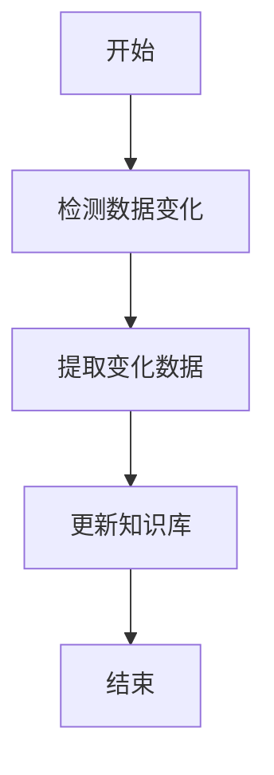
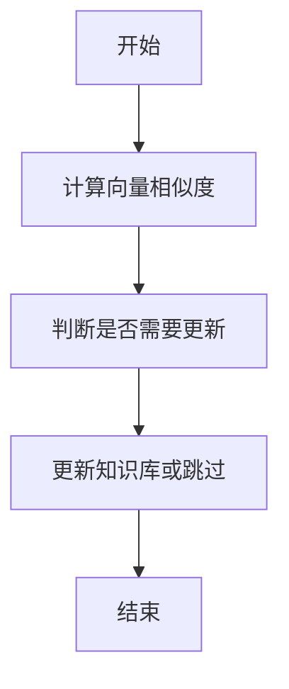
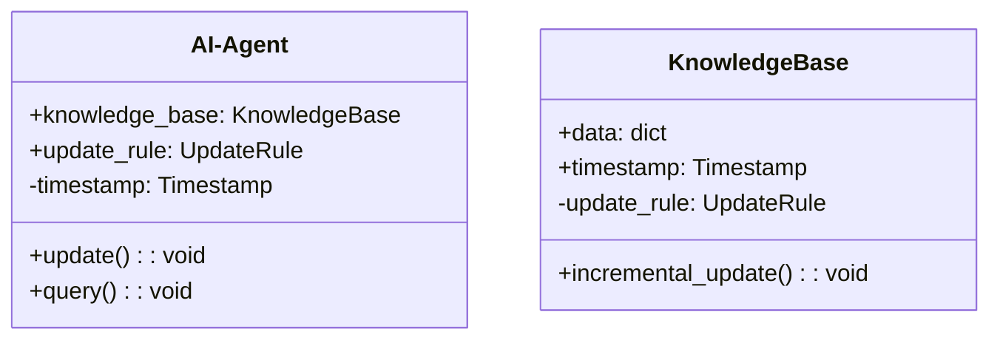
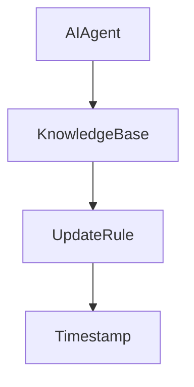

                 


# AI Agent的知识库增量更新策略：保持信息时效性

## 关键词：AI Agent, 知识库, 增量更新, 信息时效性, 实时交互

## 摘要：  
本文深入探讨了AI Agent知识库增量更新的策略，重点分析了如何在保持知识库实时性的同时，实现高效的知识更新。通过详细的技术分析和案例研究，本文提出了基于时间戳和向量相似度的增量更新算法，并结合系统架构设计，展示了如何在实际场景中应用这些策略。文章最后总结了最佳实践和未来研究方向。

---

# 第一部分: AI Agent的知识库增量更新策略背景介绍

## 第1章: 问题背景与描述

### 1.1 知识库更新的必要性  
知识库是AI Agent的核心资产，用于存储和管理结构化的信息。随着数据的实时更新和用户需求的变化，知识库的时效性变得至关重要。传统的全量更新方式效率低下，无法满足实时交互的需求。因此，增量更新策略成为提升知识库管理效率的关键。

#### 1.1.1 知识库的概念与作用  
知识库是AI Agent的信息基础，存储结构化数据、规则和语义信息，用于支持智能决策和交互。  

#### 1.1.2 知识库时效性问题的提出  
知识库中的信息会随着时间变化，如市场数据、用户偏好等。如果不能及时更新，会导致AI Agent提供过时的信息，降低用户体验和决策准确性。  

#### 1.1.3 AI Agent对知识库实时性的需求  
AI Agent需要在实时交互中快速响应，这意味着知识库必须保持最新状态。增量更新策略能够有效减少更新时间，确保实时性。  

### 1.2 问题描述  
增量更新的目标是在不影响实时交互的前提下，仅更新知识库中的变化部分。这要求设计高效的算法和优化的系统架构。  

#### 1.2.1 知识库过时信息的负面影响  
过时信息会导致错误的决策和用户体验下降，特别是在金融、医疗等关键领域。  

#### 1.2.2 AI Agent在实时场景中的挑战  
实时场景要求AI Agent快速响应，知识库必须支持动态更新，同时保证数据的一致性和完整性。  

#### 1.2.3 增量更新的核心目标  
通过最小化更新数据量，减少计算和存储资源的消耗，同时保持知识库的实时性。  

## 第2章: 问题解决与边界定义  

### 2.1 增量更新策略的提出  
增量更新的核心思想是仅处理变化的数据，而不是每次都清空重建知识库。这适用于数据量大且频繁变化的场景。  

#### 2.1.1 增量更新的核心思想  
仅更新变化的部分，减少计算开销。  

#### 2.1.2 增量更新与全量更新的对比  
| 对比维度 | 增量更新 | 全量更新 |  
|----------|----------|----------|  
| 效率     | 高       | 低       |  
| 资源消耗 | 低       | 高       |  
| 适用场景 | 动态数据 | 静态数据 |  

#### 2.1.3 增量更新的适用场景  
适用于数据量大、变化频繁且需要实时响应的场景，如智能客服、实时推荐系统。  

### 2.2 AI Agent知识库的边界与外延  

#### 2.2.1 知识库的构成要素  
知识库由数据、规则、语义信息和索引结构组成。  

#### 2.2.2 增量更新的边界条件  
仅更新变化的数据，保持知识库的逻辑一致性和完整性。  

#### 2.2.3 知识库更新的外部依赖  
依赖于数据源的更新频率和数据格式。  

## 第3章: 核心概念与联系  

### 3.1 核心概念原理  
增量更新的核心在于检测变化并高效更新知识库。  

#### 3.1.1 知识库增量更新的定义  
仅更新知识库中变化的部分，保持整体结构的完整性和一致性。  

#### 3.1.2 增量更新的关键技术  
包括变化检测、版本控制和分布式更新。  

#### 3.1.3 AI Agent与知识库的交互机制  
AI Agent通过接口与知识库交互，获取最新信息并执行增量更新。  

### 3.2 核心概念对比表  
知识库增量更新与传统数据库的对比：  

| 对比维度       | 知识库增量更新 | 传统数据库全量更新 |  
|----------------|----------------|--------------------|  
| 更新方式       | 部分更新       | 全部重建           |  
| 资源消耗       | 低             | 高                 |  
| 适用场景       | 实时交互       | 非实时场景         |  

### 3.3 ER实体关系图  
```mermaid
er
  actor: AI Agent
  knowledge_base: 知识库
  update_rule: 更新规则
  re
```

---

# 第二部分: 增量更新算法原理讲解  

## 第4章: 基于时间戳的增量更新算法  

### 4.1 算法原理  
通过记录数据的时间戳，检测变化并仅更新变化的部分。  

#### 4.1.1 时间戳机制  
每个数据项都有一个时间戳，表示最后一次更新的时间。  

#### 4.1.2 变化检测  
通过比较当前时间戳和存储时间戳，判断数据是否变化。  

#### 4.1.3 更新流程  
检测变化 → 提取变化数据 → 更新知识库 → 确保一致性。  

### 4.2 算法实现  

#### 4.2.1 Python代码实现  
```python
def incremental_update(data, timestamp):
    current_time = timestamp.current()
    if data.timestamp > current_time:
        # 数据变化，进行更新
        update(data.new_content)
    else:
        # 数据未变化，跳过更新
        pass
```

#### 4.2.2 算法流程图  


---

## 第5章: 基于向量相似度的增量更新算法  

### 5.1 算法原理  
通过计算向量相似度，判断数据是否需要更新。  

#### 5.1.1 向量空间模型  
将数据表示为向量，计算相似度。  

#### 5.1.2 相似度计算公式  
$$ \text{相似度} = \frac{\vec{a} \cdot \vec{b}}{||\vec{a}|| \cdot ||\vec{b}||} $$  

#### 5.1.3 更新规则  
相似度低于阈值时，触发更新。  

### 5.2 算法实现  

#### 5.2.1 Python代码实现  
```python
def vector_similarity(vector_a, vector_b):
    dot_product = np.dot(vector_a, vector_b)
    norm_a = np.linalg.norm(vector_a)
    norm_b = np.linalg.norm(vector_b)
    return dot_product / (norm_a * norm_b)
```

#### 5.2.2 算法流程图  


---

# 第三部分: 系统分析与架构设计方案  

## 第6章: 系统分析  

### 6.1 问题场景介绍  
以智能客服系统为例，知识库包含常见问题解答和用户偏好数据。  

### 6.2 系统功能设计  

#### 6.2.1 领域模型类图  


---

## 第7章: 系统架构设计  

### 7.1 系统架构设计  

#### 7.1.1 系统架构图  


### 7.2 系统接口设计  

#### 7.2.1 更新接口  
```mermaid
sequenceDiagram
    AI-Agent -> KnowledgeBase: request_incremental_update()
    KnowledgeBase -> UpdateRule: check_changes()
    UpdateRule -> Timestamp: get_current_time()
    KnowledgeBase -> UpdateRule: apply_changes()
    AI-Agent <-- KnowledgeBase: update_complete()
```

### 7.3 系统交互序列图  

#### 7.3.1 实时查询接口  
```mermaid
sequenceDiagram
    User -> AI-Agent: query()
    AI-Agent -> KnowledgeBase: get_latest_data()
    KnowledgeBase -> UpdateRule: verify_consistency()
    AI-Agent <-- KnowledgeBase: return_data()
    User <-- AI-Agent: response()
```

---

# 第四部分: 项目实战  

## 第8章: 项目实战  

### 8.1 环境安装  

#### 8.1.1 安装Python和相关库  
```bash
pip install numpy mermaid4jupyter
```

### 8.2 核心代码实现  

#### 8.2.1 知识库更新代码  
```python
import numpy as np
from datetime import datetime

def update_rule(data, timestamp):
    current_time = datetime.now()
    if timestamp > data['last_updated']:
        data['content'].update(data['new_content'])
        data['last_updated'] = current_time
    return data

# 示例数据
data = {
    'content': {'question': '如何使用AI Agent?', 'answer': '通过API调用'},
    'last_updated': datetime(2023, 10, 1)
}
new_content = {'question': '如何使用AI Agent?', 'answer': '通过API调用和命令行'}

# 更新知识库
updated_data = update_rule(data, new_content)
print(updated_data)
```

### 8.3 实际案例分析  

#### 8.3.1 案例分析  
以智能客服系统为例，知识库包含常见问题解答。通过增量更新，实时更新用户的FAQ，确保每次查询都能得到最新答案。  

---

# 第五部分: 最佳实践、小结与注意事项  

## 第9章: 最佳实践  

### 9.1 技术建议  
- 定期进行增量更新，确保知识库的实时性。  
- 使用分布式架构，提高更新效率。  

### 9.2 代码与系统设计建议  
- 采用时间戳机制检测变化。  
- 使用向量相似度进行语义更新。  

## 第10章: 小结  

通过本文的分析，我们深入探讨了AI Agent知识库增量更新的策略，包括算法原理、系统架构和项目实战。增量更新策略能够有效提升知识库的实时性和效率，为AI Agent的实际应用提供了重要支持。  

## 第11章: 注意事项  

### 11.1 数据质量  
确保增量更新的数据准确性和完整性。  

### 11.2 性能优化  
优化算法和系统架构，减少资源消耗。  

## 第12章: 拓展阅读  

建议阅读以下内容：  
- 增量更新在分布式系统中的应用。  
- 向量数据库在实时推荐系统中的应用。  

---

# 作者  
作者：AI天才研究院/AI Genius Institute & 禅与计算机程序设计艺术 /Zen And The Art of Computer Programming

