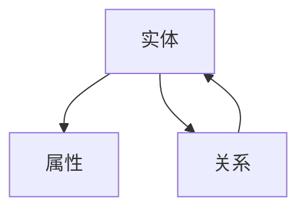
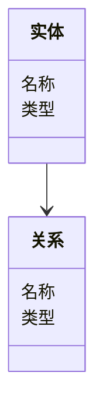
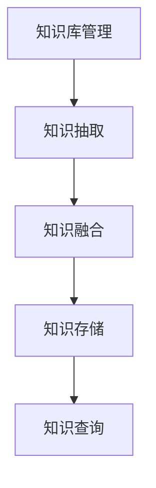
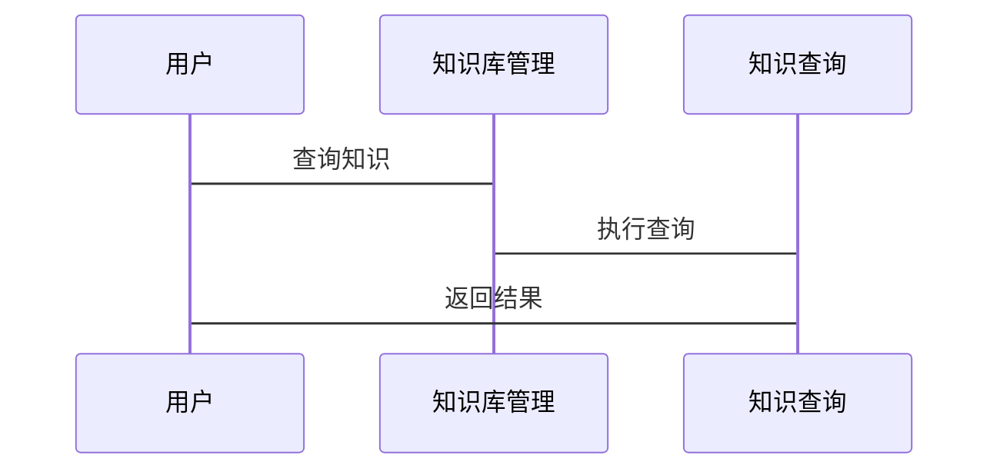

                 


# AI Agent的知识库构建与管理策略

**关键词**：AI Agent，知识库，知识图谱，知识表示，实体关系，深度学习

**摘要**：本文详细探讨了AI Agent的知识库构建与管理策略，从核心概念到算法原理，从系统设计到项目实战，全面解析了知识库在AI Agent中的重要性及其构建与管理的全过程。文章结合理论与实践，通过具体案例分析和代码实现，帮助读者深入理解知识库的构建方法，并掌握实际应用中的最佳实践。

---

## 第1章: AI Agent与知识库概述

### 1.1 AI Agent的基本概念

#### 1.1.1 AI Agent的定义与特点
AI Agent（人工智能代理）是一种能够感知环境、自主决策并执行任务的智能实体。它具备以下特点：
- **自主性**：能够在没有外部干预的情况下独立运行。
- **反应性**：能够实时感知环境并做出反应。
- **目标导向**：具备明确的目标，并通过行为优化来实现目标。
- **学习能力**：能够通过数据和经验不断优化自身性能。

#### 1.1.2 知识库在AI Agent中的作用
知识库是AI Agent的核心组件之一，用于存储和管理与任务相关的知识。知识库的作用包括：
- 提供决策所需的知识支持。
- 支持AI Agent的理解和推理能力。
- 通过知识的组织和关联，提升AI Agent的智能水平。

#### 1.1.3 AI Agent的知识表示与推理
知识表示是AI Agent理解世界的基础。常用的表示方法包括：
- **符号表示**：使用符号逻辑表示知识，例如一阶逻辑（FOL）。
- **语义网络**：通过节点和边表示概念及其关系。
- **概率表示**：基于概率论表示不确定性知识。

推理是AI Agent利用知识库中的知识进行逻辑推导的过程。常用的推理方法包括：
- **演绎推理**：从一般性知识推导出具体结论。
- **归纳推理**：从具体实例推导出一般性结论。
- ** abduction推理**：通过排除法推导出最可能的结论。

### 1.2 知识库构建的背景与意义

#### 1.2.1 当前AI Agent发展的挑战
随着AI技术的快速发展，AI Agent的应用场景日益广泛，但也面临以下挑战：
- **知识的动态性**：知识库需要实时更新以应对环境的变化。
- **知识的复杂性**：现实世界中的知识往往具有高度的复杂性和不确定性。
- **知识的关联性**：知识之间的关联性需要通过复杂的推理来体现。

#### 1.2.2 知识库在AI Agent中的重要性
知识库是AI Agent的核心基础设施，决定了其智能水平和任务执行能力。一个高效的知识库能够：
- 提高AI Agent的决策效率。
- 提升AI Agent的理解和推理能力。
- 支持AI Agent在复杂环境中的自主决策。

#### 1.2.3 AI Agent的知识库构建技术趋势
随着深度学习和知识图谱技术的发展，知识库的构建技术正在向以下方向演进：
- **自动化知识抽取**：利用自然语言处理技术从文本中自动抽取实体和关系。
- **知识融合**：将来自不同来源的知识进行整合和统一。
- **动态更新**：通过持续学习技术实现知识库的实时更新。

---

## 第2章: 知识库构建的核心概念与联系

### 2.1 知识库的核心概念

#### 2.1.1 知识表示的三元组模型
知识表示的三元组模型是一种常用的表示方法，将知识分解为头（head）、关系（relation）和尾（tail）三个部分：
$$ (头, 关系, 尾) $$
例如：(张三, 居住地, 北京)

#### 2.1.2 知识图谱的构建原理
知识图谱是一种将知识表示为图结构的数据模型，节点表示实体，边表示实体之间的关系。知识图谱的构建过程包括：
1. **实体识别**：从文本中识别出独立的实体。
2. **关系抽取**：识别实体之间的关系。
3. **知识融合**：将来自不同来源的知识进行整合。

#### 2.1.3 知识库的层次结构
知识库的层次结构通常包括以下几个层次：
- **数据层**：存储原始数据。
- **模式层**：定义数据的结构和关系。
- **知识层**：存储经过处理的知识。
- **应用层**：提供知识查询和推理服务。

### 2.2 知识库与相关技术的对比

#### 2.2.1 知识库与数据库的对比
| 特性          | 数据库          | 知识库          |
|---------------|----------------|----------------|
| 数据模型      | 关系型/非关系型 | 图结构          |
| 查询方式      | SQL            | SPARQL          |
| 主要用途      | 结构化数据存储  | 知识表示与推理  |

#### 2.2.2 知识库与数据仓库的对比
| 特性          | 数据仓库        | 知识库          |
|---------------|----------------|----------------|
| 数据来源      | 多种数据源      | 多种知识源      |
| 数据结构      | 结构化数据      | 图结构          |
| 主要用途      | 支持决策分析    | 支持知识推理    |

#### 2.2.3 知识库与图数据库的对比
| 特性          | 图数据库        | 知识库          |
|---------------|----------------|----------------|
| 数据模型      | 图结构          | 图结构          |
| 数据存储      | 稍微复杂       | 高度复杂        |
| 查询方式      | 图查询语言      | SPARQL          |
| 主要用途      | 支持图分析      | 支持知识推理    |

### 2.3 知识库的实体关系图



---

## 第3章: 知识库构建的算法原理

### 3.1 知识表示的向量空间模型

#### 3.1.1 余弦相似度的计算公式
余弦相似度用于衡量两个向量在空间中的相似程度：
$$ \text{余弦相似度} = \frac{\vec{A} \cdot \vec{B}}{|\vec{A}| |\vec{B}|} $$

#### 3.1.2 Word2Vec模型
Word2Vec是一种常用的词向量表示模型，其训练过程如下：
1. **目标函数**：最大化目标词和上下文词的相似度。
2. **训练方法**：使用负采样技术优化训练过程。

训练公式：
$$ f(X) = \log P(w_i|w_{i-2}, w_{i-1}, w_{i+1}, w_{i+2}) $$

#### 3.1.3 GLOVE模型
GLOVE是一种基于全局词向量的表示模型，其训练过程如下：
1. **目标函数**：最小化词向量和上下文向量之间的对数似然。
2. **训练方法**：使用随机梯度下降优化模型。

训练公式：
$$ f(w_i) = \frac{1}{|C|} \sum_{c \in C} \log P(w_i | c) $$

### 3.2 知识图谱的构建算法

#### 3.2.1 基于规则的实体识别
基于规则的实体识别方法通过预定义的规则从文本中提取实体。例如：
- 使用正则表达式匹配特定格式的实体（如日期、电话号码）。

#### 3.2.2 基于统计的实体链接
基于统计的实体链接方法通过计算实体之间的相似度进行链接。例如：
- 使用Word2Vec模型计算实体之间的相似度。

#### 3.2.3 基于深度学习的关系抽取
基于深度学习的关系抽取方法通过神经网络模型从文本中提取关系。例如：
- 使用卷积神经网络（CNN）提取文本的局部特征。

---

## 第4章: 知识库构建的数学模型

### 4.1 知识表示的数学模型

#### 4.1.1 知识图谱的三元组表示
知识图谱的三元组表示形式为：
$$ (头, 关系, 尾) $$

#### 4.1.2 知识嵌入的数学公式
知识嵌入的目标是将实体和关系映射到向量空间中。例如：
- 实体嵌入：$e_i = \text{lookup}(头)$
- 关系嵌入：$r_j = \text{lookup}(关系)$
- 尾嵌入：$e_k = \text{lookup}(尾)$

### 4.2 知识库构建的数学公式

#### 4.2.1 Word2Vec模型的训练公式
$$ f(X) = \log P(w_i|w_{i-2}, w_{i-1}, w_{i+1}, w_{i+2}) $$

#### 4.2.2 GLOVE模型的训练公式
$$ f(w_i) = \frac{1}{|C|} \sum_{c \in C} \log P(w_i | c) $$

---

## 第5章: 知识库构建的算法实现

### 5.1 知识表示的向量空间模型实现

#### 5.1.1 环境安装
```python
import numpy as np
from sklearn
```

#### 5.1.2 代码实现
```python
def compute_cosine_similarity(vec1, vec2):
    dot_product = np.dot(vec1, vec2)
    norm1 = np.linalg.norm(vec1)
    norm2 = np.linalg.norm(vec2)
    return dot_product / (norm1 * norm2)
```

#### 5.1.3 代码解读
- **输入**：两个向量`vec1`和`vec2`。
- **输出**：余弦相似度值。

---

## 第6章: 知识库构建的系统分析与架构设计

### 6.1 系统功能设计

#### 6.1.1 领域模型


#### 6.1.2 系统架构


### 6.2 系统交互设计

#### 6.2.1 交互流程图


---

## 第7章: 项目实战

### 7.1 环境安装
```python
pip install numpy
pip install networkx
pip install py2neo
```

### 7.2 核心代码实现

#### 7.2.1 知识抽取
```python
from networkx import Graph

def extract_entities(text):
    # 实体识别逻辑
    pass
```

#### 7.2.2 知识融合
```python
def merge_knowledge(kg1, kg2):
    # 知识融合逻辑
    pass
```

### 7.3 代码解读
- **知识抽取**：从文本中提取实体和关系。
- **知识融合**：将多个知识库中的知识进行整合。

---

## 第8章: 最佳实践与小结

### 8.1 最佳实践

#### 8.1.1 知识库设计
- 使用标准化的表示方法。
- 定期更新知识库内容。

#### 8.1.2 知识库管理
- 使用高效的存储技术。
- 建立完善的知识验证机制。

### 8.2 小结

---

## 第9章: 注意事项与拓展阅读

### 9.1 注意事项

#### 9.1.1 知识库设计
- 注意知识的动态性和不确定性。
- 避免知识冗余和不一致。

#### 9.1.2 知识库管理
- 定期进行知识清洗和优化。
- 建立完善的知识安全机制。

### 9.2 拓展阅读

#### 9.2.1 推荐书籍
- 《知识图谱：概念、方法与应用》
- 《深度学习：方法与实践》

#### 9.2.2 推荐博客
- [知识图谱技术博客](https://example.com)
- [AI Agent技术博客](https://example.com)

---

## 作者：AI天才研究院/AI Genius Institute & 禅与计算机程序设计艺术 /Zen And The Art of Computer Programming

