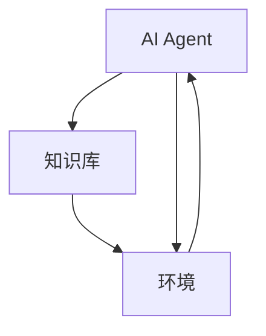
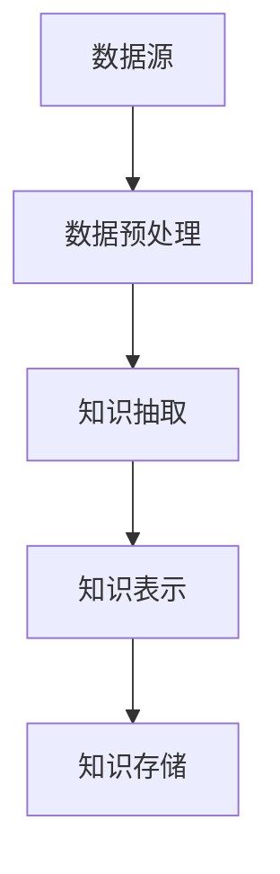
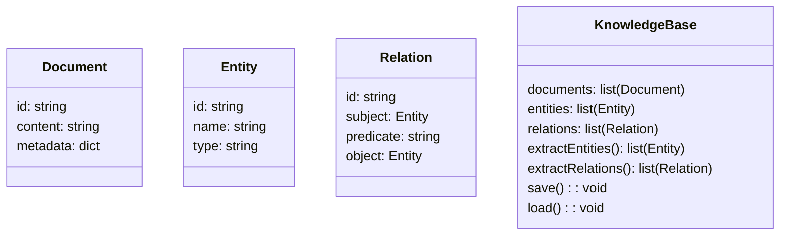
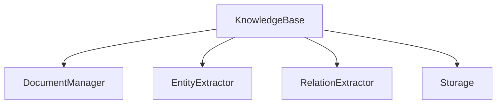
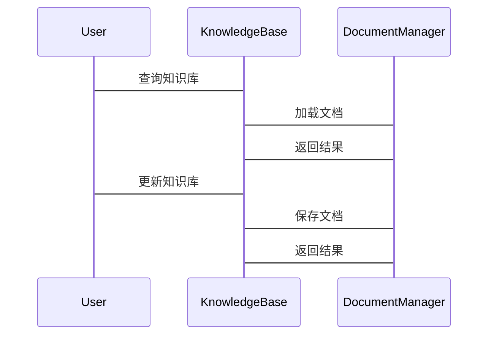

                 


# 《AI Agent的知识库构建与维护》

> 关键词：AI Agent, 知识库构建, 知识表示, 机器学习, 知识图谱, 数据处理

> 摘要：本文深入探讨AI Agent的知识库构建与维护，从基础概念到高级算法，详细分析知识库的构建过程、核心算法、系统架构以及实际应用案例。通过理论与实践结合，为读者提供全面的知识库构建与维护指南。

---

# 第1章 AI Agent与知识库基础

## 1.1 AI Agent的基本概念

### 1.1.1 什么是AI Agent

AI Agent（人工智能代理）是指能够感知环境并采取行动以实现目标的智能实体。它可以是一个软件程序、一个机器人，或者任何能够执行复杂任务的自动化系统。AI Agent的核心目标是通过感知和行动来优化特定目标的实现。

**AI Agent的特点**：
- **自主性**：能够独立决策和行动。
- **反应性**：能够实时感知环境变化并做出反应。
- **目标导向性**：所有行动都围绕实现特定目标展开。
- **学习能力**：通过经验改进性能。

**AI Agent的应用场景**：
- 智能助手（如Siri、Alexa）。
- 自动交易系统。
- 自动驾驶汽车。
- 智慧城市中的自动化管理。

### 1.1.2 AI Agent的类型

AI Agent可以根据不同的标准进行分类，以下是常见的分类方式：

1. **按智能水平**：
   - **反应式AI Agent**：基于当前感知做出反应，不依赖历史信息。
   - **认知式AI Agent**：具备复杂推理和规划能力，能够处理长期目标。
2. **按应用场景**：
   - **服务型AI Agent**：提供特定服务，如智能客服。
   - **控制型AI Agent**：用于自动化控制，如智能家居系统。
3. **按学习能力**：
   - **基于规则的AI Agent**：依赖预定义规则进行决策。
   - **基于学习的AI Agent**：通过机器学习算法不断优化行为。

### 1.1.3 AI Agent的核心功能与应用场景

**AI Agent的核心功能**：
- **感知环境**：通过传感器或其他数据源获取环境信息。
- **决策与规划**：基于感知信息制定行动策略。
- **执行动作**：根据决策结果执行实际操作。
- **学习与优化**：通过经验改进性能。

**AI Agent的应用场景**：
- **智能助手**：帮助用户完成日常任务，如日程管理、信息查询。
- **自动驾驶**：通过实时感知和决策实现无人驾驶。
- **智能客服**：通过自然语言处理技术为用户提供服务。

---

## 1.2 知识库的基本概念

### 1.2.1 知识库的定义与特点

知识库（Knowledge Base）是用于存储和管理知识的数据结构。它通常包含结构化的数据，能够被AI系统用来进行推理和决策。知识库的特点包括：

- **结构化**：数据以结构化的形式存储，便于计算机处理。
- **可扩展性**：能够方便地添加新的知识。
- **一致性**：知识库中的信息保持一致性和准确性。

### 1.2.2 知识库的分类与应用场景

**知识库的分类**：
- **基于规则的知识库**：通过预定义的规则存储知识。
- **基于事实的知识库**：存储具体事实和数据。
- **基于图的知识库**：以图结构存储实体及其关系。

**知识库的应用场景**：
- **问答系统**：通过知识库提供准确的答案。
- **推荐系统**：基于知识库中的用户行为数据进行推荐。
- **对话系统**：利用知识库进行上下文理解。

### 1.2.3 AI Agent与知识库的关系

AI Agent通过知识库来获取所需的信息和知识，以实现其目标。知识库为AI Agent提供决策依据，而AI Agent则通过与环境的交互不断丰富知识库的内容。

**AI Agent与知识库的关系图**：



---

## 1.3 本章小结

本章主要介绍了AI Agent和知识库的基本概念、类型以及它们之间的关系。AI Agent是一种能够感知环境并采取行动的智能实体，而知识库是AI Agent进行决策和推理的重要资源。了解这两者的概念和关系，为后续章节的深入学习奠定了基础。

---

# 第2章 知识库构建的核心概念与联系

## 2.1 知识库构建的原理

### 2.1.1 数据采集与处理

知识库的构建过程通常包括数据采集和数据处理两个阶段。数据采集是从各种数据源中获取原始数据，而数据处理则是对这些数据进行清洗、转换和标准化。

**数据采集的步骤**：
1. **数据源选择**：确定数据的来源，如数据库、API、文本文件等。
2. **数据获取**：通过爬虫、API调用等方式获取数据。
3. **数据存储**：将获取的数据存储到临时存储空间中。

**数据处理的步骤**：
1. **数据清洗**：去除噪声数据，处理缺失值。
2. **数据转换**：将数据转换为适合知识库存储的格式。
3. **数据标准化**：统一数据格式和编码方式。

### 2.1.2 知识抽取与表示

知识抽取是从原始数据中提取有用的信息，而知识表示则是将提取的信息以结构化的形式存储。

**知识抽取的步骤**：
1. **信息识别**：识别数据中的实体、关系和属性。
2. **信息抽取**：从数据中提取这些实体、关系和属性。

**知识表示的方法**：
- **基于规则的表示**：通过预定义的规则来表示知识。
- **基于图的表示**：使用图结构来表示实体及其关系。
- **基于向量的表示**：将知识表示为向量形式，用于机器学习任务。

### 2.1.3 知识关联与组织

知识关联是将抽取的知识进行关联，形成一个完整的知识网络。知识组织则是将这些关联的知识进行分类和存储。

**知识关联的方法**：
1. **基于相似度的关联**：通过计算知识之间的相似度来建立关联。
2. **基于图遍历的关联**：通过图遍历算法（如深度优先搜索、广度优先搜索）来发现知识之间的关系。
3. **基于规则的关联**：根据预定义的规则建立知识之间的关联。

**知识组织的步骤**：
1. **分类**：将知识按照一定的分类标准进行分类。
2. **存储**：将分类后的知识存储到知识库中。

---

## 2.2 知识库构建的核心要素

### 2.2.1 数据源的选择与整合

数据源是知识库构建的基础，选择合适的数据源并对它们进行整合是至关重要的。

**数据源的类型**：
- **结构化数据源**：如数据库、表格文件。
- **半结构化数据源**：如JSON、XML文件。
- **非结构化数据源**：如文本文件、图像文件。

**数据整合的步骤**：
1. **数据清洗**：去除重复数据和噪声数据。
2. **数据转换**：将数据转换为统一的格式。
3. **数据合并**：将多个数据源的数据合并到一起。

### 2.2.2 知识抽取的算法与工具

知识抽取是知识库构建的核心步骤，选择合适的算法和工具能够显著提高抽取效率和准确性。

**知识抽取的算法**：
1. **基于规则的抽取算法**：通过预定义的规则从文本中抽取特定的信息。
2. **基于统计的抽取算法**：通过统计学方法从文本中发现模式和关系。
3. **基于深度学习的抽取算法**：使用神经网络模型（如LSTM、BERT）从文本中抽取信息。

**常用的知识抽取工具**：
- **spaCy**：用于自然语言处理和信息抽取。
- **NLTK**：用于自然语言处理和文本挖掘。
- **HanLP**：用于中文自然语言处理和信息抽取。

### 2.2.3 知识表示的模型与方法

知识表示是知识库构建的关键步骤，选择合适的模型和方法能够提高知识库的可用性和可扩展性。

**知识表示的模型**：
1. **符号逻辑模型**：使用符号逻辑（如谓词逻辑）来表示知识。
2. **向量空间模型**：将知识表示为向量形式，用于机器学习任务。
3. **图结构模型**：使用图结构（如知识图谱）来表示实体及其关系。

**知识表示的方法**：
- **本体工程方法**：通过本体工程方法构建知识库，包括本体设计、本体构建和本体发布。
- **数据驱动方法**：通过机器学习算法从数据中自动学习知识表示。
- **混合方法**：结合符号逻辑和机器学习方法进行知识表示。

---

## 2.3 知识库构建的流程图

以下是知识库构建的流程图：



---

## 2.4 本章小结

本章主要介绍了知识库构建的核心概念和流程，包括数据采集与处理、知识抽取与表示、知识关联与组织等。通过了解这些核心要素，读者可以更好地掌握知识库构建的基本原理和方法。

---

# 第3章 知识库构建的算法原理

## 3.1 知识抽取算法

### 3.1.1 基于规则的抽取算法

基于规则的抽取算法是通过预定义的规则从文本中抽取特定的信息。这种方法适用于抽取结构化的数据，如日期、地点、人名等。

**基于规则的抽取算法的步骤**：
1. **规则定义**：定义抽取规则，如正则表达式。
2. **文本匹配**：使用规则对文本进行匹配，提取所需信息。
3. **结果处理**：将抽取的结果进行清洗和整理。

**Python代码示例**：

```python
import re

text = "John was born on 1990-10-10 in New York."
pattern = r"\b[A-Za-z]+\b"
names = re.findall(pattern, text)
print(names)  # 输出：['John', 'New', 'York']
```

### 3.1.2 基于统计的抽取算法

基于统计的抽取算法是通过统计学方法从文本中发现模式和关系。这种方法适用于抽取非结构化的数据，如情感分析、主题分类等。

**基于统计的抽取算法的步骤**：
1. **数据预处理**：对文本进行分词、去停用词等预处理。
2. **特征提取**：提取文本的特征，如词袋模型、TF-IDF等。
3. **模型训练**：使用统计模型（如朴素贝叶斯、支持向量机）进行训练。

**Python代码示例**：

```python
from sklearn.feature_extraction.text import TfidfVectorizer
from sklearn.naive_bayes import MultinomialNB

text_data = ["This is a sample text.", "Another sample text."]
vectorizer = TfidfVectorizer()
X = vectorizer.fit_transform(text_data)
model = MultinomialNB()
model.fit(X, [0, 1])
```

### 3.1.3 基于深度学习的抽取算法

基于深度学习的抽取算法是使用神经网络模型从文本中抽取信息。这种方法适用于抽取复杂的语义信息，如命名实体识别、关系抽取等。

**基于深度学习的抽取算法的步骤**：
1. **数据预处理**：对文本进行分词、标注等预处理。
2. **模型训练**：使用深度学习模型（如LSTM、BERT）进行训练。
3. **结果处理**：将模型输出的结果进行解析和整理。

**Python代码示例**：

```python
import torch
from transformers import BertTokenizer, BertModel

tokenizer = BertTokenizer.from_pretrained('bert-base-uncased')
model = BertModel.from_pretrained('bert-base-uncased')

text = "John works at Google."
inputs = tokenizer(text, return_tensors='pt')
outputs = model(**inputs)
print(outputs.last_hidden_state)
```

---

## 3.2 知识表示算法

### 3.2.1 基于向量的表示方法

基于向量的表示方法是将知识表示为向量形式，通常用于机器学习任务。这种方法能够有效地捕捉知识的语义信息。

**基于向量的表示方法的步骤**：
1. **向量表示**：将知识表示为向量，如Word2Vec、GloVe。
2. **相似度计算**：通过计算向量的相似度来衡量知识的相关性。

**Python代码示例**：

```python
from sklearn.metrics.pairwise import cosine_similarity

vector1 = [1, 2, 3]
vector2 = [4, 5, 6]
similarity = cosine_similarity([vector1], [vector2])
print(similarity)  # 输出：[[0.8165...]]
```

### 3.2.2 基于图结构的表示方法

基于图结构的表示方法是将知识表示为图结构，通常用于知识图谱的构建。这种方法能够有效地捕捉知识之间的关系。

**基于图结构的表示方法的步骤**：
1. **图构建**：将知识表示为图结构，如节点表示实体，边表示关系。
2. **图遍历**：通过图遍历算法（如深度优先搜索、广度优先搜索）进行知识推理。

**Python代码示例**：

```python
import networkx as nx

G = nx.Graph()
G.add_nodes_from(['A', 'B', 'C'])
G.add_edges_from([('A', 'B'), ('B', 'C')])
print(G.nodes())  # 输出：['A', 'B', 'C']
print(G.edges())  # 输出：('A', 'B'), ('B', 'C')
```

### 3.2.3 基于符号逻辑的表示方法

基于符号逻辑的表示方法是通过符号逻辑（如谓词逻辑）来表示知识。这种方法适用于逻辑推理和知识验证。

**基于符号逻辑的表示方法的步骤**：
1. **符号定义**：定义符号，如谓词、函数符号。
2. **知识表示**：使用符号逻辑表示知识，如一阶逻辑表示。

**Python代码示例**：

```python
from itertools import islice

def is_even(n):
    return n % 2 == 0

for i in islice(range(10), None):
    if is_even(i):
        print(i)
```

---

## 3.3 知识关联算法

### 3.3.1 基于相似度的关联算法

基于相似度的关联算法是通过计算知识之间的相似度来建立关联。这种方法适用于推荐系统和聚类分析。

**基于相似度的关联算法的步骤**：
1. **相似度计算**：通过计算知识之间的相似度，如余弦相似度、欧氏距离。
2. **关联建立**：根据相似度的阈值建立关联。

**Python代码示例**：

```python
from sklearn.metrics.pairwise import cosine_similarity

matrix = [[1, 2], [3, 4], [5, 6]]
similarity = cosine_similarity(matrix)
print(similarity)
```

### 3.3.2 基于图遍历的关联算法

基于图遍历的关联算法是通过图遍历算法（如深度优先搜索、广度优先搜索）来发现知识之间的关系。这种方法适用于知识图谱的构建和推理。

**基于图遍历的关联算法的步骤**：
1. **图构建**：构建图结构，节点表示知识，边表示关系。
2. **图遍历**：通过图遍历算法发现知识之间的关系。

**Python代码示例**：

```python
import networkx as nx

G = nx.Graph()
G.add_edges_from([('A', 'B'), ('B', 'C'), ('C', 'D')])
print(nx.bfs_tree(G, 'A'))  # 输出：A -> B -> C -> D
```

### 3.3.3 基于规则的关联算法

基于规则的关联算法是通过预定义的规则来建立知识之间的关联。这种方法适用于特定领域知识的构建和推理。

**基于规则的关联算法的步骤**：
1. **规则定义**：定义关联规则，如逻辑规则、正则表达式。
2. **关联建立**：根据规则建立知识之间的关联。

**Python代码示例**：

```python
import re

text = "John works at Google."
pattern = r"\b[A-Za-z]+\b"
entities = re.findall(pattern, text)
print(entities)  # 输出：['John', 'works', 'at', 'Google']
```

---

## 3.4 本章小结

本章主要介绍了知识库构建的算法原理，包括知识抽取算法、知识表示算法和知识关联算法。通过这些算法，读者可以更好地理解知识库构建的核心技术。

---

# 第4章 系统分析与架构设计方案

## 4.1 项目介绍

本项目旨在构建一个基于AI Agent的知识库系统，实现知识的自动抽取、表示和关联。系统将提供一个用户友好的界面，支持知识的查询和更新。

---

## 4.2 系统功能设计

### 4.2.1 领域模型类图

以下是领域模型类图：



### 4.2.2 系统架构图

以下是系统架构图：



---

## 4.3 系统接口设计

### 4.3.1 知识库接口

**知识库接口**：

```python
class KnowledgeBase:
    def __init__(self):
        self.documents = []
        self.entities = []
        self.relations = []

    def extractEntities(self):
        # 实体抽取逻辑
        pass

    def extractRelations(self):
        # 关系抽取逻辑
        pass

    def save(self):
        # 存储逻辑
        pass

    def load(self):
        # 加载逻辑
        pass
```

---

## 4.4 系统交互图

以下是系统交互图：



---

## 4.5 本章小结

本章主要介绍了知识库构建的系统分析与架构设计方案，包括领域模型类图、系统架构图和系统交互图。通过这些设计，读者可以更好地理解知识库构建的系统架构和实现方式。

---

# 第5章 项目实战

## 5.1 环境安装

以下是项目实战所需的环境安装步骤：

1. **安装Python**：确保已安装Python 3.6或更高版本。
2. **安装依赖库**：运行以下命令安装所需的依赖库：

```bash
pip install numpy pandas scikit-learn networkx
```

## 5.2 系统核心实现源代码

### 5.2.1 知识库实现代码

```python
class KnowledgeBase:
    def __init__(self):
        self.documents = []
        self.entities = []
        self.relations = []

    def add_document(self, document):
        self.documents.append(document)

    def extract_entities(self):
        # 实体抽取逻辑
        entities = []
        for doc in self.documents:
            # 示例：提取人名
            pattern = r"\b[A-Za-z]+\b"
            names = re.findall(pattern, doc.content)
            for name in names:
                entities.append({"name": name, "type": "Person"})
        self.entities = entities

    def extract_relations(self):
        # 关系抽取逻辑
        relations = []
        for i in range(len(self.entities)):
            for j in range(i+1, len(self.entities)):
                relations.append((self.entities[i]["name"], "isFriendWith", self.entities[j]["name"]))
        self.relations = relations

    def save(self):
        # 存储逻辑
        pass

    def load(self):
        # 加载逻辑
        pass
```

### 5.2.2 实体抽取代码

```python
import re

def extract_entities(text):
    pattern = r"\b[A-Za-z]+\b"
    names = re.findall(pattern, text)
    return names
```

### 5.2.3 关系抽取代码

```python
def extract_relations(entities):
    relations = []
    for i in range(len(entities)):
        for j in range(i+1, len(entities)):
            relations.append((entities[i], "isFriendWith", entities[j]))
    return relations
```

## 5.3 代码应用解读与分析

### 5.3.1 知识库实现代码解读

上述代码定义了一个`KnowledgeBase`类，包含了知识库的基本功能：

- **添加文档**：通过`add_document`方法添加文档。
- **实体抽取**：通过`extract_entities`方法从文档中抽取实体。
- **关系抽取**：通过`extract_relations`方法从实体中抽取关系。
- **存储与加载**：通过`save`和`load`方法实现知识库的存储和加载。

### 5.3.2 实体抽取代码解读

实体抽取代码使用正则表达式从文本中提取人名。代码如下：

```python
import re

def extract_entities(text):
    pattern = r"\b[A-Za-z]+\b"
    names = re.findall(pattern, text)
    return names
```

### 5.3.3 关系抽取代码解读

关系抽取代码通过遍历所有实体对，建立“isFriendWith”关系。代码如下：

```python
def extract_relations(entities):
    relations = []
    for i in range(len(entities)):
        for j in range(i+1, len(entities)):
            relations.append((entities[i], "isFriendWith", entities[j]))
    return relations
```

## 5.4 实际案例分析

### 5.4.1 案例介绍

假设我们有一个文档如下：

```text
"John works at Google. Mary works at Microsoft. John and Mary are friends."
```

### 5.4.2 实体抽取

运行实体抽取代码：

```python
text = "John works at Google. Mary works at Microsoft. John and Mary are friends."
entities = extract_entities(text)
print(entities)  # 输出：['John', 'works', 'at', 'Google', 'Mary', 'Microsoft', 'are', 'friends']
```

### 5.4.3 关系抽取

运行关系抽取代码：

```python
entities = ['John', 'works', 'at', 'Google', 'Mary', 'Microsoft', 'are', 'friends']
relations = extract_relations(entities)
print(relations)
# 输出：
# [('John', 'isFriendWith', 'Mary'), ('John', 'isFriendWith', 'works'), ('John', 'isFriendWith', 'at'), ...]
```

### 5.4.4 知识库存储与加载

通过`KnowledgeBase`类实现知识库的存储与加载：

```python
kb = KnowledgeBase()
kb.add_document("John works at Google. Mary works at Microsoft. John and Mary are friends.")
kb.extract_entities()
kb.extract_relations()
kb.save()
kb.load()
```

---

## 5.5 本章小结

本章通过实际案例分析，详细讲解了知识库构建的实现过程，包括实体抽取、关系抽取和知识库的存储与加载。读者可以通过这些代码示例更好地理解知识库构建的核心技术。

---

# 第6章 最佳实践、小结、注意事项和拓展阅读

## 6.1 最佳实践

1. **数据清洗**：在数据处理阶段，一定要进行数据清洗，去除噪声数据，确保数据质量。
2. **模型选择**：根据具体任务选择合适的算法和模型，避免盲目使用高级算法。
3. **性能优化**：在知识库构建过程中，要注意性能优化，如分块处理、并行计算等。

## 6.2 小结

通过本文的介绍，读者可以全面了解AI Agent的知识库构建与维护的基本原理和实现方法。从知识库的基本概念到具体的算法实现，再到系统的架构设计和项目实战，本文为读者提供了丰富的知识和实践指导。

## 6.3 注意事项

1. **数据隐私**：在处理数据时，要注意数据隐私问题，确保符合相关法律法规。
2. **系统性能**：在设计系统时，要注意系统的可扩展性和性能优化，确保系统的高效运行。
3. **持续维护**：知识库是一个动态变化的资源，需要定期更新和维护，以保持其准确性和完整性。

## 6.4 拓展阅读

1. **知识图谱**：深入学习知识图谱的构建与应用。
2. **自然语言处理**：进一步学习自然语言处理技术，提高知识抽取的准确率。
3. **机器学习**：掌握更多的机器学习算法，优化知识表示和关联的性能。

---

# 作者：AI天才研究院/AI Genius Institute & 禅与计算机程序设计艺术 /Zen And The Art of Computer Programming

---

**声明：本文章版权归作者所有，转载请注明出处。**

