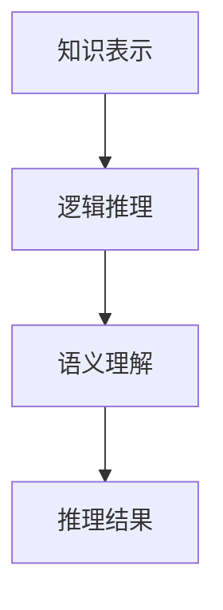
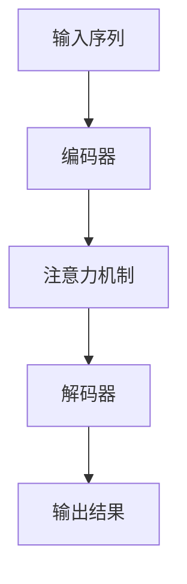
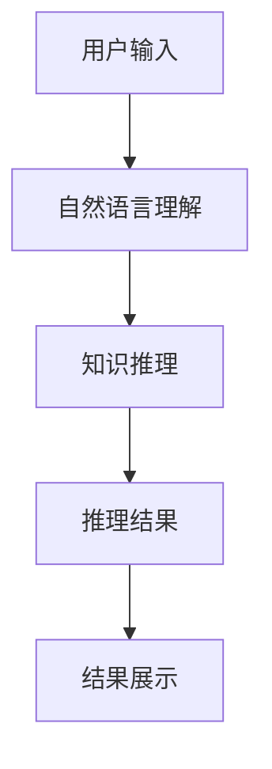
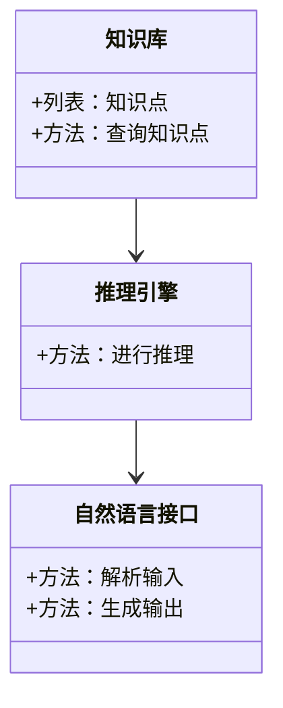

                 


# AI Agent的知识推理可解释性设计

---

## 关键词：AI Agent, 知识推理, 可解释性设计, 推理算法, 系统架构

---

## 摘要：  
AI Agent的知识推理可解释性设计是当前人工智能领域的研究热点。本文从知识推理的基本原理出发，探讨AI Agent在知识推理中的可解释性设计，分析其核心算法和系统架构，并通过实际案例展示如何实现可解释性推理。文章结合理论与实践，详细阐述了知识推理的算法原理、系统设计和项目实现，为AI Agent的开发和应用提供了重要的参考和指导。

---

## 第一部分: AI Agent的知识推理基础

### 第1章: 问题背景与核心概念

#### 1.1 问题背景  
随着人工智能技术的快速发展，AI Agent（智能体）在各个领域的应用越来越广泛。AI Agent需要具备知识推理能力，以便在复杂环境中做出合理的决策。然而，知识推理的可解释性问题一直是AI Agent研究中的难点。如何设计一种可解释的知识推理方法，使得AI Agent的决策过程透明且易于理解，是当前研究的核心问题。

#### 1.2 问题描述  
知识推理是指AI Agent根据已有知识和环境信息，推导出新的结论或行动计划的过程。可解释性推理要求AI Agent能够清晰地展示其推理过程和结果背后的原因，以便用户或开发者能够理解其决策逻辑。  

知识推理的核心问题包括：  
1. 如何表示知识？  
2. 如何进行推理？  
3. 如何确保推理过程的可解释性？  

#### 1.3 核心概念与联系  
知识推理涉及多个核心概念，包括知识表示、逻辑推理、语义理解等。以下是核心概念的特征对比表：

| 概念 | 特征 | 描述 |
|------|------|------|
| 知识表示 | 明确性 | 知识以符号或语义形式表示，支持推理。 |
| 逻辑推理 | 形式化 | 基于逻辑规则进行推导，结果具有确定性。 |
| 语义理解 | 上下文依赖 | 需要理解语境和意图，结果具有模糊性。 |

以下是知识推理的实体关系图（Mermaid流程图）：



---

## 第二部分: 知识推理的可解释性设计

### 第2章: 知识推理的核心算法

#### 2.1 知识推理算法原理  
知识推理算法主要包括基于规则的推理、基于概率的推理和基于图的推理。  

- **基于规则的推理**：通过预定义的逻辑规则进行推理，例如Rete算法。  
- **基于概率的推理**：利用概率论进行不确定性推理，例如贝叶斯网络。  
- **基于图的推理**：通过图结构（如知识图谱）进行推理，例如TransE、TransH等。  

#### 2.2 算法原理讲解  
以下是基于Transformer的推理算法原理（以Mermaid流程图为示）：



以下是注意力机制的Python代码示例：

```python
import torch

def attention(query, key, value, d_model):
    # 计算查询与键的点积
    scores = torch.bmm(query, key.transpose(-2, -1))
    # 归一化
    scores = torch.softmax(scores / torch.sqrt(torch.tensor(d_model, dtype=torch.float32)), dim=-1)
    # 加权求和
    output = torch.bmm(scores, value)
    return output
```

以下是数学模型的公式：

$$
\text{注意力机制} = \text{softmax}\left(\frac{\text{查询} \cdot \text{键}}{\sqrt{d_{\text{模型}}}}\right) \cdot \text{值}
$$

---

## 第三部分: 系统分析与架构设计

### 第3章: 系统分析与架构设计

#### 3.1 问题场景介绍  
AI Agent的知识推理系统需要处理以下场景：  
1. **知识库构建**：整合多源知识数据，构建可推理的知识库。  
2. **推理服务**：提供可解释的推理服务，支持实时查询和推理。  
3. **用户交互**：通过自然语言接口与用户交互，展示推理过程和结果。  

#### 3.2 系统架构设计  
以下是系统架构的Mermaid架构图：



以下是领域模型的Mermaid类图：



---

## 第四部分: 项目实战与案例分析

### 第4章: 项目实战

#### 4.1 环境安装与配置  
以下是Python环境的安装步骤：  
1. 安装Python 3.8及以上版本。  
2. 安装必要的依赖库：`pip install torch transformers`.  

#### 4.2 系统核心实现源代码  
以下是知识推理模块的Python代码示例：

```python
import torch
from transformers import AutoTokenizer, AutoModelForSeq2Seq

# 初始化模型和分词器
model_name = "facebook/bart-large"
tokenizer = AutoTokenizer.from_pretrained(model_name)
model = AutoModelForSeq2Seq.from_pretrained(model_name)

# 定义推理函数
def knowledge_retrieval(question, context):
    inputs = tokenizer.encode_plus(question + " " + context, max_length=512, truncation=True, padding=True, return_tensors="pt")
    outputs = model.generate(inputs['input_ids'])
    return tokenizer.decode(outputs[0], skip_special_tokens=True)

# 示例调用
question = "What is AI Agent?"
context = "AI Agent refers to an intelligent agent that performs tasks on behalf of the user."
result = knowledge_retrieval(question, context)
print(result)
```

---

## 第五部分: 总结与展望

### 5.1 总结  
本文详细探讨了AI Agent的知识推理可解释性设计，从核心概念、算法原理到系统架构，再到项目实现，全面阐述了知识推理的设计与实现过程。通过实际案例分析，展示了如何在AI Agent中实现可解释的知识推理。

### 5.2 展望  
未来的研究方向包括：  
1. 更高效的知识表示方法。  
2. 更强大的推理算法。  
3. 更自然的用户交互方式。  

---

## 作者：AI天才研究院 & 禅与计算机程序设计艺术

---

以上是《AI Agent的知识推理可解释性设计》的完整目录和文章内容，涵盖了从基础到应用的各个方面，适合技术博客的发表和阅读。

