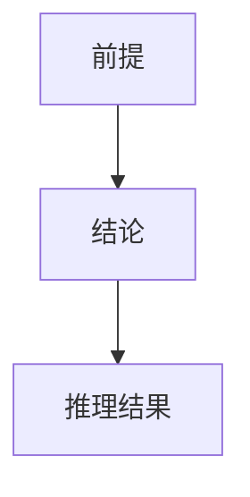
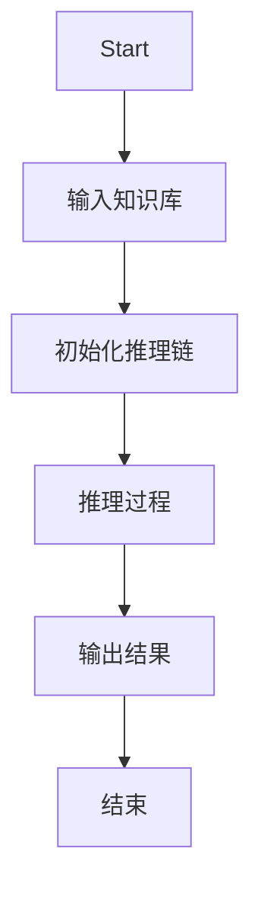
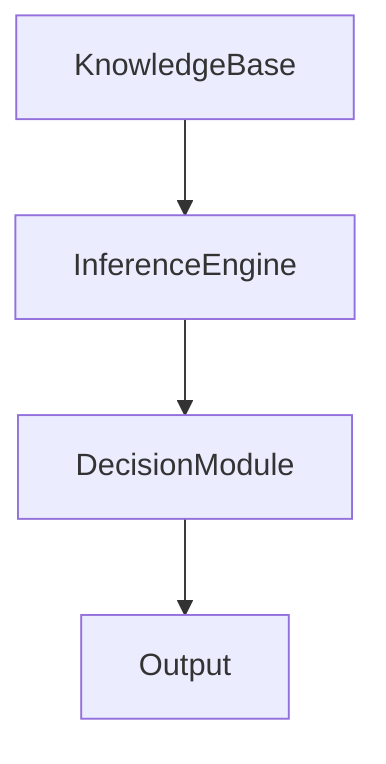

                 


# AI Agent的知识推理链：逐步解决复杂问题

> 关键词：AI Agent、知识推理链、复杂问题解决、符号逻辑推理、概率推理、系统架构设计、项目实战

> 摘要：本文详细探讨了AI Agent的知识推理链在解决复杂问题中的应用。首先，我们介绍了知识推理链的基本概念和AI Agent的定义及其在复杂问题中的作用。接着，我们深入分析了知识推理链的算法原理，包括符号逻辑推理和概率推理，并通过数学公式和mermaid图进行了详细阐述。然后，我们设计了系统的架构，包括场景介绍、功能模块划分和架构图。最后，我们通过一个项目实战案例，展示了如何在实际中应用知识推理链来解决复杂问题。本文还提供了最佳实践、小结和扩展阅读，帮助读者更好地理解和应用这些知识。

---

# 第1章: 知识推理链的背景与概念

## 1.1 问题背景与描述

### 1.1.1 复杂问题的定义与特点
- 复杂问题通常涉及多个变量和不确定性，需要系统性地分解和解决。
- 复杂问题的特点包括多维度、高动态性和强关联性。

### 1.1.2 知识推理链的提出与意义
- 知识推理链是一种将知识转化为决策的系统方法。
- 知识推理链通过逐步推理，能够有效处理复杂问题中的不确定性。

### 1.1.3 AI Agent在复杂问题中的角色
- AI Agent作为知识推理链的核心，能够实时感知环境并做出决策。

## 1.2 知识推理链的核心概念

### 1.2.1 知识推理链的定义
- 知识推理链是将知识表示、推理和决策有机结合起来的流程。

### 1.2.2 知识推理链的属性特征对比表
| 属性 | 特征 |
|------|------|
| 输入 | 知识库、问题描述 |
| 输出 | 推理结果、决策建议 |
| 方法 | 符号逻辑推理、概率推理 |

### 1.2.3 知识推理链的ER实体关系图
```mermaid
erd
    entity 知识库 {
        key: 知识ID
        知识内容
        关联规则
    }
    entity 问题 {
        key: 问题ID
        问题描述
        关联知识
    }
    entity 推理结果 {
        key: 推理ID
        结论
        置信度
    }
    知识库 -- 关联规则 --> 推理结果
    问题 -- 关联知识 --> 推理结果
```

## 1.3 AI Agent的定义与特点

### 1.3.1 AI Agent的基本定义
- AI Agent是具有感知、推理和决策能力的智能体。

### 1.3.2 AI Agent的核心特点
| 特性 | 描述 |
|------|------|
| 感知能力 | 能够感知环境并获取信息 |
| 推理能力 | 能够基于知识进行推理 |
| 决策能力 | 能够根据推理结果做出决策 |

### 1.3.3 AI Agent与传统Agent的区别
- AI Agent具有更强的学习和推理能力。

## 1.4 知识推理链与AI Agent的关系

### 1.4.1 知识推理链在AI Agent中的作用
- 知识推理链是AI Agent的核心机制，用于处理复杂问题。

### 1.4.2 AI Agent如何利用知识推理链解决问题
- AI Agent通过知识推理链将问题分解为子问题，并逐步解决。

### 1.4.3 知识推理链的边界与外延
- 知识推理链的边界在于其输入和输出的定义范围。

---

# 第2章: 知识推理链的算法原理

## 2.1 知识推理链的符号逻辑推理

### 2.1.1 符号逻辑推理的基本原理
- 符号逻辑推理通过规则和逻辑运算进行推理。

### 2.1.2 知识推理链中的蕴含关系
- 蕴含关系表示如果前提为真，则结论也为真。

### 2.1.3 知识推理链的逻辑推理流程


## 2.2 知识推理链的概率推理

### 2.2.1 概率推理的基本原理
- 概率推理通过计算概率分布来处理不确定性。

### 2.2.2 贝叶斯网络在知识推理链中的应用
- 贝叶斯网络用于表示变量之间的概率关系。

### 2.2.3 概率推理的数学模型
- 贝叶斯公式：
  $$ P(A|B) = \frac{P(B|A)P(A)}{P(B)} $$

## 2.3 知识推理链的算法流程图

### 2.3.1 算法流程图的符号表示


### 2.3.2 算法流程图的详细步骤
1. 输入知识库：加载知识库和问题描述。
2. 初始化推理链：设定初始状态和推理规则。
3. 推理过程：逐步推理并更新状态。
4. 输出结果：生成推理结果并返回。

### 2.3.3 算法流程图的实现案例
- 使用Python实现符号逻辑推理：
  ```python
  def inference(knowledge_base, problem):
      # 初始化推理链
      chain = knowledge_base.copy()
      # 推理过程
      for rule in problem['rules']:
          apply_rule(chain, rule)
      return chain
  ```

---

# 第3章: 知识推理链的数学模型与公式

## 3.1 知识推理链的基本公式

### 3.1.1 蕴含关系的公式表示
- 蕴含关系：如果P，则Q，表示为 $$ P \rightarrow Q $$

### 3.1.2 概率推理的公式推导
- 条件概率公式：$$ P(A|B) = \frac{P(A \cap B)}{P(B)} $$

### 3.1.3 知识推理链的综合公式
- 综合公式：$$ P(Q|P) = \prod_{i=1}^{n} P(Q_i|P_i) $$

## 3.2 知识推理链的符号表示

### 3.2.1 知识推理链的符号系统
- 使用符号逻辑中的命题逻辑表示知识。

### 3.2.2 知识推理链的符号转换规则
- 命题逻辑中的命题转换为谓词逻辑。

### 3.2.3 知识推理链的符号应用案例
- 示例：$$ P(A) \land P(B) \rightarrow P(A \land B) $$

## 3.3 知识推理链的数学模型

### 3.3.1 知识推理链的逻辑模型
- 逻辑模型：基于命题逻辑和谓词逻辑。

### 3.3.2 知识推理链的概率模型
- 概率模型：基于贝叶斯网络和马尔可夫链。

### 3.3.3 知识推理链的综合模型
- 综合模型：结合逻辑推理和概率推理。

---

# 第4章: 知识推理链的系统架构设计

## 4.1 系统场景介绍

### 4.1.1 知识推理链的应用场景
- 知识推理链应用于复杂问题解决、智能决策等领域。

### 4.1.2 AI Agent的典型应用场景
- 智能客服、自动驾驶、智能助手等。

### 4.1.3 系统的输入输出描述
- 输入：知识库、问题描述。
- 输出：推理结果、决策建议。

## 4.2 系统功能设计

### 4.2.1 系统功能模块划分
| 模块 | 功能 |
|------|------|
| 知识库管理 | 管理知识库的存储和更新 |
| 推理引擎 | 执行逻辑推理和概率推理 |
| 决策模块 | 根据推理结果做出决策 |

### 4.2.2 系统功能模块的交互流程
1. 知识库管理模块加载知识库。
2. 推理引擎根据问题描述启动推理过程。
3. 决策模块根据推理结果生成决策建议。

### 4.2.3 系统功能模块的实现方式
- 知识库管理：使用数据库存储知识。
- 推理引擎：基于逻辑推理和概率推理算法。
- 决策模块：根据推理结果生成决策。

## 4.3 系统架构设计

### 4.3.1 系统架构的分层设计
| 层 | 描述 |
|----|------|
| 数据层 | 知识库的存储和管理 |
| 逻辑层 | 推理引擎的实现 |
| 应用层 | 决策模块的实现 |

### 4.3.2 系统架构的模块划分


### 4.3.3 系统架构的通信机制
- 采用异步通信机制，确保高效处理。

---

# 第5章: 知识推理链的项目实战

## 5.1 项目介绍

### 5.1.1 项目背景
- 项目目标是利用知识推理链解决复杂问题。

### 5.1.2 项目需求
- 实现符号逻辑推理和概率推理。

## 5.2 系统核心实现

### 5.2.1 环境安装
- 安装Python和必要的库（如numpy、scipy）。

### 5.2.2 代码实现
- 符号逻辑推理实现：
  ```python
  def apply_rule(chain, rule):
      if rule['premise'] in chain:
          chain.append(rule['conclusion'])
  ```

- 概率推理实现：
  ```python
  def calculate_probability(evidence, model):
      return model(evidence)
  ```

### 5.2.3 代码应用解读与分析
- 代码实现展示了如何将理论应用于实际问题。

## 5.3 实际案例分析

### 5.3.1 案例背景
- 解决一个复杂决策问题。

### 5.3.2 案例分析
- 使用知识推理链进行问题分解和解决。

### 5.3.3 案例结果
- 成功解决问题并生成决策建议。

## 5.4 项目小结

### 5.4.1 项目总结
- 知识推理链在实际应用中表现出色。

### 5.4.2 项目经验
- 需要注意知识库的质量和推理算法的优化。

### 5.4.3 项目意义
- 为解决复杂问题提供了新的思路。

---

# 结语

通过本文的详细讲解，我们了解了AI Agent的知识推理链在解决复杂问题中的重要性。从背景概念到算法原理，再到系统架构设计和项目实战，我们全面探讨了知识推理链的应用。希望本文能够为读者在复杂问题解决中提供有价值的参考和指导。

---

作者：AI天才研究院/AI Genius Institute & 禅与计算机程序设计艺术 /Zen And The Art of Computer Programming

