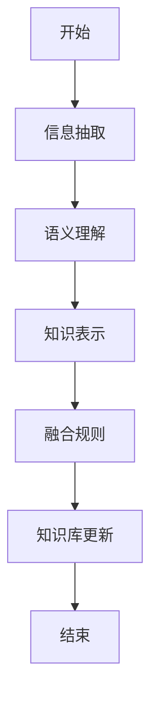
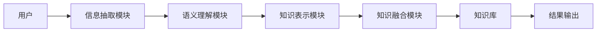

                 


# AI Agent的知识整合：融合多源信息

> 关键词：AI Agent，知识整合，多源信息，信息融合，知识图谱，系统架构

> 摘要：本文深入探讨了AI Agent在知识整合中的应用，详细分析了多源信息融合的原理、算法和系统架构设计。通过实际案例分析，展示了如何通过AI技术实现高效的知识整合，并提供了最佳实践和系统设计的建议。

---

## 第一部分：背景介绍

### 第1章：AI Agent与知识整合概述

#### 1.1 AI Agent的基本概念
- **1.1.1 AI Agent的定义与分类**  
  AI Agent（人工智能代理）是指能够感知环境、自主决策并执行任务的智能实体。根据功能和应用场景的不同，AI Agent可以分为简单反射型、基于模型的反射型、目标驱动型和实用驱动型等。

- **1.1.2 知识整合的必要性**  
  知识整合是将来自不同来源的信息进行融合和优化的过程，旨在提高信息的准确性和全面性。随着数据量的爆炸式增长，知识整合成为提升AI Agent智能水平的关键。

- **1.1.3 多源信息融合的背景与挑战**  
  当前，多源信息融合面临数据异构性、信息冗余、噪声干扰等问题。通过AI技术，可以有效地解决这些问题，实现高质量的知识整合。

#### 1.2 问题背景与描述
- **1.2.1 当前信息孤岛问题**  
  各个信息源之间存在孤立状态，导致信息无法有效共享和利用。例如，企业内部的不同部门可能使用不同的系统，导致数据难以整合。

- **1.2.2 知识整合的痛点**  
  知识整合需要解决数据清洗、信息抽取、语义理解等问题，这些都需要复杂的算法和系统支持。

- **1.2.3 多源信息融合的目标**  
  通过融合多源信息，提升AI Agent的决策能力和智能化水平，使其能够更好地服务于实际应用场景。

#### 1.3 问题解决与边界
- **1.3.1 知识整合的解决方案**  
  采用多源信息融合技术，结合机器学习和自然语言处理等方法，实现知识的高效整合。

- **1.3.2 AI Agent在知识整合中的作用**  
  AI Agent作为信息处理的核心，负责信息的感知、理解和融合，从而实现知识的动态更新和优化。

- **1.3.3 边界与外延**  
  知识整合的边界包括数据源的范围、信息处理的深度以及应用场景的限制。外延则涉及数据挖掘、知识图谱构建等领域。

#### 1.4 核心要素与概念结构
- **1.4.1 核心要素分析**  
  知识整合的核心要素包括数据源、信息抽取、语义理解、知识表示和融合规则等。

- **1.4.2 概念结构图**  
  通过概念图展示知识整合的各个要素及其关系。

- **1.4.3 外部环境的影响**  
  外部环境如数据质量、系统性能等都会影响知识整合的效果。

---

## 第二部分：AI Agent的核心概念与联系

### 第2章：AI Agent的知识整合原理

#### 2.1 核心概念的原理分析
- **2.1.1 知识表示与推理**  
  知识表示是将信息转化为计算机可处理的形式，常见的表示方法包括符号逻辑、语义网络和知识图谱等。推理则是基于知识库进行逻辑推断的过程。

- **2.1.2 多源信息融合的机制**  
  多源信息融合的机制包括加权融合、概率融合和基于规则的融合等方法。每种方法都有其优缺点，适用于不同的场景。

- **2.1.3 知识图谱的构建与应用**  
  知识图谱是一种结构化的知识表示形式，通过构建图谱可以实现对多源信息的高效整合和查询。

#### 2.2 核心概念的特征对比
- **2.2.1 信息源的特征对比**  
  通过表格形式对比不同信息源的特征，包括数据类型、数据格式、数据质量和数据量等。

- **2.2.2 知识表示的特征对比**  
  对比不同的知识表示方法，如符号逻辑和语义网络的优缺点。

- **2.2.3 融合算法的特征对比**  
  对比不同的融合算法，如加权融合和概率融合的适用场景和性能。

---

## 第三部分：算法原理讲解

### 第3章：AI Agent的知识整合算法

#### 3.1 算法原理的流程图


#### 3.2 算法实现的代码示例
```python
def knowledge_fusion(data_sources):
    # 数据抽取
    extracted_data = [process(source) for source in data_sources]
    # 语义理解
    semantic_understanding = [extract_meaning(d) for d in extracted_data]
    # 知识表示
    knowledge_graph = construct_graph(semantic_understanding)
    # 融合规则
    fused Knowledge = apply_rules(knowledge_graph)
    return fused_knowledge

# 示例调用
data_sources = [source1, source2, source3]
result = knowledge_fusion(data_sources)
```

#### 3.3 数学模型的详细讲解
- **3.3.1 贝叶斯定理的应用**  
  贝叶斯定理用于概率融合，公式为：
  $$P(A|B) = \frac{P(B|A)P(A)}{P(B)}$$

- **3.3.2 融合规则的数学表达**  
  加权融合公式：
  $$f(x) = \sum_{i=1}^{n} w_i x_i$$

---

## 第四部分：系统分析与架构设计

### 第4章：AI Agent的知识整合系统架构

#### 4.1 系统功能设计
- **4.1.1 信息抽取模块**  
  负责从多源数据中提取有用的信息。

- **4.1.2 语义理解模块**  
  对提取的信息进行语义分析，理解其含义。

- **4.1.3 知识表示模块**  
  将语义理解后的信息转化为结构化的知识表示。

- **4.1.4 知识融合模块**  
  根据融合规则对知识进行整合和优化。

#### 4.2 系统架构设计


#### 4.3 接口设计与交互流程
- **4.3.1 接口设计**  
  定义各个模块之间的接口，如数据输入接口、融合规则接口等。

- **4.3.2 交互流程**  
  通过序列图展示用户与系统之间的交互流程。

---

## 第五部分：项目实战

### 第5章：AI Agent知识整合的实现

#### 5.1 环境与工具
- **5.1.1 环境配置**  
  需要安装Python、相关库（如NLTK、networkx）和开发工具。

#### 5.2 核心代码实现
```python
import networkx as nx

def construct_graph(concepts):
    graph = nx.Graph()
    for concept in concepts:
        graph.add_node(concept)
        for related_concept in relations[concept]:
            graph.add_edge(concept, related_concept)
    return graph
```

#### 5.3 功能测试与优化
- **5.3.1 测试用例设计**  
  设计测试用例，验证系统的功能和性能。

- **5.3.2 优化建议**  
  根据测试结果，优化系统的性能和用户体验。

#### 5.4 实际案例分析
- **5.4.1 案例背景**  
  以智能客服系统为例，展示知识整合的应用场景。

- **5.4.2 实施效果**  
  通过案例分析，展示知识整合如何提升系统的智能水平和用户体验。

---

## 第六部分：最佳实践与总结

### 第6章：总结与展望

#### 6.1 最佳实践 tips
- **数据质量的重要性**  
  数据清洗和预处理是知识整合的关键步骤。

- **算法选择的影响**  
  根据具体场景选择合适的融合算法。

- **系统维护的必要性**  
  定期更新知识库和优化系统性能。

#### 6.2 小结
知识整合是AI Agent实现智能化的重要手段，通过多源信息融合技术，可以显著提升系统的决策能力和应用场景的广泛性。

#### 6.3 注意事项
- 数据隐私和安全问题需要高度重视。
- 系统的可扩展性和可维护性需要在设计阶段充分考虑。
- 知识整合的效果依赖于数据质量和算法的优化。

#### 6.4 拓展阅读
推荐相关书籍和论文，进一步深入学习知识整合和AI Agent的相关技术。

---

## 作者：AI天才研究院 & 禅与计算机程序设计艺术

---

以上是《AI Agent的知识整合：融合多源信息》的技术博客文章的完整目录和内容框架。通过逐步分析和详细讲解，本文旨在为读者提供一个全面的知识整合视角，帮助他们理解和应用相关技术。

