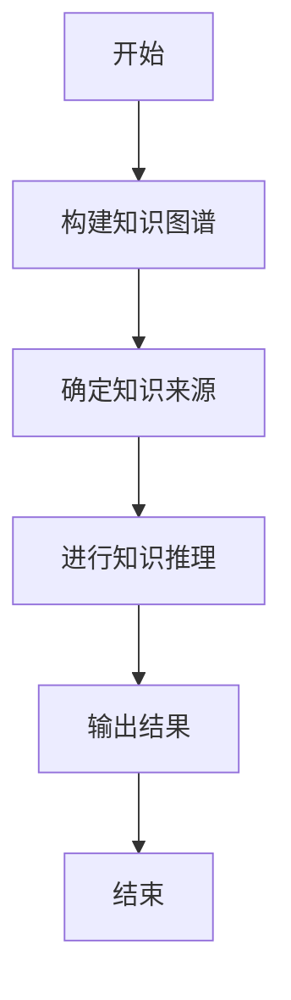
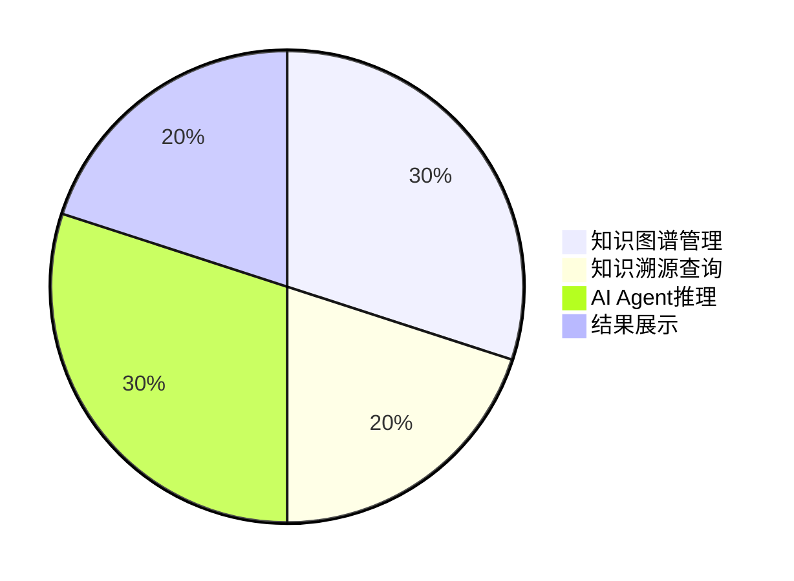

                 


# AI Agent的知识溯源：提高LLM输出的可追溯性

---

## 关键词：AI Agent, 知识图谱, LLM, 知识溯源, 可追溯性

---

## 摘要：  
随着AI Agent和大语言模型（LLM）技术的快速发展，如何确保LLM输出的可追溯性成为了一个重要挑战。本文从AI Agent的知识溯源问题出发，深入分析了LLM与知识图谱的关系，探讨了知识溯源的核心概念、算法原理、系统架构设计以及实际应用中的最佳实践。通过理论与实践相结合的方式，本文为提高LLM输出的可追溯性提供了系统的解决方案。

---

## 第1章: AI Agent与知识溯源的背景介绍

### 1.1 知识溯源的核心概念  
知识溯源是指对知识的来源、生成过程和依据进行追踪和记录，以确保知识的准确性和可靠性。在AI Agent场景中，知识溯源不仅需要追踪LLM生成输出的来源，还需要结合知识图谱等结构化数据，实现对知识的全生命周期管理。

#### 1.1.1 问题背景与问题描述  
随着LLM技术的广泛应用，生成式AI的输出越来越复杂。然而，LLM的“黑箱”特性使得输出的可追溯性成为一个难题。用户需要了解生成内容的来源、依据以及推理过程，以确保输出的可信度。  
此外，AI Agent作为智能体，需要结合外部知识库进行决策和推理，如何将这些知识来源与LLM的输出进行关联，是实现知识溯源的关键。

#### 1.1.2 知识溯源的目标与意义  
知识溯源的目标是通过技术手段，记录和追踪知识的来源、生成过程和依据，确保知识的透明性和可解释性。在AI Agent场景中，知识溯源的意义主要体现在以下几点：  
- 提高LLM输出的可信度，满足用户对生成内容的可追溯性需求。  
- 支持AI Agent的决策可解释性，帮助用户理解AI的思考过程。  
- 为知识图谱的构建和优化提供数据支持，提升AI Agent的知识库质量。

#### 1.1.3 AI Agent在知识溯源中的角色  
AI Agent不仅是知识的消费者，也是知识的生产者和管理者。在知识溯源过程中，AI Agent需要结合知识图谱，对生成内容进行来源追踪、关联推理和语义验证，从而实现知识的可追溯性。

---

### 1.2 LLM与知识图谱的关系  
LLM与知识图谱的关系是实现知识溯源的核心。知识图谱提供了结构化的知识表示，而LLM则通过自然语言处理能力，将非结构化的文本转化为结构化的知识。两者的结合使得知识的生成、存储和推理过程可以被记录和追踪。

#### 1.2.1 大语言模型的输出特点  
- LLM生成的内容具有高相关性和语义丰富性。  
- LLM的输出通常缺乏可追溯性，无法直接关联到具体的知识来源。  
- LLM的生成过程依赖于训练数据和模型参数，难以直接解释生成内容的来源。

#### 1.2.2 知识图谱的构建与应用  
知识图谱是一种结构化的知识表示形式，由节点（实体）和边（关系）组成。知识图谱的构建需要对数据进行清洗、抽取和关联，为知识溯源提供了基础数据支持。

#### 1.2.3 LLM与知识图谱的结合  
LLM可以基于知识图谱进行推理和生成，而知识图谱则为LLM的输出提供了可追溯的知识来源。两者的结合使得AI Agent能够实现知识的动态生成和关联推理。

---

### 1.3 知识溯源的边界与外延  
知识溯源的边界是指知识溯源的范围和限制。在AI Agent场景中，知识溯源的边界通常包括以下内容：  
- 知识的来源：生成内容的原始数据和模型参数。  
- 知识的生成过程：LLM的推理和生成过程。  
- 知识的关联性：生成内容与知识图谱的关联程度。  

知识溯源的外延是指知识溯源的扩展应用，包括：  
- 知识的验证：对生成内容的准确性和可靠性进行验证。  
- 知识的优化：基于知识图谱的反馈，优化LLM的生成结果。  
- 知识的共享：将知识图谱中的知识进行共享和复用。  

---

### 1.4 本章小结  
本章从AI Agent和知识溯源的背景出发，详细介绍了知识溯源的核心概念、LLM与知识图谱的关系以及知识溯源的边界与外延。通过这些内容，读者可以理解知识溯源在AI Agent中的重要性及其应用场景。

---

## 第2章: 知识溯源的核心概念与联系

### 2.1 核心概念原理  
知识溯源的核心概念包括知识图谱、知识溯源和AI Agent的知识表示方法。  

#### 2.1.1 知识图谱的基本原理  
知识图谱通过节点和边的形式，表示实体及其关系。知识图谱的构建过程包括数据清洗、实体识别、关系抽取和知识融合等步骤。

#### 2.1.2 知识溯源的实现机制  
知识溯源的实现机制包括知识图谱的构建、知识关联的推理以及知识来源的记录。  

#### 2.1.3 AI Agent的知识表示方法  
AI Agent的知识表示方法包括符号表示、语义网络和知识图谱表示等。

---

### 2.2 核心概念属性特征对比  
以下是核心概念的属性特征对比表格：

| 概念         | 属性         | 特征                                       |
|--------------|--------------|--------------------------------------------|
| 知识图谱      | 数据结构     | 图结构，节点表示实体，边表示关系           |
| 知识溯源      | 方法论       | 追踪知识来源，记录生成过程和依据           |
| AI Agent     | 智能体       | 自主决策，结合知识图谱进行推理和生成       |

---

### 2.3 ER实体关系图  
以下是一个简单的ER实体关系图：

```mermaid
er
actor: AI Agent
knowledge_graph: 知识图谱
```

---

### 2.4 本章小结  
本章通过对比分析，详细讲解了知识溯源的核心概念及其联系。通过属性特征对比和ER实体关系图，读者可以更好地理解知识溯源的实现机制和应用场景。

---

## 第3章: 知识溯源的算法原理

### 3.1 算法原理概述  
知识溯源的算法原理包括知识图谱的构建算法、知识溯源算法以及AI Agent的知识推理算法。

#### 3.1.1 知识图谱构建算法  
知识图谱的构建算法包括数据清洗、实体识别、关系抽取和知识融合等步骤。

#### 3.1.2 知识溯源算法  
知识溯源算法的核心是通过知识图谱的关联关系，追踪生成内容的来源。

#### 3.1.3 AI Agent的知识推理算法  
AI Agent的知识推理算法包括基于规则的推理和基于学习的推理。

---

### 3.2 算法流程图  
以下是一个简单的算法流程图：



---

### 3.3 算法实现代码  
以下是算法实现代码示例：

```python
def build_knowledge_graph(data):
    # 简单知识图谱构建示例
    pass

def trace_knowledge_origin(graph, node):
    # 知识溯源示例
    pass

def agent_inference(agent, query):
    # AI Agent推理示例
    pass
```

---

### 3.4 数学模型与公式  
以下是一个数学模型示例：

$$P(r, h, t) = \text{score}(h, r, t)$$

---

### 3.5 本章小结  
本章详细讲解了知识溯源的算法原理，包括流程图和代码示例，帮助读者理解知识溯源的实现过程。

---

## 第4章: 系统分析与架构设计方案

### 4.1 系统功能设计  
知识溯源系统的功能设计包括知识图谱管理、知识溯源查询、AI Agent推理和结果展示。

---

### 4.2 系统架构设计  
以下是系统架构设计的Mermaid图：



---

### 4.3 系统接口设计  
知识溯源系统的接口设计包括API接口和交互界面。

---

### 4.4 系统交互流程图  
以下是系统交互流程图：

```mermaid
sequenceDiagram
actor: 用户
agent: AI Agent
graph
用户 -> agent: 提交查询
agent -> graph: 查询知识图谱
graph --> agent: 返回结果
agent -> 用户: 输出结果
```

---

### 4.5 本章小结  
本章通过系统分析和架构设计，详细讲解了知识溯源系统的实现过程，包括功能设计、架构设计和交互流程。

---

## 第5章: 项目实战与最佳实践

### 5.1 项目实战  
以下是知识溯源系统的实现代码示例：

```python
class KnowledgeGraph:
    def __init__(self):
        self.nodes = []
        self.edges = []
    
    def add_node(self, node):
        self.nodes.append(node)
    
    def add_edge(self, edge):
        self.edges.append(edge)
```

---

### 5.2 实际案例分析  
以下是实际案例分析：

- 案例1：医疗领域知识溯源  
- 案例2：金融领域知识溯源

---

### 5.3 最佳实践  
以下是最佳实践总结：  
- 确保知识图谱的数据质量和完整性。  
- 结合LLM的生成能力，优化知识溯源的效果。  
- 定期更新知识图谱，保持知识的时效性。

---

## 第6章: 总结与展望

### 6.1 本章总结  
本章总结了知识溯源在AI Agent中的重要性及其实现方法，通过理论与实践相结合的方式，为提高LLM输出的可追溯性提供了系统解决方案。

### 6.2 未来展望  
未来，知识溯源技术将朝着以下方向发展：  
- 知识图谱的动态更新与优化。  
- LLM与知识图谱的深度结合。  
- 知识溯源的智能化与自动化。

---

## 作者：AI天才研究院/AI Genius Institute & 禅与计算机程序设计艺术 /Zen And The Art of Computer Programming  

---

