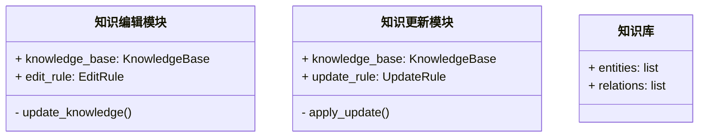
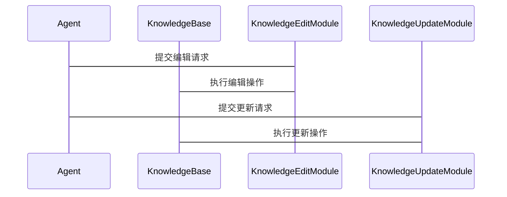

                 


# AI Agent的知识编辑与更新机制设计

## 关键词：
AI Agent、知识编辑、知识更新、算法原理、系统架构、项目实战

## 摘要：
本文深入探讨AI Agent的知识编辑与更新机制的设计与实现。从知识表示、编辑和更新的基本概念出发，详细分析了相关算法的原理，包括向量空间模型和基于规则的编辑算法。通过系统架构设计和项目实战，展示了如何在实际场景中应用这些机制，并提供了详细的代码实现和案例分析。最后，总结了最佳实践和未来发展，帮助读者全面掌握AI Agent的知识管理技术。

---

# 目录大纲：《AI Agent的知识编辑与更新机制设计》

## 第一部分：AI Agent的知识编辑与更新机制概述

### 第1章：AI Agent的基本概念与背景

#### 1.1 AI Agent的定义与特点
- 1.1.1 AI Agent的定义
  - AI Agent是一种能够感知环境、自主决策并执行任务的智能体。
- 1.1.2 AI Agent的核心特点
  - 智能性：能够理解环境并做出合理决策。
  - 自主性：无需外部干预，自主执行任务。
  - 社会性：能够与其他Agent或人类进行交互协作。
- 1.1.3 AI Agent的应用场景
  - 服务机器人、推荐系统、自动驾驶、智能助手等。

#### 1.2 知识编辑与更新机制的背景
- 1.2.1 知识编辑的必要性
  - 随着数据的不断增长，知识的准确性和及时性变得至关重要。
- 1.2.2 知识更新的挑战与重要性
  - 知识库需要动态更新以适应环境变化。
- 1.2.3 当前技术背景与发展趋势
  - 大语言模型（如GPT）、图神经网络（GNN）等技术推动了知识编辑与更新的发展。

---

## 第二部分：知识编辑与更新机制的核心概念

### 第2章：知识表示与编辑的基本概念

#### 2.1 知识表示
- 2.1.1 知识表示的定义
  - 知识表示是将现实世界中的信息转化为计算机能够理解和处理的形式。
- 2.1.2 知识表示的形式
  - 向量表示：通过向量空间模型表示知识，如Word2Vec。
  - 图结构表示：通过图模型（如知识图谱）表示实体及其关系。
- 2.1.3 知识表示的优缺点对比
  | 表示形式 | 优点 | 缺点 |
  |----------|------|------|
  | 向量     | 高维向量能够捕捉语义相似性 | 难以表示复杂的关系结构 |
  | 图结构   | 能够表示实体间的关系 | 实现复杂，计算资源消耗大 |

#### 2.2 知识编辑
- 2.2.1 知识编辑的定义
  - 知识编辑是对知识库中的知识进行添加、修改或删除的操作。
- 2.2.2 知识编辑的类型
  - 基于规则的编辑：根据预定义的规则进行知识修改。
  - 基于模型的编辑：利用机器学习模型自动生成编辑规则。
- 2.2.3 知识编辑的实现步骤
  1. 确定编辑目标。
  2. 选择合适的编辑方法。
  3. 执行编辑操作。
  4. 验证编辑结果。

#### 2.3 知识更新
- 2.3.1 知识更新的定义
  - 知识更新是根据新的信息动态调整知识库的过程。
- 2.3.2 知识更新的类型
  - 增量式更新：仅更新变化的部分。
  - 全量式更新：完全重建知识库。
- 2.3.3 知识更新的挑战
  - 数据一致性：确保新旧知识的一致性。
  - 性能问题：大规模知识库的更新效率。

---

### 第3章：知识表示与编辑的算法原理

#### 3.1 知识表示的向量空间模型

##### 3.1.1 向量空间模型的定义
- 向量空间模型将每个实体表示为高维向量，通过向量的相似性度量来表示实体之间的语义关系。

##### 3.1.2 向量空间模型的数学表示
$$
\text{向量相似性} = \frac{\vec{A} \cdot \vec{B}}{||\vec{A}|| \cdot ||\vec{B}||}
$$
其中，$\vec{A}$和$\vec{B}$分别为两个实体的向量表示。

##### 3.1.3 向量空间模型的优缺点
- 优点：计算高效，能够捕捉语义相似性。
- 缺点：难以处理复杂的关系结构。

#### 3.2 知识编辑的基于规则的算法

##### 3.2.1 基于规则的编辑算法的定义
- 基于预定义的规则对知识库进行编辑，例如删除重复信息或补充缺失信息。

##### 3.2.2 基于规则的编辑算法的实现步骤
1. 确定规则：例如，规则1：删除所有重复实体。
2. 应用规则：遍历知识库，删除所有重复实体。
3. 验证结果：检查删除后的知识库是否符合预期。

##### 3.2.3 基于规则的编辑算法的优缺点
- 优点：简单易实现，可控制性强。
- 缺点：难以处理复杂的语义编辑任务。

---

### 第4章：知识更新的算法原理

#### 4.1 知识更新的增量式算法

##### 4.1.1 增量式更新算法的定义
- 只更新变化的部分，节省计算资源和时间。

##### 4.1.2 增量式更新算法的实现步骤
1. 检测变化：识别需要更新的部分。
2. 更新知识库：仅修改变化的部分。
3. 验证结果：确保更新后的知识库一致性。

##### 4.1.3 增量式更新算法的优缺点
- 优点：高效，适合大规模知识库。
- 缺点：实现复杂，需要高效的检测机制。

#### 4.2 知识更新的基于图结构的算法

##### 4.2.1 基于图结构的更新算法的定义
- 利用图神经网络（GNN）对知识图谱进行更新。

##### 4.2.2 基于图结构的更新算法的实现步骤
1. 构建知识图谱：将知识表示为图结构，节点表示实体，边表示关系。
2. 更新图结构：根据新信息添加或修改节点和边。
3. 传播更新：通过GNN传播更新信息到整个图中。

##### 4.2.3 基于图结构的更新算法的优缺点
- 优点：能够处理复杂的关系结构。
- 缺点：计算资源消耗大，实现复杂。

---

## 第三部分：系统分析与架构设计

### 第5章：系统分析与架构设计

#### 5.1 问题场景介绍
- 知识库需要实时更新，以应对快速变化的环境。

#### 5.2 项目介绍
- 开发一个支持动态知识更新的AI Agent系统。

#### 5.3 系统功能设计
##### 5.3.1 领域模型设计


#### 5.4 系统架构设计


#### 5.5 系统接口设计
##### 5.5.1 接口描述
- `updateKnowledge(newKnowledge: Knowledge): void`
- `editKnowledge(rule: EditRule): void`

##### 5.5.2 接口交互流程


---

## 第四部分：项目实战

### 第6章：项目实战与案例分析

#### 6.1 环境安装
- 安装必要的库：如numpy、scikit-learn、networkx。

#### 6.2 核心实现
##### 6.2.1 知识表示的向量空间模型实现
```python
import numpy as np

def compute_similarity(vec1, vec2):
    return np.dot(vec1, vec2) / (np.linalg.norm(vec1) * np.linalg.norm(vec2))
```

##### 6.2.2 知识编辑的基于规则的实现
```python
class KnowledgeEditor:
    def __init__(self, knowledge_base):
        self.knowledge_base = knowledge_base
    
    def apply_rule(self, rule):
        if rule.type == 'remove_duplicates':
            self.knowledge_base.remove_duplicates()
```

##### 6.2.3 知识更新的基于图结构的实现
```python
import networkx as nx

class KnowledgeUpdater:
    def __init__(self, knowledge_graph):
        self.graph = knowledge_graph
    
    def update_graph(self, new_edge):
        self.graph.add_edge(*new_edge)
```

#### 6.3 案例分析
- 案例：更新知识图谱中的实体关系。
- 实现步骤：
  1. 初始化知识图谱。
  2. 添加新关系。
  3. 传播更新信息。

#### 6.4 项目小结
- 通过实际案例展示了知识编辑与更新机制的实现过程。
- 强调了代码实现与实际应用的结合。

---

## 第五部分：最佳实践与总结

### 第7章：最佳实践与总结

#### 7.1 最佳实践
- 设计原则：
  - 知识表示的选择应基于具体应用场景。
  - 知识编辑与更新算法的选择应考虑性能与准确性。
- 常见问题及解决方案：
  - 性能问题：采用增量式更新。
  - 一致性问题：使用基于规则的编辑。

#### 7.2 未来展望
- 结合大语言模型，提升知识编辑与更新的智能化水平。
- 研究更高效的算法，应对更大规模的知识库。

#### 7.3 小结
- 本文详细探讨了AI Agent的知识编辑与更新机制的设计与实现。
- 提供了丰富的理论分析和实际案例，帮助读者深入理解相关技术。

---

## 作者：AI天才研究院（AI Genius Institute）  
本文作者：AI天才研究院 & 禅与计算机程序设计艺术（Zen And The Art of Computer Programming）

