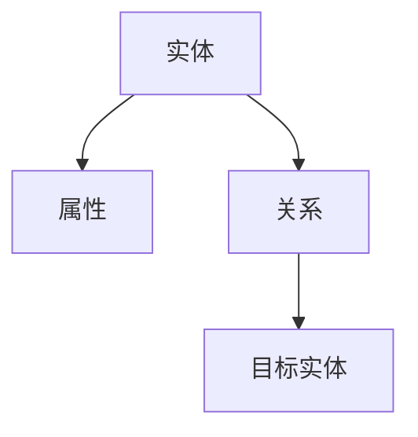
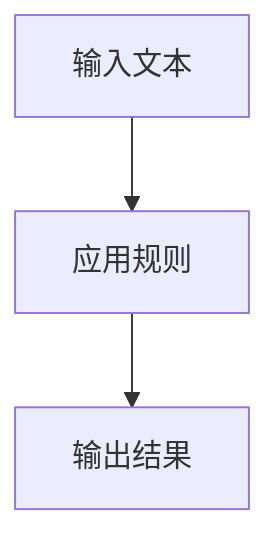
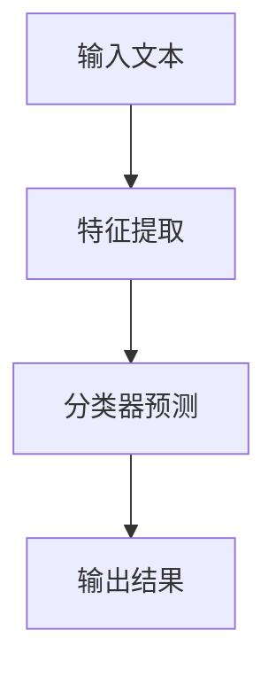
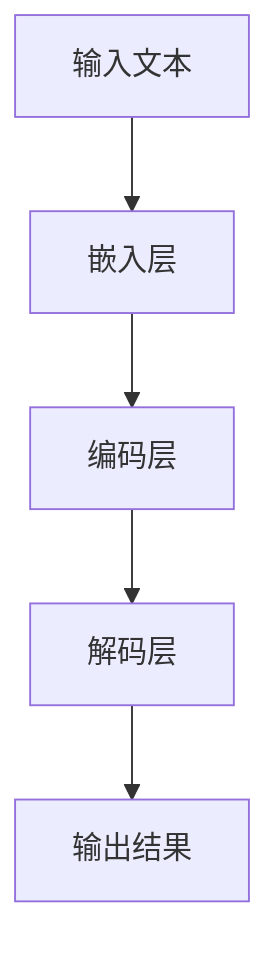
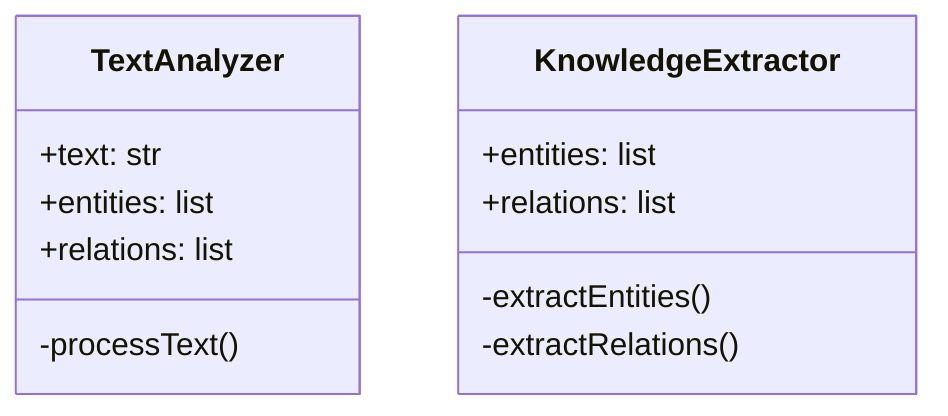
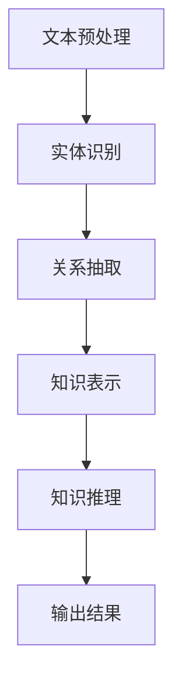
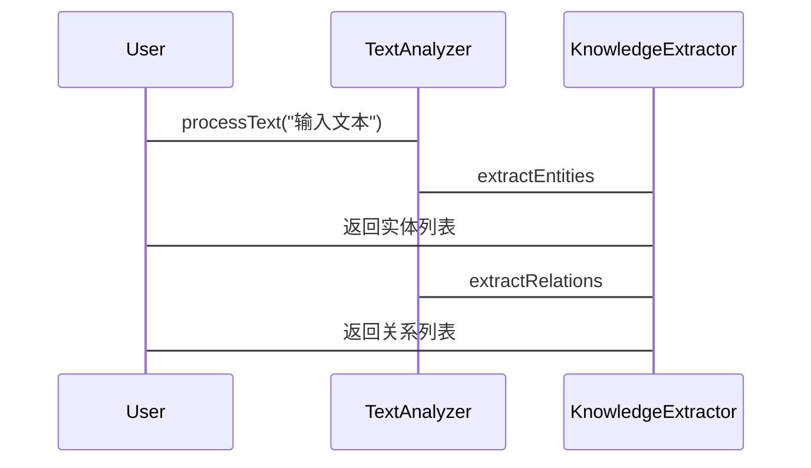

                 


# AI Agent的知识获取：从非结构化文本中提取信息

> 关键词：AI Agent，知识获取，非结构化文本，信息抽取，知识表示，自然语言处理，机器学习

> 摘要：AI Agent需要从非结构化文本中获取知识，以增强其智能性和决策能力。本文详细探讨了从非结构化文本中提取信息的核心概念、算法原理、系统架构设计、项目实战及最佳实践，帮助读者全面理解和掌握这一技术。

---

# 第一部分: AI Agent的知识获取背景与概念

# 第1章: 问题背景与概念介绍

## 1.1 问题背景

### 1.1.1 非结构化文本的挑战
- 非结构化文本占大部分数据（如社交媒体、新闻、对话等）。
- 信息分散，难以直接提取有用知识。
- 数据噪声大，如拼写错误、语法错误等。

### 1.1.2 AI Agent的知识获取需求
- AI Agent需要从非结构化文本中提取结构化知识。
- 知识获取是实现AI Agent智能决策的关键步骤。
- 需要处理多语言、多领域、多模态的文本数据。

### 1.1.3 知识获取的核心问题
- 如何准确提取实体、关系和语义信息。
- 如何处理模糊、歧义和不完整的信息。
- 如何高效处理大规模文本数据。

## 1.2 问题描述

### 1.2.1 非结构化文本的特点
- 文本数据无固定结构，难以直接使用。
- 文本内容多样，涵盖多个领域和主题。
- 文本中包含大量隐含信息，需要深度分析。

### 1.2.2 知识获取的目标
- 从文本中提取实体、关系和属性。
- 将提取的信息组织成结构化知识表示。
- 支持AI Agent的智能决策和推理。

### 1.2.3 知识表示的多样性
- 实体表示：如人名、组织名、地名等。
- 关系表示：如“属于”、“位于”、“构成”等。
- 属性表示：如颜色、形状、时间等。

## 1.3 问题解决方法

### 1.3.1 基于规则的方法
- 使用预定义的规则和模板进行信息抽取。
- 适用于特定领域和场景。

### 1.3.2 基于统计的方法
- 使用统计模型（如HMM）进行模式匹配。
- 适用于数据量大且规则不明确的场景。

### 1.3.3 基于深度学习的方法
- 使用神经网络（如LSTM、BERT）进行特征提取。
- 适用于复杂语义理解和上下文分析。

## 1.4 边界与外延

### 1.4.1 知识获取的边界
- 仅处理文本数据，不涉及图像、视频等其他模态。
- 仅提取显式信息，不进行知识推理和生成。

### 1.4.2 相关领域的外延
- 与自然语言处理（NLP）、信息检索（IR）、知识图谱（KB）等密切相关。
- 与其他AI技术（如机器学习、深度学习）深度融合。

### 1.4.3 与其他技术的区分
- 与文本分类、情感分析等任务的区别。
- 与知识推理、问答系统等任务的区别。

## 1.5 概念结构与核心要素

### 1.5.1 核心概念的组成
- 实体：文本中具有意义的独立单元。
- 关系：实体之间的连接和关联。
- 属性：实体的特征和描述。

### 1.5.2 概念之间的关系
- 实体是基础，关系是连接，属性是补充。
- 三者共同构成完整的知识表示。

### 1.5.3 核心要素的特征
- 实体具有唯一性、明确性和可识别性。
- 关系具有方向性、层次性和关联性。
- 属性具有可量化的特征。

---

# 第2章: 核心概念与联系

## 2.1 信息抽取与知识表示

### 2.1.1 信息抽取的定义
- 信息抽取是从文本中提取结构化信息的过程。
- 包括实体识别、关系抽取和语义理解。

### 2.1.2 知识表示的多样性
- 知识图谱：将实体、关系和属性组织成图结构。
- 本体论：定义领域内的基本概念和关系。
- RDF和OWL：基于语义网的表示方法。

### 2.1.3 信息抽取与知识表示的关系
- 信息抽取是知识表示的基础。
- 知识表示为信息抽取提供语义框架。

## 2.2 信息融合与知识推理

### 2.2.1 信息融合的定义
- 信息融合是将多个来源的信息整合成一致的表示。
- 适用于处理冗余和冲突信息。

### 2.2.2 知识推理的原理
- 通过逻辑推理或概率推理，从已有知识中推导新知识。
- 常见方法包括基于规则的推理和基于图的推理。

### 2.2.3 信息融合与知识推理的联系
- 信息融合为知识推理提供多样化的数据源。
- 知识推理为信息融合提供语义理解能力。

## 2.3 实体识别与关系抽取

### 2.3.1 实体识别的定义
- 实体识别是识别文本中的命名实体。
- 包括人名、组织名、地名等。

### 2.3.2 关系抽取的原理
- 关系抽取是识别文本中实体之间的关系。
- 包括直接关系和间接关系。

### 2.3.3 实体识别与关系抽取的对比
- 实体识别关注“谁”，关系抽取关注“关系”。

## 2.4 核心概念对比表

| 对比维度       | 信息抽取          | 知识表示          |
|----------------|-------------------|-------------------|
| 定义           | 提取结构化信息     | 表示知识结构       |
| 输入           | 非结构化文本       | 结构化数据或文本   |
| 输出           | 实体、关系、属性   | 知识图谱或本体论   |
| 方法           | 基于规则/统计/深度学习 | 基于图论/逻辑推理 |
| 应用场景       | 文本分析          | 知识库构建        |

## 2.5 ER实体关系图



---

# 第3章: 算法原理与实现

## 3.1 信息抽取算法原理

### 3.1.1 基于规则的抽取

#### 3.1.1.1 规则定义
- 使用正则表达式匹配特定模式。
- 例如：提取人名可以用模式`[A-Za-z]+`。

#### 3.1.1.2 实现流程


### 3.1.2 基于统计的抽取

#### 3.1.2.1 统计模型
- 使用条件概率公式：
  $$ P(word|class) = \frac{P(class|word)P(word)}{P(class)} $$
- 例如：使用HMM模型进行分词。

#### 3.1.2.2 实现流程


### 3.1.3 基于深度学习的抽取

#### 3.1.3.1 神经网络模型
- 使用LSTM或BERT进行序列建模。
- 例如：BERT模型可以捕捉上下文信息。

#### 3.1.3.2 实现流程


## 3.2 知识表示与推理算法

### 3.2.1 知识图谱的构建

#### 3.2.1.1 实体识别与链接
- 使用WikiData等知识库进行实体映射。

#### 3.2.1.2 关系抽取与构建
- 使用关系抽取模型（如RElationExtraction）提取关系。

### 3.2.2 基于符号逻辑的推理

#### 3.2.2.1 逻辑推理规则
- 使用一阶逻辑（FOL）进行推理。
- 例如：所有鸟都是动物，企鹅是鸟，所以企鹅是动物。

### 3.2.3 基于向量空间的推理

#### 3.2.3.1 向量表示
- 使用Word2Vec或GloVe生成词向量。
- 例如：向量运算`king - man + woman = queen`。

---

# 第4章: 系统分析与架构设计

## 4.1 问题场景介绍

### 4.1.1 应用场景
- 智能客服：从用户反馈中提取情感和关键词。
- 金融分析：从财报中提取财务指标。
- 医疗健康：从医学文献中提取疾病和治疗方法。

## 4.2 项目介绍

### 4.2.1 项目目标
- 构建一个从非结构化文本中提取知识的系统。
- 实现实体识别、关系抽取和知识推理功能。

### 4.2.2 系统功能设计

#### 4.2.2.1 领域模型


#### 4.2.2.2 系统架构


### 4.2.3 接口设计
- 输入接口：`processText(text: str) -> None`
- 输出接口：`extractEntities() -> list`, `extractRelations() -> list`

### 4.2.4 交互流程


---

# 第5章: 项目实战

## 5.1 环境安装

### 5.1.1 安装Python
```bash
python --version
pip install --upgrade pip
```

### 5.1.2 安装依赖库
```bash
pip install spacy transformers
python -m spacy download en_core_web_sm
```

## 5.2 系统核心实现源代码

### 5.2.1 实体识别实现
```python
import spacy

nlp = spacy.load("en_core_web_sm")

def extract_entities(text):
    doc = nlp(text)
    entities = []
    for ent in doc.ents:
        entities.append((ent.text, ent.label_))
    return entities
```

### 5.2.2 关系抽取实现
```python
from transformers import BertForTokenClassification, BertTokenizer

model = BertForTokenClassification.from_pretrained("bert-base")
tokenizer = BertTokenizer.from_pretrained("bert-base")

def extract_relations(text):
    inputs = tokenizer.encode_plus(text, return_tensors="pt")
    outputs = model(inputs)
    relations = []
    # 解析outputs以提取关系
    return relations
```

## 5.3 代码应用解读与分析

### 5.3.1 实体识别代码解读
- 使用spaCy库进行实体识别。
- 返回实体文本和实体类型。

### 5.3.2 关系抽取代码解读
- 使用BERT模型进行关系抽取。
- 解析模型输出以获取实体关系。

## 5.4 实际案例分析

### 5.4.1 案例文本
```text
"Apple was founded by Steve Jobs in 1976."
```

### 5.4.2 实体识别结果
- 实体：Apple（ORG）、Steve Jobs（PERSON）、1976（DATE）

### 5.4.3 关系抽取结果
- 关系：founded_by（Apple - Steve Jobs）
- 时间：founded（Apple - 1976）

## 5.5 项目小结

### 5.5.1 核心代码实现
- 实体识别和关系抽取是关键功能。
- 使用spaCy和BERT库实现高效提取。

### 5.5.2 实际应用中的挑战
- 处理歧义和不完整信息。
- 提高模型的准确性和鲁棒性。

---

# 第6章: 最佳实践、小结、注意事项与拓展阅读

## 6.1 最佳实践

### 6.1.1 数据预处理
- 清洗文本数据，去除噪声。
- 分词和分句处理。

### 6.1.2 模型选择
- 根据任务选择合适的模型。
- 调参和优化模型性能。

### 6.1.3 知识图谱构建
- 使用知识图谱工具（如Neo4j）存储和管理知识。
- 定期更新和维护知识图谱。

## 6.2 小结

### 6.2.1 核心内容回顾
- AI Agent需要从非结构化文本中获取知识。
- 信息抽取、知识表示和推理是关键步骤。
- 深度学习和知识图谱技术是未来发展方向。

## 6.3 注意事项

### 6.3.1 数据质量
- 数据清洗和预处理影响提取效果。
- 数据标注和验证是关键。

### 6.3.2 模型选择
- 根据任务需求选择合适的模型。
- 避免过度依赖单一模型。

### 6.3.3 系统设计
- 系统架构要模块化设计。
- 接口设计要标准化。

## 6.4 拓展阅读

### 6.4.1 推荐书籍
- 《自然语言处理入门》
- 《知识图谱：概念、方法与应用》

### 6.4.2 推荐论文
- "A Survey on Text Data Extraction and Knowledge Representation"
- "BERT: Pre-training of Deep Bidirectional Transformers for Natural Language Processing"

---

# 作者：AI天才研究院/AI Genius Institute & 禅与计算机程序设计艺术 /Zen And The Art of Computer Programming

