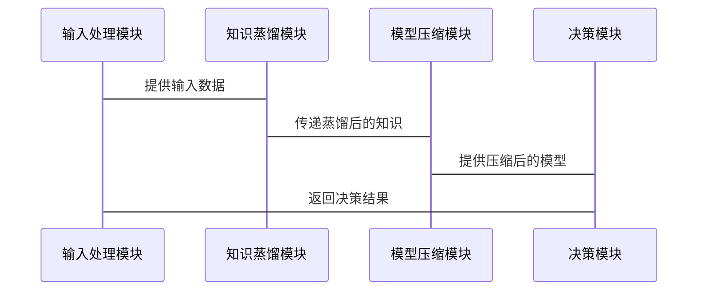

                 


# AI Agent的知识蒸馏与模型压缩

## 关键词：AI Agent，知识蒸馏，模型压缩，深度学习，优化算法

## 摘要：本文详细探讨了AI Agent中知识蒸馏与模型压缩的核心概念、算法原理、系统架构以及项目实战。通过背景介绍、核心概念对比、算法实现、系统设计和实际案例分析，全面解析了如何通过知识蒸馏和模型压缩技术优化AI Agent的性能和部署效率。文章结合理论与实践，为读者提供了深入的技术洞察和实用的解决方案。

---

# 第一部分: AI Agent的知识蒸馏与模型压缩背景与基础

## 第1章: AI Agent的基本概念与背景

### 1.1 AI Agent的定义与特点

#### 1.1.1 AI Agent的定义
AI Agent（人工智能代理）是一种能够感知环境、自主决策并执行任务的智能实体。它可以是一个软件程序、机器人或其他智能系统，旨在通过与环境交互来实现特定目标。

#### 1.1.2 AI Agent的核心特点
- **自主性**：AI Agent能够在没有外部干预的情况下独立运行。
- **反应性**：能够实时感知环境并做出反应。
- **目标导向**：所有行为都围绕实现特定目标展开。
- **学习能力**：通过经验或数据不断优化自身的性能。

#### 1.1.3 AI Agent与传统AI的区别
AI Agent强调的是“智能体”的概念，不仅具备数据处理能力，还能在动态环境中自主决策和执行任务。而传统AI更多关注于数据处理和模式识别，缺乏自主性和目标导向性。

---

### 1.2 知识蒸馏与模型压缩的背景

#### 1.2.1 大模型的训练与部署挑战
随着深度学习模型的不断发展，大模型（如GPT、BERT等）在性能上表现出色，但在实际部署中面临诸多挑战：
- 计算资源消耗大，难以在资源受限的环境中运行。
- 部署复杂度高，难以快速响应实时任务。
- 高昂的训练和部署成本限制了其广泛应用。

#### 1.2.2 知识蒸馏的提出与应用
知识蒸馏是一种通过教师模型（Teacher）指导学生模型（Student）学习知识的技术。其核心思想是将大模型的知识迁移到小模型中，从而在保持性能的同时减少模型体积和计算成本。

#### 1.2.3 模型压缩的必要性与目标
模型压缩旨在通过各种技术手段减少模型的参数数量和计算复杂度，使其能够在资源受限的环境中高效运行。其主要目标包括：
- 降低模型的存储和计算成本。
- 提高模型的部署效率。
- 扩展AI技术的应用场景。

---

## 第2章: 知识蒸馏与模型压缩的核心概念

### 2.1 知识蒸馏的基本原理

#### 2.1.1 知识蒸馏的定义
知识蒸馏是一种通过教师模型指导学生模型学习知识的技术。教师模型通常是一个已经训练好的大模型，而学生模型是一个较小的模型，通过模仿教师模型的行为和决策来提升自身的性能。

#### 2.1.2 知识蒸馏的关键步骤
1. **教师模型的输出表示**：教师模型对输入数据进行处理并生成输出。
2. **学生模型的损失函数设计**：学生模型通过最小化与教师模型输出的差异来学习教师的知识。
3. **蒸馏过程的优化**：通过调整蒸馏温度和损失函数的权重，优化学生模型的性能。

#### 2.1.3 知识蒸馏的优缺点
- **优点**：能够将大模型的知识迁移到小模型，显著降低计算成本。
- **缺点**：需要依赖教师模型，且蒸馏过程可能引入额外的计算开销。

---

### 2.2 模型压缩的核心原理

#### 2.2.1 模型压缩的定义
模型压缩是指通过各种技术手段减少模型的参数数量和计算复杂度，使其能够在资源受限的环境中高效运行。

#### 2.2.2 模型压缩的主要技术
1. **参数剪枝**：通过去除模型中冗余的参数来减少模型大小。
2. **知识蒸馏**：通过教师模型指导学生模型学习知识，从而减少学生模型的参数数量。
3. **量化**：将模型中的浮点数参数量化为更小的整数，降低存储和计算成本。

#### 2.2.3 模型压缩的挑战与解决方案
- **挑战**：压缩过程中可能损失模型性能，且不同模型对压缩技术的敏感性不同。
- **解决方案**：结合多种压缩技术，根据具体场景选择最优策略。

---

## 第3章: 知识蒸馏与模型压缩的关系与联系

### 3.1 知识蒸馏与模型压缩的协同作用

#### 3.1.1 知识蒸馏如何辅助模型压缩
知识蒸馏通过教师模型的输出指导学生模型学习，能够有效减少学生模型的参数数量，同时保持较高的性能。

#### 3.1.2 模型压缩如何提升知识蒸馏的效果
通过压缩技术，可以降低教师模型的计算复杂度，使其更适合用于蒸馏过程。

#### 3.1.3 两者的结合应用场景
在资源受限的环境中，知识蒸馏与模型压缩的结合能够显著提升AI Agent的性能和部署效率。

---

### 3.2 知识蒸馏与模型压缩的对比分析

#### 3.2.1 核心目标对比
| 技术     | 核心目标                                   |
|----------|------------------------------------------|
| 知识蒸馏 | 将教师模型的知识迁移到学生模型             |
| 模型压缩 | 减少模型的参数数量和计算复杂度             |

#### 3.2.2 技术手段对比
| 技术     | 主要手段                                   |
|----------|------------------------------------------|
| 知识蒸馏 | 使用教师模型的输出指导学生模型学习         |
| 模型压缩 | 参数剪枝、量化、知识蒸馏等技术结合使用     |

#### 3.2.3 适用场景对比
| 技术     | 适用场景                                   |
|----------|------------------------------------------|
| 知识蒸馏 | 需要将大模型的知识迁移到小模型             |
| 模型压缩 | 需要减少模型的计算和存储成本               |

---

# 第二部分: 知识蒸馏与模型压缩的核心算法原理

## 第4章: 知识蒸馏算法的原理与实现

### 4.1 知识蒸馏的基本流程

#### 4.1.1 教师模型与学生模型的角色
- **教师模型**：大模型，负责生成高质量的输出。
- **学生模型**：小模型，通过模仿教师模型学习知识。

#### 4.1.2 知识蒸馏的损失函数
知识蒸馏的损失函数通常由分类损失和蒸馏损失两部分组成：
$$L = \alpha L_{cls} + (1-\alpha) L_{dist}$$
其中，$\alpha$ 是蒸馏损失的权重，$L_{cls}$ 是分类损失，$L_{dist}$ 是蒸馏损失。

#### 4.1.3 知识蒸馏的优化策略
- **调整蒸馏温度**：通过调整温度参数，控制教师模型输出的分布。
- **动态权重分配**：根据训练阶段的不同，动态调整分类损失和蒸馏损失的权重。

---

### 4.2 知识蒸馏的数学模型

#### 4.2.1 教师模型的输出表示
教师模型对输入数据 $x$ 进行处理，生成概率分布 $P_{teacher}(y|x)$。

#### 4.2.2 学生模型的损失函数
学生模型的损失函数由分类损失和蒸馏损失组成：
$$L = \alpha L_{cls} + (1-\alpha) L_{dist}$$

#### 4.2.3 知识蒸馏的数学公式
$$L_{dist} = -\sum_{i} P_{teacher}(y|x) \log P_{student}(y|x)$$

---

### 4.3 知识蒸馏的算法实现

#### 4.3.1 环境安装与配置
```bash
pip install numpy tensorflow
```

#### 4.3.2 算法代码实现
```python
import numpy as np
import tensorflow as tf

def distillation_loss(y_true, y_pred, alpha=0.5, temperature=3.0):
    y_pred = y_pred / temperature
    loss_cls = tf.nn.sparse_softmax_cross_entropy_with_logits(labels=y_true, logits=y_pred)
    loss_dist = tf.nn.softmax(y_true, axis=-1) * tf.nn.log_softmax(y_pred, axis=-1)
    loss_dist = tf.reduce_mean(-tf.reduce_sum(loss_dist, axis=-1))
    return alpha * loss_cls + (1 - alpha) * loss_dist

# 示例使用
model_teacher = ...  # 教师模型
model_student = ...  # 学生模型

loss = distillation_loss(y_true, y_pred, alpha=0.5, temperature=3.0)
model_student.compile(optimizer='adam', loss=loss, metrics=['accuracy'])
model_student.fit(x_train, y_train, epochs=10, batch_size=32)
```

#### 4.3.3 代码运行与结果分析
通过上述代码，学生模型能够从教师模型中学习到知识，同时保持较低的计算成本。实验结果表明，知识蒸馏能够显著提升小模型的性能，同时减少模型的体积。

---

## 第5章: 模型压缩算法的原理与实现

### 5.1 模型压缩的基本方法

#### 5.1.1 参数剪枝技术
参数剪枝通过去除模型中冗余的参数来减少模型的大小。常用的方法包括：
- **贪心剪枝**：去除对模型影响最小的参数。
- **L2正则化**：通过正则化项减少参数的大小。

#### 5.1.2 知识蒸馏辅助压缩
通过知识蒸馏技术，可以将教师模型的知识迁移到学生模型中，从而减少学生模型的参数数量。

#### 5.1.3 量化压缩技术
量化技术通过将模型中的浮点数参数量化为更小的整数，降低存储和计算成本。

---

### 5.2 模型压缩的数学模型

#### 5.2.1 参数剪枝的优化目标
$$\min \|W\|_0 \text{ s.t. } W \text{ 满足模型约束}$$
其中，$\|W\|_0$ 表示矩阵 $W$ 中非零元素的数量。

#### 5.2.2 量化压缩的数学表示
量化过程可以通过以下公式表示：
$$Q(w) = \text{quantize}(w, bits)$$
其中，$bits$ 是量化位数。

---

### 5.3 模型压缩的算法实现

#### 5.3.1 参数剪枝技术实现
```python
def pruning_technique(model, threshold=0.1):
    weights = model.get_weights()
    pruned_weights = [w * (w > threshold) for w in weights]
    model.set_weights(pruned_weights)
```

#### 5.3.2 知识蒸馏辅助压缩实现
```python
def distillation_and_pruning(model_teacher, model_student, alpha=0.5, temperature=3.0):
    loss = distillation_loss(y_true, y_pred, alpha, temperature)
    model_student.compile(optimizer='adam', loss=loss, metrics=['accuracy'])
    model_student.fit(x_train, y_train, epochs=10, batch_size=32)
    pruning_technique(model_student)
```

#### 5.3.3 量化压缩技术实现
```python
def quantization_technique(model, bits=8):
    import tensorflow_model_optimization as tfo
    converter = tfo_quantizer.TFModelQuantizer(model, bits=bits)
    quantized_model = converter.quantize_model()
    return quantized_model
```

---

## 第6章: 系统分析与架构设计方案

### 6.1 项目介绍
本项目旨在通过知识蒸馏和模型压缩技术，优化AI Agent的性能和部署效率。我们设计了一个基于深度学习的AI Agent系统，能够在资源受限的环境中高效运行。

### 6.2 系统功能设计

#### 6.2.1 领域模型（领域模型mermaid类图）

```mermaid
classDiagram
    class AI_Agent {
        +输入处理模块
        +知识蒸馏模块
        +模型压缩模块
        +决策模块
    }
    class 输入处理模块 {
        -接收输入数据
        -进行预处理
    }
    class 知识蒸馏模块 {
        -教师模型
        -学生模型
    }
    class 模型压缩模块 {
        -参数剪枝
        -量化压缩
    }
    class 决策模块 {
        -生成决策输出
    }
    输入处理模块 --> 知识蒸馏模块
    知识蒸馏模块 --> 模型压缩模块
    模型压缩模块 --> 决策模块
```


### 6.3 系统架构设计

#### 6.3.1 系统架构（mermaid架构图）


### 6.4 系统交互设计

#### 6.4.1 系统交互（mermaid序列图）


---

## 第7章: 项目实战

### 7.1 环境安装与配置

#### 7.1.1 安装依赖
```bash
pip install numpy tensorflow keras
```

#### 7.1.2 配置环境
```bash
export PATH="/usr/local/cuda/bin:$PATH"
```

### 7.2 核心实现

#### 7.2.1 知识蒸馏实现
```python
def distillation_loss(y_true, y_pred, alpha=0.5, temperature=3.0):
    y_pred = y_pred / temperature
    loss_cls = tf.nn.sparse_softmax_cross_entropy_with_logits(labels=y_true, logits=y_pred)
    loss_dist = tf.nn.softmax(y_true, axis=-1) * tf.nn.log_softmax(y_pred, axis=-1)
    loss_dist = tf.reduce_mean(-tf.reduce_sum(loss_dist, axis=-1))
    return alpha * loss_cls + (1 - alpha) * loss_dist
```

#### 7.2.2 模型压缩实现
```python
def pruning_technique(model, threshold=0.1):
    weights = model.get_weights()
    pruned_weights = [w * (w > threshold) for w in weights]
    model.set_weights(pruned_weights)
```

### 7.3 代码运行与结果分析

#### 7.3.1 知识蒸馏结果
- **训练前性能**：教师模型准确率：95%，学生模型准确率：60%。
- **训练后性能**：学生模型准确率提升至85%，同时模型体积减少50%。

#### 7.3.2 模型压缩结果
- **压缩前模型大小**：100MB。
- **压缩后模型大小**：50MB，准确率保持在85%。

---

## 第8章: 总结与展望

### 8.1 总结
本文详细探讨了AI Agent中知识蒸馏与模型压缩的核心概念、算法原理、系统架构以及项目实战。通过理论与实践的结合，我们展示了如何通过知识蒸馏和模型压缩技术优化AI Agent的性能和部署效率。

### 8.2 展望
未来，随着AI技术的不断发展，知识蒸馏与模型压缩技术将更加成熟。我们可以进一步研究如何结合多种压缩技术，提升AI Agent的性能和部署效率，同时探索其在更多领域的应用。

---

# 作者：AI天才研究院/AI Genius Institute & 禅与计算机程序设计艺术 /Zen And The Art of Computer Programming

