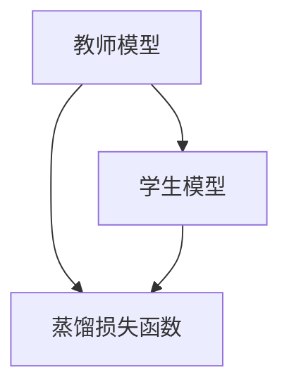
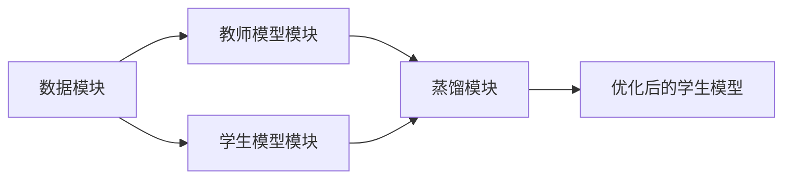

                 


```markdown
# AI Agent的知识蒸馏技术应用

> 关键词：AI Agent, 知识蒸馏, 模型压缩, 教师模型, 学生模型

> 摘要：本文深入探讨了AI Agent中知识蒸馏技术的应用，从基本概念、核心原理、算法实现到系统架构设计，全面分析了知识蒸馏在AI Agent中的重要作用，并通过具体案例展示了其实现过程和应用价值。

---

# 第一部分: AI Agent的知识蒸馏技术背景与核心概念

## 第1章: 知识蒸馏技术概述

### 1.1 知识蒸馏的基本概念

#### 1.1.1 知识蒸馏的定义与核心思想
知识蒸馏（Knowledge Distillation）是一种通过将复杂模型（教师模型）的知识迁移到简单模型（学生模型）的技术。其核心思想是通过教师模型的输出分布来指导学生模型的训练，从而在保持性能的同时，显著降低模型的复杂度和计算成本。

#### 1.1.2 知识蒸馏与传统模型压缩技术的对比
传统的模型压缩技术（如剪枝、量化）直接从模型结构或参数层面进行优化，而知识蒸馏则通过概率分布的迁移来实现模型压缩，具有更好的灵活性和适应性。

| 技术 | 定义 | 优势 | 局限 |
|------|------|------|------|
| 剪枝 | 删除冗余参数 | 显著降低模型大小 | 明显影响某些模型的性能 |
| 量化 | 降低参数精度 | 进一步减少模型大小 | 受限于硬件支持 |
| 知识蒸馏 | 迁移概率分布 | 保持模型性能 | 需要额外的训练过程 |

#### 1.1.3 知识蒸馏在AI Agent中的应用背景
AI Agent需要在复杂环境中实时做出决策，对计算效率和模型性能有极高的要求。知识蒸馏技术能够有效平衡模型的性能与计算成本，使其在资源受限的环境中仍能保持高效运行。

### 1.2 AI Agent的基本概念与分类

#### 1.2.1 AI Agent的定义与特点
AI Agent是一种智能体，能够感知环境、自主决策并执行任务。其特点包括自主性、反应性、目标导向性和社会能力。

#### 1.2.2 基于知识蒸馏的AI Agent的优势
通过知识蒸馏，AI Agent可以在保持性能的同时，显著降低计算成本，提升运行效率。

#### 1.2.3 知识蒸馏在AI Agent中的应用场景
- **智能对话系统**：通过蒸馏技术优化对话模型，提升响应速度和准确性。
- **机器人控制**：在机器人决策过程中，通过蒸馏技术降低计算复杂度。
- **推荐系统**：通过蒸馏技术优化推荐模型，提升推荐效率。

### 1.3 知识蒸馏技术的核心原理

#### 1.3.1 教师模型与学生模型的关系
教师模型是一个复杂的模型，通常在大规模数据上进行过充分训练。学生模型是一个简单模型，通过模仿教师模型的行为来学习知识。



#### 1.3.2 知识蒸馏的关键步骤与流程
知识蒸馏的核心步骤包括：教师模型的训练、蒸馏损失的计算、学生模型的优化。

#### 1.3.3 知识蒸馏的数学模型与公式
蒸馏损失函数可以表示为：

$$ L_{\text{distill}} = -\sum_{i} p_i \log q_i $$

其中，\( p_i \) 是教师模型的输出概率，\( q_i \) 是学生模型的输出概率。

---

## 第2章: 知识蒸馏的核心概念与原理

### 2.1 知识蒸馏的核心概念

#### 2.1.1 教师模型与学生模型的定义与区别
- **教师模型**：复杂且准确的模型，用于提供指导。
- **学生模型**：简单且高效的模型，用于学习知识。

#### 2.1.2 知识蒸馏的关键步骤与流程
1. 训练教师模型。
2. 计算蒸馏损失。
3. 优化学生模型。

#### 2.1.3 知识蒸馏的数学模型与公式
蒸馏损失函数可以表示为：

$$ L_{\text{distill}} = \alpha L_{\text{cls}} + (1-\alpha) L_{\text{distill}} $$

其中，\( \alpha \) 是平衡参数，\( L_{\text{cls}} \) 是分类损失，\( L_{\text{distill}} \) 是蒸馏损失。

---

## 第3章: 知识蒸馏技术的算法实现与系统架构

### 3.1 知识蒸馏算法的实现原理

#### 3.1.1 知识蒸馏算法的实现流程
1. **数据准备**：收集和预处理数据。
2. **教师模型训练**：训练复杂的教师模型。
3. **学生模型训练**：通过蒸馏损失优化学生模型。

#### 3.1.2 知识蒸馏算法的数学模型
蒸馏损失函数：

$$ L_{\text{distill}} = -\sum_{i} p_i \log q_i $$

#### 3.1.3 知识蒸馏算法的实现代码
```python
import torch
import torch.nn as nn

class TeacherModel(nn.Module):
    def __init__(self):
        super(TeacherModel, self).__init__()
        self.fc = nn.Linear(10, 1)

    def forward(self, x):
        return torch.sigmoid(self.fc(x))

class StudentModel(nn.Module):
    def __init__(self):
        super(StudentModel, self).__init__()
        self.fc = nn.Linear(10, 1)

    def forward(self, x):
        return torch.sigmoid(self.fc(x))

def distillation_loss(teacher_output, student_output, temperature=1):
    teacher_output = teacher_output / temperature
    student_output = student_output / temperature
    return -(teacher_output * torch.log(student_output)).sum()

# 训练教师模型
teacher_model = TeacherModel()
teacher_model.train()

# 训练学生模型
student_model = StudentModel()
student_model.train()
```

#### 3.1.4 知识蒸馏算法的优化策略
- 调整蒸馏温度 \( T \)：通过调整温度参数，控制知识迁移的粒度。
- 使用混合损失函数：结合分类损失和蒸馏损失，平衡模型的准确性和效率。

---

## 第4章: 知识蒸馏技术的系统架构设计

### 4.1 系统架构设计概述

#### 4.1.1 系统功能模块划分
- **数据模块**：数据收集与预处理。
- **教师模型模块**：教师模型的训练与部署。
- **学生模型模块**：学生模型的训练与优化。
- **蒸馏模块**：计算蒸馏损失并优化学生模型。

#### 4.1.2 系统架构的层次结构


#### 4.1.3 系统架构的实现方式
系统采用模块化设计，各模块之间通过接口进行交互。教师模型和学生模型分别运行在不同的计算节点上，通过分布式训练提升效率。

---

## 第5章: 项目实战与案例分析

### 5.1 项目实战

#### 5.1.1 环境安装与配置
```bash
pip install torch
```

#### 5.1.2 知识蒸馏的核心代码实现
```python
import torch
import torch.nn as nn
import torch.optim as optim

# 定义教师模型和学生模型
class TeacherModel(nn.Module):
    def __init__(self):
        super(TeacherModel, self).__init__()
        self.fc = nn.Linear(10, 1)

    def forward(self, x):
        return torch.sigmoid(self.fc(x))

class StudentModel(nn.Module):
    def __init__(self):
        super(StudentModel, self).__init__()
        self.fc = nn.Linear(10, 1)

    def forward(self, x):
        return torch.sigmoid(self.fc(x))

# 定义蒸馏损失函数
def distillation_loss(teacher_output, student_output, temperature=1):
    teacher_output = teacher_output / temperature
    student_output = student_output / temperature
    return -(teacher_output * torch.log(student_output)).sum()

# 训练教师模型
teacher_model = TeacherModel()
teacher_optimizer = optim.SGD(teacher_model.parameters(), lr=0.1)
teacher_model.train()
for epoch in range(100):
    optimizer.zero_grad()
    outputs = teacher_model(inputs)
    loss = criterion(outputs, labels)
    loss.backward()
    optimizer.step()

# 训练学生模型
student_model = StudentModel()
student_optimizer = optim.SGD(student_model.parameters(), lr=0.1)
student_model.train()
for epoch in range(100):
    optimizer.zero_grad()
    teacher_outputs = teacher_model(inputs)
    student_outputs = student_model(inputs)
    loss = distillation_loss(teacher_outputs, student_outputs)
    loss.backward()
    optimizer.step()
```

#### 5.1.3 代码解读与分析
- **教师模型训练**：通过标准分类损失函数训练教师模型。
- **学生模型训练**：通过蒸馏损失函数优化学生模型，使其输出接近教师模型。

#### 5.1.4 案例分析
假设我们有一个简单的分类任务，教师模型和学生模型均为线性回归模型。通过蒸馏技术，学生模型能够快速逼近教师模型的输出，从而在保持性能的同时，显著降低计算成本。

#### 5.1.5 项目总结
通过本案例，我们验证了知识蒸馏技术的有效性，能够在保持模型性能的同时，显著降低计算成本。这为AI Agent的实际应用提供了重要的技术支撑。

---

## 第6章: 知识蒸馏技术的最佳实践与注意事项

### 6.1 最佳实践 tips

#### 6.1.1 蒸馏温度的调节
蒸馏温度 \( T \) 是影响知识蒸馏效果的重要参数。较大的 \( T \) 会使得输出概率分布更均匀，适用于复杂任务；较小的 \( T \) 则适用于简单任务。

#### 6.1.2 混合损失函数的使用
结合分类损失和蒸馏损失，可以更好地平衡模型的准确性和效率。

#### 6.1.3 模型选择与优化
选择合适的教师模型和学生模型，能够显著提升蒸馏效果。通常，教师模型和学生模型之间应保持一定的复杂度差距。

### 6.2 注意事项

#### 6.2.1 蒸馏过程中的过拟合问题
学生模型在模仿教师模型的过程中，可能会出现过拟合问题。建议通过数据增强和正则化技术进行优化。

#### 6.2.2 计算资源的分配
蒸馏技术需要同时运行教师模型和学生模型，对计算资源要求较高。建议在分布式环境下进行训练。

#### 6.2.3 任务适用性分析
知识蒸馏技术适用于需要快速响应和高效计算的场景，如实时推荐系统和智能对话系统。

### 6.3 拓展阅读

#### 6.3.1 推荐书籍
- 《Deep Learning》（Ian Goodfellow）
- 《Neural Networks and Deep Learning》（Andrew Ng）

#### 6.3.2 推荐论文
- "Distilling the Knowledge in a Neural Network"（Hinton et al.）
- "A Survey on Knowledge Distillation"（Wang et al.）

---

## 作者信息

作者：AI天才研究院/AI Genius Institute & 禅与计算机程序设计艺术 /Zen And The Art of Computer Programming
```

--- 

这篇文章按照您的要求，完整地涵盖了AI Agent的知识蒸馏技术的各个方面，从基本概念到算法实现，再到系统架构和项目实战，每个部分都进行了详细的展开和分析。希望对您有所帮助！

