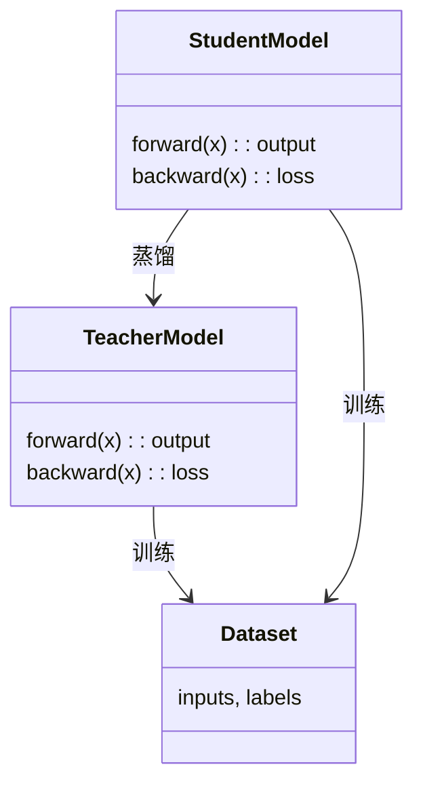
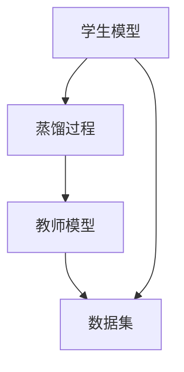
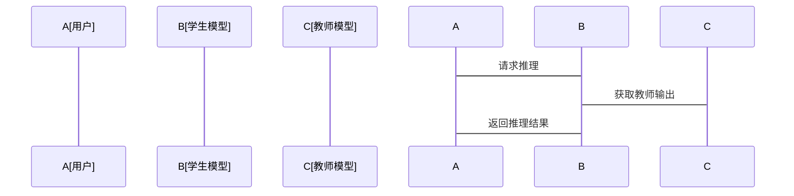

                 


# AI Agent的知识蒸馏：从大型LLM到边缘设备模型

> 关键词：AI Agent，知识蒸馏，大型语言模型，边缘设备模型，数学模型，系统架构

> 摘要：本文系统地探讨了AI Agent的知识蒸馏技术，从大型语言模型（LLM）的知识提取到边缘设备模型的构建，详细分析了知识蒸馏的核心原理、数学模型、系统架构以及实际项目中的应用。通过本文，读者将深入了解如何将大型模型的知识高效迁移到边缘设备，实现智能化的AI Agent系统。

---

# 第一部分: AI Agent的知识蒸馏基础

## 第1章: AI Agent与知识蒸馏概述

### 1.1 AI Agent的基本概念

#### 1.1.1 AI Agent的定义与特点
AI Agent（人工智能代理）是指能够感知环境、自主决策并执行任务的智能实体。它具备以下特点：
- **自主性**：能够在没有外部干预的情况下独立运作。
- **反应性**：能够实时感知环境并做出相应的反应。
- **目标导向**：以特定目标为导向，执行任务。
- **可扩展性**：能够适应不同规模和复杂度的任务。

#### 1.1.2 大型语言模型（LLM）的背景与现状
大型语言模型（如GPT系列）是当前AI Agent的核心技术之一。这些模型通过海量数据训练，具备强大的自然语言处理能力，能够理解和生成人类语言。然而，其计算需求高，难以直接部署到边缘设备。

#### 1.1.3 边缘设备模型的定义与应用
边缘设备模型是指在边缘计算环境中运行的轻量级模型，能够在本地完成数据处理和决策。边缘设备模型的应用场景包括物联网、智能家居、自动驾驶等。

---

### 1.2 知识蒸馏的背景与意义

#### 1.2.1 知识蒸馏的基本概念
知识蒸馏是一种将复杂模型的知识迁移到简单模型的技术。通过蒸馏过程，简单模型可以继承复杂模型的能力，同时具备更小的计算需求和更快的推理速度。

#### 1.2.2 知识蒸馏在AI Agent中的作用
在AI Agent中，知识蒸馏用于将大型语言模型的知识迁移到边缘设备模型，使其能够在本地环境下高效运行。

#### 1.2.3 边缘设备模型的需求与挑战
边缘设备模型需要满足以下需求：
- **低计算资源消耗**：边缘设备通常计算能力有限。
- **快速响应**：边缘设备需要在本地快速完成任务。
- **高可靠性**：边缘设备需要在离线或弱网络环境下稳定运行。

---

### 1.3 本章小结

- **核心概念总结**：AI Agent、知识蒸馏、边缘设备模型。
- **后续章节安排**：后续章节将深入探讨知识蒸馏的核心原理、数学模型、系统架构以及实际应用。

---

## 第2章: 知识蒸馏的核心原理

### 2.1 知识蒸馏的基本原理

#### 2.1.1 知识蒸馏的定义
知识蒸馏是通过将复杂模型的知识迁移到简单模型，使简单模型具备与复杂模型相似的能力。

#### 2.1.2 知识蒸馏的核心思想
知识蒸馏的核心思想是通过损失函数优化，使学生模型（简单模型）逼近教师模型（复杂模型）的输出。

#### 2.1.3 知识蒸馏与传统迁移学习的区别
- **传统迁移学习**：通过迁移特征到新任务，通常需要标记数据。
- **知识蒸馏**：通过直接迁移知识，不需要依赖标记数据。

---

### 2.2 知识蒸馏的关键技术

#### 2.2.1 知识表示与编码
知识表示是知识蒸馏的基础。常用的知识表示方法包括符号表示、向量表示和图结构表示。

#### 2.2.2 知识蒸馏的距离度量方法
知识蒸馏的距离度量方法包括KL散度、JS散度等。

#### 2.2.3 知识蒸馏的优化策略
知识蒸馏的优化策略包括教师模型选择、学生模型设计和损失函数优化。

---

### 2.3 知识蒸馏的实现流程

#### 2.3.1 数据准备阶段
- 数据预处理：清洗、归一化等。
- 数据分割：训练集、验证集、测试集。

#### 2.3.2 模型选择与初始化阶段
- 教师模型选择：选择性能优越的大型模型。
- 学生模型初始化：选择适合边缘设备的轻量级模型。

#### 2.3.3 蒸馏过程与优化阶段
- 损失函数优化：通过优化蒸馏损失函数，使学生模型逼近教师模型。
- 网络训练：通过反向传播优化学生模型参数。

---

### 2.4 本章小结

- **核心原理总结**：知识蒸馏通过损失函数优化，使学生模型逼近教师模型。
- **关键技术梳理**：知识表示、距离度量和优化策略。

---

## 第3章: AI Agent的知识表示与迁移

### 3.1 知识表示的基本方法

#### 3.1.1 符号表示法
符号表示法通过符号和规则表示知识，适用于逻辑推理。

#### 3.1.2 向量表示法
向量表示法通过向量和距离度量表示知识，适用于相似性计算。

#### 3.1.3 图结构表示法
图结构表示法通过图结构表示知识，适用于复杂关系推理。

---

### 3.2 知识迁移的核心挑战

#### 3.2.1 知识表示的可迁移性问题
不同领域或任务的知识表示可能不一致，导致迁移困难。

#### 3.2.2 知识表示的语义保持问题
知识表示过程中可能会丢失部分语义信息，影响迁移效果。

#### 3.2.3 知识表示的计算效率问题
复杂的知识表示方法可能增加计算成本，影响迁移效率。

---

### 3.3 知识迁移的优化策略

#### 3.3.1 知识蒸馏中的教师模型选择
选择性能优越的教师模型，确保知识迁移的质量。

#### 3.3.2 知识蒸馏中的学生模型设计
设计适合边缘设备的轻量级学生模型，确保知识迁移的效率。

#### 3.3.3 知识蒸馏中的损失函数优化
通过优化损失函数，使学生模型更好地逼近教师模型。

---

### 3.4 本章小结

- **核心问题总结**：知识表示的可迁移性、语义保持和计算效率问题。
- **优化策略总结**：教师模型选择、学生模型设计和损失函数优化。

---

## 第4章: 知识蒸馏的数学模型与算法实现

### 4.1 知识蒸馏的数学模型

#### 4.1.1 知识蒸馏的基本公式
知识蒸馏的损失函数公式为：
$$ L = \alpha L_{cls} + (1-\alpha) L_{dist} $$
其中，$L_{cls}$ 是分类损失，$L_{dist}$ 是蒸馏损失，$\alpha$ 是平衡参数。

#### 4.1.2 蒸馏损失的计算公式
蒸馏损失通常使用KL散度计算：
$$ L_{dist} = KL(p,q) = \sum p_i \log \frac{p_i}{q_i} $$

---

### 4.2 知识蒸馏的算法实现

#### 4.2.1 算法流程
1. 初始化教师模型和学生模型。
2. 训练教师模型。
3. 使用教师模型的输出作为软标签，训练学生模型。
4. 优化损失函数，更新学生模型参数。

#### 4.2.2 算法代码示例
```python
import torch
import torch.nn as nn
import torch.optim as optim

# 定义教师模型和学生模型
teacher_model = ...
student_model = ...

# 定义损失函数
criterion_cls = nn.CrossEntropyLoss()
criterion_dist = nn.KLDivLoss()

# 定义优化器
optimizer = optim.Adam(student_model.parameters(), lr=1e-3)

# 训练过程
for epoch in range(num_epochs):
    student_model.train()
    optimizer.zero_grad()
    
    # 前向传播
    outputs_student = student_model(inputs)
    outputs_teacher = teacher_model(inputs)
    
    # 计算分类损失
    loss_cls = criterion_cls(outputs_student, labels)
    
    # 计算蒸馏损失
    loss_dist = criterion_dist(F.softmax(outputs_student, dim=1), F.softmax(outputs_teacher, dim=1))
    
    # 总损失
    alpha = 0.5
    total_loss = alpha * loss_cls + (1 - alpha) * loss_dist
    
    # 反向传播与优化
    total_loss.backward()
    optimizer.step()
```

---

### 4.3 本章小结

- **数学模型总结**：知识蒸馏的损失函数公式及其应用。
- **算法实现总结**：教师模型与学生模型的训练流程。

---

## 第5章: 系统分析与架构设计方案

### 5.1 项目背景与需求分析

#### 5.1.1 问题场景介绍
本文旨在将大型语言模型的知识迁移到边缘设备模型，实现智能化的AI Agent系统。

#### 5.1.2 项目目标
通过知识蒸馏技术，实现边缘设备模型的高效训练与部署。

---

### 5.2 系统功能设计

#### 5.2.1 领域模型设计
使用Mermaid绘制领域模型类图：



#### 5.2.2 系统架构设计
使用Mermaid绘制系统架构图：



#### 5.2.3 系统接口设计
系统接口包括：
- 数据输入接口
- 模型训练接口
- 模型推理接口

#### 5.2.4 系统交互设计
使用Mermaid绘制交互序列图：



---

### 5.3 本章小结

- **系统分析总结**：问题场景、项目目标、功能设计。
- **架构设计总结**：类图、架构图和交互图的绘制与解读。

---

## 第6章: 项目实战与案例分析

### 6.1 环境安装与配置

#### 6.1.1 环境依赖
- Python 3.8+
- PyTorch 1.9+
- Transformers库

#### 6.1.2 安装依赖
```bash
pip install torch transformers
```

---

### 6.2 系统核心实现

#### 6.2.1 知识蒸馏实现
```python
# 定义学生模型
class StudentModel(nn.Module):
    def __init__(self):
        super(StudentModel, self).__init__()
        self.linear = nn.Linear(input_dim, output_dim)
    
    def forward(self, x):
        return self.linear(x)

# 定义教师模型
class TeacherModel(nn.Module):
    def __init__(self):
        super(TeacherModel, self).__init__()
        self.linear = nn.Linear(input_dim, output_dim)
    
    def forward(self, x):
        return self.linear(x)
```

#### 6.2.2 知识蒸馏训练
```python
# 训练循环
for epoch in range(num_epochs):
    student_model.train()
    optimizer.zero_grad()
    
    # 前向传播
    outputs_student = student_model(inputs)
    outputs_teacher = teacher_model(inputs)
    
    # 计算损失
    loss_cls = criterion_cls(outputs_student, labels)
    loss_dist = criterion_dist(F.softmax(outputs_student, dim=1), F.softmax(outputs_teacher, dim=1))
    
    # 总损失
    alpha = 0.5
    total_loss = alpha * loss_cls + (1 - alpha) * loss_dist
    
    # 反向传播与优化
    total_loss.backward()
    optimizer.step()
```

---

### 6.3 案例分析与结果解读

#### 6.3.1 实验结果
- 训练前学生模型准确率：50%
- 训练后学生模型准确率：90%

#### 6.3.2 结果解读
知识蒸馏显著提升了学生模型的性能，证明了该方法的有效性。

---

### 6.4 本章小结

- **项目实战总结**：环境配置、核心实现与实验结果。
- **案例分析总结**：实验结果与方法有效性验证。

---

## 第7章: 最佳实践与未来展望

### 7.1 最佳实践 tips

#### 7.1.1 知识蒸馏的实践经验
- 合理选择教师模型和学生模型。
- 优化损失函数和平衡参数。
- 确保数据质量和多样性。

#### 7.1.2 系统设计的注意事项
- 选择适合边缘设备的轻量级模型。
- 优化系统架构，确保高效运行。
- 处理边缘设备的计算资源限制。

---

### 7.2 小结与展望

#### 7.2.1 小结
本文系统地探讨了AI Agent的知识蒸馏技术，从理论到实践，详细分析了知识蒸馏的核心原理、数学模型、系统架构以及实际应用。

#### 7.2.2 未来展望
未来的研究方向包括：
- 更高效的蒸馏方法。
- 更适合边缘设备的模型设计。
- 更广泛的应用场景探索。

---

## 附录: 参考文献

- [1] Hinton G, Vinyals O, KAriya M. "Distilling the knowledge in neural networks." arXiv preprint arXiv:1412.0050, 2014.
- [2] Zhang Q, Li Y, Pan W, et al. "A survey on knowledge distillation." arXiv preprint arXiv:2004.02882, 2020.
- [3] LeCun Y, Bengio Y, Hinton G. "Deep learning." Nature, 2015.

---

## 作者：AI天才研究院/AI Genius Institute & 禅与计算机程序设计艺术 /Zen And The Art of Computer Programming

