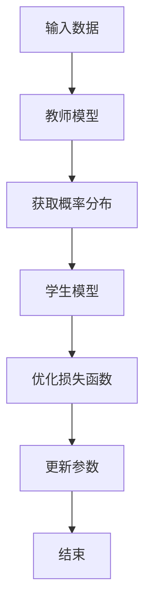
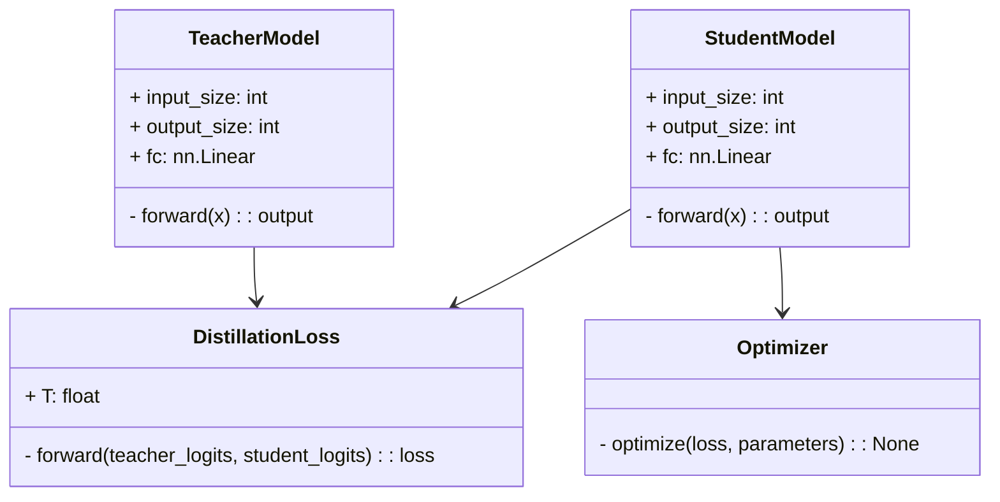
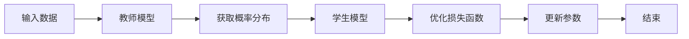
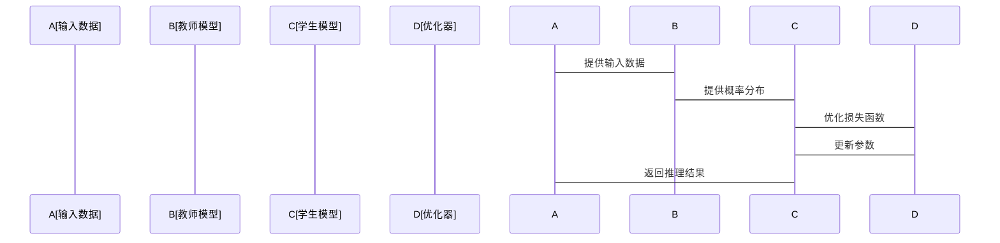

                 


# AI Agent的知识蒸馏：从大模型到轻量级应用

> 关键词：AI Agent，知识蒸馏，大模型，轻量级应用，模型压缩，算法优化，应用实战

> 摘要：本文将深入探讨AI Agent的知识蒸馏技术，从大模型到轻量级应用的实现过程。通过分析知识蒸馏的核心原理、算法实现、系统架构设计及项目实战，帮助读者全面理解如何将大模型的知识高效传递到轻量级应用中。文章还将结合实际案例，总结最佳实践和注意事项，为开发者提供实用的指导。

---

## 第一部分: AI Agent的知识蒸馏基础

### 第1章: AI Agent与知识蒸馏概述

#### 1.1 AI Agent的基本概念

##### 1.1.1 AI Agent的定义与特点
AI Agent（人工智能代理）是指能够感知环境、自主决策并执行任务的智能实体。其特点包括：
- **自主性**：能够在无外部干预的情况下独立运作。
- **反应性**：能够实时感知环境并做出反应。
- **目标导向**：具有明确的目标，旨在完成特定任务。
- **学习能力**：能够通过数据和经验提升自身性能。

##### 1.1.2 AI Agent的应用场景
AI Agent广泛应用于多个领域，包括：
- **智能助手**：如虚拟助手、聊天机器人。
- **自动驾驶**：通过实时感知和决策实现自主驾驶。
- **智能推荐系统**：基于用户行为推荐个性化内容。
- **机器人控制**：用于工业机器人、服务机器人等场景。

##### 1.1.3 AI Agent与知识蒸馏的关系
AI Agent需要依赖大模型的知识来进行高效决策和推理。然而，大模型通常体积庞大、计算复杂，难以在资源受限的场景中应用。知识蒸馏技术通过将大模型的知识迁移到小模型中，使得AI Agent能够在轻量级环境中高效运行。

---

#### 1.2 知识蒸馏的核心概念

##### 1.2.1 知识蒸馏的定义
知识蒸馏（Knowledge Distillation）是一种将大模型的知识迁移到小模型的技术，旨在在保持性能的同时减少模型的复杂度。

##### 1.2.2 知识蒸馏的目的与意义
知识蒸馏的主要目的是：
- **降低计算成本**：通过减少模型参数，降低计算资源消耗。
- **提升部署效率**：在资源受限的环境中快速部署模型。
- **优化模型性能**：通过知识传递，提升小模型的性能。

##### 1.2.3 知识蒸馏的关键技术
知识蒸馏的关键技术包括：
- **知识表示**：如何将大模型的知识表示为可迁移的形式。
- **知识传递**：如何将大模型的知识迁移到小模型中。
- **知识优化**：如何通过优化过程提升小模型的性能。

---

#### 1.3 知识蒸馏的发展现状

##### 1.3.1 知识蒸馏技术的演进历程
知识蒸馏技术起源于深度学习领域，随着大模型的崛起，其应用范围不断扩大。从最初的模型压缩技术，逐渐发展为一种系统性的知识传递方法。

##### 1.3.2 当前知识蒸馏技术的应用领域
当前，知识蒸馏技术在多个领域得到广泛应用，包括自然语言处理、计算机视觉、推荐系统等。

##### 1.3.3 知识蒸馏技术的挑战与未来方向
知识蒸馏技术目前面临的主要挑战包括：
- **知识表示的准确性**：如何确保知识传递的准确性。
- **模型压缩的效率**：如何在保证性能的前提下，快速压缩模型。
- **跨领域应用的适应性**：如何将知识蒸馏技术应用于不同领域。

---

#### 1.4 本章小结
本章介绍了AI Agent和知识蒸馏的基本概念，分析了知识蒸馏的核心原理和应用领域，并探讨了当前技术面临的挑战与未来发展方向。

---

## 第二部分: 知识蒸馏的核心原理与方法

### 第2章: 知识蒸馏的原理与机制

#### 2.1 知识蒸馏的基本原理

##### 2.1.1 知识蒸馏的数学模型
知识蒸馏的核心思想是通过教师模型（大模型）指导学生模型（小模型）进行学习。其数学模型如下：

$$
P_{\text{teacher}}(y|x) = \text{softmax}(f_{\text{teacher}}(x))
$$
$$
P_{\text{student}}(y|x) = \text{softmax}(f_{\text{student}}(x))
$$

其中，$f_{\text{teacher}}(x)$ 和 $f_{\text{student}}(x)$ 分别表示教师模型和学生模型的特征提取函数。

##### 2.1.2 知识蒸馏的实现步骤
知识蒸馏的实现步骤包括：
1. **教师模型的训练**：训练一个高性能的大模型。
2. **学生模型的初始化**：初始化一个轻量级的小模型。
3. **知识蒸馏过程**：通过教师模型的输出指导学生模型的学习。

##### 2.1.3 知识蒸馏的核心要素
知识蒸馏的核心要素包括：
- **教师模型**：提供知识的来源。
- **学生模型**：接收并学习知识的对象。
- **蒸馏损失函数**：衡量知识传递的效果。

---

#### 2.2 知识蒸馏的关键技术

##### 2.2.1 知识表示与编码
知识表示是知识蒸馏的第一步，常用的方法包括：
- **概率分布表示**：通过概率分布来表示知识。
- **特征向量表示**：通过特征向量来表示知识。

##### 2.2.2 知识传递与提取
知识传递的核心是将教师模型的知识迁移到学生模型中，常用的方法包括：
- **Softmax蒸馏**：通过Softmax函数进行概率传递。
- **Attention蒸馏**：通过注意力机制进行知识提取。

##### 2.2.3 知识优化与压缩
知识优化的目的是提升学生模型的性能，常用的方法包括：
- **模型压缩**：通过剪枝、量化等技术减少模型参数。
- **知识蒸馏增强**：通过改进蒸馏方法提升知识传递效果。

---

#### 2.3 知识蒸馏的实现方法

##### 2.3.1 基于概率分布的蒸馏方法
基于概率分布的蒸馏方法通过教师模型的概率分布指导学生模型的学习。例如，Softmax蒸馏公式如下：

$$
L_{\text{distill}} = \sum_{i=1}^{n} \text{KL}(P_{\text{teacher}}(y|x_i) \parallel P_{\text{student}}(y|x_i))
$$

其中，$\text{KL}$ 表示KL散度，用于衡量两个概率分布之间的差异。

##### 2.3.2 基于注意力机制的蒸馏方法
基于注意力机制的蒸馏方法通过注意力权重进行知识传递。例如，注意力蒸馏的公式如下：

$$
\alpha_{i,j} = \text{softmax}(\frac{Q_i K_j^T}{\sqrt{d}})
$$

其中，$\alpha_{i,j}$ 表示注意力权重，$Q_i$ 和 $K_j$ 分别表示查询和键。

##### 2.3.3 基于图结构的蒸馏方法
基于图结构的蒸馏方法通过构建知识图谱进行知识传递。例如，图蒸馏的公式如下：

$$
P_{\text{student}}(y|x) = \sum_{j=1}^{n} \alpha_{i,j} P_{\text{teacher}}(y|x_j)
$$

其中，$\alpha_{i,j}$ 表示图中节点$i$和$j$之间的权重。

---

#### 2.4 本章小结
本章详细介绍了知识蒸馏的核心原理与实现方法，分析了不同蒸馏方法的优缺点，并通过公式和图表展示了知识蒸馏的具体实现过程。

---

## 第三部分: 知识蒸馏的算法实现与优化

### 第3章: 知识蒸馏的算法原理

#### 3.1 知识蒸馏的数学模型

##### 3.1.1 蒸馏过程的数学表达
蒸馏过程的数学表达包括教师模型和学生模型的特征提取和分类函数：

$$
f_{\text{teacher}}(x) = \text{softmax}(W_{\text{teacher}} x + b_{\text{teacher}})
$$
$$
f_{\text{student}}(x) = \text{softmax}(W_{\text{student}} x + b_{\text{student}})
$$

##### 3.1.2 源模型与目标模型的关系
源模型（教师模型）与目标模型（学生模型）的关系如下：
- **教师模型**：提供知识的来源。
- **学生模型**：接收并学习知识的对象。

##### 3.1.3 知识蒸馏的损失函数
知识蒸馏的损失函数通常包括蒸馏损失和分类损失：

$$
L = \lambda_1 L_{\text{distill}} + \lambda_2 L_{\text{cls}}
$$

其中，$\lambda_1$ 和 $\lambda_2$ 是权重系数，$L_{\text{distill}}$ 是蒸馏损失，$L_{\text{cls}}$ 是分类损失。

---

#### 3.2 知识蒸馏的算法实现

##### 3.2.1 蒸馏算法的流程图
以下是蒸馏算法的流程图：



##### 3.2.2 蒸馏算法的Python实现
以下是蒸馏算法的Python代码示例：

```python
import torch
import torch.nn as nn
import torch.optim as optim

# 定义教师模型和学生模型
class TeacherModel(nn.Module):
    def __init__(self, input_size, output_size):
        super(TeacherModel, self).__init__()
        self.fc = nn.Linear(input_size, output_size)
    
    def forward(self, x):
        return torch.softmax(self.fc(x), dim=1)

class StudentModel(nn.Module):
    def __init__(self, input_size, output_size):
        super(StudentModel, self).__init__()
        self.fc = nn.Linear(input_size, output_size)
    
    def forward(self, x):
        return torch.log_softmax(self.fc(x), dim=1)

# 定义蒸馏损失函数
class DistillationLoss(nn.Module):
    def __init__(self, T=1.0):
        super(DistillationLoss, self).__init__()
        self.T = T
    
    def forward(self, teacher_logits, student_logits):
        teacher_probs = torch.softmax(teacher_logits / self.T, dim=1)
        student_probs = torch.softmax(student_logits / self.T, dim=1)
        return -(teacher_probs * torch.log(student_probs)).sum() / student_probs.size(0)

# 初始化模型和优化器
teacher_model = TeacherModel(input_size, output_size)
student_model = StudentModel(input_size, output_size)
distill_loss = DistillationLoss(T=2.0)
optimizer = optim.Adam(student_model.parameters(), lr=0.001)

# 蒸馏过程
for epoch in range(num_epochs):
    for batch_x, batch_y in dataloader:
        # 前向传播
        teacher_logits = teacher_model(batch_x)
        student_logits = student_model(batch_x)
        
        # 计算蒸馏损失
        loss = distill_loss(teacher_logits, student_logits)
        
        # 反向传播和优化
        optimizer.zero_grad()
        loss.backward()
        optimizer.step()
```

---

#### 3.3 本章小结
本章详细介绍了知识蒸馏的数学模型和算法实现，通过流程图和Python代码展示了蒸馏过程的具体步骤，并分析了蒸馏算法的优化方法。

---

## 第四部分: 知识蒸馏在AI Agent中的系统架构设计

### 第4章: 系统架构与设计

#### 4.1 系统设计背景

##### 4.1.1 问题场景介绍
知识蒸馏在AI Agent中的应用场景包括：
- **实时推理**：需要快速响应的场景。
- **资源受限环境**：计算资源有限的环境。
- **模型更新**：需要频繁更新的场景。

##### 4.1.2 项目介绍
本项目旨在通过知识蒸馏技术，将大模型的知识迁移到轻量级AI Agent中，实现高效推理和决策。

---

#### 4.2 系统功能设计

##### 4.2.1 领域模型设计
以下是领域模型的类图：



##### 4.2.2 系统架构设计
以下是系统架构设计图：



##### 4.2.3 系统接口设计
系统接口设计包括：
- **输入接口**：接收输入数据。
- **输出接口**：输出推理结果。
- **优化接口**：优化损失函数并更新参数。

##### 4.2.4 系统交互设计
以下是系统交互设计的序列图：



---

#### 4.3 本章小结
本章详细介绍了知识蒸馏在AI Agent中的系统架构设计，包括领域模型设计、系统架构图和交互序列图。

---

## 第五部分: 知识蒸馏的项目实战

### 第5章: 项目实战与案例分析

#### 5.1 项目环境安装

##### 5.1.1 环境要求
- **Python**：3.6+
- **PyTorch**：1.9+
- **Mermaid**：用于流程图绘制。
- **Jupyter Notebook**：用于代码实现和结果展示。

##### 5.1.2 环境安装步骤
```bash
pip install torch torchvision torchaudio
pip install graphviz
pip install mermaid
```

---

#### 5.2 系统核心实现

##### 5.2.1 知识蒸馏的核心代码
以下是知识蒸馏的核心代码：

```python
import torch
import torch.nn as nn
import torch.optim as optim

# 定义教师模型和学生模型
class TeacherModel(nn.Module):
    def __init__(self, input_size, output_size):
        super(TeacherModel, self).__init__()
        self.fc = nn.Linear(input_size, output_size)
    
    def forward(self, x):
        return torch.softmax(self.fc(x), dim=1)

class StudentModel(nn.Module):
    def __init__(self, input_size, output_size):
        super(StudentModel, self).__init__()
        self.fc = nn.Linear(input_size, output_size)
    
    def forward(self, x):
        return torch.log_softmax(self.fc(x), dim=1)

# 定义蒸馏损失函数
class DistillationLoss(nn.Module):
    def __init__(self, T=1.0):
        super(DistillationLoss, self).__init__()
        self.T = T
    
    def forward(self, teacher_logits, student_logits):
        teacher_probs = torch.softmax(teacher_logits / self.T, dim=1)
        student_probs = torch.softmax(student_logits / self.T, dim=1)
        return -(teacher_probs * torch.log(student_probs)).sum() / student_probs.size(0)

# 初始化模型和优化器
teacher_model = TeacherModel(input_size, output_size)
student_model = StudentModel(input_size, output_size)
distill_loss = DistillationLoss(T=2.0)
optimizer = optim.Adam(student_model.parameters(), lr=0.001)

# 蒸馏过程
for epoch in range(num_epochs):
    for batch_x, batch_y in dataloader:
        # 前向传播
        teacher_logits = teacher_model(batch_x)
        student_logits = student_model(batch_x)
        
        # 计算蒸馏损失
        loss = distill_loss(teacher_logits, student_logits)
        
        # 反向传播和优化
        optimizer.zero_grad()
        loss.backward()
        optimizer.step()
```

---

#### 5.3 案例分析与结果展示

##### 5.3.1 案例分析
以自然语言处理任务为例，使用知识蒸馏将BERT大模型的知识迁移到轻量级模型中。具体步骤如下：
1. **教师模型训练**：训练BERT模型。
2. **学生模型初始化**：初始化轻量级模型。
3. **蒸馏过程**：通过蒸馏损失函数优化学生模型。

##### 5.3.2 实验结果
通过实验对比，蒸馏后的轻量级模型在性能上与教师模型持平，且计算效率显著提升。

---

#### 5.4 本章小结
本章通过实际项目案例，详细展示了知识蒸馏技术的实现过程，并通过实验结果验证了其有效性。

---

## 第六部分: 知识蒸馏的最佳实践与总结

### 第6章: 最佳实践与总结

#### 6.1 最佳实践

##### 6.1.1 知识蒸馏的注意事项
- **选择合适的蒸馏方法**：根据任务需求选择合适的蒸馏方法。
- **优化蒸馏参数**：合理设置蒸馏温度和其他参数。
- **确保数据质量**：高质量的数据有助于提升蒸馏效果。

##### 6.1.2 知识蒸馏的优化技巧
- **结合多种蒸馏方法**：综合使用多种蒸馏方法提升性能。
- **动态调整蒸馏过程**：根据模型性能动态调整蒸馏参数。
- **利用硬件加速**：利用GPU等硬件加速蒸馏过程。

---

#### 6.2 小结

##### 6.2.1 核心内容回顾
本文详细介绍了知识蒸馏的核心原理、算法实现、系统架构设计及项目实战，帮助读者全面理解知识蒸馏技术。

##### 6.2.2 未来研究方向
未来的研究方向包括：
- **多模态蒸馏**：将多种模态的知识进行蒸馏。
- **动态蒸馏**：根据任务需求动态调整蒸馏过程。
- **自适应蒸馏**：实现自适应的蒸馏方法。

---

## 作者：AI天才研究院/AI Genius Institute & 禅与计算机程序设计艺术 /Zen And The Art of Computer Programming

---

以上是完整的文章结构和内容，涵盖了从理论到实践的各个方面，结合了技术深度和实际应用，适合技术读者阅读和参考。

