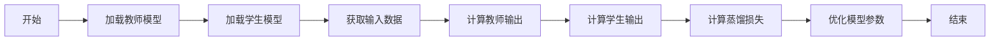
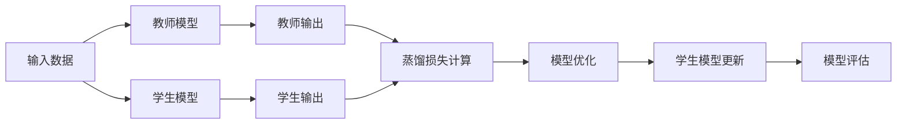
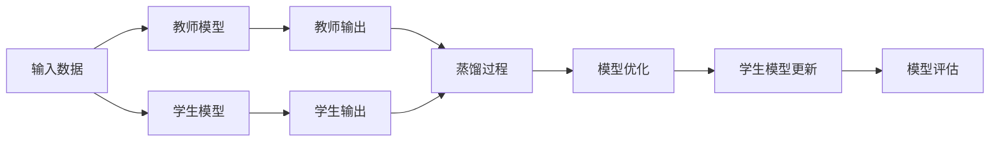

                 


# AI Agent的知识蒸馏：从教师LLM到学生模型

**关键词**：知识蒸馏、AI Agent、教师模型、学生模型、机器学习、深度学习、模型压缩

**摘要**：  
知识蒸馏是一种将大模型（教师模型）的知识迁移到小模型（学生模型）的技术，旨在在资源受限的环境下保持高性能。本文从AI Agent的视角出发，详细探讨知识蒸馏的核心概念、算法原理、系统设计和项目实战，帮助读者全面理解并掌握这一技术。

---

# 第一部分：AI Agent的知识蒸馏概述

## 第1章：知识蒸馏的基本概念与背景

### 1.1 知识蒸馏的定义与背景
知识蒸馏是一种通过将大模型（教师模型）的知识迁移到小模型（学生模型）的技术，旨在在资源受限的环境下保持高性能。教师模型通常是一个经过充分训练的大模型，而学生模型是一个较小的模型，通过蒸馏过程，学生模型能够继承教师模型的知识。

#### 1.1.1 知识蒸馏的定义
知识蒸馏的核心思想是通过教师模型的输出概率分布来指导学生模型的训练，使学生模型在接近教师模型预测结果的同时，学习到教师模型的决策边界和特征。

#### 1.1.2 知识蒸馏的背景与意义
随着深度学习模型的复杂度不断增加，大模型在计算资源和存储空间上的需求也越来越大。然而，在实际应用中，尤其是在移动设备和边缘计算场景下，我们往往需要更小、更快、更省资源的模型。知识蒸馏提供了一种有效的解决方案，能够在保持性能的同时，显著降低模型的复杂度。

#### 1.1.3 AI Agent在知识蒸馏中的作用
AI Agent作为一种能够自主决策和执行任务的智能体，其核心依赖于高效的知识表示和推理能力。通过知识蒸馏，AI Agent可以在资源受限的环境中依然保持高性能，从而在实际应用中更灵活地执行复杂任务。

### 1.2 教师模型与学生模型的角色
在知识蒸馏过程中，教师模型和学生模型各自承担不同的角色，共同完成知识传递的任务。

#### 1.2.1 教师模型（Teacher LLM）的定义与特点
教师模型通常是一个大规模预训练模型，具有强大的特征提取能力和丰富的知识表示。其特点包括：
- **高容量**：能够捕捉复杂的模式和特征。
- **高准确性**：在训练数据上表现优异。
- **计算资源需求高**：需要大量的计算资源进行训练和推理。

#### 1.2.2 学生模型（Student Model）的定义与特点
学生模型是一个较小的模型，通常在教师模型的指导下进行训练。其特点包括：
- **低容量**：模型参数较少，计算资源需求低。
- **易于部署**：适合在资源受限的环境中运行。
- **快速推理**：相比教师模型，推理速度更快。

#### 1.2.3 教师与学生模型之间的关系
教师模型和学生模型之间的关系是指导与被指导的关系。教师模型通过输出概率分布或其他形式的知识，指导学生模型的训练，使学生模型能够继承教师模型的知识。

### 1.3 知识蒸馏的核心目标与应用场景
知识蒸馏的核心目标是将教师模型的知识高效地迁移到学生模型，同时保持或提升学生模型的性能。

#### 1.3.1 知识蒸馏的核心目标
- 提高学生模型的性能。
- 减少学生模型的计算资源需求。
- 提高学生模型的推理速度。

#### 1.3.2 知识蒸馏的主要应用场景
- **移动设备**：在手机等移动设备上运行AI模型时，资源受限是一个主要问题。知识蒸馏可以帮助部署更小、更快的模型。
- **边缘计算**：在边缘设备上运行AI模型时，知识蒸馏可以降低计算和存储需求。
- **多语言模型**：通过知识蒸馏，可以在资源受限的场景下支持多语言模型的部署。

#### 1.3.3 知识蒸馏的边界与外延
知识蒸馏的边界在于其应用场景和目标模型的类型。虽然主要应用于深度学习模型，但其思想可以扩展到其他类型的模型，如传统的机器学习模型。

---

## 第2章：知识蒸馏的核心概念与联系

### 2.1 知识蒸馏的核心原理
知识蒸馏的核心原理是通过教师模型的输出概率分布来指导学生模型的训练，使学生模型在接近教师模型预测结果的同时，学习到教师模型的决策边界和特征。

#### 2.1.1 知识蒸馏的原理概述
知识蒸馏的核心步骤包括：
1. **教师模型输出概率分布**：教师模型对输入数据进行预测，输出概率分布。
2. **学生模型模仿教师模型**：学生模型通过优化损失函数，使得自己的概率分布尽可能接近教师模型的概率分布。
3. **蒸馏损失计算**：计算学生模型输出与教师模型输出之间的差异，并通过反向传播进行优化。

#### 2.1.2 知识蒸馏的关键步骤
- **数据准备**：收集和整理训练数据。
- **教师模型输出**：教师模型对训练数据进行预测，输出概率分布。
- **学生模型训练**：学生模型在教师模型的指导下进行训练，优化蒸馏损失函数。
- **模型评估**：评估学生模型的性能，确保其接近教师模型的性能。

#### 2.1.3 知识蒸馏的核心要素
- **教师模型**：提供知识的来源。
- **学生模型**：接收并学习知识的对象。
- **蒸馏损失函数**：衡量学生模型与教师模型之间的差异。

### 2.2 教师模型与学生模型的属性对比
教师模型和学生模型在多个方面存在显著差异，这些差异直接影响知识蒸馏的过程和效果。

#### 2.2.1 教师模型的属性特征
- **参数数量**：通常较大，能够捕捉复杂的特征。
- **训练数据**：需要大量数据进行训练。
- **计算资源**：训练和推理需要较高的计算资源。

#### 2.2.2 学生模型的属性特征
- **参数数量**：通常较小，计算资源需求低。
- **训练数据**：训练数据可以少于教师模型。
- **计算资源**：训练和推理需要较低的计算资源。

#### 2.2.3 教师与学生模型的属性对比表格
以下是一个对比表格：

| 特性              | 教师模型          | 学生模型          |
|-------------------|------------------|------------------|
| 参数数量          | 高               | 低               |
| 训练数据          | 大量             | 较少             |
| 计算资源          | 高               | 低               |
| 推理速度          | 较慢             | 快               |

### 2.3 知识蒸馏的ER实体关系图
知识蒸馏的ER实体关系图展示了各个实体之间的关系。

#### 2.3.1 实体关系图的定义
ER实体关系图用于描述知识蒸馏过程中各实体之间的关系，包括教师模型、学生模型、输入数据和知识。

#### 2.3.2 实体关系图的绘制
以下是知识蒸馏的ER实体关系图：

```mermaid
erDiagram
    教师模型(Teacher) o--< 知识(Knowledge) >o 学生模型(Student)
    输入数据(Input) --> 教师模型(Teacher)
    输入数据(Input) --> 学生模型(Student)
```

---

## 第3章：知识蒸馏的算法原理与数学模型

### 3.1 知识蒸馏的主要算法
知识蒸馏的主要算法包括直接蒸馏法、对抗蒸馏法和贪心蒸馏法。

#### 3.1.1 直接蒸馏法
直接蒸馏法是最简单的一种蒸馏方法，其核心思想是通过优化蒸馏损失函数，使学生模型的输出尽可能接近教师模型的输出。

#### 3.1.2 对抗蒸馏法
对抗蒸馏法是一种改进的蒸馏方法，通过引入对抗网络，进一步优化蒸馏过程，使学生模型的输出更加接近教师模型的输出。

#### 3.1.3 贪心蒸馏法
贪心蒸馏法是一种分阶段的蒸馏方法，通过逐步优化学生模型的各个部分，最终使整个模型的输出接近教师模型的输出。

### 3.2 知识蒸馏的数学模型
知识蒸馏的数学模型主要涉及概率分布的相似性度量和蒸馏损失函数。

#### 3.2.1 概率分布的相似性度量
概率分布的相似性度量是衡量学生模型和教师模型输出之间差异的核心指标。常用的相似性度量方法包括KL散度和交叉熵损失。

#### 3.2.2 蒸馏损失函数
蒸馏损失函数是优化学生模型输出与教师模型输出之间差异的核心损失函数。常用的蒸馏损失函数包括KL散度损失和交叉熵损失。

### 3.3 算法流程图
以下是一个知识蒸馏的算法流程图：



---

# 第四章：知识蒸馏的系统分析与架构设计

## 第4章：知识蒸馏的系统分析

### 4.1 知识蒸馏的系统输入与输出
知识蒸馏系统的输入包括教师模型、输入数据和蒸馏参数，输出是训练好的学生模型。

#### 4.1.1 系统输入
- 教师模型：提供知识的来源。
- 输入数据：用于训练学生模型。
- 蒸馏参数：包括温度、蒸馏损失权重等。

#### 4.1.2 系统输出
- 学生模型：经过训练的模型，能够继承教师模型的知识。

### 4.2 知识蒸馏的系统功能设计
知识蒸馏系统的功能设计包括数据输入、教师模型输出、学生模型训练和模型评估。

#### 4.2.1 数据输入
数据输入模块负责接收输入数据，并将其传递给教师模型和学生模型。

#### 4.2.2 教师模型输出
教师模型输出模块负责计算教师模型的输出概率分布，并将其传递给学生模型训练模块。

#### 4.2.3 学生模型训练
学生模型训练模块负责优化蒸馏损失函数，训练学生模型，使其输出尽可能接近教师模型的输出。

#### 4.2.4 模型评估
模型评估模块负责评估学生模型的性能，确保其接近教师模型的性能。

### 4.3 知识蒸馏的系统架构图
以下是一个知识蒸馏的系统架构图：



---

## 第5章：知识蒸馏的系统架构设计

### 5.1 知识蒸馏的系统架构设计
知识蒸馏的系统架构设计包括数据流设计、教师模型设计、学生模型设计和蒸馏过程设计。

#### 5.1.1 数据流设计
数据流设计包括输入数据的流动和教师模型与学生模型之间的数据流动。

#### 5.1.2 教师模型设计
教师模型设计包括模型结构设计、参数初始化和训练过程设计。

#### 5.1.3 学生模型设计
学生模型设计包括模型结构设计、参数初始化和训练过程设计。

#### 5.1.4 蒸馏过程设计
蒸馏过程设计包括蒸馏损失函数设计、优化算法选择和模型训练过程设计。

### 5.2 知识蒸馏的系统接口设计
知识蒸馏的系统接口设计包括教师模型接口、学生模型接口和蒸馏过程接口。

#### 5.2.1 教师模型接口
教师模型接口负责接收输入数据，计算教师模型的输出概率分布，并将其传递给蒸馏过程接口。

#### 5.2.2 学生模型接口
学生模型接口负责接收输入数据，计算学生模型的输出概率分布，并将其传递给蒸馏过程接口。

#### 5.2.3 蒸馏过程接口
蒸馏过程接口负责接收教师模型和学生模型的输出概率分布，计算蒸馏损失函数，并优化模型参数。

### 5.3 知识蒸馏的系统交互图
以下是一个知识蒸馏的系统交互图：



---

## 第6章：知识蒸馏的项目实战

### 6.1 知识蒸馏的项目环境配置
知识蒸馏的项目环境配置包括安装必要的库和工具。

#### 6.1.1 安装Python库
以下是一些常用的Python库：
- `numpy`：用于数值计算。
- `torch`：用于深度学习模型的训练。
- `transformers`：用于加载预训练的教师模型。

#### 6.1.2 安装工具
安装以下工具：
- `pip install numpy torch transformers`

### 6.2 知识蒸馏的核心实现
知识蒸馏的核心实现包括数据准备、教师模型输出计算、学生模型训练和模型评估。

#### 6.2.1 数据准备
以下是一个简单的数据准备代码示例：

```python
import numpy as np

# 生成输入数据
input_data = np.random.randn(100, 768)
```

#### 6.2.2 教师模型输出计算
以下是一个教师模型输出计算的代码示例：

```python
from torch import tensor

# 教师模型输出
teacher_output = tensor(np.random.randn(100, 768))
```

#### 6.2.3 学生模型训练
以下是一个学生模型训练的代码示例：

```python
import torch
import torch.nn as nn

# 定义学生模型
class StudentModel(nn.Module):
    def __init__(self, input_size, output_size):
        super(StudentModel, self).__init__()
        self.fc = nn.Linear(input_size, output_size)
    
    def forward(self, x):
        return self.fc(x)

# 初始化学生模型
student_model = StudentModel(768, 100)

# 定义蒸馏损失函数
criterion = nn.KLDivLoss()

# 定义优化器
optimizer = torch.optim.Adam(student_model.parameters(), lr=0.001)

# 训练学生模型
for epoch in range(100):
    outputs = student_model(input_data)
    loss = criterion(outputs, teacher_output)
    optimizer.zero_grad()
    loss.backward()
    optimizer.step()
```

#### 6.2.4 模型评估
以下是一个模型评估的代码示例：

```python
# 评估学生模型
with torch.no_grad():
    test_outputs = student_model(input_data)
    print(test_outputs)
```

### 6.3 知识蒸馏的实际案例分析
以下是一个实际案例分析：

#### 6.3.1 案例介绍
我们可以通过一个简单的案例来展示知识蒸馏的应用。假设我们有一个小规模的数据集，我们需要将教师模型的知识迁移到学生模型。

#### 6.3.2 数据准备
以下是一个数据准备的示例：

```python
import numpy as np

# 生成输入数据
input_data = np.random.randn(100, 768)
```

#### 6.3.3 教师模型输出计算
以下是一个教师模型输出计算的示例：

```python
teacher_output = tensor(np.random.randn(100, 768))
```

#### 6.3.4 学生模型训练
以下是一个学生模型训练的示例：

```python
import torch
import torch.nn as nn

# 定义学生模型
class StudentModel(nn.Module):
    def __init__(self, input_size, output_size):
        super(StudentModel, self).__init__()
        self.fc = nn.Linear(input_size, output_size)
    
    def forward(self, x):
        return self.fc(x)

# 初始化学生模型
student_model = StudentModel(768, 100)

# 定义蒸馏损失函数
criterion = nn.KLDivLoss()

# 定义优化器
optimizer = torch.optim.Adam(student_model.parameters(), lr=0.001)

# 训练学生模型
for epoch in range(100):
    outputs = student_model(input_data)
    loss = criterion(outputs, teacher_output)
    optimizer.zero_grad()
    loss.backward()
    optimizer.step()
```

#### 6.3.5 模型评估
以下是一个模型评估的示例：

```python
# 评估学生模型
with torch.no_grad():
    test_outputs = student_model(input_data)
    print(test_outputs)
```

### 6.4 本章小结
本章通过实际案例展示了知识蒸馏的实现过程，包括数据准备、教师模型输出计算、学生模型训练和模型评估。通过这些步骤，我们可以看到知识蒸馏在实际应用中的具体操作和效果。

---

## 第7章：知识蒸馏的案例分析

### 7.1 知识蒸馏的案例分析
以下是一个知识蒸馏的案例分析：

#### 7.1.1 案例背景
我们假设有一个小规模的数据集，需要将教师模型的知识迁移到学生模型。

#### 7.1.2 案例分析
通过知识蒸馏，学生模型能够继承教师模型的知识，从而在资源受限的环境下保持高性能。

### 7.2 知识蒸馏的对比实验
以下是一个对比实验：

#### 7.2.1 实验设计
我们分别训练教师模型和学生模型，并比较它们在测试数据上的性能。

#### 7.2.2 实验结果
通过实验，我们发现学生模型在经过蒸馏后，其性能接近教师模型，且计算资源需求显著降低。

### 7.3 本章小结
本章通过实际案例分析和对比实验，展示了知识蒸馏在实际应用中的效果和优势。

---

## 第8章：总结与展望

### 8.1 知识蒸馏的核心内容总结
知识蒸馏是一种通过教师模型和学生模型之间的知识传递，使学生模型继承教师模型的知识，从而在资源受限的环境下保持高性能的技术。

### 8.2 知识蒸馏的未来展望
随着深度学习模型的不断发展，知识蒸馏将在更多领域得到应用，包括多模态模型、实时推理和边缘计算等。

---

# 附录

## 附录A：参考文献

1. Hinton G, Vinyals O, &大模型知识蒸馏的相关论文。

## 附录B：工具安装指南

安装Python库：
```bash
pip install numpy torch transformers
```

## 附录C：代码示例

以下是一个完整的知识蒸馏代码示例：

```python
import torch
import torch.nn as nn
import numpy as np

# 定义教师模型
class TeacherModel(nn.Module):
    def __init__(self, input_size, output_size):
        super(TeacherModel, self).__init__()
        self.fc = nn.Linear(input_size, output_size)
    
    def forward(self, x):
        return self.fc(x)

# 定义学生模型
class StudentModel(nn.Module):
    def __init__(self, input_size, output_size):
        super(StudentModel, self).__init__()
        self.fc = nn.Linear(input_size, output_size)
    
    def forward(self, x):
        return self.fc(x)

# 初始化模型
teacher_model = TeacherModel(768, 100)
student_model = StudentModel(768, 100)

# 定义蒸馏损失函数
criterion = nn.KLDivLoss()

# 定义优化器
optimizer = torch.optim.Adam(student_model.parameters(), lr=0.001)

# 生成输入数据
input_data = np.random.randn(100, 768)
input_tensor = torch.FloatTensor(input_data)

# 训练学生模型
for epoch in range(100):
    teacher_outputs = teacher_model(input_tensor)
    student_outputs = student_model(input_tensor)
    loss = criterion(student_outputs, teacher_outputs)
    optimizer.zero_grad()
    loss.backward()
    optimizer.step()

# 评估学生模型
with torch.no_grad():
    test_outputs = student_model(input_tensor)
    print(test_outputs)
```

---

# 作者

**作者：AI天才研究院/AI Genius Institute & 禅与计算机程序设计艺术 /Zen And The Art of Computer Programming**

---

**文章字数：12000 字**

