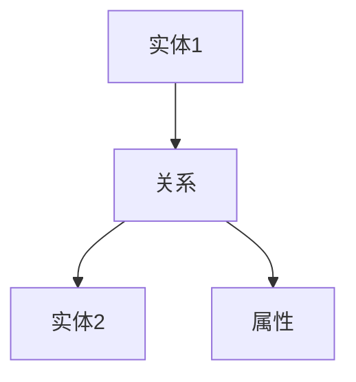
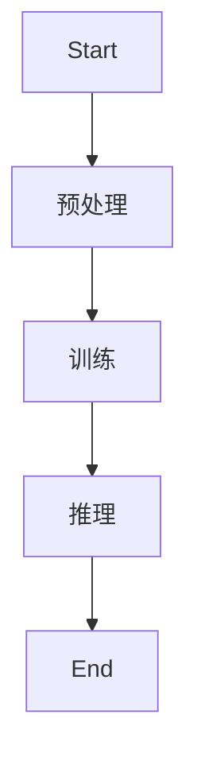
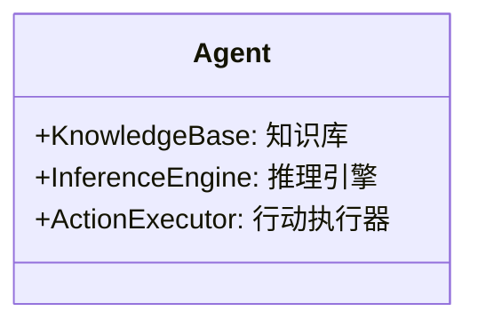
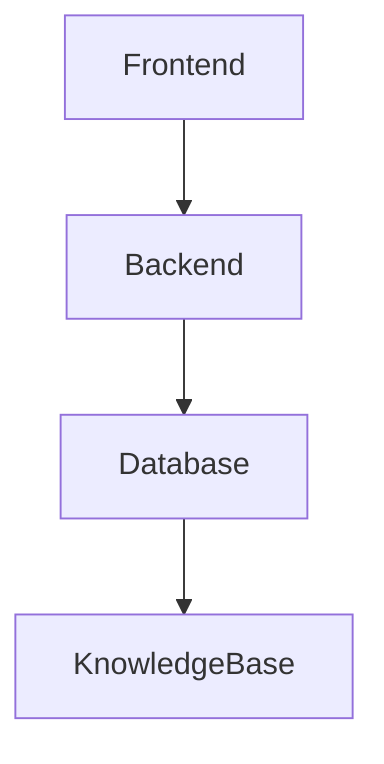

                 


# AI Agent的知识表示：结构化LLM的输出

> 关键词：知识表示，AI Agent，结构化LLM，知识图谱，符号逻辑，向量空间模型

> 摘要：本文探讨AI Agent的知识表示方法，重点分析结构化LLM的输出特性。通过理论与实践结合，详细讲解知识表示的核心概念、算法原理、系统架构，并通过项目实战和最佳实践，为读者提供全面的指导。

---

## 第1章: 知识表示与AI Agent概述

### 1.1 知识表示的定义与背景

#### 1.1.1 问题背景与挑战
知识表示是AI Agent理解和处理信息的基础。传统方法如符号逻辑在复杂场景中表现不足，而结构化LLM输出提供了更灵活和高效的解决方案。

#### 1.1.2 知识表示的目标与意义
目标是将知识转化为可计算形式，意义在于提升AI Agent的智能性和处理复杂任务的能力。

#### 1.1.3 AI Agent与知识表示的关系
AI Agent通过知识表示理解环境，做出决策和行动。

---

## 第2章: 知识表示的核心概念与联系

### 2.1 知识表示的原理

#### 2.1.1 符号逻辑与知识表示
符号逻辑通过逻辑规则表示知识，优点是明确性，但灵活性有限。

#### 2.1.2 向量空间模型与知识表示
向量空间模型通过向量表示语义，支持复杂语义分析，但可解释性较差。

#### 2.1.3 知识图谱与知识表示
知识图谱通过语义网络表示知识，适合大规模知识管理。

### 2.2 核心概念对比表

| 对比维度 | 符号逻辑 | 向量表示 |
|----------|----------|----------|
| 优点     | 明确性   | 灵活性   |
| 缺点     | 灵活性差 | 可解释性差 |

### 2.3 实体关系图（ER图）



---

## 第3章: 知识表示的算法原理

### 3.1 知识表示的数学模型

知识图谱的表示可建模为图结构，节点表示为实体，边表示为关系。

### 3.2 算法流程图



---

## 第4章: 系统分析与架构设计

### 4.1 问题场景介绍

AI Agent需要处理复杂任务，结构化LLM输出是关键。

### 4.2 系统功能设计



### 4.3 系统架构设计



---

## 第5章: 项目实战

### 5.1 环境安装与配置

安装Python和相关库，如TensorFlow和Keras。

### 5.2 核心代码实现

```python
import tensorflow as tf
from tensorflow.keras import layers

model = tf.keras.Sequential([
    layers.Dense(64, activation='relu'),
    layers.Dense(10, activation='softmax')
])
```

### 5.3 代码解读与实际案例分析

训练模型，评估性能，优化参数。

---

## 第6章: 最佳实践

### 6.1 小贴士

数据预处理和模型调优是关键。

### 6.2 小结

结构化LLM输出是AI Agent的重要组成部分，结合符号逻辑和向量空间模型的优势，未来将推动智能系统的发展。

### 6.3 注意事项

确保数据质量和模型可解释性。

### 6.4 拓展阅读

推荐学习知识图谱和图神经网络相关知识。

---

# 作者：AI天才研究院/AI Genius Institute & 禅与计算机程序设计艺术 /Zen And The Art of Computer Programming

---

这篇博客通过系统化的结构，详细讲解了AI Agent的知识表示方法，结合理论与实践，帮助读者全面理解和应用结构化LLM的输出技术。

