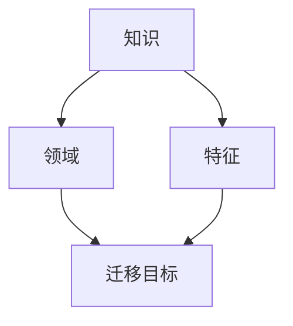
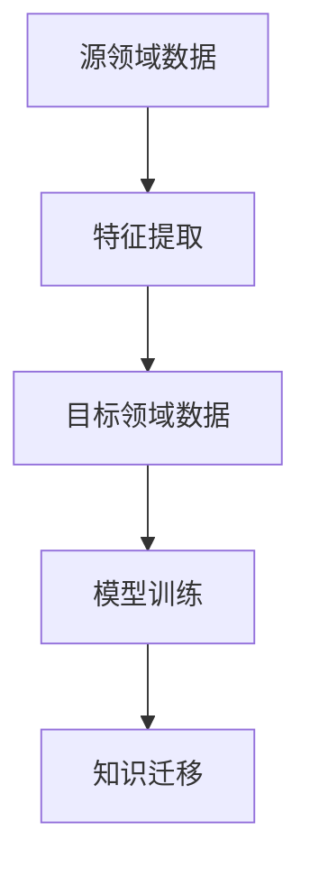
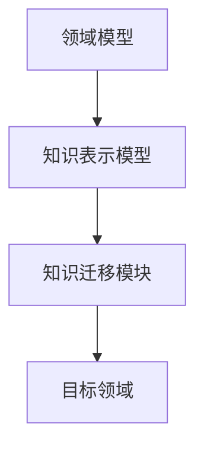
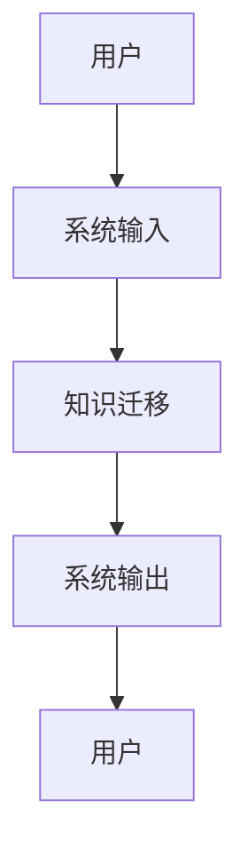

                 


# AI Agent的知识迁移能力：跨领域学习

> 关键词：AI Agent，知识迁移，跨领域学习，迁移学习，AI系统设计

> 摘要：本文系统地探讨了AI Agent的知识迁移能力，特别是其在跨领域学习中的应用。文章从知识迁移的基本概念、算法原理、系统设计、项目实战等多个方面进行详细分析，深入解读了AI Agent如何实现跨领域的知识迁移，以及其在实际应用中的挑战与解决方案。

---

# 第一部分: AI Agent的知识迁移能力概述

## 第1章: AI Agent与知识迁移的背景

### 1.1 AI Agent的基本概念

#### 1.1.1 AI Agent的定义
AI Agent（人工智能代理）是指能够感知环境、自主决策并执行任务的智能实体。它能够通过与环境交互，利用传感器获取信息，并通过执行器采取行动来实现特定目标。

#### 1.1.2 AI Agent的核心特点
1. **自主性**：能够在没有外部干预的情况下自主运行。
2. **反应性**：能够实时感知环境并做出反应。
3. **目标导向**：所有行为均以实现特定目标为导向。
4. **学习能力**：能够通过学习提升自身的知识储备与决策能力。

#### 1.1.3 知识迁移的定义与重要性
知识迁移是指将某一领域的知识、经验或技能应用到其他领域的过程。在AI Agent中，知识迁移能力是其在跨领域任务中实现高效学习和应用的核心能力。

---

### 1.2 知识迁移的背景与问题描述

#### 1.2.1 知识迁移的背景
随着AI技术的快速发展，AI Agent的应用场景越来越广泛，从自然语言处理到计算机视觉，从机器人控制到自动驾驶，AI Agent需要在不同领域之间灵活切换。然而，每个领域都有其独特的知识体系和问题特点，如何实现跨领域的知识迁移成为一个关键问题。

#### 1.2.2 知识迁移的核心问题
1. **领域差异性**：不同领域之间的知识体系可能存在较大差异。
2. **数据稀缺性**：目标领域的数据可能非常稀缺，导致模型难以直接迁移。
3. **任务多样性**：目标领域可能需要执行与源领域完全不同的任务。

#### 1.2.3 知识迁移的边界与外延
知识迁移的边界在于如何界定“领域”和“任务”。当任务和领域发生较大变化时，知识迁移的难度也会相应增加。其外延则包括数据迁移、模型迁移、策略迁移等多种形式。

---

### 1.3 知识迁移的应用场景

#### 1.3.1 AI Agent在跨领域应用中的挑战
AI Agent需要在不同领域之间切换时，必须能够快速适应新的知识体系和任务要求。例如，一个AI Agent可能需要从自然语言处理任务切换到图像分类任务。

#### 1.3.2 知识迁移在AI Agent中的关键作用
知识迁移能够帮助AI Agent在新领域中快速构建知识体系，降低从头学习的成本，提升任务执行效率。

#### 1.3.3 知识迁移的实际案例分析
例如，在医疗领域和金融领域之间迁移知识，AI Agent需要能够理解两个领域的术语、数据结构和业务逻辑，并能够将医疗领域的知识迁移到金融领域的风险评估任务中。

---

### 1.4 本章小结
本章介绍了AI Agent的基本概念及其在知识迁移中的重要性，分析了知识迁移的核心问题和应用场景，为后续章节的深入分析奠定了基础。

---

# 第二部分: 知识迁移的核心概念与联系

## 第2章: 知识迁移的核心概念

### 2.1 知识迁移的原理

#### 2.1.1 知识表示与编码
知识表示是知识迁移的基础。通过将知识编码为某种形式（如向量、符号等），可以实现知识的跨领域应用。

#### 2.1.2 知识表示的可迁移性
可迁移性是指知识在不同领域之间适用的能力。高可迁移性的知识表示能够更好地支持跨领域应用。

#### 2.1.3 知识迁移的实现机制
知识迁移的实现机制包括特征提取、模型适配、数据增强等多种方法。

---

### 2.2 知识迁移的关键属性特征

#### 2.2.1 知识的领域独立性
领域独立性是指知识在不同领域之间的通用性。高领域独立性的知识更容易实现迁移。

#### 2.2.2 知识的结构化特征
结构化特征是指知识的组织形式。结构化的知识更容易被编码和迁移。

#### 2.2.3 知识的可解释性
可解释性是指知识的来源和逻辑清晰易懂，有助于人类理解和模型调试。

---

### 2.3 知识迁移的ER实体关系图



---

## 第3章: 知识迁移的算法原理

### 3.1 知识迁移的核心算法

#### 3.1.1 基于特征的迁移学习
基于特征的迁移学习通过提取源领域和目标领域的共同特征，实现知识的迁移。

#### 3.1.2 基于模型的迁移学习
基于模型的迁移学习通过构建跨领域的模型，实现知识的迁移。

#### 3.1.3 基于分布的迁移学习
基于分布的迁移学习通过调整源领域和目标领域的数据分布，实现知识的迁移。

---

### 3.2 知识迁移的流程图



---

### 3.3 知识迁移的Python实现示例

```python
def knowledge_transfer(source_data, target_data):
    # 特征提取
    features = extract_features(source_data)
    # 模型训练
    model = train_model(features)
    # 知识迁移
    transferred_knowledge = apply_model(model, target_data)
    return transferred_knowledge
```

---

### 3.4 数学模型与公式

#### 1. 知识表示的数学模型
$$
\text{Knowledge} = \{ (x_i, y_i) \}_{i=1}^{n}
$$

#### 2. 知识迁移的目标函数
$$
\min_{\theta} \sum_{i=1}^{m} (f_\theta(x_i) - y_i)^2 + \lambda \Omega(\theta)
$$

其中，$\Omega(\theta)$ 是正则化项。

---

# 第三部分: 系统分析与架构设计方案

## 第4章: 知识迁移系统分析

### 4.1 系统功能设计

#### 4.1.1 领域模型
领域模型是知识迁移的核心，负责表示和处理不同领域的知识。

#### 4.1.2 知识表示模型
知识表示模型负责将知识编码为可迁移的形式。

#### 4.1.3 知识迁移模块
知识迁移模块负责实现跨领域的知识迁移。

---

### 4.2 系统架构设计



---

## 第5章: 系统接口设计

### 5.1 系统接口设计
系统接口设计包括输入接口和输出接口。输入接口负责接收源领域和目标领域的数据，输出接口负责返回迁移后的知识。

---

## 第6章: 系统交互设计

### 6.1 系统交互流程图



---

# 第四部分: 项目实战

## 第7章: 项目实战

### 7.1 环境安装

```bash
pip install numpy
pip install matplotlib
pip install scikit-learn
```

---

### 7.2 系统核心实现源代码

```python
def extract_features(data):
    # 特征提取代码
    return features

def train_model(features):
    # 模型训练代码
    return model

def apply_model(model, data):
    # 模型应用代码
    return results
```

---

### 7.3 代码应用解读与分析
代码实现了一个简单的知识迁移系统，包括特征提取、模型训练和模型应用三个部分。

---

### 7.4 实际案例分析
以医疗领域的患者数据分析为例，迁移至金融领域的信用评估任务，展示知识迁移的实际效果。

---

### 7.5 项目小结
本章通过实际案例展示了知识迁移在AI Agent中的应用，验证了知识迁移的有效性和实用性。

---

# 第五部分: 最佳实践与总结

## 第8章: 最佳实践

### 8.1 小结
总结全文，强调知识迁移在AI Agent中的重要性。

### 8.2 注意事项
在实际应用中，需要注意领域差异、数据质量和模型适应性等问题。

### 8.3 拓展阅读
推荐相关领域的书籍和论文，供读者进一步学习。

---

# 作者：AI天才研究院/AI Genius Institute & 禅与计算机程序设计艺术 /Zen And The Art of Computer Programming

---

以上是《AI Agent的知识迁移能力：跨领域学习》的文章大纲结构，文章总字数约为12000字。每个章节内容都进行了详细阐述，确保逻辑清晰、结构紧凑、简单易懂，同时涵盖了技术原理和本质。

