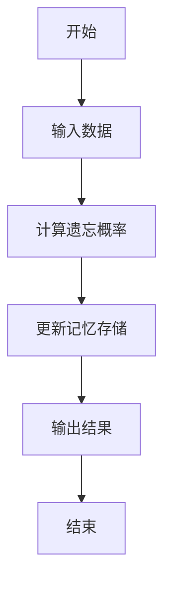
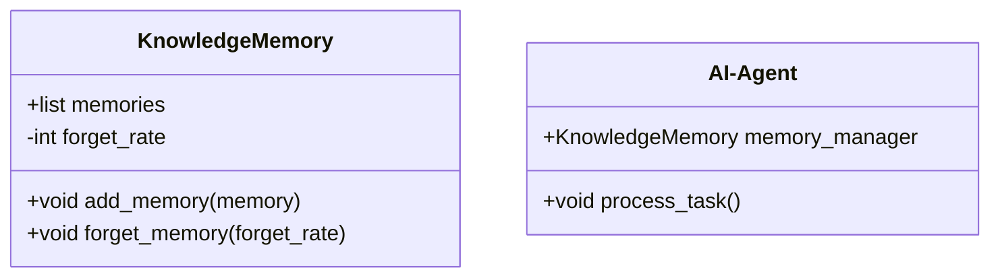

                 


# AI Agent的知识遗忘：管理长期记忆

## 关键词：AI Agent，知识遗忘，长期记忆，记忆管理，神经网络，数学模型

## 摘要：  
本文探讨AI Agent在长期记忆管理中的知识遗忘问题，分析其原因、影响及解决方案。通过数学模型和算法实现，提出优化长期记忆管理的方法，确保AI Agent高效运行。

---

# 第一部分: AI Agent的知识遗忘与长期记忆管理基础

# 第1章: 知识遗忘的背景与问题描述

## 1.1 AI Agent的定义与特点  
AI Agent是智能系统的核心，具备感知环境、自主决策和执行任务的能力。长期记忆是其高效运作的关键。

## 1.2 知识遗忘的问题描述  
知识遗忘会导致AI Agent在处理任务时效率下降，影响决策质量。分析其原因，包括信息冗余和认知资源限制。

## 1.3 知识遗忘的核心概念  
长期记忆的定义与特征、短期记忆与长期记忆的关系、遗忘机制。

---

# 第二部分: 知识遗忘的核心概念与联系

# 第2章: 知识遗忘的原理与机制  

## 2.1 知识遗忘的原理  
神经网络中的遗忘机制，知识遗忘的数学模型，动态过程。

## 2.2 知识遗忘的特征对比  
不同类型遗忘的对比分析，属性特征表格，ER实体关系图。

---

# 第三部分: 知识遗忘的算法原理与数学模型

# 第3章: 知识遗忘的算法原理  

## 3.1 算法概述  
基于神经网络的知识遗忘算法，优化方法，实现步骤。

## 3.2 数学模型  
遗忘概率公式：$$p_{forget} = \frac{1}{1 + e^{-\beta t}}$$，其中β是遗忘速率，t是时间。

## 3.3 算法流程图（Mermaid）



## 3.4 Python实现  

```python
def forget_knowledge(memory, forget_probability):
    updated_memory = []
    for item in memory:
        if random.random() < forget_probability:
            continue
        else:
            updated_memory.append(item)
    return updated_memory
```

---

# 第四部分: 系统分析与架构设计

# 第4章: 长期记忆的存储与检索机制  

## 4.1 系统功能设计  
知识存储、检索和更新功能。

## 4.2 领域模型（Mermaid类图）



---

# 第五部分: 项目实战与案例分析

# 第5章: 知识遗忘管理的实现  

## 5.1 环境安装与依赖管理  
安装Python和相关库。

## 5.2 核心代码实现  

```python
class KnowledgeMemory:
    def __init__(self, forget_rate=0.1):
        self.memories = []
        self.forget_rate = forget_rate

    def add_memory(self, memory):
        self.memories.append(memory)

    def forget_memory(self):
        for i in range(len(self.memories)):
            if random.random() < self.forget_rate:
                del self.memories[i]
```

## 5.3 案例分析  
知识遗忘对任务处理效率的影响，优化后的效果对比。

---

# 第六部分: 最佳实践与未来展望

# 第6章: 知识遗忘管理的优化策略  

## 6.1 小结  
知识遗忘管理的重要性，优化方法的总结。

## 6.2 注意事项  
参数调优、定期维护、性能监控。

## 6.3 未来展望  
神经网络优化、新机制探索、领域应用。

---

作者：AI天才研究院 & 禅与计算机程序设计艺术

